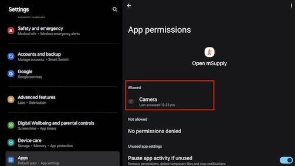
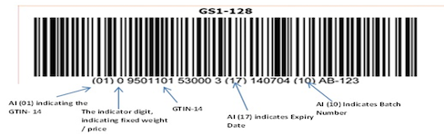
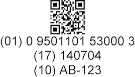
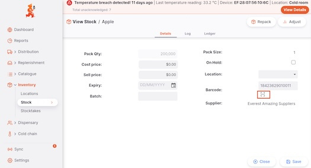
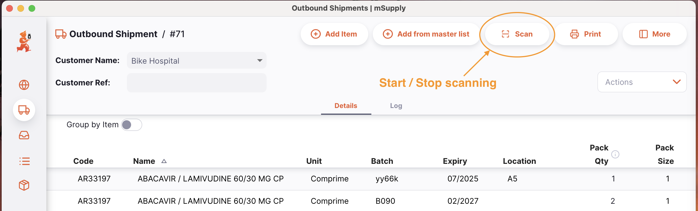
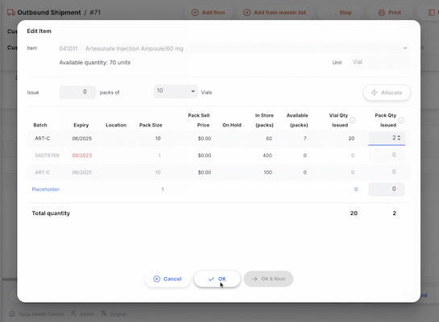

+++
title = "Barcode scanning"
description = "Adding stock to an Outbound Shipment with a barcode scanner."
date = 2023-05-03T18:20:00+00:00
updated = 2026-06-08T18:20:00+00:00
draft = false
weight = 111
sort_by = "weight"
template = "docs/page.html"

[extra]
toc = true
top = false
+++

## Adding items using a barcode scanner

If using the desktop or Android apps, you have the option of scanning items in order to add them to the Outbound Shipment. Open mSupply supports several types of scanner:

- **USB barcode scanners** (desktop app) - both serial-mode and keyboard-mode scanners are supported. Serial scanners are preferred as we have found them to be more reliable. We have been using Zebra USB scanners (DS-22). Any hand held barcode scanner should work, though we may need to update to support different models - if you have another model, please get in touch.
- **The Android camera** (Android tablets) - see [Using the Android camera for barcode scanning](#using-the-android-camera-for-barcode-scanning) below
- **Integrated scanners on Honeywell Android devices** - if Open mSupply is running on a Honeywell device with a built-in scanner, it is detected automatically and used in place of the camera

It is recommended to set the scanner to 'continuous scan' mode if it supports this, so you can scan several items one after another without restarting the scanner.

USB scanner hardware needs to be detected once before it can be used. This is done from <strong>Admin &gt; Settings &gt; Barcode Scanners</strong>. See <a href="/docs/settings/devices/#barcode-scanners">Devices settings</a> for how to detect and connect a scanner.

## Using the android camera for barcode scanning

If you are managing your store via an android tablet then you do not need a Zebra USB scanner or any other scanner hardware. Instead you can use the inbuilt camera to scan the barcode.

On the Open mSupply app setting, ensure that Open mSupply has the permission to use the camera.

The scanners support 1D and 2D barcodes, and can parse the information from a GS1 barcode in order to read the GTIN-14 code, batch number and expiry date.
As an example, barcodes could look like this:

### Introducing barcode to stock

You may find that sometimes the stock that you have lacks the barcode when a suitable GTIN-14 code already exists. If this is the case then you can view the stock and either via the android tablet (inbuilt camera) or via the windows exe (scanner hardware), you can then assign the missing barcode.

on OpenmSupply :

- Navigate and expand the Inventory section
- Click on `Stock`
- View a stock in detail
- Click the `[-]` button
- Either using the android camera or the scanner, scan the barcode
- See that the `Barcode` field now has the code.

### Issuing stock out using the barcode

To begin, open the Outbound Shipment. If the status is `New`, `Allocated` or `Picked` you can start the scanner using the `Scan` button:

You can also press the 'control (ctrl)' and 's' keys at the same time to start scanning

### Adding items

Once the scanner is started you can scan items. Each time a barcode is detected by the scanner the `Add Item` window is shown. If the scanned barcode matches an item in your database then this item is automatically selected. When no match is made, the usual drop down selection is shown allowing you to select an item.

In addition, if the scanned barcode provides batch information and a match exists in your database, then all other batch lines are disabled, and the matching line is focused.

After entering a quantity of the item, click `Ok` as usual.

In the case when the scanned barcode did not match any of the items in your database, this barcode is saved against the item selected in the `Add item` window. This means that the next time this particular item is scanned, it will correctly match an item.

When using the desktop application, the scanner will continue accepting barcodes until you click the `Scan` button a second time. You can continue to scan items and enter their quantity until all items are added.
