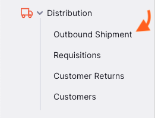
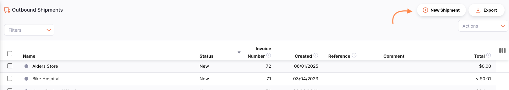
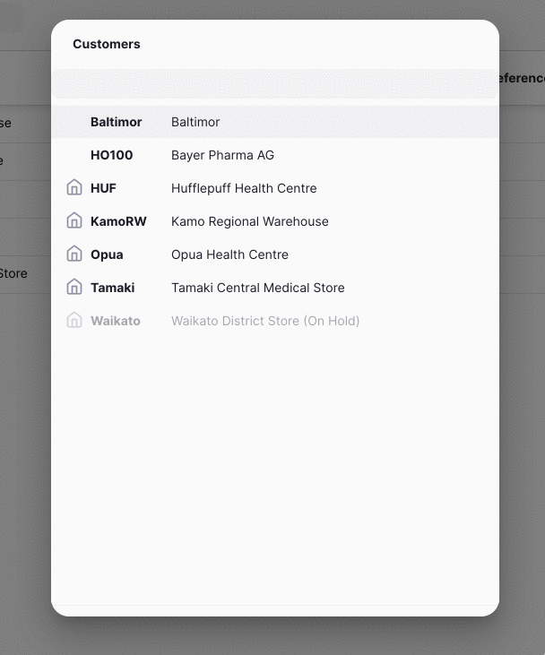
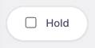
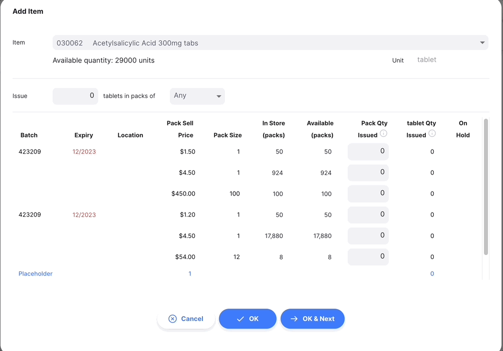
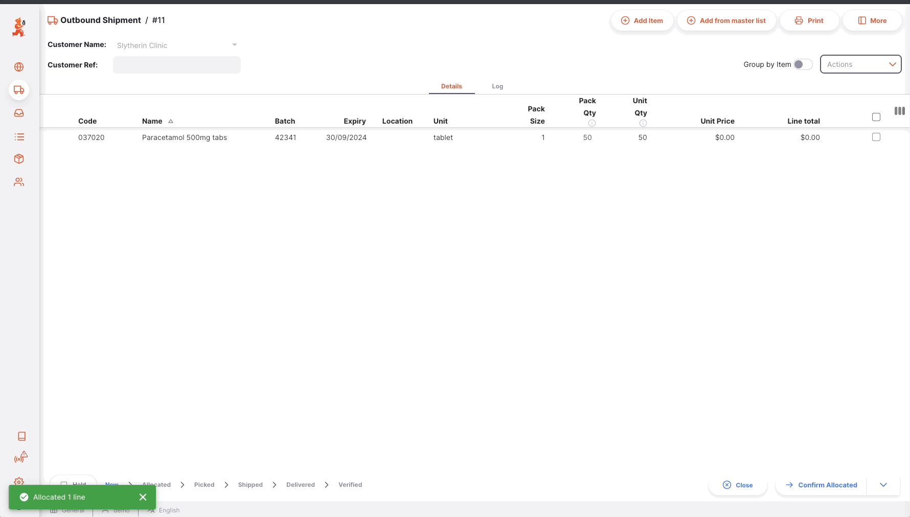
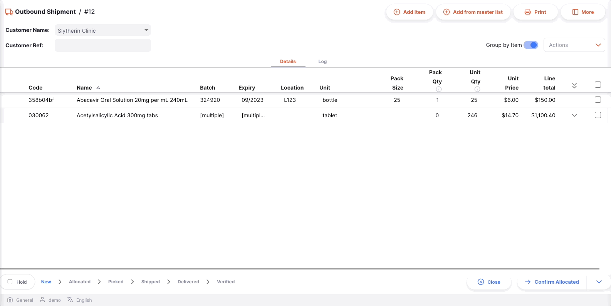
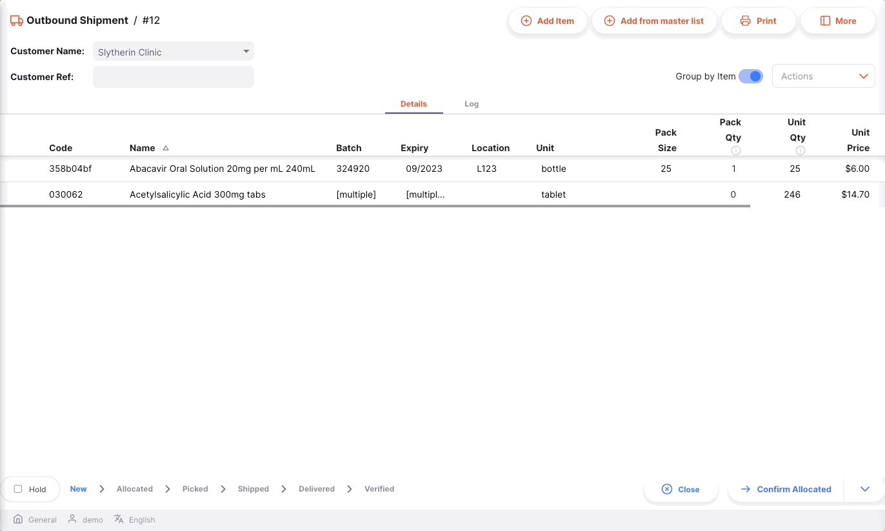

+++
title = "Salidas"
description = "Proveyendo a tus clientes"
date = 2022-03-19T18:20:00+00:00
updated = 2022-03-19T18:20:00+00:00
draft = false
weight = 23
sort_by = "weight"
template = "docs/page.html"

[extra]
toc = true
top = false
+++

Las salidas se pueden utilizar para proveer de inventario a tu cliente.

Si has utilizado mSupply anteriormente, es posible que estés familiarizado con el término **Factura al Cliente** en lugar de Salida.
Una salida se puede utilizar para:

- Transferir stock a otro almacén que también utiliza mSupply
- Emitir stock a un cliente
- Cumplir con requisiciones (órdenes de cliente)

## Visualización de salidas

### Abrir el menú de salidas

Selecciona `Distribución` > `Salida` en el panel de navegación.

Se mostrará una lista de sakidas(si no ves ninguna, es probable que estés comenzando).

Desde esta pantalla puedes:

- Ver un listado de las salidas
- Crear una salida
- Exportar las salidas a un archivo `.csv`
- Imprimir una o varias salidas

### Lista de salidas

1. La lista de salidas se diviede en 7 columnas:

| Columna        | Descripción                    |
| :------------- | :----------------------------- |
| **Nombre**     | Nombre del cliente             |
| **Estado**     | Estado actual del envío        |
| **Número**     | Número de referencia del envío |
| **Creado**     | Fecha de creación del envío    |
| **Referencia** | Referencia del cliente         |
| **Comentario** | Comentario del envío           |
| **Total**      | Total value of the shipment    |

2. La lista puede mostrar un número fijo de envíos por página. En la esquina inferior izquierda, puedes ver cuántos envíos se muestran actualmente en tu pantalla.

3. Si tienes más envíos que el límite actual, puedes navegar a otras páginas haciendo clic en el número de página o utilizando las flechas izquierda o derecha (esquina inferior derecha).

4. También puedes seleccionar un número diferente de filas para mostrar por página utilizando la opción en la esquina inferior derecha de la página.

### Búsqueda por nombre de cliente

Puedes filtrar la lista de envíos por el nombre del cliente. ¡Esto puede ser útil si estás buscando un envío en particular!

Escribe el nombre de un cliente en el campo `Buscar por nombre` (a la izquierda, justo encima de los encabezados de la lista). Todos los envíos para este cliente aparecerán en la lista.

### Exportar salidas

La lista de salias se puede exportar a un archivo separado por comas (CSV). Simplemente haz clic en el botón de exportación (a la derecha, en la parte superior de la página).

y el archivo será descargado. La función de exportación descargará todos los envíos salientes, no sólo la página actual, si tienes más de 20 de ellos. Los envíos se exportan utilizando el orden de clasificación seleccionado en la tabla, aunque por supuesto puedes ordenar fácilmente la lista en Excel o en cualquier programa con el que abras el archivo CSV.

### Eliminar una salida

Puedes eliminar una salida del listado de salidas.

1. Selecciona la salida que deseas eliminar marcando la casilla en el extremo izquierdo de la lista. Puedes seleccionar más de una salida para eliminar. Incluso las puedes seleccionar todas utilizando el checkbox maestro en los encabezados de la lista.

2. Abre el menú desplegable `Seleccionar` (esquina superior derecha, encima de la lista) y selecciona `Eliminar líneas seleccionadas`.

3. Una notificación confirma cuántas salidas fueron eliminadas (esquina inferior izquierda).

Solo puedes eliminar salidas cuyo estado sea <code>NUEVO</code>.

## Crear una salida

1. Ir a `Distribución` > `Salida`.

2. Presionar el botón `Nueva salida`, en la esquina superior derecha.

3. Se abrirá una nueva ventana llamada `Clientes`, la cual le invita a seleccionar un cliente.

#### Seleccionar un cliente:

1. En la ventana `Clientes`, se presentará una lista de clientes disponibles. Puede seleccionar su cliente de la lista o puede escribir parte del nombre del cliente.

En el siguiente ejemplo, estamos emitiendo inventario al <b>Almacén Regional de Kamo</b>. 

Puede saber si un cliente también está usando mSupply en su almacén. Si lo está haciendo, verá un ícono como este (images/is_msupplystoreicon.png" alt="Store" style="width:auto">) junto al código del proveedor. 

2. Una vez que toque o presion `Enter`, su Salida se creará automáticamente

Si todo salió bien, debería ver el nombre de su cliente en la esquina superior izquierda y el estado debería ser: <code>NUEVO</code> 

### Editar el nombre del cliente

Si ha seleccionado el cliente equivocado, puede cambiar el nombre del cliente en el campo `Nombre del cliente` o seleccionar uno de la lista desplegable:

### Ingresar una referencia de client

Una vez que se ha creado su salida, puede ingresar una referencia del cliente en el campo `Referencia del cliente`, si la tienen (por ejemplo, _PO#1234567_)

### Ver o editar el panel de información de la salida

El Panel de información le permite ver o editar información sobre la salida. Está dividido en varias secciones:

- Información Adicional
- Documentos Relacionados
- Detalles de la Factura
- Detalles de transporte

Estamos planeando agregar más secciones en el futuro a medida que Open mSupply crezca.

#### ¿Cómo abrir y cerrar el Panel de información?

Si está utilizando una pantalla grande, el panel de información se abrirá automáticamente para usted. Sin embargo, en una pantalla de tamaño promedio, el panel de información estará cerrado por defecto.

Para abrir el Panel de información, puede tocar el botón `Más`, ubicado en la esquina superior derecha de la vista de Envío saliente.

Puede cerrarlo tocando el botón `X Cerrar`, en la esquina superior derecha del panel de información.

#### Información adicional

En la sección de **Información adicional**, puede:

- Ver quién creó el Envío saliente (nombre del usuario)
- Ver y editar el color de la salida. Para editar el color, toque el círculo de color y seleccione un color de la ventana emergente
- Escribir o editar un comentario

#### Documentos relacionados

En la sección de **Documentos relacionados**, puede ver otros documentos de transacción relacionados con la salida.

Si su salida fue creada para cumplir con una **Solicitud**, el número de referencia de la solicitud aparecería en esta sección.

En el futuro, también incluiremos otros documentos como registros de temperatura, documentos de transporte o hojas de recogida.

#### Invoice Details

En esta sección, verá por defecto el precio total de venta de los artículos listados en la salida.

También puede agregar un **Cargo de servicio** si desea agregar otros cargos, como costos de flete. Para agregar un Cargo por servicio a los Detalles de la factura:

1. Toca el botón `Editar cargos de servicio`. Una nueva ventana se abrirá.
2. Toca el botón `Agregar cargo` en la nueva ventana. Una nueva línea aparecerá en la lista de cargos. Toca en `Cancelar` si no deseas agregar nada.
3. **Nombre:** Selecciona un cargo de servicio en la lista desplegable. Puedes personalizar la lista de cargos disponibles. Contacta a tu administrador.
4. **Comentario:** Puedes agregar un comentario para proporcionar más detalles sobre el nuevo cargo.
5. **Cantidad:** Ingresa la cantidad del cobro
6. **Impuesto:** Ingresa el % de impuesto para el cobro
7. **Total:** El campo de total se calcula automáticamente en función de la cantidad y el porcentaje de impuesto
8. **Eliminar:** Puedes tocar el icono `Eliminar` para eliminar el cobro

En esta sección, también puedes editar la tasa de impuesto (%) para el precio de venta de los artículos. Toca el icono de lápiz e ingresa un valor.

#### Detalles de transporte

En esta sección, puedes ver o editar el número de referencia de transporte (por ejemplo, un número de reserva o de seguimiento).

### Secuencia del estado de la salida

La secuencia de estado se encuentra en la esquina inferior izquierda de la pantalla de la salida.

Los estados pasados se resaltan en azul, los próximos estados aparecen en gris.

<figure>

<figcaption align="center">Secuencia de estado: el estado actual es <code>NUEVO</code>.</figcaption>
</figure>

<figure>

<figcaption align="center">Secuencia de estado: el estado actual es </i><code>RECOGIDO</code>.</figcaption>
</figure>

There are 6 status for the Outbound Shipment:

| Estado         | Descripción                                                                                                                     |
| :------------- | ------------------------------------------------------------------------------------------------------------------------------- |
| **Nuevo**      | Este es el primer estado cuando se crea un envío.                                                                               |
| **Asignado**   | La asignación está confirmada. Los bienes ya no están disponibles para otros envíos pero todavía forman parte de su inventario. |
| **Recogido**   | El envío está recogido y listo para ser enviado. Los bienes todavía forman parte de su inventario.                              |
| **Enviado**    | El envío ha sido enviado y los bienes ya no forman parte de su inventario.                                                      |
| **Entregado**  | Su cliente ha recibido el envío.                                                                                                |
| **Verificado** | Su cliente ha verificado la cantidad del envío. Los bienes ahora forman parte de su inventario.                                 |

Si pasas el cursor sobre la secuencia de estados, aparecerá una ventana de historial de envío. Podrás ver la fecha en que un envío se actualizó de un estado a otro.

Este envío ha sido creado, asignado y recogido el 29/03/2022

### Casilla de retención

Se encuentra en la esquina inferior izquierda, a la izquierda de la secuencia de estados.

Seleccionar la casilla `Retener` evita que la salida se actualice al siguiente estado.

### Botones de Cancelar y Confirmar

#### Botón de Cancelar

Toca el botón `Cancelar` para salir de la vista de salida y volver a la listado de salidas.

#### Botón de Confirmar

El botón `Confirmar` es el botón para actualizar el estado de un envío. El estado que puedes confirmar depende del estado actual del envío y sigue la secuencia que se muestra a continuación.

Cuando gestionas una Salida, solo puedes confirmar la asignación, la recogida y el envío.

| Confirmaar...          | Estado actual | Siguiente estado |
| :--------------------- | :------------ | :--------------- |
| **Confirmar Asignado** | Nuevo         | Asignado         |
| **Confirmar Recogido** | Asignado      | Recogido         |
| **Confirmar Enviado**  | Recogido      | Enviado          |

No es necesario actualizar un envío al siguiente estado en la secuencia. Puedes optar por saltarte algunos de ellos para ir directamente a `Confirmar Enviado` por ejemplo.

Como se muestra a continuación, toca la flecha hacia abajo del botón `Confirmar` y selecciona el estado al que deseas que se actualice el envío.

## Agregar líneas a una salida

Toca el botón `Agregar artículo` (esquina superior derecha).

Se abrirá una nueva ventana llamada `Agregar artículo`.

### Seleccionar un ítem

En la ventana de `Agregar ítem`, puedes buscar un ítem de las siguientes maneras:

- Revisando la lista de ítems disponibles
- Escribiendo parte o todo el nombre del ítem
- Escribiendo parte o todo el código del ítem

Una vez que hayas resaltado el ítem, toca su nombre o presiona `Enter`.

Una vez que se selecciona el artículo, se pueden ver las siguientes información:

#### Encabezados

- Código y nombre del artículo (por ejemplo, _030453 Amoxicillina 250 mg Tabletas_)
- la cantidad de stock disponible para este artículo (por ejemplo, _3527 unidades_)
- la unidad del artículo (por ejemplo, _Tab_)

<b>Ejemplo:</b> Para el artículo *030453 - Amoxicillina 250mg tabletas*, hay 3527 pestañas disponibles. 

#### Emitir [Cantidad] de unidades en paquetes de [Tamaño del paquete]

En el campo `Cantidad a enviar`, puedes ingresar la cantidad que deseas enviar a tu cliente.

Por defecto, se te invita a emitir una cantidad de **unidades**. Sin embargo, tienes la posibilidad de emitir una cantidad de paquetes en su lugar cambiando el valor en el segundo menú desplegable (`Tamaño del PAquete`).

El valor predeterminado es `Cualquiera` cuando emites unidades.

#### Lista de lotes disponibles:

Esta es una lista de números de lote que tienes en tu inventario para este artículo:

- **Lote**: Número de lote. Es una designación dada a los productos fabricados en la misma carrera de producción.
- **Vencimiento**: Fecha de vencimiento del lote (formato: MM/AAAA)
- **Ubicación**: Si tu inventario se gestiona con ubicaciones de almacenamiento, el nombre de la ubicación donde se almacena el artículo
- **Tamaño del paquete**: Cantidad de unidades por paquete
- **Precio de venta por paquete**: Precio de venta por unidad del artículo
- **En espera**: Indica si un lote está en espera o no. No puedes emitir un lote que está en espera.
- **En inventario (paquetes)**: Total de paquetes en tu inventario
- **Disponibles(paquetes)**: Número de paquetes disponibles (que no están asignados a otros envíos)
- **[Unidad] Cantidad emitida**: Cantidad total de unidades a emitir
- **Cantidad de paquetes emitidos**: Número de paquetes a emitir

También hay una última fila en la tabla que es una línea de marcador de posición, si el estado del envío de salida es`NUEVO`.
La línea de marcador de posición se utiliza cuando la cantidad que se emite es mayor que tu inventario disponible.

### Emitir una cantidad de unidades

Por defecto, se le invita a emitir una cantidad de **unidades**, independientemente del tamaño del paquete (número de unidades en un paquete).

Al ingresar un número en el campo `Emitir`, después de hacer clic en el botón `Asignar`, el sistema elige automáticamente el/los número(s) de lote con la fecha de caducidad más cercana (lógica de Primero en Caducar, Primero en Salir o FEFO).

En el siguiente ejemplo, emitiremos 10 unidades del artículo. Las 10 unidades se tomarán de la misma partida (tercera fila). Las dos primeras partidas no fueron seleccionadas porque han caducado.

En este otro ejemplo, emitiremos 100 unidades. El sistema selecciona tres lotes con diferentes tamaños de paquete.

Ten en cuenta que en esta lista, las partidas que están disponibles para su selección se muestran primero y las partidas que no lo están (en espera o sin stock disponible) se muestran abajo y en fuente gris.

### Emitir una cantidad de paquetes

Puedes decidir emitir una cantidad de **paquetes**. Para hacerlo, puedes cambiar el valor en el menú desplegable `Tamaño del paquete`.

Imaginemos que tu cliente solo quiere un tamaño de paquete de 25 unidades. Puedes cambiar el valor del menú desplegable de  `Cualquier` a `25`. 

Ahora se te ofrece la posibilidad de emitir un número de paquetes de 25 unidades. Solo se pueden emitir automáticamente los números de lote que tengan un tamaño de paquete de 25 unidades.

En el siguiente ejemplo, estamos emitiendo 5 paquetes de 25 unidades:

<b></b> si previamente has ingresado una cantidad de unidades y cambias a una cantidad de paquetes, la cantidad de unidades se convertirá automáticamente en la cantidad correcta de paquetes.  

Cuando se selecciona un tamaño de paquete, las líneas de stock que tienen un tamaño de paquete diferente no están disponibles para seleccionar. Por lo tanto, esas filas se enumeran más abajo en la tabla y se muestran en una fuente gris, de la misma manera que otras filas no disponibles.

### Asignación Manual

Independientemente de si has elegido emitir una cantidad de unidades o paquetes, siempre puedes cambiar manualmente la cantidad en el nivel del número de partida directamente antes de presionar OK.

Simplemente tienes que ingresar o editar la cantidad en la columna `Cantidad de paquetes emitidos`.

Los valores en la fila **Total** se actualizarán automáticamente con la nueva cantidad.

 <b></b> cuando asignas cantidades en el nivel del número de partida, la cantidad que ingreses siempre será una cantidad de paquetes. 

<figure>

<figcaption align="center"><i>Asignación manual a nivel del número de lote.</i></figcaption>
</figure>

### Emisión cuando no hay suficiente stock (Línea de reserva)

Si la cantidad a emitir es mayor que el total de stock disponible de todas las líneas disponibles, entonces la cantidad a emitir se colocará automáticamente en el campo de `reserva`, en la parte inferior de la lista de números de partida disponibles.

Las líneas de reserva se pueden asignar más tarde cuando llegue nuevo stock. Sin embargo, todas las líneas de envío deben asignarse antes de confirmar la asignación.

Dado que no hay stock disponible para <i>042744-Diazepam Injection 5mg/ml Amp/2ml</i>,  el sistema emitirá 100 unidades en el campo de reserva. 

Cuando revisas una salida, puedes ver si una línea de envío no ha sido asignada o ha sido parcialmente asignada cuando se resalta en azul.

### Confirmar artículo y cantidad

Cuando estés satisfecho con la cantidad, puedes presionar:

- el botón `OK`. Serás redirigido a la vista de Salida y el artículo se habrá agregado a la lista.
- el botón `OK & Siguiente` para agregar otro artículo inmediatamente.
- el botón `Cancelar` si no deseas agregar el artículo al envío de salida.

## Agregando líneas a un envío de salida usando una lista maestra

Haga clic en el botón `Agregar desde la lista maestra` (esquina superior derecha).

Se abre una nueva ventana de `Listas Maestras`. Esto le permite seleccionar la lista maestra requerida. Simplemente haga clic en una de las listas (si tiene alguna disponible).
Tenga en cuenta que las listas que se muestran son aquellas que son visibles para el cliente del envío.

Haga clic en `OK` en la ventana emergente:

Luego se agregarán líneas no asignadas (reserva) a su envío, que se verán así:

Como puede ver, todas las cantidades son cero. Puede seguir los pasos para editar estas líneas, como se detalla arriba.

## Editar una línea de salida

Para editar una línea de envío, selecciónela. Se abrirá la ventana`Editar Artículo`, que es idéntica a la ventana `Agregar Artículo`, excepto que el artículo ya está seleccionado.

### Editar una línea de envío

 <b></b> puede editar una línea de envío si el estado del envío es inferior a <code>Enviado</code>. 

1. Abra la salida que desea editar.
2. Haga clic en la línea que desea editar. Aparece una ventana idéntica a `Agregar Artículo`. En esta etapa:

   - Edite el campo principal de `Emitir Cantidad`
   - o cambie el valor de la cantidad de paquetes en el nivel de número de lote

 <b></b> Al editar una línea de envío, no puede cambiar el artículo. Deberá eliminar la línea de envío y crear una nueva. 

### Eliminar una línea de envío

1. Abre la salida que quieres evitar.
2. Selecciona la(s) línea(s) que deseas eliminar marcando la casilla(es) a la derecha de la lista.
3. Ve al menú desplegable `Acciones` (esquina superior derecha, encima de la lista).
4. Selecciona la acción `Eliminar las líneas seleccionadas`

En el siguiente ejemplo, estamos eliminando e <i>artículo 030063 - Tabletas de ácido acetilsalicílico de 100 mg</i>

 <b></b> Puedes eliminar varias líneas a la vez. Asegúrate de revisar lo que está seleccionado antes de realizar la acción de eliminación. 

## Procesar una salida

### Asignar una salida

La asignación es el proceso de asignar uno o varios números de lote del inventario a una línea de envío. En otras palabras, estás asignando inventario a tu envío. Una vez asignado, el inventario está reservado para el envío y, por lo tanto, para tu cliente.

Hay 2 formas principales de asignar una línea de envío:

1. Al agregar artículos, el sistema asigna automáticamente inventario a la nueva línea de envío cuando ingresas una cantidad. Si no tienes suficiente inventario, el sistema agregará líneas de marcador de posición (líneas no asignadas).

2. Acción en masa `Asignar líneas de marcador de posición`:
   - Selecciona las líneas que deseas asignar marcando las casillas a la derecha en la lista.
   - En el menú desplegable `Acciones`, selecciona `Signar líneas de marcador de posición`. El sistema verificará si hay inventario disponible para cada línea seleccionada y las asignará utilizando la lógica del primero en caducar, primero en salir (FEFO). Una notificación te informará si la operación se realizó con éxito o no.

No podrás procesar tu salida si tienes líneas no asignadas (líneas de envío sin número(s) de lote asignado(s)) con una cantidad mayor que 0. Puedes esperar a que llegue más stock o puedes eliminar las líneas de marcador de posición. Cualquier línea no asignada con una cantidad de 0 se eliminará automáticamente cuando asignes.

### Confirmación de asignación de una salida

Una vez que todas las líneas de envío han sido asignadas, puedes **confirmar la asignación**:

- confirmar la asignación `NUEVO`
- Las líneas deben estar asignadas con uno o varios números de lote. No podrás confirmar la asignación si tu envío contiene líneas sin números de lote asignados (líneas de marcador de posición).

Para confirmar la asignación, presiona el botón `Confirmar asignado`.

Una vez confirmada la asignación:

- El estado del envío es `ASIGNADO`
- Ahora se te invita a confirmar la selección de artículos mediante el botón `Confirmar seleccionados`
- Todos los artículos y sus cantidades estarán reservados, lo que significa que ya no están disponibles para la asignación
- Puedes imprimir una **hoja de recogida** para enviar a tu almacén para que puedan empezar a preparar el envío

### Confirmar el alistamiento de la salida

El término "picking" se refiere al proceso en el que se recogen los artículos individualmente de una instalación de cumplimiento (por lo general, un almacén o una farmacia).

Una vez que se ha asignado un envío, el siguiente paso es ir a buscar los artículos para preparar el envío real. Para ayudar con esto, se puede generar un documento de **lista de recogida**. Una lista de recogida indica:

- Qué artículos se deben recoger
- La cantidad y los números de lote para cada artículo
- Si gestiona su inventario con ubicaciones de almacenamiento, dónde se encuentran los artículos

Una vez que se han recogido y empacado todos los artículos, puede confirmar la preparación del envío para indicar que está listo para ser despachado.

Para confirmar que se ha preparado un envío, haga clic en el botón `Confirmar Recogido`.

Una vez confirmado el alistamiento:

- El estado del envío es ahora `RECOGIDO`
- Ahora se te invita a confirmar el envío a través del botón `Confirmar Envío`
- Se ha generado una entrada **Entrada** y ahora es visible para tu cliente

En este momento, todavía puedes editar las líneas del envío, agregar o eliminar elementos. Sin embargo, si se ha confirmado el picking, debes asegurarte de informar a tu centro de cumplimiento de cualquier cambio para que puedan asegurarse de que el envío siga siendo correcto.

### Confirmar el envío de una salida

El último paso para emitir el stock con un Salida es confirmar que se ha enviado el stock. Este es un paso crítico porque cuando los bienes se confirman como enviados, ya no forman parte de los registros de su inventario.

Para confirmar que se ha enviado una salida, haga clic en el botón `Confirmar envío`.

Una vez que se ha confirmado el envío:

- El estado del envío es ahora `ENVIADO`
- Los bienes ya no forman parte de su inventario
- Ya no puede editar las líneas de envío
- Ya no puede eliminar el envío
- Puede imprimir una **nota de entrega** o una **factura**

### Seguimiento al progreso de las salidas

Si su cliente también utiliza mSupply, podrá ver cuándo recibirán sus envíos:

- el estado se convertirá en `ENTREGADO` cuando los bienes sean recibidos: su cliente confirmó que recibió sus bienes
- el estado se convertirá en `VERIFICADO` cuando el envío haya sido verificado por su cliente. Los bienes ahora forman parte de su inventario

## Ver una salida

Cuando se visualiza un envío específico, se pueden ver los lotes en ese envío agrupados por ítem o con cada lote listado por separado.
Para cambiar el modo de vista, haz clic en el botón `Agrupar por artículo`.

Cuando se agrupa por árticulo, se puede expandir el artículo para ver lotes individuales, o utilizar la expansión en el encabezado de la tabla para expandir todas las filas agrupadas. Si haces clic en un artículo, también verás todos los lotes seleccionados, como se muestra en este ejemplo:

Si no tienes suficiente espacio en la pantalla, o simplemente no estás interesado en algunas de las columnas mostradas, tienes la opción de ocultar qué columnas se muestran en esta vista.

Haz clic en el botón `Mostrar / ocultar columnas`, que está en la parte superior derecha de la tabla. Esto da una lista de las columnas disponibles; puedes marcar las columnas que deseas ver. Las opciones elegidas se almacenan para el navegador actual, por lo que la próxima vez que veas una salida, solo verás las columnas seleccionadas. Si has elegido qué columnas mostrar, entonces el botón se muestra en azul para recordarte que hay más columnas disponibles.

