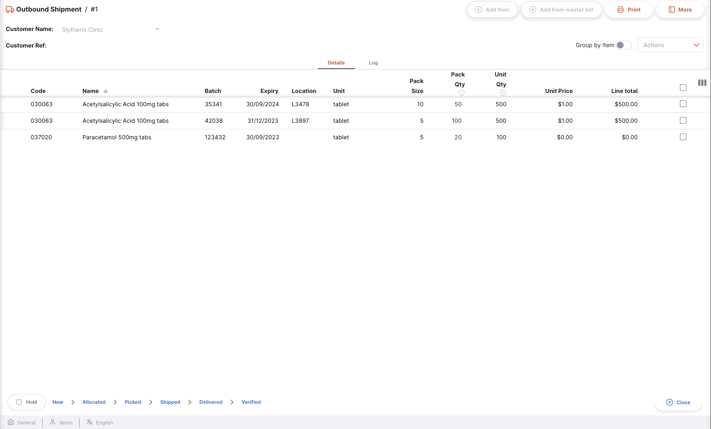
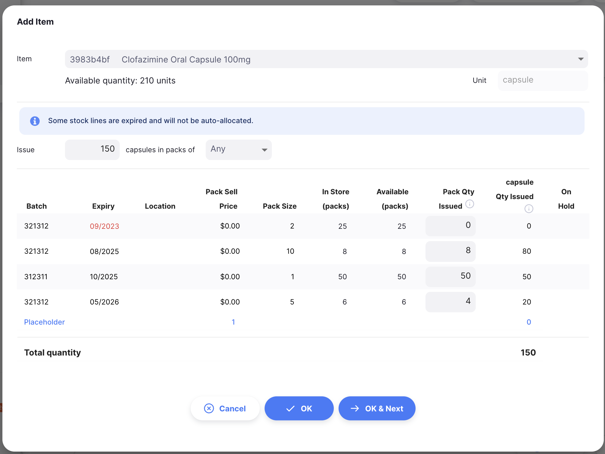

+++
title = "Expéditions"
description = "Livrer du stock aux clients."
date = 2022-03-19T18:20:00+00:00
updated = 2022-03-19T18:20:00+00:00
draft = false
weight = 3
sort_by = "weight"
template = "docs/page.html"

[extra]
toc = true
top = false
+++

La fonction _Expédition_ peut être utilisée pour livrer du stock à un client.

Si vous utilisiez mSupply par le passé, vous devriez être familier au terme **Facture Client** au lieu de **Expédition**.
La fonction Expédition est utilisée pour:

- Un envoi de stock vers un autre dépôt qui utilise mSupply
- Une sortie de stock au bénéfice d'un client
- Le traitement d'une réquisition (commande client)

## Voir les Expéditionns

### Ouvrir le Menu Expéditions

Choisir `Distribution` > `Expédition` dans le panneau de navigation.

La liste des Expéditions s'affichera (Si vous ne voyez aucune ligne, rassurez-vous. Vous venez probablement de commencer!).

De cet écran, vous pouvez:

- Voir la liste des Expéditions
- Créer une nouvelle Expédition
- Exporter les Expéditions dans un fichier `.csv`
- Imprimer une ou plusieurs Expéditions

### Liste des expéditions

1. La liste des expéditions comprend 7 colonnes:

| Colonne         | Description                            |
| :-------------- | :------------------------------------- |
| **Nom**         | Nom du Client                          |
| **Statut**      | Le statut actuel de l'expédition       |
| **Numéro**      | Le numéro de référence de l'expédition |
| **Créée le**    | La date de création                    |
| **Reference**   | La référence du Client                 |
| **Commentaire** | Commentaire sur l'expédition           |
| **Total**       | Valeur totale                          |

2. La liste peut afficher un nombre fixe d'expéditions par page. Au bas de liste, à gauche, on peut voir le nombre d'expéditons actuellement affiché à l'écran.

3. S'il y a plus de 20 expéditions, vous pouvez vous déplacer vers une autre page en cliquant sur le numéro de la page ou en utilisant les flèches droite ou gauche (coin inférieur droit).

### Recherche par nom de client

Vous pouvez filter la liste des expéditions par nom de client. Cela peut être utile si vous êtes à la recherche d'une expédition en particulier!

Entrez le nom du client dans le champs `Search by name` (à gauche, juste au-dessus des en-têtes de liste). Toutes les expéditions pour ce client apparaissent dans la liste.

### Exporter des expéditions

La liste des expéditions peut être exportée dans un fichier (csv). Cliquez simplement sur le bouton _**Exporter**_ (à droite, en haut de la page)

et le fichier sera téléchargé. La fonction d'exportation téléchargera toutes les expéditions, pas seulement la page actuelle, si vous en avez plus de 20. Les expéditions sont exportées en utilisant l'ordre de tri sélectionné dans la liste, bien que vous puissiez facilement trier la liste dans Excel ou tout autre outil avec lequel vous ouvrez le fichier .csv !

### Supprimer une expédition

Vous pouvez, à partir de la liste, supprimer une expédition.

1. Sélectionnez l'expédition que vous souhaitez supprimer en cochant la case à l'extrémité gauche de la liste. Vous pouvez sélectionner plus d'une expédition à supprimer. Vous pouvez même tous les sélectionner à l'aide de la case à cocher principale dans les en-têtes de liste.

2. Ouvrez la liste déroulante `Sélectionner` (coin supérieur droit, au-dessus de la liste) et sélectionnez `Supprimer lignes sélectionnées`.

3. Une notification confirme le nombre d'expéditions supprimées (coin inférieur gauche).

Vous ne pouvez supprimer que les expéditions avec un statut <code>NOUVEAU</code>.

## Créer une expédition

1. Allez à `Distribution` > `Expédition`.

2. Cliquez sur le bouton `Nouveau` en haut à dorite de l'écran

3. Une nouvelle fenêtre `Clients` s'affiche pour vous inviter à sélctionner un client.

#### Sélectionner un client

1. Dans la fenêtre `Clients`, une liste de Clients disponibles vous sera présentée. Vous pouvez sélectionner votre client dans la liste ou vous pouvez entrer manuellement le nom d'un Client. La liste sera filtrée au fil des caractères saisis.

Dans l'exemple ci-dessous, du stock sera livré au client <b>Kamo Regional Warehouse</b>. 

Vous pouvez savoir si un client utilise également mSupply dans son dépôt. Si c'est le cas, vous verrez cette icône (images/is_msupplystoreicon.png" alt="Store" style="width:auto">) près du code du fournisseur. 

2. Une fois que vous pressez la touche `Entrer`, votre Expédition est automatiquement créée.

Si tout s'est bien passé, vous devriez voir le nom de votre client dans le coin supérieur gauche et le statut devrait être <code>NOUVEAU</code> 

### Modifier le nom du client

Si vous avez sélectionné le mauvais client, vous pouvez modifier le nom du client dans le champ `Customer Name` ou le sélectionner dans la liste déroulante :

### Saisir une référence client

Une fois l'expédition créé, vous pouvez saisir une référence client dans le champ `Customer Ref`, s'il y en a une. (ex. _PO#1234567_)

### Afficher ou modifier le panneau d'information sur les expéditions

Le panneau d'information permet d'afficher ou de modifier des informations sur l'expédition. Il est divisé en plusieurs sections :

- Informations complémentaires
- Documents connexes
- Détails de la facture
- Détails du transport

Nous prévoyons ajouter d'autres sections à l'avenir, au fur et à mesure de la croissance d'Open mSupply.

#### Comment ouvrir et fermer le panneau d'information ?

Si vous utilisez un grand écran, le panneau d'information sera automatiquement ouvert pour vous. En revanche, sur un écran de taille moyenne, le panneau d'information sera fermé par défaut.

Pour ouvrir le panneau d'information, vous pouvez cliquer sur le bouton `More`, situé dans le coin supérieur droit de la vue de l'expédition..

Vous pouvez fermer la fenêtre en cliquant sur le bouton `X Close`, situé dans le coin supérieur droit de la fenêtre d'information.

#### Informations complémentaires

Dans la section **Informations complémentaires**, vous pouvez :

- Voir qui a créé l'expédition (nom de l'utilisateur)
- Afficher et modifier la couleur de l'envoi sortant. Pour modifier la couleur, tapez sur le cercle coloré et sélectionnez une couleur dans le menu déroulant.
- Écrire ou modifier un commentaire

#### Documents connexes

Dans la section **Documents connexes**, vous pouvez consulter d'autres documents de transaction liés à l'expédition.

Si votre expédition a été créé pour répondre à une **Requisition**, le numéro de référence de la réquisition apparaît dans cette section.

À l'avenir, nous inclurons également d'autres documents tels que des relevés de température, des documents de transport ou des fiches de prélèvement.

#### Détails de la facture

Dans cette section, vous verrez par défaut le prix de vente total des articles énumérés dans l'expédition.

Vous pouvez également ajouter un **Service charges** si vous souhaitez ajouter d'autres frais tels que les frais de transport. Pour ajouter des frais de service aux détails de la facture :

1. Tapez sur le bouton `Edit Service Charges`. Une nouvelle fenêtre s'ouvre.
2. Tapez sur le bouton `Add charge` dans la nouvelle fenêtre. Une nouvelle ligne apparaît dans la liste des frais. Si vous ne souhaitez rien ajouter, cliquez sur `Cancel`.
3. **Name:** Sélectionnez un service dans la liste déroulante. Vous pouvez personnaliser la liste des frais disponibles. Contactez votre administrateur
4. **Comment:** Vous pouvez ajouter un commentaire pour fournir des détails supplémentaires sur la nouvelle taxe.
5. **Amount:** Indiquer le montant de la taxe
6. **Tax:** Entrer un % de taxe pour la charge
7. **Total:** Le champ total est automatiquement calculé sur la base du montant et du pourcentage de la taxe.
8. **Delete:** Vous pouvez appuyer sur l'icône `Delete` pour effacer la charge.

Dans cette section, vous pouvez également modifier le taux de taxe (%) pour le prix de vente des articles. Tapez sur l'icône du crayon et entrez une valeur.

#### Détails du transport

Dans cette section, vous pouvez voir ou modifier un numéro de référence de transport (par exemple, un numéro de référence de réservation ou de suivi).

### Status de séquence des expéditions

Le status de la séquence se trouve dans le coin inférieur gauche de l'écran expédition.

Les statuts passés sont mis en évidence en bleu, les statuts suivants apparaissent en gris.

<figure>

<figcaption align="center">Status Sequence: status actuel est <code>NEW</code>.</figcaption>
</figure>

<figure>

<figcaption align="center">Status Sequence: status actuel est </i><code>PICKED</code>.</figcaption>
</figure>

Il y a 6 statuts pour l'expédition :

| Status        | Description                                                                                                                               |
| :------------ | ----------------------------------------------------------------------------------------------------------------------------------------- |
| **New**       | Il s'agit du premier status lorsque vous créez un transfert.                                                                              |
| **Allocated** | L'allocation est confirmée. Les produits ne sont plus disponibles pour d'autres transferts mais font toujours partie de votre inventaire. |
| **Picked**    | Le transfert est prélevé et prêt à être expédié. Les produits font toujours partie de votre inventaire.                                   |
| **Shipped**   | Le transfert a été effectué et les produits ne font plus partie de votre inventaire.                                                      |
| **Delivered** | Votre client a reçu le transfert                                                                                                          |
| **Verified**  | Votre client a vérifié la quantité du transfert. Les produits font désormais partie de son inventaire.                                    |

Si vous survolez le statut des séquences, une fenêtre d'historique des transferts s'affiche. Vous pouvez voir la date à laquelle un transfert est passé d'un statut à un autre.

Ce transfert a été créé, attribué et prélevé le 29/03/2022.

### Case à cocher Hold

Situé dans le coin inférieur gauche, à gauche du statuts de la séquence.

Le fait de cocher la case `Hold` empêche la mise à jour du transfert sortant vers le statut suivant.

### Bouton d'annulation et de confirmation

#### Bouton d'annulation

Tapez sur le bouton `Cancel` pour quitter la vue des transfert sortants et revenir à la liste des transferts sortants.

#### Bouton de confirmation

Le bouton `Confirm` permet de mettre à jour le statut d'un transfert. Le statut que vous pouvez confirmer dépend du statut actuel du transfert et suit la séquence indiquée ci-dessous.

Lors de la gestion d'un transfert sortant, vous ne pouvez que confirmer l'allocation, le prélèvement et le transfert.

| Confirmer...               | Statut actuel | Statut suivant |
| :------------------------- | :------------ | :------------- |
| **Confirmer l'allocation** | Nouveau       | Attribué       |
| **Confirmer la sélection** | Alloué        | Choisi         |
| **Confirmer l'envoi**      | Choisi        | Expédié        |

Il n'est pas nécessaire de mettre à jour un transfert pour qu'il passe au statut suivant dans la séquence. Vous pouvez choisir d'ignorer certains d'entre eux pour passer directement à `Confirm Shipped` par exemple.

Comme indiqué ci-dessous, appuyez sur la flèche vers le bas du bouton `Confirm` et sélectionnez le statut dans lequel vous souhaitez que le transfert soit mis à jour.

## Ajout de lignes à une expédition

Bouton de réapprovisionnement `Add Item` (en haut à droite).

Une nouvelle fenêtre `Add Item` s'ouvre.

### Sélectionner un article

Dans la fenêtre `Add Item` vous pouvez rechercher un élément par :

- Lecture de la liste des éléments disponibles
- ou en tapant tout ou une partie du nom de l'article
- ou en tapant tout ou une partie d'un code article

Une fois que votre article est mis en évidence, tapez sur le nom ou appuyez sur `Enter`.

Une fois l'élément sélectionné, les informations suivantes s'affichent :

#### En-têtes

- Code et nom de l'article (ex. _030453 Amoxicilline 250 mg Tabs_)
- la quantité de stock disponible pour cet article (ex. _3527 unités_)
- l'unité de l'article (ex. _Tab_)

<b>Example:</b> For the item *030453 - Amoxicillin 250mg tabs*, there are 3527 tabs available. 

#### [Quantité] d'unités à délivrer en paquets de [Taille de l'emballage].

Dans le champ `Issue Quantity`, vous pouvez saisir la quantité que vous souhaitez délivrer à votre client.

Par défaut, vous êtes invité à délivrer une quantité de **units**. Cependant, vous avez la possibilité de délivrer une quantité de paquets en changeant la valeur dans la deuxième liste déroulante (`Taille de l'emballage`).

La valeur par défaut est `Any` lorsque vous délivrez des unités.

#### Liste des lots disponibles :

Il s'agit d'une liste de numéros de lots que vous avez en stock pour cet article :

- **# Emballages**: Nombre d'emballages à délivrer
- **Taille de l'emballage**: Quantité d'unités par emballage
- **Unit Qty**: Quantité totale d'unités à délivrer
- **Disponible**: Nombre de paquets disponibles (non déjà affectés à d'autres expéditions)
- **En stock**: Nombre total de paquets dans votre dépot
- **Lot**: Numéro de lot. Il s'agit d'une désignation donnée aux produits fabriqués au cours d'un même cycle de fabrication.
- **Expiration**: Date d'expiration du lot (format : MM/AAAA)
- **Emplacement**: Si votre inventaire est géré avec des emplacements de stockage, le nom de l'emplacement où l'article est stocké.
- **Vente**: Prix unitaire de vente de l'article
- **En attente**: Indiquer si un lot est en attente ou non. Il n'est pas possible d'émettre un lot en attente.
- **Espace reservé**: La ligne de remplacement est utilisée lorsque la quantité à délivrer est supérieure au stock disponible.

### Délivrer une quantité d'unités

Par défaut, vous êtes invité à délivrer une quantité de **units**, quelle que soit la taille de l'emballage (nombre d'unités dans un emballage).
Lors de la saisie d'un nombre dans le champ `Issue Quantity`, le système choisit automatiquement le(s) numéro(s) de lot ayant la date de péremption la plus courte (logique "Premier à expirer, premier à sortir" ou FIFO).

Dans l'exemple ci-dessous, nous émettons 100 unités de l'article. Les 100 unités seront prélevées dans le même lot (deuxième ligne). Le premier lot n'a pas été sélectionné car il est périmé. 

Dans cet autre exemple, nous émettons 1200 unités. Le système sélectionne deux lots avec des tailles d'emballage différentes. 

Notez que dans cette liste, les lots qui sont disponibles pour la sélection sont affichés en premier et les lots qui ne le sont pas (en attente ou pas de stock disponible) sont affichés en dessous et dans une police grise.

### Délivrer une quantité d'emballages

Vous pouvez décider de délivrer une quantité d'**emballages**. Pour ce faire, vous pouvez modifier la valeur de la liste déroulante `Taille de l'emballage`.

Imaginons que votre client ne veuille que des emballages de 12 unités. Vous pouvez changer la valeur de la liste déroulante de `Any` à `12`. 

Il vous est maintenant proposé d'émettre un certain nombre d'emballages de 12 unités. Seul(s) le(s) numéro(s) de lot avec une taille d'emballage de 12 unités peut(vent) être automatiquement délivré(s).

Dans l'exemple ci-dessous, nous délivrons 10 emballages de 12 unités :

<b></b> si vous avez déjà introduit une quantité d'unités et que vous passez à une quantité d'emballages, la quantité d'unités sera automatiquement convertie en la quantité correcte d'emballages.  

Lorsqu'une taille d'emballage est sélectionnée, les lignes de stock qui ont une taille d'emballage différente ne sont pas disponibles pour la sélection. Ces lignes sont donc répertoriées plus bas dans le tableau et apparaissent en caractères gris, comme les autres lignes non disponibles.

### Allocation manuelle

Que vous ayez choisi de délivrer une quantité d'unités ou d'emballages, vous pouvez toujours modifier manuellement la quantité au niveau du numéro de lot directement avant d'appuyer sur OK.

Il vous suffit de saisir ou de modifier la quantité dans la colonne `# Packs`.

Le champ principal `Quantité à délivrer` sera automatiquement mis à jour avec la nouvelle quantité.

 <b></b> Lors de l'allocation de quantités au niveau du numéro de lot, la quantité saisie est toujours une quantité d'emballages. 

<figure>

<figcaption align="center"><i>Allocation manuelle au niveau du numéro de lot.</i></figcaption>
</figure>

### Émettre quand il n'y a pas assez de stock (ligne de remplacement)

Si la quantité à délivrer est supérieur au stock total disponible sur toutes les lignes disponibles, la quantité à délivrer sera automatiquement placée dans le champ `placeholder`, au bas de la liste des numéros de lots disponibles.

Les lignes de remplacement peuvent être attribuées ultérieurement lorsque de nouveaux stocks arrivent. Cependant, toutes les lignes d'expédition doivent être allouées avant de confirmer l'allocation.

Étant donné qu'il n'y a pas de stock disponible pour les <i>042744-Diazepam Injection 5mg/ml Amp/2ml</i>, Le système délivre 100 unités dans le champ réservé. 

Lorsque vous examinez une expédition, vous pouvez voir si une ligne d'expédition n'a pas été allouée ou a été partiellement allouée lorsqu'elle est surlignée en bleu.

### Confirm Item and Quantity

When you are happy with the quantity, you can either press on:

- the `OK` button. You are redirected to the Outbound Shipment view and your item has been added to the list.
- the `OK & Next` button to add another item right away
- the `Cancel` if you do not want to add the item to the Outbound Shipment anymore

## Editing an Outbound Shipment Line

To edit an shipment line, tap on it. You will be presented with the `Edit Item` window, which is identical to the `Add Item` window, except that the item is already chosen.

### Edit a Shipment Line

 <b></b> you can edit a shipment line if the shipment has a status lower than <code>Shipped</code>. 

1. Open the Outbound Shipment you want to edit.
2. Tap on the line you want to edit. An identical window to `Add Item` appears. At this stage:

   - Edit the main `Issue Quantity` field
   - or change the number of packs value at the batch number level

 <b></b> When editing a shipment line, you cannot change the item. You would need to delete the shipment line and to create a new one. 

### Delete a Shipment line

1. Open the Outbound Shipment you want to edit.
2. Select the line(s) you want to delete by checking the box(es) on the right of the list.
3. Go to the `Actions` dropdown menu (top right corner, above the list)
4. Select the action `Delete selected lines`

In the below example, we are deleting <i>item 030063 - Acetylsalicylic Acid 100mg tabs</i>

 <b></b> You can delete multiple lines at once. Be sure to review what is selected before performing the Delete action. 

## Processing an Outbound Shipment

### Allocating an Outbound Shipment

Allocation is the process of assigning one or multiple batch numbers from the inventory to a shipment line. In other words, you are assigning stock to your shipment. Once allocated, the stock is reserved for the shipment and thus for your customer.

There are 2 main ways to allocate a shipment line:

1. When adding items, system is automatically assigning stock to the new shipment line when you enter a quantity. If you don't have enough stock, system will add placeholder lines (unallocated lines).

2. Bulk action `Allocate placeholder lines`:
   - Select the lines that you want to allocate by checking boxes on the right on the list
   - In the `Actions` dropdown menu, select `Allocate placeholder lines`. System will check if there is available stock for each selected lines and allocate them using the First to Expire, First Out (FEFO) logic. A notification will let you know whether the operation is successful or not.

You won't be able to process your Outbound Shipment if you have unallocated lines (shipment lines without batch number(s) assigned to it). You can wait for more stock to arrive or you can delete the placeholder lines. 

### Confirming an Outbound Shipment's allocation

Once you all your shipments lines have been allocated, you can **confirm the allocation**:

- Current status of the shipment has to be `NEW`
- Lines must be assigned with one or several batch numbers. You won't be able to confirm the allocation if your shipment contains lines without batch numbers assigned to it (placeholder lines).

To confirm the allocation, press the `Confirm Allocated` button.

Once the allocation is confirmed:

- Shipment status is `ALLOCATED`
- You are now invited to confirm the picking via the `Confirm Picked` button
- All the items and their quantities will be reserved, meaning that they are no longer available for allocation
- You can print a **pick slip** to be sent to your warehouse so they can start preparing the shipment

### Confirming Outbound Shipment picking

Picking refers to the process where individual items are picked from a fulfillment facility (usually a warehouse or a pharmacy store).

Once a shipment has been allocated, next step is to go get the items to prepare the actual shipment. To help with that, you are able to generate a **pick slip** document. A pickslip indicates:

- What are the items to be picked
- The quantity and batch numbers for each item
- If you manage your inventory with storage locations, where the items are located

Once all items are picked and packed. You can then confirm the picking of the shipment to indicate to indicate that it is ready to be dispatched.

To confirm that a shipment has been picked, tap on the `Confirm Picked` button.

Once picking is confirmed:

- Shipment status is now `PICKED`
- You are now invited to confirm the shipping via the `Confirm Shipped` button
- An **Inbound Shipment** has been generated and is now visible to your customer

At this stage, you are still able to edit shipment lines, to add items or to delete existing lines. However, if picking has been confirmed, you need to make sure to inform your fulfillment facility of any change so they can make sure that the shipment is still correct.

### Confirming the Outbound Shipment shipping

The last step to issue stock with an Outbound Shipment is to confirm that stock has been shipped. This a critical step cause when goods are confirmed as shipped, they are no longer part of your inventory records.

To confirm that an Outbound Shipment has been shipped, tap on the `Confirm Shipped` button.

Once shipping has been confirmed:

- Shipment status is now `SHIPPED`
- Goods are no longer part of your inventory
- You can no longer edit shipment lines
- You can no longer delete the shipment
- You can print a **delivery note** or an **invoice**

### Tracking Progress of Outbound Shipments

If your customer is also using mSupply, you wil be able to see when they'll receive your shipments:

- status will become `DELIVERED` when goods are received: your customer confirmed that they received your goods
- status will become `VERIFIED` when shipment has been verified by your customer. Goods are now part of their inventory

## Viewing an Outbound Shipment

When viewing a specific shipment, you can view the batches on that shipment grouped by item or with each batch listed separately.
To change the view mode, click the `Group by item` switch.

When grouped by item, you can expand the item to see individual batches, or use the expand in the table header to expand all grouped rows. If you click on an item you will also see all selected batches, as shown in this example:

