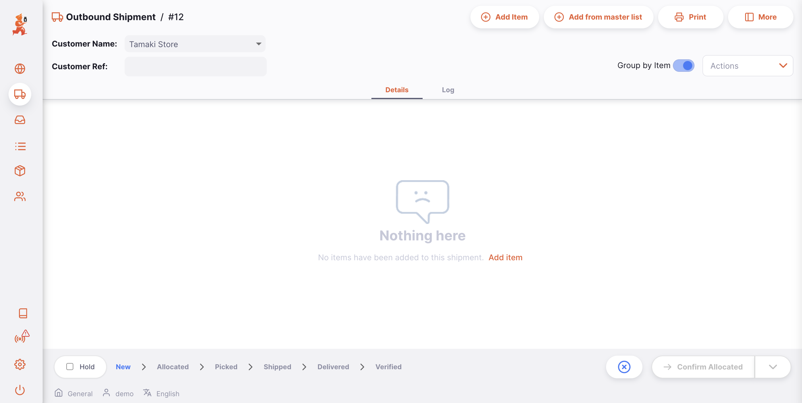
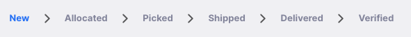
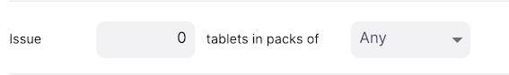
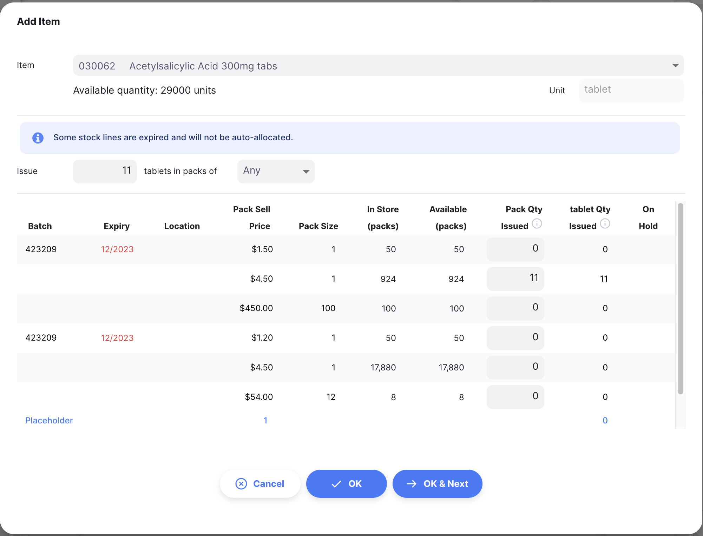
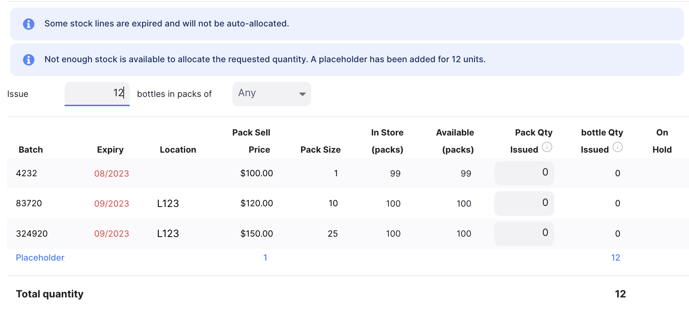
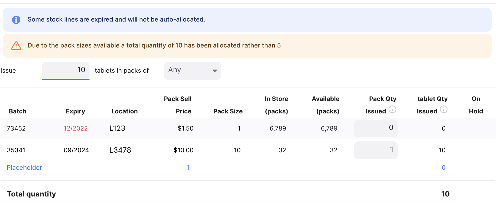
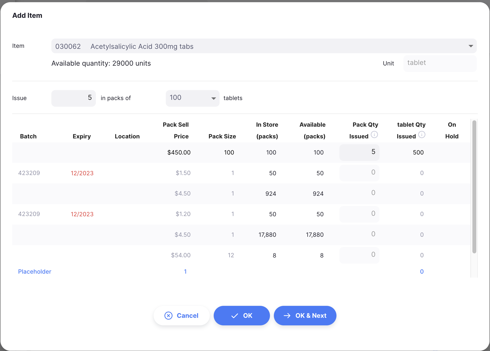
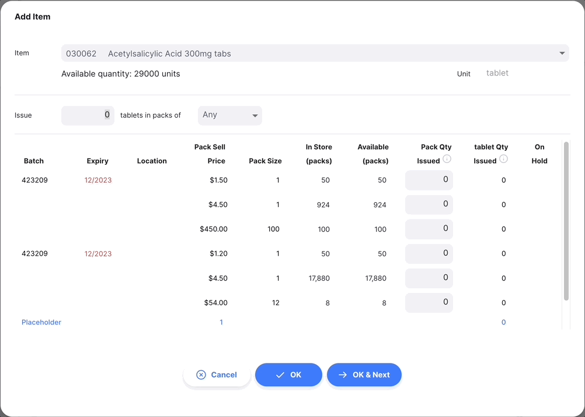
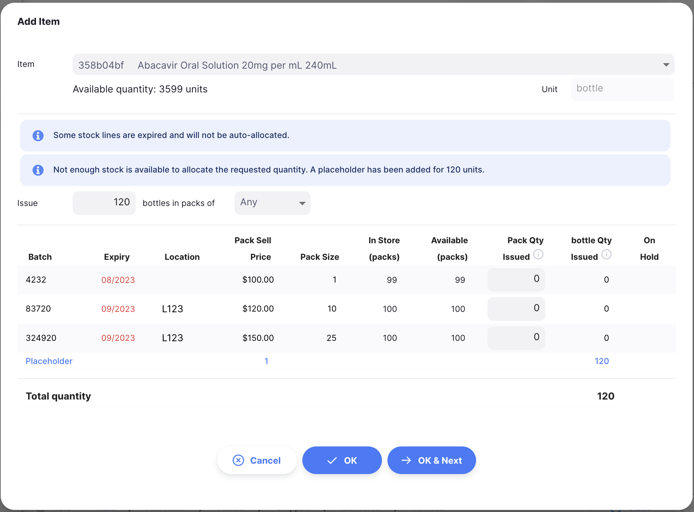
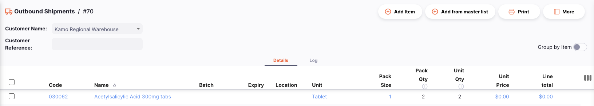

+++
title = "Outbound Shipments"
description = "Issuing stock to your customers."
date = 2022-03-19T18:20:00+00:00
updated = 2022-03-19T18:20:00+00:00
draft = false
weight = 23
sort_by = "weight"
template = "docs/page.html"

[extra]
toc = true
top = false
+++

Outbound Shipments can be used to issue stock to a customer.

If you have used mSupply in the past, you may be familiar with the term **Customer Invoice** instead of Outbound Shipment.
An Outbound Shipment can be used to:

- Transfer stock to another store which also uses mSupply
- Issue stock to a customer
- Fulfill requisitions (customer orders)

## Viewing Outbound Shipments

### Open the Outbound Shipments Menu

Choose `Distribution` > `Outbound Shipment` in the navigation panel.

You will be presented with a list of Outbound Shipments (if you don't see any, you are probably just starting!).

From this screen you can:

- View a list of Outbound Shipments
- Create a new Outbound Shipment
- Export Outbound Shipments to a `.csv` file
- Print one or multiple Outbound Shipments

### Outbound Shipment list

1. The list of Outbound Shipments is divided into 7 columns:

| Column        | Description                      |
| :------------ | :------------------------------- |
| **Name**      | Name of the Customer             |
| **Status**    | Current Status of the shipment   |
| **Number**    | Reference Number of the shipment |
| **Created**   | Creation date of the shipment    |
| **Reference** | Customer reference               |
| **Comment**   | Comment for the shipment         |
| **Total**     | Total value of the shipment      |

1. The list can display a fixed number of shipments per page. On the bottom left corner, you can see how many shipments are currently displayed on your screen.

3. If you have more shipments than the current limit, you can navigate to the other pages by tapping on the page number or using the right of left arrows (bottom right corner).

4. You can also select a different number of rows to show per page using the option at the bottom right of the page.

### Search by Customer Name

You can filter the list of shipments by customer name or by status. This can be useful if you're looking for one particular shipment!
Select the `Name` filter from the list to filter by the customer name:

Type the name of a customer in the `Name` field. All the shipments for this customer will appear in the list.

### Exporting Outbound Shipments

The list of Outbound Shipments can be exported to a comma separated file (csv). Simply click the export button (on the right, at the top of the page)

and the file will be downloaded. The export function will download all Outbound Shipments, not just the current page, if you have more than 20 of them.

### Delete an Outbound Shipment

You can delete a shipment from the Outbound Shipment list.

1. Select the shipment that you want to delete by checking the box on the left end of the list. You can select more than one shipment to be deleted. You can even select them all using the master checkbox in the list headers.

2. The `Actions` footer will display at the bottom of the screen when a shipment is selected. It will display the number of shipments selected and the actions which can be taken. Click `Delete`.

3. A notification confirms how many shipments were deleted (bottom left corner).

You can only delete Outbound Shipments if they have not been <code>SHIPPED</code>.

## Creating an Outbound Shipment

1. Go to `Distribution` > `Outbound Shipment`.

2. Press the `New Shipment` button, in the top right corner

3. A new window `Customers` opens, inviting you to select a customer.

#### Select a Customer

1. In the `Customers` window, you will be presented with a list of available customers. You can select your customer from the list or you can type as much of a customer name.

In the below example, we are issuing stock to <b>Kamo Regional Warehouse</b>. 

You can tell if a customer is also using Open mSupply in their store if they have an icon like this  next to the customer code. 

2. Once you tap or press `Enter`, or click on a customer, your Outbound Shipment is automatically created

os
If everything went well, you should see the name of your customer in the top left corner and the status should be <code>NEW</code> 

### Edit the Customer Name

If you have selected the wrong customer, you can change the customer name in the `Customer Name` field or select one the dropdown list:

### Enter a Customer Reference

Once your Outbound Shipment has been created, you can enter a customer reference in the `Customer Ref` field, if they have one (eg. _PO#1234567_)

### View or edit the Outbound Shipment Information Panel

The Information Panel allows you to see or edit information about the Outbound Shipment. It is divided into multiple sections:

- Additional Info
- Related Documents
- Invoice Details
- Transport Details

We are planning to add more sections in the future as Open mSupply grows.

#### How to open and close the Information Panel?

If you are using a large screen, the information panel will be automatically opened for you. However, on an average sized screen, the information panel will be closed by default.

To open the Information Panel, you can tap on the `More` button, located in the top right corner of the Outbound Shipment view.

You can close by tapping on the `X Close` button, on the top right corner of the information panel.

#### Additional Info

In the **Additional Info** section, you can:

- See who created the Outbound Shipment (name of the user)
- View and edit the Outbound Shipment color. To edit the color, tap on the colored circle and select a color from the pop-up
- Write or edit a comment

#### Related Documents

In the **Related Documents** section, you can see other related transaction document for the Outbound Shipment.

If your Outbound Shipment was created to fulfill a **Requisition**, the reference number of the requisition would appear in this section.

In the future, we would also include other documents such as temperature records, transportation documents or pick slips.

#### Invoice Details

In this section, you will see by default the total selling price of the items listed in the Outbound Shipment.

You can also add **service charges** if you wish to add other charges such as `Freight Costs`.

Service charges must be in your Master List for you to use them.

To add a service charges to the Invoice Details:

1. Tap on the three dots besides `Service charges` to get a new window to appear.
2. Tap on the `Add charge` button on the new window. A new line appears in the list of charges. Tap on `Cancel` if you do not wish to add anything
3. **Name:** Select a service charge from the dropdown list. You can customise the list of available charges. Contact your administrator
4. **Comment:** You can add a comment to provide further details about the new charge
5. **Amount:** Enter the amount of the charge
6. **Tax:** Enter a % of tax for the charge
7. **Total:** The total field is automatically calculated based on the _amount_ and the _tax percentage_
8. **Delete:** You can tap on the `Delete` icon to delete the charge

The tax rate (%) for service charges and the item's sell price can also be edited by clicking on the pencil icon. A pop-up window will appear for you to enter a value.

###### Foreign Currencies

If your store is issuing in foreign currencies follow [these instructions](https://docs.msupply.org.nz/other_stuff:currencies) in the central server documentation to set it up. You will also need to enable the store preference `Store: Able to issue in foreign currency`. This preference is compatible with Open mSupply `v1.7.0+`.

The pen icon will become active once the above instructions have been followed and only if the customer is an external customer. Click on this icon and change to a currency that you would like to issue the shipment in. The currency rate can also be edited if you and the customer have agreed on a different rate.

You can also see the foreign currency totals in the invoice line details as well.

See the <a href="/docs/introduction/faq/#is-there-support-for-my-currency">currency support question</a> for the list of codes supported

#### Transport Details

In this section, you can see or edit a transport reference number (eg. a booking or a tracking reference number).

#### Actions

1. **Delete:** You can tap on the `Delete` button to delete the invoice
2. **Copy to Clipboard**: You can tap on the `Copy to Clipboard` button to copy the invoice details to the clipboard.

### Outbound Shipment Status Sequence

The status sequence is located at the bottom left corner of the Outbound Shipment screen.

Passed statuses are hightlighted in blue, next statuses appear in grey.

<figure>

<figcaption align = "center">Status Sequence: current status is <code>NEW</code>.</figcaption>
</figure>

<figure>

<figcaption align = "center">Status Sequence: current status is </i><code>PICKED</code>.</figcaption>
</figure>

There are 6 status for the Outbound Shipment:

| Status        | Description                                                                                                     |
| :------------ | --------------------------------------------------------------------------------------------------------------- |
| **New**       | This is the first status when you create a shipment                                                             |
| **Allocated** | Allocation is confirmed. Goods are no longer available for other shipments but are still part of your inventory |
| **Picked**    | Shipment is picked and is now ready to ship. Goods are no longer part of your inventory                         |
| **Shipped**   | Shipment has been shipped.                                                                                      |
| **Delivered** | Your customer has received the shipment. Goods are now part of their inventory                                  |
| **Verified**  | Your customer has verified the quantity of the shipment.                                                        |

If you hover over the status sequence, a shipment history window appears. You can see the date when a shipment was updated from one status to another.

This shipment has been created, allocated and picked on 29/03/2022

### Hold checkbox

Located on the bottom left corner, on the left of the status sequence.

Checking the `Hold` checkbox prevents the Outbound Shipment from being updated to the next status.

### Cancel and Confirm button

#### Cancel Button

Tap on the `Close` button to quit the Outbound Shipment view and return to the Outbound Shipments list.

#### Confirm Button

The `Confirm` button updates the status of a shipment. The status which you can confirm depends on the current status of the shipment and follows the sequence shown below.

When managing an Outbound Shipment, you can only confirm the Allocation, Picked and Shipped statuses.

| Confirm...            | Current Status | Next Status |
| :-------------------- | :------------- | :---------- |
| **Confirm Allocated** | New            | Allocated   |
| **Confirm Picked**    | Allocated      | Picked      |
| **Confirm Shipped**   | Picked         | Shipped     |

You don't have to update a shipment to the next status in the sequence. You can choose to skip some of them to go directly to `Confirm Shipped` for example.

As demonstrated below, tap on the down arrow of the `Confirm` button and select the status you want the shipment to be updated to.

## Adding lines to an Outbound Shipment

Tap on the `Add Item` button (top right corner).

A new `Add Item` window opens.

### Adding using a barcode scanner

For another way to add items, if you are using the desktop client or android app, you can make use of [barcode scanning](../barcode-scanning) to add items.

### Select an Item

In the `Add Item` window, you can look up an item by:

- Reading through the list of available items
- or by typing some or all of the item name
- or by typing some or all of an item code

Once your item is highlighted, tap on the name or press `Enter`.

Once the item is selected, you can see the following information:

#### Headers

- Item code and name (eg. _030453 Amoxicillin 250 mg Tabs_)
- the available stock quantity for this item (eg. _3527 units_)
- the item's unit (eg. _Tab_)

<b>Example:</b> For the item *030453 - Amoxicillin 250mg tabs*, there are 3527 tabs available. 

#### Issue [Quantity] of units in packs of [Pack Size]

In the `Issue` field, you can enter the quantity that you want to issue to your customer.

By default, you are invited to issue a quantity of **units**. However, you have the possibility to issue a quantity of packs instead by changing the value in the second dropdown (`Pack Size`).

Default value is `Any` when you are issuing units.

#### List of available batches:

This is a list of batch numbers that you have in store for this item:

| Column                | Description                                                                                                        |
| :-------------------- | :----------------------------------------------------------------------------------------------------------------- |
| **Batch**             | Batch number. It is a designation given to products made in the same manufacturing run.                            |
| **Expiry**            | Expiry date of the batch (format: MM/YYYY). Note: the date shows in red if the expiry is within the next 3 months. |
| **Location**          | This is the code of the location where the item is stored if your inventory is managed with storage locations      |
| **Pack Sell Price**   | Selling unit price of the item                                                                                     |
| **Pack Size**         | Quantity of units per pack                                                                                         |
| **In Store (packs)**  | Total number of packs in your store                                                                                |
| **Available (packs)** | Number of packs available (not already allocated to other shipments)                                               |
| **[Pack] Qty Issued** | Total quantity of packs to be issued                                                                               |
| **[Unit] Qty Issued** | Number of units to be issued                                                                                       |
| **On Hold**           | Indicates whether a batch is on hold or not. You cannot issue a batch that is on hold.                             |

There is also a final row in the table which is a placeholder line, if the status of the Outbound Shipment is `NEW`.
The placeholder line is used when the quantity you are issuing is higher than your available stock.

### Issue a quantity of units

By default, you are invited to issue a quantity of **units**, regardless of the pack size (number of units in a pack).

When entering a number in the `Issue` field, the system automatically chooses the batch number(s) with the closest expiry date (First to Expire, First Out or FEFO logic).

In the example below, we are issuing 11 units of the item. All 11 units will be taken from the same batch (second row). The first batches was not selected because it is expired. 

In this other example, we are issuing 150 units. System selects three batches with different pack sizes. 

Note that in this list, the batches which are available for selection are shown first and batches which are not (on hold or no stock available) are shown below and in a grey font.

#### Warnings

You may see one or more warning messages on this screen:

The warning is shown to let you know that not enough stock is available to fulfil your request. A placeholder quantity is added automatically so that you can keep track of the amount requested, while adding more stock (for example by using an internal order or inbound shipment).

This image also shows the warning which lets you know that some stock lines are expired; this may be why the system did not auto-allocate particular stock lines.
However you can still manually choose those lines and issue the expired stock!

This warning tells you that because of the available pack sizes, the system has rounded up the quantity requested. In this example, there is no pack size that is less than `5`. There are packs of `10` available though, so when 5 tablets are requested, the system has rounded up the request to `1` pack of `10`.

If you add an item, forget to enter a quantity to issue, and click `OK` you will see this warning message. It is informing you that there is no issue quantity; from here you can click `OK` again to confirm that you intended to enter `0`, in which case the window will close and a placeholder row will be added to the shipment. You can edit the row later and add a quantity. If you forget to add a quantity however, and confirm the shipment as allocated, this row will be removed!

### Issue a quantity of packs

You can decide to issue a quantity of **packs**. To do this, you can change the value in the `Pack Size` dropdown.

Let's imagine that your customer only wants pack size of 10 units. You can change the dropdown value from `Any` to `10`. 

You are now offered to issue a number of packs of 100 units. Only batch number(s) with a pack size of 100 units can be automatically issued.

In the example below, we are issuing 5 packs of 100 units:

If you had previously entered a quantity of units and you switch to a quantity of packs, the quantity of units will automatically be converted into the correct quantity of packs.  

When a pack size is selected, stock lines which have a different pack size from the one selected are not available for selection. As such, those rows are listed lower down in the table and are shown in a grey font, in the same way as other unavailable rows.

### Manual Allocation

Regardless of if you chose to issue a quantity of units or packs, you can always manually change the quantity at the batch number level directly before pressing on OK.

You simply have to enter or edit the quantity in the `Packs Qty Issued` column.

The values in the **Total quantity** row will be automatically updated with the new quantity.

 <b></b> When allocating quantities at the batch number level, the quantity you enter is always a quantity of packs. 

<figure>

<figcaption align = "center"><i>Manual allocation at the batch number level.</i></figcaption>
</figure>

### Issuing when there is not enough stock (Placeholder Line)

If the amount to be issued is greater than the total stock available from all of the available lines, then the quantity to be issued will automatically be placed in the `placeholder` field, at the bottom of the list of available batch numbers.

Placeholder lines can be allocated later when new stock arrives. However, all shipment lines must be allocated before confirming the allocation.

Since there is no stock available for <i>358b04bf Abacavir Oral Solution 20mg per mL 240mL</i>, the system is issuing 120 units in the placeholder field. 

When you look at an Outbound Shipment, you can see if a shipment line has not been allocated or has been partially allocated when it is highlighted in blue.

### Confirm Item and Quantity

When you are happy with the quantity, you can either press on:

- the `OK` button. You are redirected to the Outbound Shipment view and your item has been added to the list
- the `OK & Next` button to add another item right away
- the `Cancel` button if you do not want to add the item to the Outbound Shipment any more

## Adding lines to an Outbound Shipment using a Master List

Tap on the `Add from master list` button (top right corner).

A new `Master Lists` window opens. This allows you to select the required master list. Simply click on one of the lists (if you have some available).
Note that the lists shown are those which are visible to the customer of the shipment.

Click `OK` on the prompt:

You will then have unallocated (placeholder) lines added to your shipment, which will then look like this:

As you can see - all of the quantities are zero. You can follow the steps for editing these lines, as detailed above.

## Editing an Outbound Shipment Line

To edit a shipment line, tap on it. You will be presented with the `Edit Item` window, which is identical to the `Add Item` window, except that the item is already chosen.

### Edit a Shipment Line

 <b></b> You can edit a shipment line if the shipment has a status lower than <code>Shipped</code>. 

1. Open the Outbound Shipment you want to edit.
2. Tap on the line you want to edit. An identical window to `Add Item` appears. At this stage:

   - Edit the main `Issue Quantity` field
   - or change the number of packs value at the batch number level

 <b></b> When editing a shipment line, you cannot change the item. You would need to delete the shipment line and create a new one. 

### Delete a Shipment line

1. Open the Outbound Shipment you want to edit.
2. Select the line(s) you want to delete by checking the box(es) on the left hand side of the list.
3. Click the `Delete` button which appears at the bottom of the page.

In the below example, we are deleting <i>three placeholder lines</i>.

 <b></b> You can delete multiple lines at once. Be sure to review what is selected before performing the Delete action. 

## Processing an Outbound Shipment

### Allocating an Outbound Shipment

Allocation is the process of assigning one or multiple batch numbers from the inventory to a shipment line. In other words, you are assigning stock to your shipment. Once allocated, the stock is reserved for the shipment and thus for your customer.

There are 2 main ways to allocate a shipment line:

1. When adding items, the system will automatically assign stock to the new shipment line when you enter a quantity. If you don't have enough stock, the system will add placeholder lines (unallocated lines).

2. Bulk action `Allocate placeholder lines`: Select the lines that you want to allocate by checking boxes on the left hand side of the list

3. Click the `Allocate placeholder lines` button which appears at the bottom of the page. System will check if there is available stock for each selected line and allocate them using the First to Expire, First Out (FEFO) logic. A notification will let you know whether the operation is successful or not.

You won't be able to process your Outbound Shipment if you have unallocated lines (shipment lines without batch number(s) assigned to them) with a quantity greater than 0. You can wait for more stock to arrive or you can delete the placeholder lines. Any unallocated lines with a 0 quantity will automatically be removed for you when you allocate.

### Confirming an Outbound Shipment's allocation

Once all your shipments lines have been allocated, you can **confirm the allocation**:

- Current status of the shipment has to be `NEW`
- Lines must be assigned with one or several batch numbers. You won't be able to confirm the allocation if your shipment contains lines without batch numbers assigned to it (placeholder lines).

To confirm the allocation, press the `Confirm Allocated` button.

Once the allocation is confirmed:

- Shipment status is `ALLOCATED`
- You are now invited to confirm the picking via the `Confirm Picked` button
- All the items and their quantities will be reserved, meaning that they are no longer available for allocation
- You can print a **pick slip** to be sent to your warehouse so they can start preparing the shipment

### Confirming Outbound Shipment picking

Picking refers to the process where individual items are picked from a fulfilment facility (usually a warehouse or a pharmacy store).

Once a shipment has been allocated, the next step is to go get the items to prepare the actual shipment. To help with that, you are able to generate a **pick slip**. A pick slip indicates:

- The items to be picked
- The quantity and batch numbers for each item
- If you manage your inventory with storage locations, where the items are located

Once all items are picked and packed. You can then confirm the picking of the shipment to indicate that it is ready to be dispatched. Goods are no longer part of your inventory and cannot be allocated to other shipments once the status has been changed to `PICKED`.

To confirm that a shipment has been picked, tap on the `Confirm Picked` button.

Once picking is confirmed:

- Shipment status is now `PICKED`
- You are now invited to confirm the shipping via the `Confirm Shipped` button
- If your customer is also using mSupply, then an **Inbound Shipment** has been generated and is now visible to your customer

At this stage, you are still able to edit shipment lines, to add items or to delete existing lines. However, if picking has been confirmed, you need to make sure to inform your fulfilment facility of any change so they can make sure that the shipment is still correct.

### Confirming the Outbound Shipment shipping

The last step to issue stock with an Outbound Shipment is to confirm that stock has been shipped. This is a critical step because when goods are confirmed as shipped, they are no longer a part of your inventory records.

To confirm that an Outbound Shipment has been shipped, tap on the `Confirm Shipped` button.

Once shipping has been confirmed:

- Shipment status is now `SHIPPED`
- Goods are no longer part of your inventory
- You can no longer edit shipment lines
- You can no longer delete the shipment
- You can print a **delivery note** or an **invoice**

### Tracking the Progress of Outbound Shipments

If your customer is also using mSupply, you will be able to see when they'll receive your shipments:

- status will become `DELIVERED` when goods are received: your customer confirmed that they received your goods
- status will become `VERIFIED` when shipment has been verified by your customer. Goods are now a part of their inventory.

## Process return of stock from an Outbound Shipment

Sometimes, stock sent via an Outbound Shipment will need to be returned. You can do this by creating an [Customer Return](../customer-returns).

1. Open the Outbound Shipment for which you would like to process the return of some or all of the stock
2. Make sure that status is at least `SHIPPED`
3. Select the line(s) you want to process the return of by checking the box(es) on the right of the list
4. Click the `Return selected lines` button which appears at the bottom of the page.

### Select quantity returned

A modal will open, containing each line you selected for return:

| Column                | Description                                                                             |
| :-------------------- | :-------------------------------------------------------------------------------------- |
| **Code**              | Item code                                                                               |
| **Name**              | Item name                                                                               |
| **Batch**             | Batch number. It is a designation given to products made in the same manufacturing run. |
| **Expiry**            | Expiry date of the batch (format: MM/YYYY)                                              |
| **Pack Size**         | Quantity of units per pack                                                              |
| **Pack Qty Issued**   | Number of packs that were issued in the Outbound Shipment                               |
| **Quantity Returned** | Number of packs to be returned                                                          |

The `Quantity Returned` values will initially be `0` - you can adjust this to return some or all of the available stock.

#### Warnings

If you forget to enter a `Quantity Returned` for any line and click `Next step`, you will see this warning message. You'll need to add a quantity returned from at least one line. You can click `Cancel` if you no longer want to process the return of any of this stock.

### Provide reasons

Once you are happy with your returned quantities, you can click `Next step`. The list of lines will be filtered to only include the lines you provided a return quantity for. In this view, you can enter a reason for the return of each line, and an additional comment.

### Confirm

When you are happy with the quantities and reasons, you can press on:

- the `OK` button. a Customer Return will be created, and you will be redirected to view it.
- the `Back` button, to go back to the `Select quantity` step

## Viewing an Outbound Shipment

When viewing a specific shipment, you can view the batches on that shipment grouped by item or with each batch listed separately.
To change the view mode, click the `Group by item` switch.

When grouped by item, you can expand the item to see individual batches, or use the expand in the table header to expand all grouped rows. If you click on an item you will also see all selected batches, as shown in this example:

If you do not have enough room on your screen, or simply aren't interested in some of the columns shown, you have the option of hiding which columns are shown in this view.

Click on the `Show / hide columns` button which is at the top right of the table. This gives a list of the columns available - you can check the columns you want to see. The options chosen are stored for the current browser, so next time you view an Outbound Shipment, you will see the selected columns only. If you have chosen which columns to show, then the button is shown in blue to remind you that there are more columns available.

