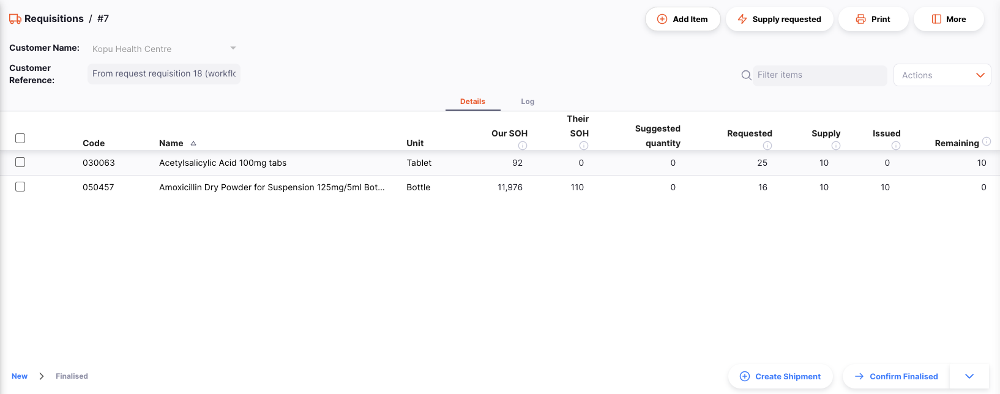
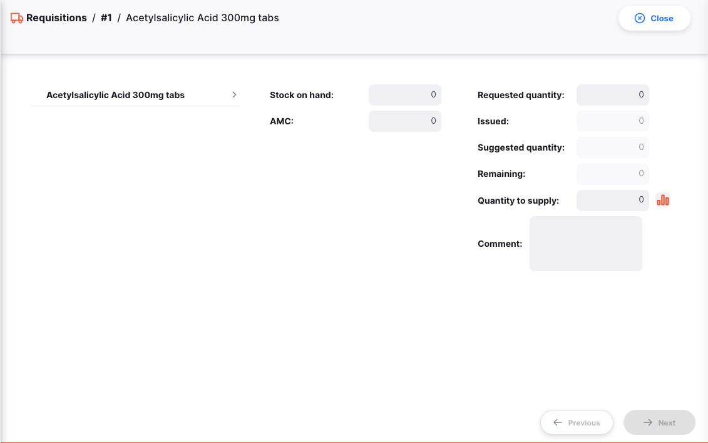

+++
title = "Requisiciones"
description = "Gestión de las órdenes de tus clientes."
date = 2022-03-19T18:20:00+00:00
updated = 2022-03-19T18:20:00+00:00
draft = false
weight = 22
sort_by = "weight"
template = "docs/page.html"

[extra]
lead = "Gestiona las órdenes de tus clientes"
toc = true
top = false
+++

Cuando un cliente te hace un pedido de inventario, ellos crean una **Oden Interna** en su almacén. Esto aparecerá como una **Requisición** en tu almacén.

## Ver requisiciones de tus clientes

Para saber si has recibido requisiciones de tus clientes, ve a `Distribución` > `Requisición`

Deberías ver una lista de todas las requisiciones enviadas por tus clientes.

Desde esta pantalla puedes:

- Ver la lista de requisiciones
- Exportar requisiciones a un archivo`.csv`

### Lista de Requisiciones

1. La lista de Requisiciones está dividida en 5 columnas:

| Columna        | Descripción                            |
| :------------- | :------------------------------------- |
| **Nombre**     | Nombre del Cliente                     |
| **Número**     | Número de referencia de la requisición |
| **Creada**     | Fecha de creación de la requisición    |
| **Estado**     | Estado actual de la requisición        |
| **Comentario** | Comentario para la requisición         |

2. La lista puede mostrar un número fijo de requisiciones por página. En la esquina inferior izquierda, puedes ver cuántas requisiciones se están mostrando actualmente en tu pantalla.

3. Si tienes más requisiciones que el límite actual, puedes navegar a las otras páginas tocando el número de página o utilizando las flechas derecha o izquierda (esquina inferior derecha).

4. También puedes seleccionar un número diferente de filas para mostrar por página utilizando la opción en la esquina inferior derecha de la página.

### Búsqueda por comentario

Puedes filtrar la lista de requisiciones por comentario. ¡Esto puede ser útil si estás buscando una requisición en particular!

Comienza a escribir en el campo `Buscar por comentario` (a la izquierda, justo encima de los encabezados de la lista). Todas las requisiciones que tengan un comentario que coincida con el texto ingresado aparecerán en la lista.

### Exportación de Requisiciones

La lista de Requisiciones se puede exportar a un archivo separado por comas (csv). Simplemente haz clic en el botón de exportación (a la derecha, en la parte superior de la página)

y el archivo se descargará automáticamente. La función de exportación descargará todas las Requisiciones, no solo las de la página actual, si tienes más de 20 de ellas.

### Ver una requisición

Para ver los detalles de una requisición en particular, simplemente haz clic en ella en la vista de lista. Luego podrás ver la vista detallada de la requisición:

Al hacer clic en un elemento individual en esta vista, se mostrarán los detalles del artículo en particular. Aquí puedes ajustar la cantidad a suministrar:

La cantidad solicitada también se muestra, junto con los detalles del artículo en inventario.

Otra forma de ajustar la cantidad de suministro es hacer clic en el botón "Suministrar solicitado" en la parte superior de la página. Esto establecerá automáticamente la cantidad de suministro como la cantidad solicitada para ese artículo. Haz clic en el botón y se te pedirá confirmación antes de que se realice el ajuste:

Para crear una salida que suministre los artículos solicitados, haz clic en el botón "Crear envío". Esto creará un envío, agregará todos los artículos que no estén completamente suministrados, y luego abrirá ese envío en una nueva pestaña. Antes de hacerlo, se te pedirá confirmación:

Después de crear dicho envío, verás el número de envío, junto con un enlace para verlo, en la sección "Documentos relacionados" del panel de detalles adicionales en el lado derecho de la pantalla.
