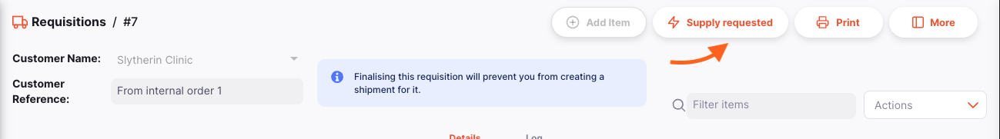
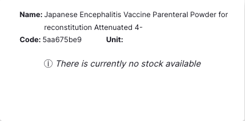

+++
title = "Requisitions"
description = "Managing your customers orders."
date = 2022-03-19T18:20:00+00:00
updated = 2022-03-19T18:20:00+00:00
draft = false
weight = 22
sort_by = "weight"
template = "docs/page.html"

[extra]
lead = "Managing your customers' orders"
toc = true
top = false
+++

When a customer orders stock from you, they create an **Internal Order** in their store. This will appear as a **Requisition** in your store.

## Viewing Customers' Requisition

To know if you have received requisitions from your customers, go to `Distribution` > `Requisition`

You should see a list of all requisitions sent by your customers.

From this screen you can:

- View a list of Requisitions
- Export Requisitions to a `.csv` file

### Requisition list

The list of Requisitions is divided into 6 columns:

| Column        | Description                                      |
| :------------ | :----------------------------------------------- |
| **Name**      | Name of the Customer                             |
| **Number**    | Reference Number of the requisition              |
| **Created**   | Creation Date of the requisition                 |
| **Status**    | Current Status of the requisition                |
| **Shipments** | Number of shipments created from the requisition |
| **Comment**   | Comment for the requisition                      |

If you have program requisitions enabled, you may have additional columns in this table!

### Filter Requisitions

You can filter the list of requisitions by name, status or whether shipments have been created. This can be useful if you're looking for one particular requisition!

Select the desired filter(s) from the list:

- **Name**: Start typing in the field to filter by customer name
- **Status**: Select a status from the dropdown list
- **Shipment created**: Toggle on to only show requisitions where shipments have been created

All the requisitions which match the filters will appear in the list.

### Exporting Requisitions

The list of Requisitions can be exported to a comma separated file (csv). Simply click the export button (on the right, at the top of the page)

and the file will be downloaded. The export function will download all
Requisitions, not just the current page.

### Delete a Requisition

You can delete a requisition from the Requisition list.

1. Select the requisition that you want to delete by checking the box on the
   left end of the list. You can select more than one requisition to be deleted.
   You can even select them all by using the master checkbox in the header.
2. The `Actions` footer will display at the bottom of the screen when a requisition is selected. It will display the number of requisitions selected and the actions which can be taken. Click `Delete`.
3. A confirmation window will appear, asking you to confirm the number of
   requisitions to be deleted.
4. After clicking `OK`, a notification will appear in the bottom left corner, confirming that the selected requisitions were deleted.

You cannot delete requisitions that have been created from an Internal Order, or have had a shipment created from them.

### Viewing a Requisition

To view the detail of a particular requisition, simply click on it in the list view.
You will then see the detail view of the requisition:

#### Enter a Customer Reference

The customer reference is automatically generated when the customer creates an
Internal Order, but you can also enter a customer reference manually.

#### View or Edit the Requisition Information Panel

The information Panel allows you to see or edit information about the
Requisition. It is divided into three sections:

- Additional Info
- Related documents
- Actions

We are planning to add more sections in the future as Open mSupply grows.

##### How to Open and Close the Information Panel?

To open the Information Panel, you can tap on the `More` button, located in the
top right corner of the Requisition page.

You can close the Information Panel by tapping on the `X Close` button on the
top right corner of the information panel.

##### Additional Info

In the **Additional Info** section you can:

- See who created the Requisition (name of the user)
- See when the Requisition was created
- View and edit the Requisition colour. To edit the colour, tap on the coloured
  circle and select a colour from the pop-up
- Write or edit a comment

##### Related Documents

In the **Related Documents** section you can see other related transactions for
the Requisition.

If you have created shipments for the Requisition, the shipment numbers will
appear in this section along with a link to view the shipment.

##### Actions

**Copy to clipboard**: You can tap on the `Copy to Clipboard` button to copy
the Requisition details to the clipboard.

#### Requisition Detail

| Column        | Description                                                                                                                                                                     |
| :------------ | :------------------------------------------------------------------------------------------------------------------------------------------------------------------------------ |
| **Code**      | Code of the item                                                                                                                                                                |
| **Name**      | Name of the item                                                                                                                                                                |
| **Unit**      | The unit of measure for the item                                                                                                                                                |
| **Our SOH**   | How much stock is available in this store                                                                                                                                       |
| **Their SOH** | How much stock is available in the customer's store                                                                                                                             |
| **Requested** | The quantity requested by customer                                                                                                                                              |
| **Supply**    | The quantity that will be supplied by this store (quantity can differ from what is being requested)                                                                             |
| **Issued**    | The quantity that has already been issued in `Outbound Shipments`                                                                                                               |
| **Remaining** | The quantity remaining to be supplied to the customer. The calculation is 'Supply - Issued'. This quantity will be re-calculated after an `Outbound Shipment` has been created. |

One way to adjust the supply quantity, is to click the button `Supply requested`
at the top of the page. This will automatically set the supply quantity to be
that of the quantity requested for each item.

Click the button and you are asked
for confirmation before the adjustment happens:

The other way to adjust the supply quantity is to click on the item line in the
table. This will open the line details page where you will see information about
the item such as your stock on hand, and the requested quantity.

Once the `Quantity to supply` field is entered, a green tick will appear next to the item name, to help you track your progress.

You can navigate between different items by:

- Clicking on the item name in the list to the left of the screen
- Using the `Previous` and `Next` buttons at the bottom of the screen

##### Customer Store Stats

Clicking on the `Graph Icon` next to the `Requested quantity` field will open a
graph showing you the details of the stock at the customer's store.

The request quantity charts will only show if the Requisition was created from an Internal Order.

- The customer's _Target Quantity_ for this item. This is calculated as: Target MOS x AMC
- The customer's stock on hand for this item

##### Your Store Stats

Clicking on the `Graph Icon` next to the `Quantity to Supply` field will open a
graph showing you the details of the stock at your store.

This message will be displayed if your store currently doesn't have any stock available.

_The first bar:_

- Your stock on hand for this item
- Any incoming stock for this item that has been `Shipped`, but not yet `Delivered`
- The quantity being requested for this item in any `Internal Orders`

_The second bar:_

- The quantity being requested for this item in this Requisition
- The quantity being requested in other Requisitions

To go back to the Requisition view, tap on the `Close` button at the top right
corner of the screen or click on the `Requisition Number` at the top left of the
screen.

#### Creating an Outbound Shipment from a Requisition

Once you are happy with the supply quantities, you can create an `Outbound
Shipment` which will supply the items requested by going back to the Requisition
Detail page.

Click on the `Create Shipment` button. This will create a shipment, add all of the items which are not fully supplied, and then, open that shipment in a new tab. Before doing so, you are prompted to confirm:

If the supply quantity is changed for any item/s in the requisition after a shipment has been made for it and a new shipment is created through clicking the `Create Shipment` button, then a new shipment will be created with the remaining supply amount (supply quantity minus any linked Outbound Shipment quantity).

After creating the shipment, you will see the shipment number, along with a link to view it, in the `Related documents` section of the additional details panel on the right of the screen.

Clicking an item line in the table will redirect you to the line details page. Here you can adjust the
quantity to supply and add a comment:

### Manual Requisition

Usually, Requisitions will be sent to you by your Customers. However, if they aren't using mSupply, you can create a Requisition manually.

#### Creating a Manual Requisition

1. Go to `Distribution` > `Requisition`
2. Press the `Create Requisition` button at the top right of the page

3. A new window will appear where you can select the customer for whom you want
   to create the requisition. You can search for the customer by typing their
   name or code in the search bar or by scrolling through the list of customers.

4. Once you have selected the customer, you will be taken to the requisition
   detail page where you can add items to the requisition.

You cannot change the customer name after the requisition has been created. If you have made a mistake in selecting the customer, you will need to delete the requisition and create a new one.

#### Adding Lines to a Requisition

Tap on the `Add Item` button (top right corner).

You will be redirected to the edit page. You can look up an item by:

- Reading through the list of available items
- or by typing some or all of the item name
- or by typing some or all of an item code

Once your item is highlighted, tap on the name or press `Enter`.

Once an item has been selected, you will be redirected to the item edit page. Here you can enter the customer's stock on hand, average monthly consumption and
requested quantity. You can also enter how much you are going to supply to the
customer and any comments. The values are saved automatically.

After this, the workflow will follow the [same steps](#viewing-a-requisition)
as for a requisition created from an Internal Order.
