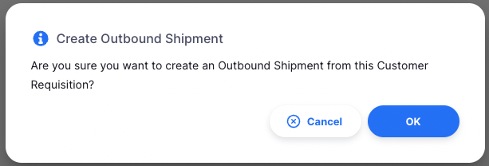

+++
title = "Requisitions"
description = "Managing your customers orders."
date = 2022-03-19T18:20:00+00:00
updated = 2022-03-19T18:20:00+00:00
draft = false
weight = 22
sort_by = "weight"
template = "docs/page.html"

[extra]
lead = "Managing your customers' orders"
toc = true
top = false
+++

When a customer orders stock from you, they create an **Internal Order** in their store. This will appear as a **Requisition** in your store.

## Viewing Customers' Requisitions

To know if you have received requisitions from your customers, go to `Distribution` > `Requisition`

You should see a list of all requisitions sent by your customers.

From this screen you can:

- View a list of Requisitions
- Export Requisitions to a `.csv` file

### Requisition list

The list of Requisitions is divided into 6 columns:

| Column        | Description                                      |
| :------------ | :----------------------------------------------- |
| **Name**      | Name of the Customer                             |
| **Number**    | Reference Number of the requisition              |
| **Created**   | Creation Date of the requisition                 |
| **Status**    | Current Status of the requisition                |
| **Shipments** | Number of shipments created from the requisition |
| **Comment**   | Comment for the requisition                      |

If you have program requisitions enabled, you may have additional columns in this table!

### Filter Requisitions

You can filter the list of requisitions by name, status or whether shipments have been created. This can be useful if you're looking for one particular requisition!

Select the desired filter(s) from the list:

- **Name**: Start typing in the field to filter by customer name
- **Status**: Select a status from the dropdown list
- **Shipment created**: Toggle on to only show requisitions where shipments have been created

All the requisitions which match the filters will appear in the list.

### Exporting Requisitions

The list of Requisitions can be exported to a comma separated file (csv). Simply click the export button (on the right, at the top of the page)

and the file will be downloaded. The export function will download all
Requisitions, not just the current page.

### Delete a Requisition

You can delete a requisition from the Requisition list.

1. Select the requisition that you want to delete by checking the box on the
   left end of the list. You can select more than one requisition to be deleted.
   You can even select them all by using the master checkbox in the header.
2. The `Actions` footer will display at the bottom of the screen when a requisition is selected. It will display the number of requisitions selected and the actions which can be taken. Click `Delete`.
3. A confirmation window will appear, asking you to confirm the number of
   requisitions to be deleted.
4. After clicking `OK`, a notification will appear in the bottom left corner, confirming that the selected requisitions were deleted.

You cannot delete requisitions that have been created from an Internal Order, or have had a shipment created from them.

### Viewing a Requisition

To view the detail of a particular requisition, simply click on it in the list view.
You will then see the detail view of the requisition:

#### Enter a Customer Reference

The customer reference is automatically generated when the customer creates an
Internal Order, but you can also enter a customer reference manually.

#### View or Edit the Requisition Information Panel

The information Panel allows you to see or edit information about the
Requisition. It is divided into three sections:

- Additional Info
- Related documents
- Actions

##### Additional Info

In the **Additional Info** section you can:

- See who created the Requisition (name of the user)
- See when the Requisition was created
- View and edit the Requisition colour. To edit the colour, tap on the coloured
  circle and select a colour from the pop-up
- Write or edit a comment

##### Related Documents

In the **Related Documents** section you can see other related transactions for
the Requisition.

If you have created shipments for the Requisition, the shipment numbers will
appear in this section along with a link to view the shipment.

##### Actions

**Copy to clipboard**: You can tap on the `Copy to Clipboard` button to copy
the Requisition details to the clipboard.

#### Requisition Detail

| Column        | Description                                                                                                                                                                     |
| :------------ | :------------------------------------------------------------------------------------------------------------------------------------------------------------------------------ |
| **Code**      | Code of the item                                                                                                                                                                |
| **Name**      | Name of the item                                                                                                                                                                |
| **Unit**      | The unit of measure for the item                                                                                                                                                |
| **Our SOH**   | How much stock is available in this store                                                                                                                                       |
| **Their SOH** | How much stock is available in the customer's store                                                                                                                             |
| **Requested** | The quantity requested by customer                                                                                                                                              |
| **Supply**    | The quantity that will be supplied by this store (quantity can differ from what is being requested)                                                                             |
| **Issued**    | The quantity that has already been issued in `Outbound Shipments`                                                                                                               |
| **Remaining** | The quantity remaining to be supplied to the customer. The calculation is 'Supply - Issued'. This quantity will be re-calculated after an `Outbound Shipment` has been created. |

#### Supply Requested

To quickly fulfil all quantities requested by the customer, simply click the `Supply Requested` button at the top of the page. This will automatically match the supply quantity to the requested quantity for each item.

Click the button and you are asked
for confirmation before the adjustment happens:

#### Adding items

To add additional items to the requisition that the customer did not request, you may press the "Add item" button to search for and add an item.

#### Editing items

Clicking on an item row in the table will open the line details where you will see information about
the item such as your stock on hand, and the requested quantity.

Here, you can set how much you wish to supply the customer. The dropdown next to the supply quantity allows you to choose whether you want the display the amounts in units (e.g. "Tablets" in this case) or in packs, based on the item's default pack size.

- AMC/AMD: The "Average Monthly Consumption" of the customer, also known as "Average Monthly Distribution".
- MOS: The "Months of Stock" the customer has. This is "Their SOH" divided by "AMC/AMD".
- Comment: you may leave a comment on the line, perhaps explaining decisions on why to supply more or less than what the customer requested.

##### My Store Tab

This shows information about your store's stock levels and whats on order along side your customers' requests

_The first bar:_

- Your stock on hand for this item
- Any incoming stock for this item that has been `Shipped`, but not yet `Delivered`
- The quantity being requested for this item in any `Internal Orders`

_The second bar:_

- Requested: The quantity being requested for this item in this Requisition
- Other requested: The quantity being requested in other pending Requisitions from all customers to your store.

This message will be displayed if your store currently doesn't have any stock available.
 
 

##### Customer Tab

- The customer's _Target Quantity_ for this item. This is calculated as: Target MOS x AMC
- The customer's stock on hand for this item

#### Creating an Outbound Shipment from a Requisition

Once you are happy with the supply quantities, you can create an `Outbound
Shipment` which will supply the items requested by going back to the Requisition
Detail page.

Click on the `Create Shipment` button. This will create a shipment, add all of the items which are not fully supplied, and then, open that shipment in a new tab. Before doing so, you are prompted to confirm:

If either the supply quantity is changed for any items in the requisition, or quantities in the outbound shipments are adjusted in the shipment, there may be some remaining to supply left for lines in the requisition. Subsequent new shipments created through clicking the `Create Shipment` button will be created with the remaining supply amount (supply quantity minus any linked Outbound Shipment quantity).

After creating the shipment, you will see the shipment number, along with a link to view it, in the `Related documents` section of the additional details panel on the right of the screen.

### Manual Requisition

Usually, Requisitions will be sent to you by your Customers. However, if they aren't using mSupply, you can create a Requisition manually.

#### Creating a Manual Requisition

1. Go to `Distribution` > `Requisition`
2. Press the `Create Requisition` button at the top right of the page

3. A new window will appear where you can select the customer for whom you want
   to create the requisition. You can search for the customer by typing their
   name or code in the search bar or by scrolling through the list of customers.

4. Once you have selected the customer, you will be taken to the requisition
   detail page where you can add items to the requisition.

You cannot change the customer name after the requisition has been created. If you have made a mistake in selecting the customer, you will need to delete the requisition and create a new one.

#### Adding items

Similar to normal requisitions from customers, you can add items to the requisition and then edit them:

The key difference in a manual requisition being entered on behalf of a customer is that you need to enter the "Requested" and "Their SOH" (Stock On Hand) fields for them. Often users of this functionality will have received a paper requisition form from the customer that captures this data either through their own stock keeping, or a quick stock take they did to provide accurate an SOH value.
