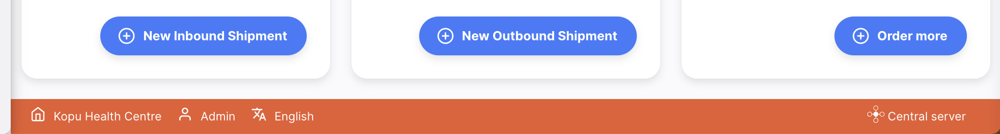
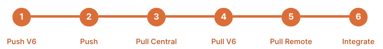

+++
title = "Open mSupply Central Server"
description = "Open mSupply Central Server functionality"
date = 2022-06-10T11:38:00+00:00
updated = 2022-06-10T11:38:00+00:00
draft = false
weight = 20
sort_by = "weight"
template = "docs/page.html"

[extra]
toc = true
top = true
+++

See the <a href="#configuration-and-synchronisation">Configuration</a> section for how to get started with the central server configuration.

Open mSupply central server is a special site that allows for configuration of subsets of central data. Please see the [requirements](/docs/introduction/requirements/#open-msupply-requirements) section for details on the requirements for running Open mSupply, and the [Open mSupply central server](/docs/introduction/requirements/#open-msupply-central-server) section for details about the central server requirements specifically.

## What is the Open mSupply central server

In essence it's just another Open mSupply instance. However, the differences from a typical remote site are:

- Only one instance of the Open mSupply central server will exist in the Open mSupply system
- It will be configured by our support staff and needs to be available on the World Wide Web (typically as a cloud server, but can also be hosted in-country)
- All remote instances of Open mSupply will communicate with Open mSupply central server, as part of the [synchronisation process](/docs/sync/synchronisation/)
- Allows for configuration of subsets of central data

## What does it look like?

The central server interface looks very much like any other Open mSupply instance, but you will see a distinct coloured bar at the bottom of the interface which identifies the site as the central server:

Similar to the mSupply central server, only one instance of the Open mSupply central server will exist in the Open mSupply system.

## Remote site vs central server

Some operations are only allowed in the Open mSupply central server, if an operation is prohibited on the remote site you will see the following alert

Throughout this documentation you will see sections that refer to open mSupply central server functionality. To indicate this, they will have this image on the page:

Clicking on the image will take you to this page.

## Configuration and Synchronisation

Open mSupply is configured as another site on the mSupply central server with a [couple of extra settings](https://docs.msupply.org.nz/synchronisation:sync_sites#open_msupply_central_server_settings).

To configure your Open mSupply site to use a central server, there are a couple of options.

#### Using a separate Open mSupply central server and remote server

- In mSupply, create a new site with a store assigned (this can be a dummy store)
- Tick the checkbox (as noted in the 'extra settings' link above)
- Enter the server URL of your new Open mSupply
  central server. This will be different to the usual Open mSupply server and to
  the mSupply server!

Open mSupply central server can be configured and synced successfully, even if this URL is wrong. This field is only used by remote sites, to know where to find the Open mSupply central server.

#### Configuring an existing Open mSupply site as a central server

- In mSupply, edit the Open mSupply site, then
- Tick the checkbox (as noted in the 'extra settings' link above)
- Enter the current Open mSupply URL as the central server URL

When the Open mSupply site goes through the synchronisation cycle, it will query the mSupply central server and ask for the URL where the Open mSupply central server resides, it will then use this URL to synchroniser with the Open mSupply central site.

Synchronisation to Open mSupply central server is performed via the V6 API, and requires a couple of extra steps, as per the V6 push and pull steps in the sync stepper

### Requirements

- As of v2.7.0, all stores on the Open mSupply Central Server must run in dispensary mode. This ensures all record types sync correctly.

## Versions of central server

### v2.x

Open mSupply `v2.0.00` introduced the central server. For versions 2.x of Open mSupply, remote sites synchronise to both the mSupply central server _and_ the Open mSupply central server.

For reporting purposes, all sites will have standard data stored in the mSupply central server and available to be reported on. Newly introduced functionality will only be on the Open mSupply central server. The newly introduced data includes the following:

**Configured in Open mSupply central server**

- Item Pack Variants
- Asset Catalogue
- Asset Status Reasons
- Demographics Indicators

**Synchronises with Open mSupply central server**

- Assets
- Files
- Asset Logs
- Store Properties
- Immunization Programs and Vaccine Courses

### v3.x

Open mSupply `v3.0.00` introduces a newer sync method (referred to internally as v7), in which a remote site syncs only with the Open mSupply central server. It no longer connects directly to the legacy mSupply central server at all. For reporting purposes all site data is available on the Open mSupply central server in this scenario.

Before a site can move to v7, all of the store data it holds has to be moved from the mSupply central server to the Open mSupply central server. This is initiated by a setting on the mSupply central server (migrate all store data). **Contact support for assistance with this.**

Checking the setting does not switch any site to sync v7 by itself. The mSupply setting moves the data, and a site changes to use sync v7 only once every store it holds has finished moving. When that is true, a remote site running v3.0+ transitions itself automatically on its next sync — there is nothing to change on the remote machine, and no setting for you to edit by hand.

Do not install v3 on a new remote site before its stores have been migrated

A remote site running `v3.0` or later asks to change to use sync v7 at the end of every sync cycle. Until its store data has finished migrating, the mSupply central server declines the request, and the site treats that as a failed sync. What you see depends on whether the site has ever synced successfully:

| Situation                            | What happens                                                                                                                                                                    |
| :----------------------------------- | :------------------------------------------------------------------------------------------------------------------------------------------------------------------------------ |
| **An existing site upgraded to v3**  | Keeps working normally — it continues to push and pull as before. It reports a sync error on each cycle until the move to v7 goes through, which is expected and clears itself. |
| **A brand new site installed on v3** | **Cannot finish initialising.** It will pull data but never push, and never comes into service. It stays like this until its store has been migrated.                           |
