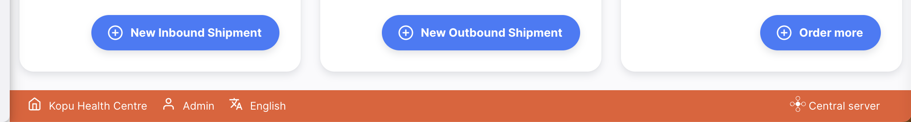
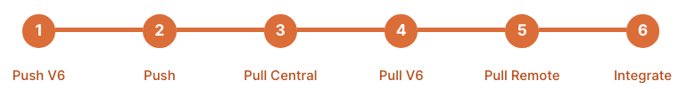

+++
title = "Servidor Open mSupply Central"
description = "Funcionalidades do Servidor Central do Open mSupply"
date = 2022-06-10T11:38:00+00:00
updated = 2022-06-10T11:38:00+00:00
draft = false
weight = 20
sort_by = "weight"
template = "docs/page.html"

[extra]
toc = true
top = true
+++

 Vá até a sessão de <a href="#configuration-and-synchronisation">Configuração</a> para comecar a configuraça7o do sevidor central do Open mSupply.

O servidor central do Open mSupply centralé um site especial porque permite a configuração de alguns subconjuntos de dados centrais. Consulte a secção [requisitos](/docs/introduction/requirements/#open-msupply-requirements) para obter detalhes sobre os requisitos para executar o Open mSupply e a secção [servidor central do Open mSupply](/docs/introduction/requirements/#open-msupply-central-server) para obter detalhes sobre os requisitos do servidor central especificamente.

## O que é o servidor central Open mSupply

Na sua essência, é apenas mais uma instância do Open mSupply. No entanto, as diferenças em relação a um site remoto típico são:

- Apenas existirá uma instância do servidor central Open mSupply no sistema Open mSupply
- Será configurado pela nossa equipa de suporte e precisa de estar disponível na World Wide Web (normalmente como servidor na nuvem, mas também pode ser alojado no país)
- Todas as instâncias remotas do Open mSupply comunicarão com o servidor central do Open mSupply, como parte do [processo de sincronização](/docs/sync/synchronisation/)
- Permite a configuração de subconjuntos de dados centrais

## Como é?

A interface do servidor central parece-se muito com qualquer outra instância do Open mSupply, mas verá uma barra colorida distinta na parte inferior da interface que identifica o site como o servidor central:

Semelhante ao servidor central mSupply, apenas existirá uma instância do servidor central Open mSupply no sistema Open mSupply.

## Site remoto vs servidor central

Algumas operações só são permitidas no servidor central do Open mSupply. Se uma operação for proibida no site remoto, verá o seguinte alerta.

Ao longo desta documentação, verá secções que se referem à funcionalidade do servidor central aberto mSupply. Para indicar isso, terão esta imagem na página:

Clicar na imagem levá-lo-á para esta página.

## Configuração e Sincronização

O Open mSupply está configurado como outro site no servidor central do mSupply com [algumas configurações extra](https://docs.msupply.org.nz/synchronisation:sync_sites#open_msupply_central_server_settings).

Para configurar o seu site Open mSupply para utilizar um servidor central, existem algumas opções.

#### Utilizando um servidor central e um servidor remoto Open mSupply separados

- No mSupply, crie um novo site com uma loja atribuída (pode ser uma loja fictícia)
- Marque a caixa de seleção (conforme indicado no link 'definições extra' acima)
- Introduza o URL do servidor do seu novo Open mSupply
  servidor central. Isto será diferente do servidor Open mSupply habitual e
  o servidor mSupply!

O servidor central aberto do mSupply pode ser configurado e sincronizado com sucesso, mesmo que este URL esteja errado. Este campo é apenas utilizado por sites remotos para saber onde encontrar o servidor central do Open mSupply.

#### Configurar um site Open mSupply existente como servidor central

- No mSupply, edite o site Open mSupply e, em seguida,
- Marque a caixa de seleção (conforme indicado no link 'definições extra' acima)
- Introduza o URL atual do Open mSupply como o URL do servidor central

Quando o site Open mSupply passa pelo ciclo de sincronização, consulta o servidor central do mSupply e pede o URL onde reside o servidor central do Open mSupply. De seguida, utiliza esse URL para sincronizar com o site central do Open mSupply.

A sincronização com o servidor central Open mSupply é realizada através da API V6 e requer alguns passos extra, de acordo com os passos push e pull V6 no stepper de sincronização

## Tipos de dados do servidor central aberto mSupply

A partir de <code>v2.0.00</code>

#### Dados configurados no servidor central Open mSupply

- Variantes do pacote de artigos
- Catálogo de ativos
- Motivos do estado do ativo
- Indicadores Demográficos

#### Dados que sincronizam com o servidor central Open mSupply

- Ativos
- Arquivos
- Registos de ativos
- Propriedades da loja
- Programas de Vacinação e Cursos de Vacinação
