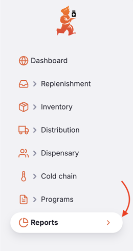
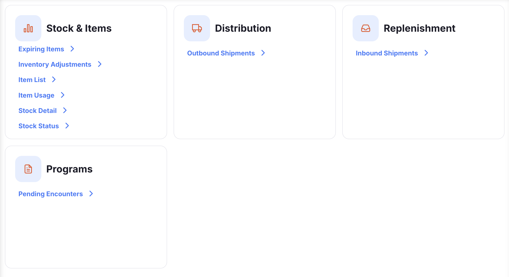
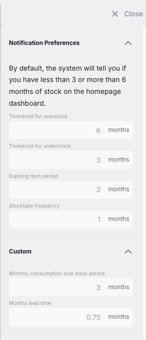
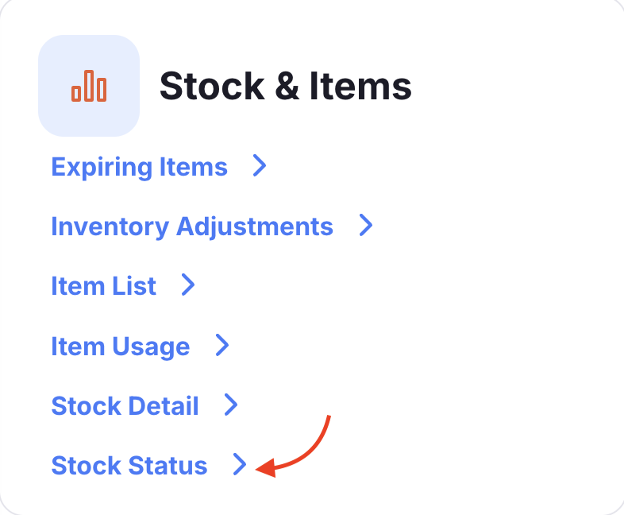
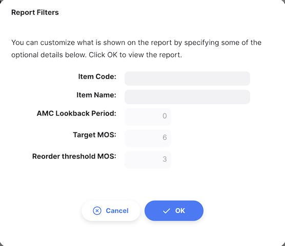
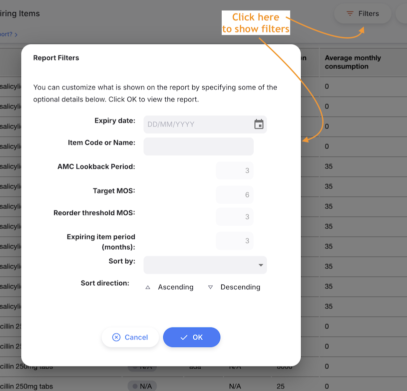
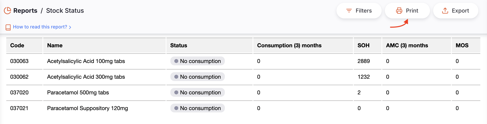
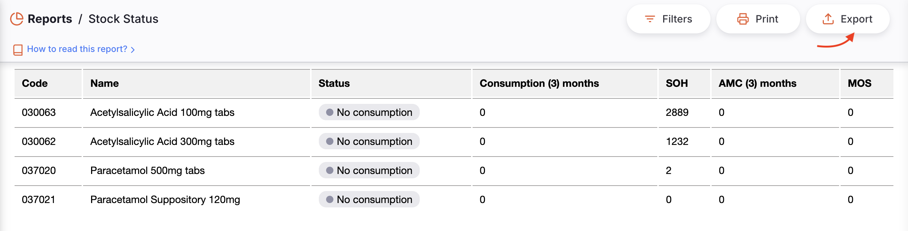

+++
title = "Rapports"
description = "Rapports Open mSupply."
date = 2022-03-19T18:20:00+00:00
updated = 2022-03-19T18:20:00+00:00
draft = false
weight = 31
sort_by = "weight"
template = "docs/page.html"

[extra]
toc = true
+++

La page des rapports vous donne un aperçu des rapports disponibles dans Open mSupply. Vous pouvez accéder à la page des rapports en cliquant sur l'élément de menu `Rapports`.

Une liste des rapports que vous pouvez générer vous sera présentée. Les rapports listés ci-dessous sont les rapports standard et seront déjà configurés pour vous. Si vous avez besoin d'un rapport personnalisé, veuillez contacter le support mSupply à [support@msupply.foundation](mailto:support@msupply.foundation).

Les rapports sont générés en fonction des préférences configurées dans le serveur central mSupply. Voir les [préférences des rapports](https://docs.msupply.org.nz/other_stuff:virtual_stores?s[]=threshold&s[]=overstock#notification_preferences) pour plus d'informations sur ces préférences et leur configuration.

Vous pouvez consulter ces préférences en cliquant sur le bouton `Plus`.

Certains rapports affichent le logo du dépôt dans leur en-tête. Consultez la <a href="https://docs.msupply.org.nz/other_stuff:virtual_stores#logo_tab">documentation mSupply</a> pour savoir comment ajouter ou mettre à jour un logo de dépôt.

## Générer des rapports

Cliquez sur le rapport que vous souhaitez générer. Pour cet exemple, nous allons générer le rapport `États des stocks`.

Cliquez sur le rapport `États des stocks`.

Un formulaire s'affichera où vous pouvez modifier les critères de filtrage utilisés par le rapport. Laissez inchangé pour afficher tous les articles dans le rapport.

Pour le rapport `États des stocks`, vous pouvez filtrer le rapport selon les critères suivants :

- `Nom de l'article`
- `Code de l'article`

Si vous saisissez des valeurs pour le code et le nom, les articles affichés devront correspondre aux **deux** critères, c'est-à-dire que saisir un code `01` et un nom `am` n'affichera que les articles dont le code contient `01` et le nom contient `am`.

Le formulaire affiche également les préférences sur lesquelles le rapport est basé.

Cliquez sur `Ok` pour générer le rapport. Si vous souhaitez affiner le rapport pendant sa consultation, vous pouvez cliquer sur le bouton `Filtrer` dans le coin supérieur droit du rapport pour rouvrir le formulaire de filtrage.

### Imprimer un rapport

Pour imprimer un rapport, cliquez sur le bouton `Imprimer` dans le coin supérieur droit du rapport.

Une fenêtre d'aperçu avant impression s'ouvrira, vous montrant ce qui sera imprimé et vous permettant de sélectionner l'imprimante. Il peut ensuite être imprimé via votre navigateur en cliquant sur imprimer ou en utilisant les touches `Ctrl`+`P` (sous Windows) ou `Cmd`+`P` (sous Mac).

### Exporter un rapport

Pour exporter un rapport en Excel, cliquez sur le bouton `Exporter` dans le coin supérieur droit du rapport.

Le rapport sera téléchargé en tant que fichier Excel.

### Traductions des rapports standard

Les rapports standard seront traduits dans la langue de l'utilisateur si elle est disponible lors de la génération du rapport.

L'anglais sera utilisé par défaut là où les traductions dans la langue de l'utilisateur ne sont pas disponibles.

## Rapports standard

Certains rapports standard sont inclus par défaut dans toutes les instances d'Open mSupply, avec de nouveaux rapports ajoutés régulièrement.

| Domaine             | Rapport                     | Version | Détails                                                                                         |
| ------------------- | --------------------------- | ------: | ----------------------------------------------------------------------------------------------- |
| Distribution        | Livraisons sortantes        | 2.10.1+ | Filtrable par date et client, ce rapport liste toutes les lignes des expéditions sortantes      |
| Réapprovisionnement | Livraisons entrantes        | 2.17.0+ | Filtrable par date et fournisseur, ce rapport liste toutes les lignes des expéditions entrantes |
| Stock & Articles    | Articles en fin de validité | è2.6.0+ | Nombreuses options de filtre, le rapport donne des informations sur l'expiration des articles   |
| Stock & Articles    | Consommation des articles   |  2.6.3+ | Filtrer par article et consulter des statistiques d'utilisation détaillées                      |
| Stock & Articles    | Détails des stocks          |  2.6.3+ | Filtrer par article et voir les détails du stock actuel                                         |
| Stock & Articles    | États des stocks            |  2.6.3+ | Filtrer par article et consulter l'état du stock actuel, similaire au rapport de détail         |
| Programmes          | Visites en attente          |  2.6.0+ | Rapport sur les visites en attente par programme                                                |

## Modèles d'impression

En plus des rapports, des modèles d'impression sont fournis pour de nombreux éléments. Ceux-ci, comme les rapports, peuvent être personnalisés pour les clients ayant des exigences spécifiques de mise en page ou de données dans leurs pages imprimées.

| Domaine             | Version | Détails                  |
| ------------------- | ------: | ------------------------ |
| Expédition entrante |    2.5+ |                          |
| Commande interne    |  2.6.3+ |                          |
| Livraison sortante  |    2.5+ | Paysage                  |
| Livraison sortante  |    2.5+ | Portrait                 |
| Prescription        |  2.6.0+ | Reçu de prescription     |
| Reconditionnement   |  2.5.1+ |                          |
| Réquisition         |  2.5.1+ |                          |
| Inventaire          |  2.6.3+ | Vue détaillée            |
| Inventaire          |  2.5.1+ | Variance d'inventaire    |
| Inventaire          |  2.5.1+ | Inventaire avec quantité |
| Inventaire          |  2.5.0+ | Inventaire sans quantité |
