+++
title = "Tutorial"
description = "Introductory tutorial for Open mSupply."
date = 2022-03-19
updated = 2022-03-19
draft = false
weight = 40
sort_by = "weight"
template = "docs/page.html"

[extra]
toc = true
+++

## Open mSupply Tutorial

This tutorial is designed to guide you through the basics of using Open mSupply.

## Logging in

1. For a start, you'll need to open your web browser. We like Firefox, but Chrome and its myriad children will also suffice.
2. Enter the web address (URL) of your mSupply server. In our case we're using https://demo-open.msupply.org - our test web site.
3. After pressing `enter` on your keyboard you'll be shown the login page

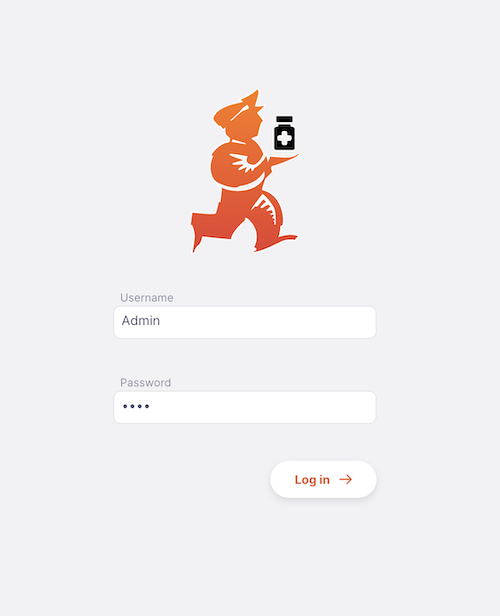

4. Enter your user name and password and press `enter` on your keyboard, or click the [Log in] button

If everything is going well, you'll be redirected to the dashboard page.
BUT if there was a problem, you'll see an error message, like this:

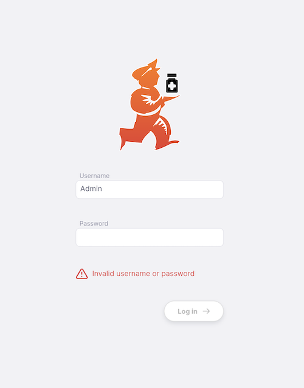

Try re-typing the username and password (note that both are case-sensitive).
When you log in, the default store for your user is selected as the current store. If you have access to other stores, you'll be able to change stores after logging in (see below).
If you have logged in previously, and changed stores, then the most recent store will be selected for you when you log in.

### Store selection

If your user account has access to **more than one** store which is **enabled**, after successfully logging in you'll be shown the **Select a store** panel:

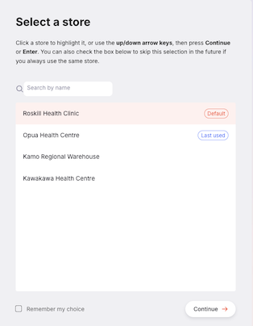

Click a store to choose it, or use the up/down arrow keys and then press the **Continue** button or **Enter** key.

There are two types of store which could be identified as special here:

- **Default** This is the store which is designated the _Default store_ for the <a href="https://docs.msupply.org.nz/admin:managing_users?s%5B%5D=default%20store#login_rights_tab">user in mSupply</a>
- **Last used** The store which was most recently logged into by this user

#### Remember my choice

This is the checkbox at the bottom of the panel:

- **If you leave** `Remember my choice` **unticked**, the store selector will appear
  again the next time you log in, letting you pick a store each time

- **If you tick** `Remember my choice` before selecting a store, your preference
  to skip the selector is saved for **your username**. The next time you log in with
  that same username, the store selector is skipped automatically and you go straight
  into the store chosen here.

To change the `Remember my choice` setting later, simply click the store selector in the <a href="#footer">footer</a>.

The preference is saved <b>per username</b> on the device/browser you are using. If two
people use the same computer with different usernames, each person's choice is
remembered independently — one person ticking the box does not affect the other.

## Navigating around

The main menu is on the left side of the screen. If you have a small screen size, then it will be collapsed by default - for larger screens it will instead be open by default.
To open and close you can click on the logo at the top, as shown below. The menu remains either open or closed once you have selected an option.

If the menu is closed, simply hovering over the menu items will open it, in which case clicking on an item will close the menu again. If you are on a tablet, clicking on a menu item will have the same effect.

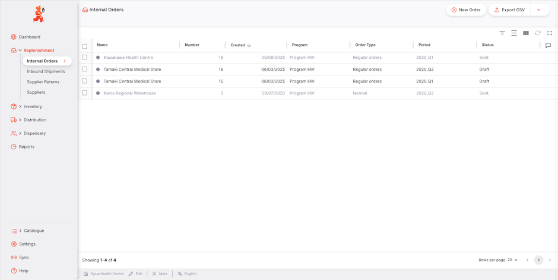

On some screens you'll see that the header shows a heading, such as **Internal Orders** in the example above. Clicking on a specific order then changes that heading to **Internal Orders / #[the order number]**. You are able to click on the **Internal Orders** part to return to the list - or use the main navigation on the left.

### Keyboard shortcuts

There are keyboard shortcuts used throughout Open mSupply. Rather than remember them all, to get started you simply have to remember the combination `control (ctrl)`+`k` (windows and linux) or `cmd (⌘)`+`k` (mac)

This will bring up the following window, no matter which page you are on:

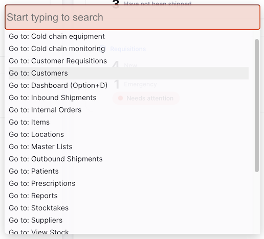

This shows you the list of globally available shortcuts, for example pressing `Alt+D` (or `Option+D` on a mac) on your keyboard will take you to the dashboard (unless you are entering text into an input field!).

However, you can also click on an item in the list using your mouse, or search available commands:

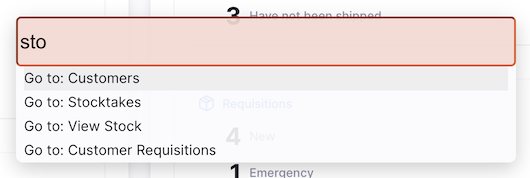

You can then use the arrow keys on the keyboard to move up and down the list and click Enter/Return on the line highlighted in grey.

There are also various places where specific keyboard shortcuts are available. An example is the tab control used in both Stocktakes and Inbound Shipments. Here you can use `control`+`1` to navigate to the first tab (Quantities) or `control`+`2` for the second tab (Pricing) etc. If you press `+` on your keyboard, you can add a new batch.

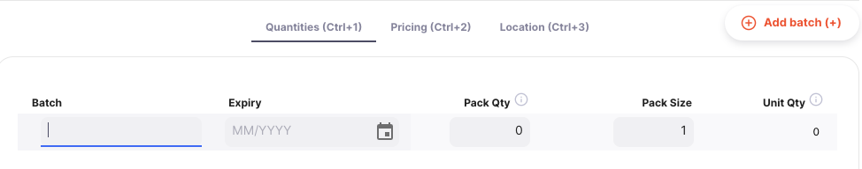

#### Discovering shortcuts as you go

You don't have to open the shortcut window to find out which shortcuts apply to the screen you are on. Press and hold the `Control (Ctrl)` or `Alt` key (`Option (⌥)` on a Mac) and a small badge appears next to every button that has a keyboard shortcut, showing the key combination that activates it — for example `Alt+N` to add a new record, `Alt+S` to save, or `Escape` to cancel.

Release the key and the badges disappear. This is a quick way to learn the shortcuts for the buttons in front of you.

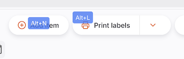

#### Moving around tables with the keyboard

Lists and tables throughout Open mSupply can be navigated without the mouse:

- Use the `↓` and `↑` arrow keys to move the highlight down and up the rows. The highlighted row is shown with a shaded background.
- Press `Enter` to open the highlighted row — the same as clicking it.

## Footer

The bottom of the screen contains some useful information and is shown on every screen

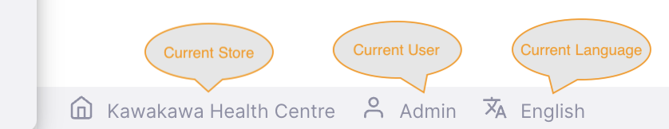

Some users have access to more than one store. To change the store which is currently selected, simply click on the store name in the footer:

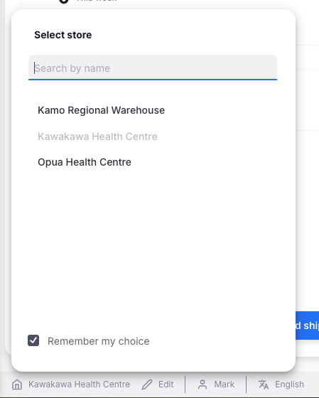

You will see the notification and the store name in the footer will be updated. From now, all actions will be in the newly selected store.

You can view your user information by clicking on your username:

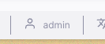

You can also log out from here:

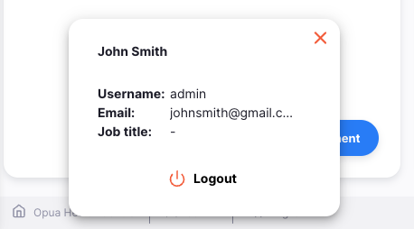

In a similar way, you can select another language by clicking on the current language in the footer:

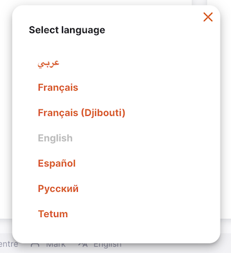

If store properties have been configured for your Open mSupply system, you will also see an `Edit` button next to the store selector, where you can [view and edit your store properties](/docs/manage/facilities/#editing-your-store-properties):

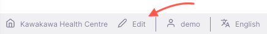

## Help!

If you get stuck at any time when using the site, click on the `Help` menu item.

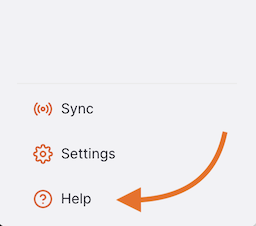

Use the [Help](/docs/help/help) page to access the Open mSupply User Guide (where you are now!) The Help page is also where you can reach out to us with any feedback or support requests.
