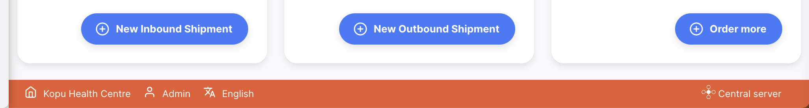
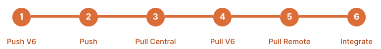

+++
title = "Servidor Central de Open mSupply"
description = "La funcionalidad del Servidor Central de Open mSupply"
date = 2022-06-10T11:38:00+00:00
updated = 2022-06-10T11:38:00+00:00
draft = false
weight = 20
sort_by = "weight"
template = "docs/page.html"

[extra]
toc = true
top = true
+++

Consulta la sección de <a href="#configuration-and-synchronisation">Configuración</a> para entender como empezar con la configuración del servidor central.

El servidor central de Open mSupply es un sitio especial que permite configurar secciones específicas de los datos central. Consulta la sección de[requisitos](/docs/introduction/requirements/#open-msupply-requirements) para más información sobre lo necesario para ejecutar Open mSupply, y la sección de [servidor central de Open mSupply](/docs/introduction/requirements/#open-msupply-central-server) para conocer los requisitos específicos del servidor central.

## ¿Qué es el servidor central de Open mSupply?

En esencia, es simplemente otra versión de Open mSupply. Sin embargo, se diferencia de un sitio remoto típico en lo siguiente:

- Solo habrá una versión del servidor central de Open mSupply en todo el sistema
- Será configurado por nuestro equipo de soporte y debe estar disponible en Internet (generalmente como un servidor en la nube, pero también puede ser alojado localmente en el país)
- Todas las versiones remotas de Open mSupply se comunicarán con el servidor central de Open mSupply, como parte del [proceso de sincronización](/docs/sync/synchronisation/)
- Permite configurar partes específicas de los datos centralizados

## ¿Cómo se ve?

La interfaz del servidor central se parece mucho a la de cualquier otra versión de Open mSupply, pero notarás una barra de color diferente en la parte inferior. Esta barra indica que el sitio es el servidor central:

Al igual que con el servidor central de mSupply, solo habrá un servidor central de Open mSupply en todo el sistema.

## Sitio remoto vs servidor central

Algunas operaciones solo se permiten en el servidor central de Open mSupply. Si intentas hacer algo que no está permitido en el sitio remoto, verás esta alerta

En esta documentación, verás secciones que hablan sobre las funciones del servidor central de Open mSupply. Para señalarlo, esas secciones tendrán esta imagen:

Al hacer clic en la imagen, te llevará a la página correspondiente.

## Configuración y Sincronización

Open mSupply se configura como un sitio más en el servidor central de mSupply, pero con [algunas configuraciones adicionales](https://docs.msupply.org.nz/synchronisation:sync_sites#open_msupply_central_server_settings).

Para configurar tu sitio de Open mSupply con un servidor central, tienes un par de opciones.

#### Usar un servidor central de Open mSupply y un servidor remoto por separado

- En mSupply, crea un nuevo sitio y asigna un almacén (puede ser una almacén ficticio).
- Marca la casilla correspondiente (como se indica en el enlace de "configuraciones adicionales" anterior).
- Escribe la URL del servidor de tu nuevo servidor central de Open mSupply. Esta URL será diferente a la del servidor habitual de Open mSupply y al del servidor de mSupply.

Advertencia: El servidor central de Open mSupply se puede configurar y sincronizar correctamente, incluso si la URL ingresada es incorrecta. Este campo se utiliza solo en los sitios remotos para saber dónde localizar el servidor central de Open mSupply.

#### Configurar un Sitio Existente de Open mSupply como Servidor Central

- En mSupply, selecciona y edita el sitio de Open mSupply
- Asegúrate de marcar la casilla de verificación que encontrarás (como se indica en el enlace de "configuraciones adicionales" arriba)
- Escribe la URL actual de Open mSupply como la URL del servidor central

Cuando el sitio de Open mSupply complete el ciclo de sincronización, preguntará al servidor central de mSupply por la URL donde se encuentra el servidor central de Open mSupply. Luego, usará esa URL para sincronizarse con el servidor central.

La sincronización con el servidor central de Open mSupply se hace a través de la API V6 y necesita algunos pasos adicionales, como se explica en los pasos de "push" y "pull" en el asistente de sincronización.

## Tipos de Datos del Servidor Central de Open mSupply

As of <code>v2.0.00</code>

#### Datos que se configuran en el servidor central de Open mSupply

- Tipos de Empaque de Artículos
- Catálogo de Activos
- Razones de Estado de Activos
- Indicadores Demográficos

#### Datos que se sincronizan con el servidor central de Open mSupply

- Activos
- Archivos
- Registros de Activos
- Propiedades de Almacén
