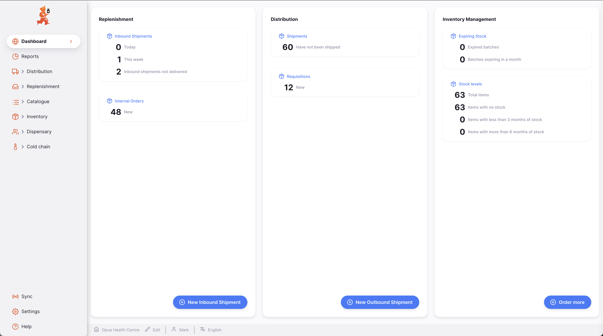

+++
title = "Painéis gráficos"
description = "Introdução ao Open mSupply"
date = 2022-03-17T18:20:00+00:00
updated = 2022-03-17T18:20:00+00:00
draft = false
weight = 30
sort_by = "title"
template = "docs/page.html"

[extra]
lead = "The landing page"
toc = true
+++

## Muitos painéis!

Sim, usamos o termo _Dashboard_ para mais do que uma coisa.
O Open mSupply tem uma landing page que fornece uma visão geral de algumas estatísticas e alguns links úteis, que discutiremos aqui, bem como um sistema de painel que utiliza o Grafana e fornece uma visão geral de todos os sites do seu país (ou organização).

## O que está em exposição?

Pode ver algumas estatísticas de remessas e stock:

- Reposição
 - Remessas de entrada
 - **Hoje**: Mostra o número de remessas de entrada criadas hoje
 - **Esta semana**: O número criado durante a semana atual
 - **Remessas de entrada não entregues**: Número de faturas enviadas que ainda não foram entregues
 - Ordens Internas
 - **Novo**: Mostra o número de novos Pedidos Internos
- Distribuição
 - Remessas
 - **Não foram enviados**: O número de Remessas de Saída que não foram definidas para o estado `Enviado` (ou posterior)
 - Requisições
 - **Novo**: O número de novos pedidos
- Gestão de Stocks
 - Stock expirado
 - **Lotes expirados**: O número de linhas de stock na loja atual que expiraram
 - **Lotes que expiram num mês**: O número de linhas de stock na loja atual que irão expirar dentro do mês
 - Níveis de stock
 - **Total de artigos**: Uma contagem do número de artigos nesta loja
 - **Artigos sem stock**: O artigo está visível nesta loja, mas não tem stock registado
 - **Artigos com menos de 3 meses de stock**: Que se baseia no consumo médio mensal (AMC) para este artigo na loja atual
 - **Artigos com mais de 6 meses de stock**: Como acima, com base no AMC do artigo na loja atual

Existem também botões na parte inferior da página que permitem criar remessas e requisições.

Clicar nos títulos (por exemplo, `Remessas de entrada`, `Remessas` etc.) levará à lista destes itens.
Além disso, clicar no texto ao lado de um item (por exemplo, `Não foi enviado`) levará a uma vista que fornece uma lista filtrada para mostrar todos os registos que correspondem à condição listada. A exceção a isto são as estatísticas apresentadas em "Níveis de stock", que atualmente não têm filtros disponíveis.