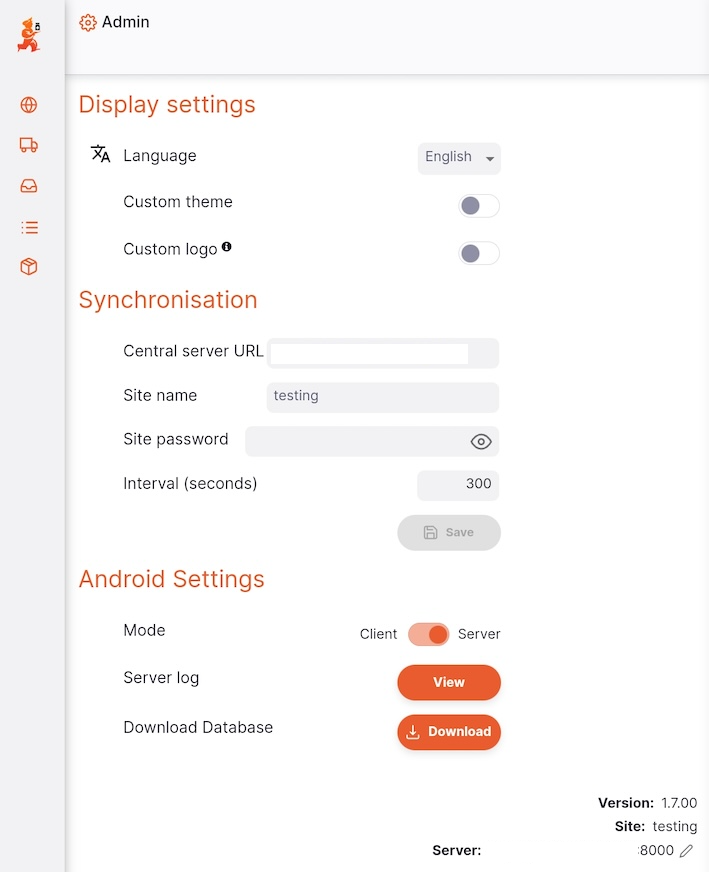
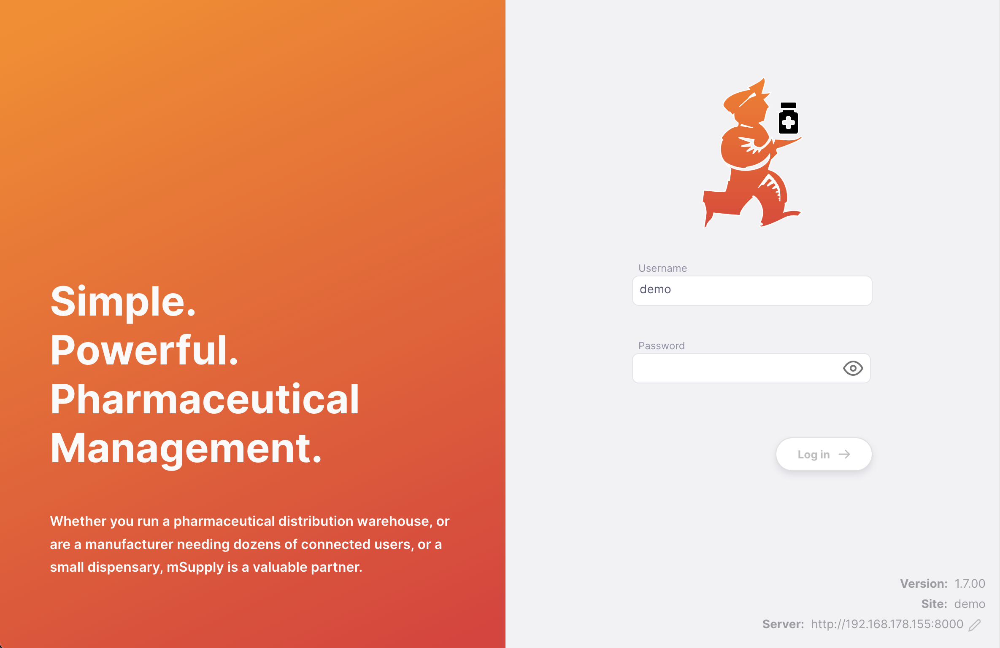

+++
title = "Mobile"
description = "Open mSupply Introduction."
date = 2023-02-24T18:20:00+00:00
updated = 2023-02-24T18:20:00+00:00
draft = false
weight = 10
sort_by = "weight"
template = "docs/page.html"

[extra]
lead = "Guia de inicia a nuestra aplicación mobile"
toc = true
+++

## Guía de inicio

Cuando inicias la aplicación mobile por primera vez, aparecerá una pantalla de bienvenida que te preguntará si prefieres ejecutarla en uno de dos modos:

- **Cliente** Es cuando la aplicación mobile se conecta a un servidor en tu red local.
- **Servidor** La aplicación ejecutará una versión completa del servidor Open mSupply localmente. Puedes configurar este servidor para que se sincronice con un servidor central.

Simplemente haz clic en el botón de la opción que prefieras. ¡No te preocupes! Esto se puede cambiar más tarde. Si vas a la configuración después de configurar tu aplicación, tendrás una opción adicional al verla en mobile:

## Modo cliente

Después de seleccionar el modo cliente, verás una lista de servidores disponibles. Estos son los servidores en tu red local.

Es posible que veas`[ No configurado ]`  junto a algunos de los servidores, lo que indica que el servidor aún no ha sido configurado para sincronizarse con un servidor central.

Haz clic en el nombre del servidor para seleccionarlo. Si deseas cambiar de servidor más tarde, puedes hacerlo desde la pantalla de inicio de sesión. Al usar la aplicación mobile, la pantalla de inicio de sesión tiene dos elementos adicionales, como se muestra. Al hacer clic en el icono de lápiz, te redirigirá de nuevo a la pantalla de selección de servidor.

## Modo servidor

En el modo servidor, configurarás el servidor para que se ejecute en el dispositivo móvil y se sincronice con un servidor central. La pantalla de inicialización es la misma que para las versiones de escritorio y web, con la adición de los detalles del servidor en la parte inferior derecha.

