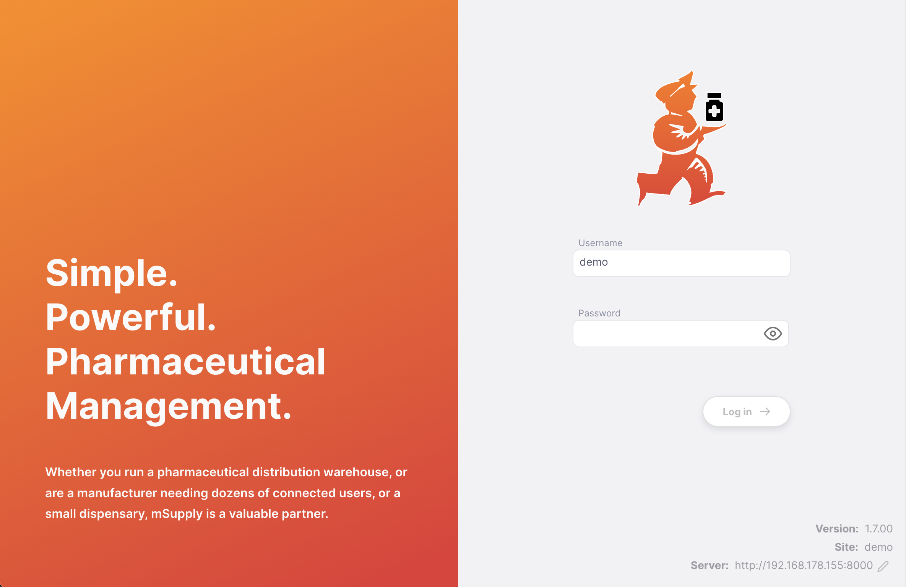

+++
title = "Mobile"
description = "Open mSupply Introduction."
date = 2023-02-24T18:20:00+00:00
updated = 2023-02-24T18:20:00+00:00
draft = false
weight = 10
sort_by = "weight"
template = "docs/page.html"

[extra]
lead = "Démarrer avec l'application mobile."
toc = true
+++

## Démarrer

Lorsque vous démarrez l'application mobile pour la première fois, vous êtes accueilli par un écran de bienvenue qui vous demande le mode d'utilisation préféré :

- **Client:** Lorsque l'application mobile se connecte à un serveur sur votre réseau local
- **Serveur:** L'application exécute localement une version complète du serveur Open mSupply. Ce serveur peut être configuré pour synchroniser avec un serveur distant.

Cliquez simplement sur le bouton de l'option que vous préférez. Ne vous inquiétez pas, cela peut être modifié ultérieurement. Si vous accédez aux paramètres après avoir configuré votre application, vous disposerez d'une option supplémentaire pour l'affichage sur mobile:

## Mode Client

Après avoir sélectionné le mode client, vous verrez une liste des serveurs disponibles. Il s'agit des serveurs de votre réseau local.

Vous pouvez voir `[ Non configuré ]` à côté de certains serveurs - cela indique que le serveur n'a pas encore été configuré pour se synchroniser avec un serveur central.

Cliquez sur le nom du serveur pour le sélectionner. Si vous souhaitez changer de serveur ultérieurement, vous pouvez le faire à partir de l'écran de connexion. Lorsque vous utilisez l'application mobile, l'écran de connexion comporte deux éléments supplémentaires, comme indiqué. En cliquant sur l'icône en forme de crayon, vous serez redirigé vers l'écran de sélection du serveur.

## Mode Serveur

En mode serveur, veuillez configurer le serveur pour qu'il fonctionne sur l'appareil mobile et se synchronise avec un serveur central. L'écran d'initialisation est le même que pour les versions desktop et web, avec l'ajout des détails du serveur en bas à droite :

## Accéder au journal des logs

Dans l'application Android, vous verrez une section supplémentaire. Elle vous permet de changer le mode entre le client et le serveur, et de visualiser le fichier journal `Server log`:

Cliquez sur l'icône `View` pour ouvrir une fenêtre qui affiche le journal du serveur:

À partir de là, vous pouvez enregistrer le journal sous la forme d'un fichier texte sur votre appareil : il vous suffit de cliquer sur `Enregistrer` et de choisir un emplacement pour enregistrer le fichier.
