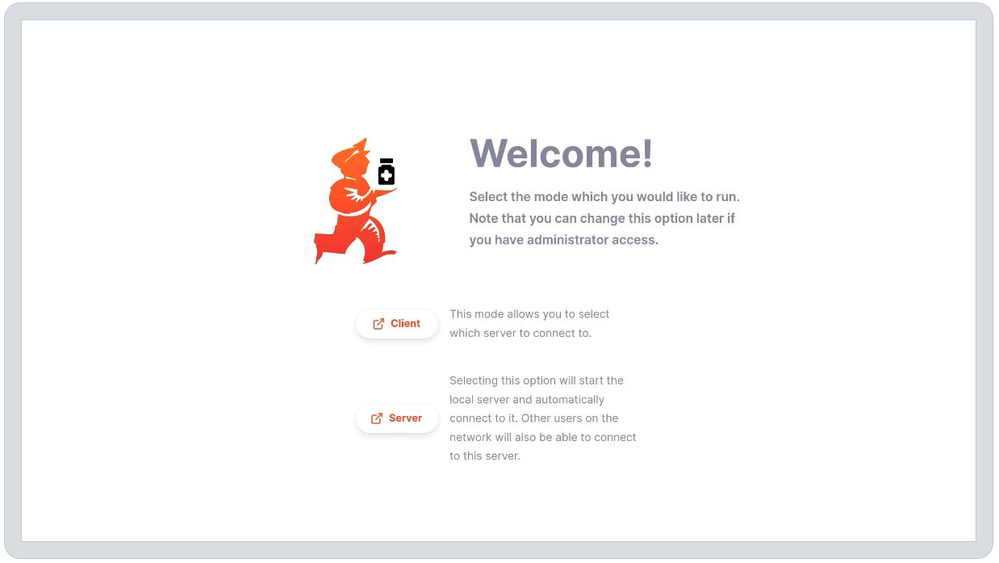
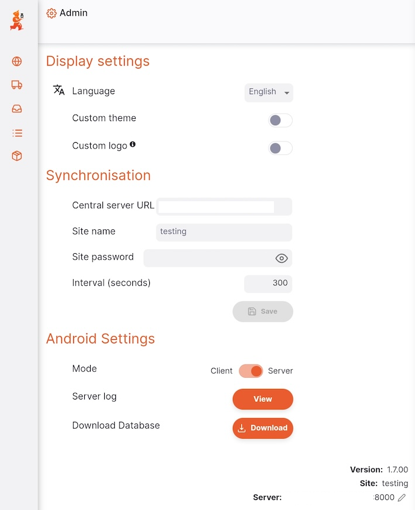
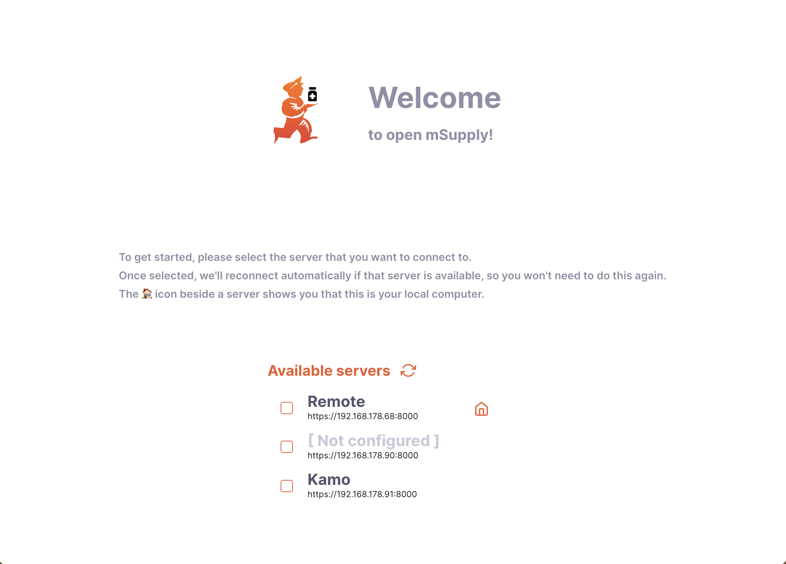
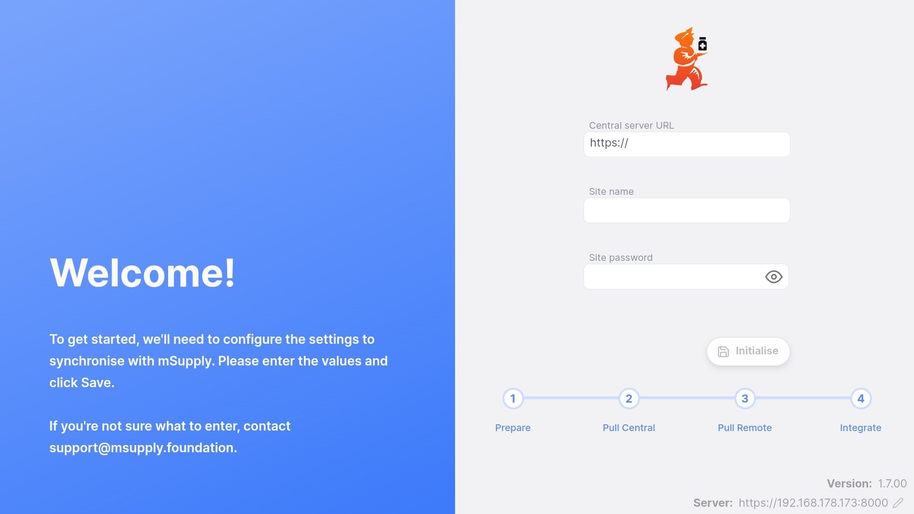
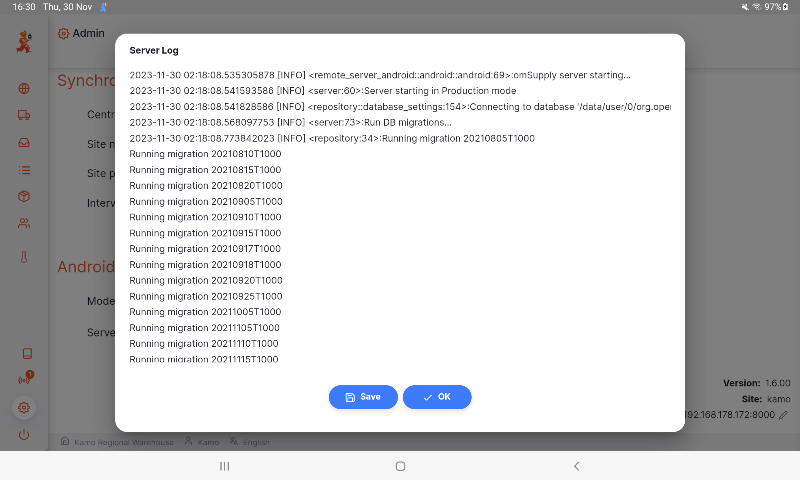

+++
title = "Aplicação Móvel"
description = "Introdução ao Open mSupply"
date = 2023-02-24T18:20:00+00:00
updated = 2023-02-24T18:20:00+00:00
draft = false
weight = 10
sort_by = "weight"
template = "docs/page.html"

[extra]
lead = "Guia para começar a utilizar a nossa aplicação móvel"
toc = true
+++

## Guia inicial

Ao iniciar a aplicação móvel pela primeira vez, será apresentado um ecrã de boas-vindas a perguntar se prefere executá-lo de uma das duas formas:

- **Cliente** É quando a aplicação móvel se liga a um servidor na sua rede local.
- **Servidor** A aplicação executará uma versão completa do servidor Open mSupply localmente. Pode configurar este servidor para sincronizar com um servidor central.

Basta clicar no botão da opção que preferir. Não se preocupe! Isto pode ser alterado mais cedo. Se for às definições depois de configurar a sua aplicação, encontrará uma opção adicional para a visualizar no telemóvel:

## Modo cliente

Após selecionar o modo cliente, verá uma lista de servidores disponíveis. Estes são os servidores na sua rede local.

É possível que `[Não configurado]` seja apresentado junto de alguns servidores, indicando que o servidor ainda não foi configurado para sincronizar com um servidor central.

Clique no número do servidor para o selecionar. Se quiser mudar de servidor antes, pode fazê-lo no ecrã de login. Ao utilizar a aplicação móvel, o ecrã de login possui elementos adicionais, como o display. Clicar no ícone do lápis irá redirecioná-lo de volta para o ecrã de seleção de servidor.

## Modo Servidor

No modo de servidor, irá configurar o servidor para ser executado no dispositivo móvel e sincronizar com um servidor central. O ecrã inicial é o mesmo das versões para desktop e web, com os detalhes do servidor adicionados no canto inferior direito.

## Visualização de logs

Na aplicação Android, verá uma secção adicional. Isto permite alterar o modo entre cliente e servidor e visualizar o ficheiro de registo:

Clique no botão `Ver` para abrir uma janela que apresenta o registo do servidor:

A partir daqui, pode guardar o registo como um ficheiro de texto no seu dispositivo: basta clicar em `Guardar` e escolher um local para guardar o ficheiro.