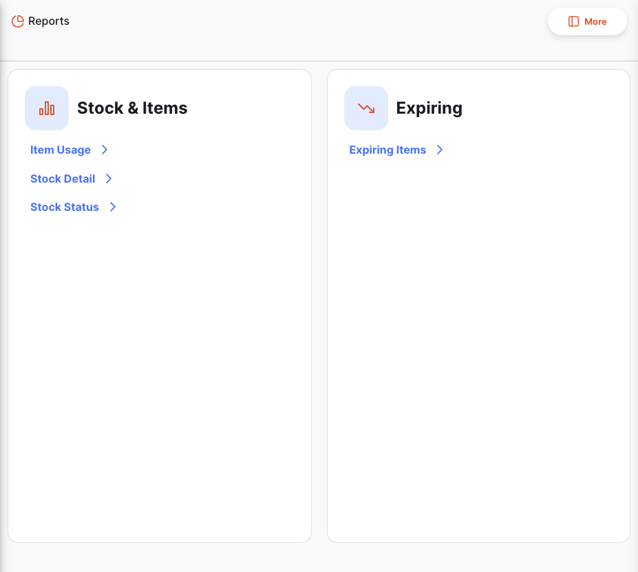
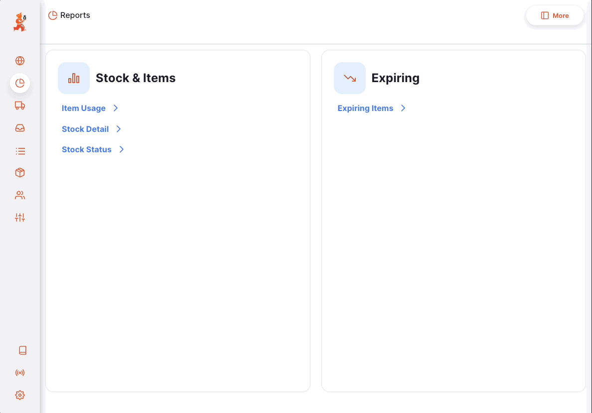
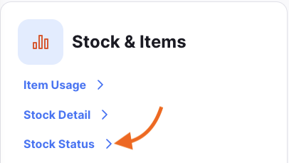
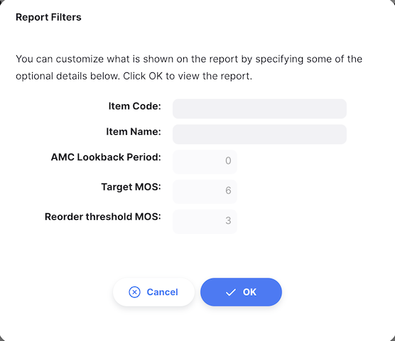
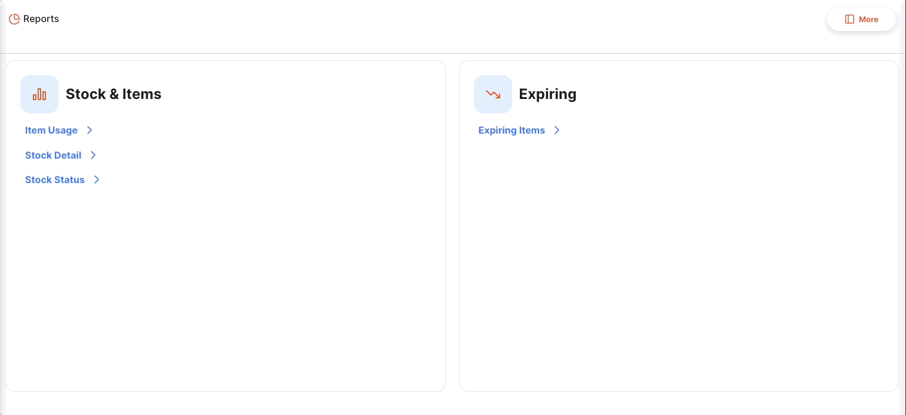
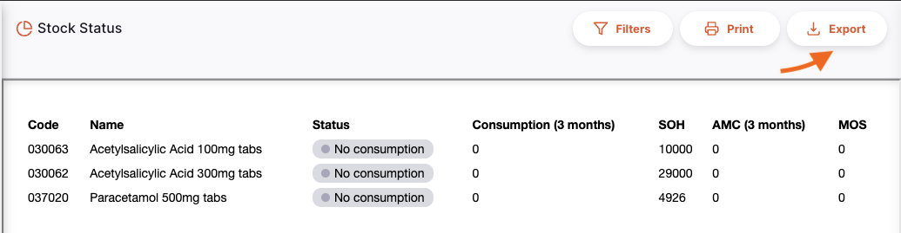

+++
title = "Rapports"
description = "Rapports Open mSupply"
date = 2022-03-19T18:20:00+00:00
updated = 2022-03-19T18:20:00+00:00
draft = false
weight = 31
sort_by = "weight"
template = "docs/page.html"

[extra]
toc = true
+++

La page des rapports vous donne un aperçu des rapports disponibles dans Open mSupply.
Vous pouvez accéder à la page des rapports en cliquant sur l'élément de menu `Rapports`.

Une liste de rapports que vous pouvez générer vous sera présentée. Les rapports
répertoriés ci-dessous sont les rapports standard et seront déjà configurés pour vous. Si
vous avez besoin d'un rapport personnalisé, veuillez contacter le support mSupply à [support@msupply.foundation](mailto:support@msupply.foundation).

Les rapports sont générés en fonction des préférences configurées sur le serveur central mSupply. Voir [report
preferences](https://docs.msupply.org.nz/other_stuff:virtual_stores?s[]=threshold&s[]=overstock#notification_preferences)
pour plus d'information sur les préférences et comment les configurer.

Vous pouvez voir ces préférences en cliquant sur le bouton `Plus`.

## Générer des rapports

Cliquez sur le rapport que vous souhaitez générer. Pour exemple, nous allons générer le rapport `Etat du Stock`.

Cliquez sur le rapport `Etat du Stock`.

Un formulaire s'affiche dans lequel vous pouvez modifier les critères de filtrage utilisés par le rapport. Laissez-les inchangés pour afficher tous les éléments du rapport.

Pour le rapport `Etat du Stock`, vous pouvez filtrer le rapport en fonction des critères suivants:

- `Nom Article`
- `Code Article`

Si vous entrez des valeurs pour le code et le nom, les éléments affichés devront correspondre aux **deux** critères, c'est-à-dire que la saisie d'un code `01` et d'un nom `am` n'affichera que les éléments avec un code contenant `01` et un nom contenant `am`.

Le formulaire affiche également les préférences sur lesquelles le rapport est basé.

Cliquez sur `Ok` pour générer le rapport. Si vous souhaitez affiner le rapport pendant que vous le consultez, vous pouvez cliquer sur le bouton `Filtrer` dans le coin supérieur droit du rapport, ce qui ouvrira à nouveau le formulaire de filtrage.

### Imprimer un rapport

Pour imprimer un rapport, cliquez sur le bouton `Imprimer` en haut a doite du rapport.

Une fenêtre d'aperçu avant impression s'ouvre, vous montrant ce qui sera imprimé et vous permettant
de sélectionner l'imprimante. Vous pouvez ensuite imprimer le document à l'aide de votre navigateur en cliquant sur Imprimer ou en utilisant les touches `control`+`P` (si vous utilisez Windows) ou `cmd`+`P` sur votre clavier (si
vous utilisez un Mac).

### Exporter un rapport

Pour exporter un rapport vers Excel, cliquez sur le bouton `Export` en haut à droite du rapport.

Le rapport sera téléchargé en tant que fichier Excel.
