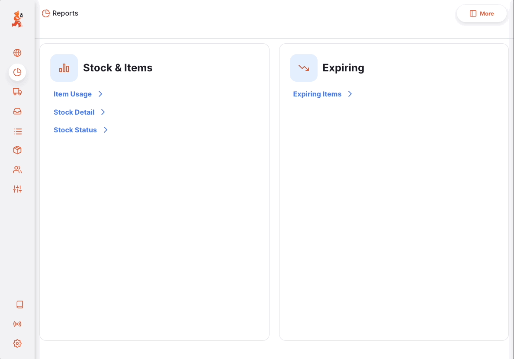
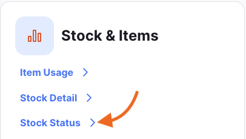

+++
title = "Reports"
description = "Open mSupply Reports."
date = 2022-03-19T18:20:00+00:00
updated = 2022-03-19T18:20:00+00:00
draft = false
weight = 31
sort_by = "weight"
template = "docs/page.html"

[extra]
toc = true
+++

The reports page gives you an overview of the reports available in Open mSupply.
You can access the reports page by clicking on the `Reports` menu item.

You will be presented with a list of reports that you can generate. The reports
listed below are the standard reports and will already be set up for you. If
you need a custom report, please contact mSupply support at [support@msupply.foundation](mailto:support@msupply.foundation).

The reports are generated based on preferences which are set up in the mSupply
central server. See [report
preferences](https://docs.msupply.org.nz/other_stuff:virtual_stores?s[]=threshold&s[]=overstock#notification_preferences)
for more information about what these preferences are and how to set them up.

You can view these preferences by clicking on the `More` button.

Some reports display the store logo in their header. See the <a href="https://docs.msupply.org.nz/other_stuff:virtual_stores#logo_tab">mSupply documentation</a> for how to add or update a store logo.

## Generating reports

Click on the report you want to generate. For this example, we will generate the
`Stock Status` report.

Click on the `Stock Status` report.

You will be presented with a form where you can edit the filter criteria used by the report. Leave unchanged to display all items for the report.

For the `Stock Status` report, you can filter the report based on the following criteria:

- `Item Name`
- `Item Code`

If you enter values for both the code and name, the items shown would have to match **both** criteria i.e. entering a code of `01` and a name of `am` would only show items with a code that contains `01` and a name that contains `am`.

The form also display which preferences the report is based on.

Click `Ok` to generate the report. If you find that you would like to narrow
down the report while viewing it, you can click on the `Filter` button on the
top right corner of the report which will open up the filter form again.

### Printing a report

To print a report, click on the `Print` button on the top right corner of the
report.

A print preview window will open showing you what will be printed and allowing
you to select the printer. This can then be printed using your browser by clicking print or
using `control`+`P` (if using windows) or `cmd`+`P` keys on your keyboard (if
using a mac).

### Exporting a report

To export a report to excel, click on the `Export` button on the top right corner of the report.

The report will be downloaded as an excel file.

### Standard report translations

Standard reports will be translated to the user's language if available when generating the report.

English will be used by default in places where translations in the user's language is unavailable.

## Standard Reports

There are some standard reports included by default in all instances of Open mSupply, with more reports added regularly.

| Area          | Report             | Version | Details                                                                                |
| ------------- | ------------------ | ------: | -------------------------------------------------------------------------------------- |
| Distribution  | Outbound shipments | 2.10.1+ | Filterable by date and customer, this report lists all lines on outbound shipments     |
| Stock & Items | Expiring Items     |  2.6.0+ | Many filter options for this one, the report lists stock which are expiring            |
| Stock & Items | Item usage         |  2.6.3+ | Filter by item and report on detailed usage statistics                                 |
| Stock & Items | Stock detail       |  2.6.3+ | Filter by item and view details of current stock                                       |
| Stock & Items | Stock status       |  2.6.3+ | Filter by item and report on the status of current stock, similar to the detail report |
| Programs      | Pending Encounters |  2.6.0+ | Report on pending encounters by program                                                |

## Print templates

In addition to reports, there are print templates provided for many items. These, like reports, can be customised for clients who have specific layout or data requirements in their printed pages.

| Area              | Version | Details                    |
| ----------------- | ------: | -------------------------- |
| Inbound shipment  |    2.5+ |                            |
| Internal order    |  2.6.3+ |                            |
| Outbound shipment |    2.5+ | Landscape                  |
| Outbound shipment |    2.5+ | Portrait                   |
| Prescription      |  2.6.0+ | Prescription receipt       |
| Repack            |  2.5.1+ |                            |
| Requisition       |  2.5.1+ |                            |
| Stocktake         |  2.6.3+ | Detail view                |
| Stocktake         |  2.5.1+ | Stocktake variance         |
| Stocktake         |  2.5.1+ | Stocktake with quantity    |
| Stocktake         |  2.5.0+ | Stocktake without quantity |
