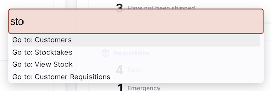
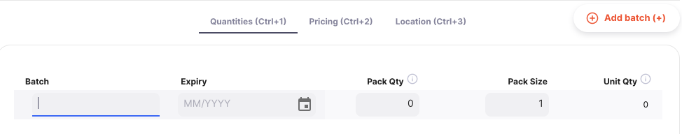

+++
title = "Tutorial"
description = "Introductory tutorial for Open mSupply."
date = 2022-03-19T18:20:00+00:00
updated = 2022-03-19T18:20:00+00:00
draft = false
weight = 40
sort_by = "weight"
template = "docs/page.html"

[extra]
toc = true
+++

## Tutorial Open mSupply

Este tutorial está diseñado para guiarte a través de los conceptos básicos del uso de Open mSupply.

## Inicio de sesión

1. En primer lugar, deberás abrir tu navegador web. Nosotros recomendamos Firefox, pero Chrome y sus muchos derivados también son suficientes.
2. Introduce la dirección web (URL) de tu servidor mSupply. En nuestro caso, estamos utilizando https://demo-open.msupply.org - nuestro sitio web de prueba.
3. Después de presionar <enter> en tu teclado, se te mostrará la página de inicio de sesión.

4. Ingresa tu nombre de usuario y contraseña y presiona <enter> en tu teclado o haz clic en el botón [Iniciar sesión].

Si todo va bien, serás redirigido a la página del tablero de control.
Si hubo un problema, verás un mensaje de error como este:

Intenta volver a escribir tu nombre de usuario y contraseña. Recuerda que ambos son sensibles a las mayúsculas y minúsculas. Una vez que hayas iniciado sesión, se seleccionará automáticamente el almacén predeterminado de tu usuario. Si tienes acceso a otros almacenes, podrás cambiar entre ellos después de iniciar sesión (ver más abajo).Si ya has iniciado sesión antes y has cambiado de almacén, se seleccionará automáticamente el almacén más reciente cuando inicies sesión de nuevo.

## Navegación

El menú principal se encuentra en el lado izquierdo de la pantalla. Si tienes una pantalla pequeña, por defecto estará colapsado - en pantallas más grandes estará abierto por defecto.
Para abrir y cerrar el menú puedes hacer clic en el logo en la parte superior, como se muestra a continuación. Una vez que hayas seleccionado una opción, el menú permanecerá abierto o cerrado.

Si el menú está cerrado, simplemente pasar el cursor sobre los elementos del menú lo abrirá, en cuyo caso al hacer clic en un elemento, el menú se cerrará de nuevo. Si estás en una tablet, hacer clic en un elemento del menú tendrá el mismo efecto.

En algunas pantallas verás que el encabezado muestra un título, como **Salida** in the example above. en el ejemplo anterior. Al hacer clic en un envío específico, el título cambiará a **Salida/ #[número de envío]**. Puedes hacer clic en la parte **Salida** para volver a la lista o utilizar la navegación principal a la izquierda.

### Atajos de teclado

Hay atajos de teclado utilizados en todo Open mSupply. En lugar de recordarlos todos, para empezar solo tienes que recordar la combinación `control (ctrl)`+`k` (windows y linux) o `cmd (⌘)`+`k` (mac).

Esto te mostrará la siguiente ventana, sin importar en qué página te encuentres:

Esto te muestra la lista de atajos disponibles globalmente, por ejemplo, pulsando `Alt+D` (u `Opción+D` en un mac) en tu teclado te llevará al tablero de control (¡a menos que estés escribiendo texto en un campo de entrada!).

Sin embargo, también puedes hacer clic en un elemento de la lista o buscar comandos disponibles:

Además, hay varios lugares donde están disponibles los atajos de teclado específicos. Un ejemplo es el control de pestañas utilizado tanto en Inventario como en Entradas. Aquí puedes usar `control`+`1` para navegar a la primera pestaña (Cantidades) o`control`+`2` para la segunda pestaña (Precios), etc. Si presionas`+` en tu teclado, puedes agregar un nuevo lote.

## Pie de página

El fondo de la pantalla contiene información útil y se muestra en todas las pantallas.

Algunos usuarios tienen acceso a más de un almacén. Para cambiar el almacén que está actualmente seleccionado, simplemente haz clic en el nombre del almacén en el pie de página:

Verás la notificación y el nombre del almacén en el pie de página se actualizará. A partir de ahora, todas las acciones se realizarán en el almacén recién seleccionado.

De manera similar, puedes seleccionar otro idioma haciendo clic en el idioma actual en el pie de página:

## ¡Ayuda!

Si en algún momento tiene dificultades para utilizar el sitio, haga clic en la opción «Ayuda» del menú.

Utilice la página [Ayuda](/docs/help/help) para acceder a la Guía del usuario de Open mSupply (¡donde se encuentra ahora mismo!). La página de Ayuda también le permite ponerse en contacto con nosotros para enviarnos sus comentarios o solicitudes de asistencia.
