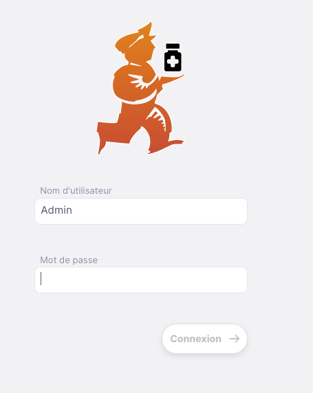
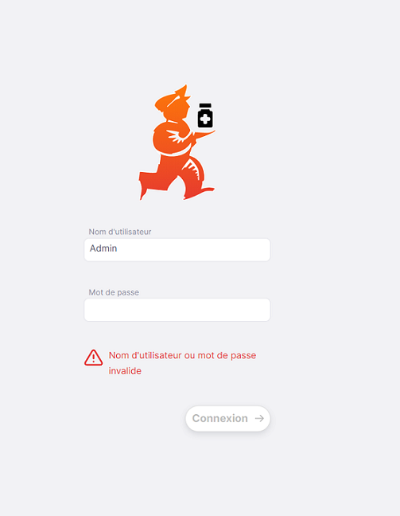
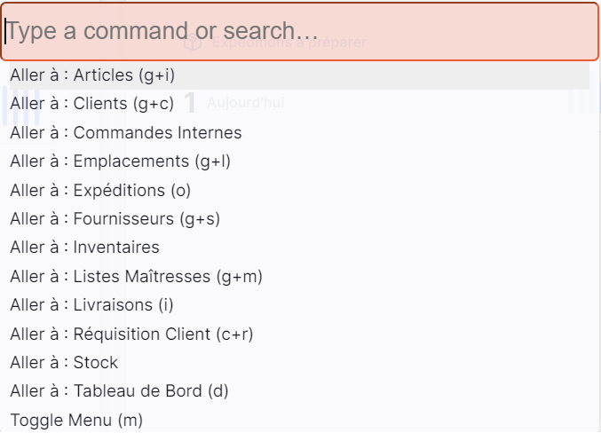
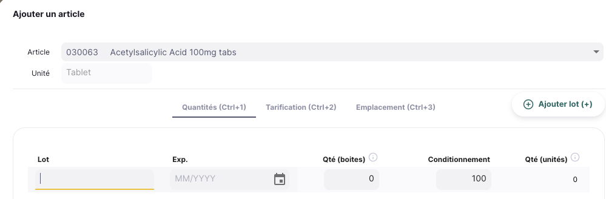

+++
title = "Didacticiel"
description = "Tutoriel d'intriduction à Open mSupply."
date = 2022-03-19
updated = 2022-03-19
draft = false
weight = 40
sort_by = "weight"
template = "docs/page.html"

[extra]
toc = true
top = true
+++

## Didacticiel: Open mSupply

Ce didacticiel est conçu pour vous guider à travers les bases de l'utilisation d'Open mSupply.

## Se connecter

1. Pour commencer, vous devrez ouvrir votre navigateur Web. Nous aimons Firefox, mais Chrome et sa myriade d'enfants suffiront également.
2. Entrez l'adresse Web (URL) de votre serveur mSupply. Dans notre cas, nous utilisons https://demo-open.msupply.org - notre site Web de test.
3. Après avoir appuyé <entrer> sur votre clavier, la page de connexion s'affichera.

4. Entrez votre nom d'utilisateur et votre mot de passe et appuyez sur <entrer> sur ton clavier, ou cliquez sur le boutton [Connexion].

Si tout se passe bien, vous serez redirigé vers la page du tableau de bord.
S'il y a eu un problème, vous verrez un message d'erreur, comme celui-ci :

Essayez de retaper le nom d'utilisateur et le mot de passe (notez que les deux sont sensibles à la casse).
Lorsque vous vous connectez, le dépôt par défaut de votre utilisateur est sélectionné comme dépôt courant. Si vous avez accès à d'autres dépôts, vous pourrez changer de dépôt après vous être connecté (voir ci-dessous).
Si vous vous êtes déjà connecté, et changé de dépôt, alors le dépôt le plus récent sera sélectionné pour vous lorsque vous vous connecterez.

## Naviguer dans Open mSupply

Le menu principal se trouve sur le côté gauche de l'écran. Si vous avez un petit écran, alors il sera réduit par défaut - pour les écrans plus grands, il sera plutôt ouvert par défaut. Pour ouvrir et fermer, vous pouvez cliquer sur le logo en haut, comme indiqué ci-dessous. Le menu reste ouvert ou fermé une fois que vous avez sélectionné une option.

Si le menu est fermé, il suffit de survoler les éléments du menu pour l'ouvrir, dans ce cas, cliquer sur un élément laissera le menu se refermer. Si vous êtes sur tablette, cliquer sur un élément du menu aura le même effet.

Sur certains écrans, vous verrez afficher un libellé en en-tête, tel que **Expédition** dans l'exemple ci-avant. En cliquant sur une expédition spécifique de la liste, vous changez cet en-tête en **Expédition/ #[le numéro d'expédition]**. Vous pouvez cliquer sur **Expédition** pour retourner à la liste - ou utiliser le menu de navigation à gauche.

### Raccourcis clavier

Des raccourcis clavier sont utilisés tout au long de Open mSupply. Plutôt que de tous les mémoriser, pour commencer, il vous suffit de vous souvenir de la combinaison `control (ctrl)`+`k` (windows et linux) ou `cmd (⌘)`+`k` (mac)

Cela fera apparaître la fenêtre suivante, quelle que soit la page sur laquelle vous vous trouvez :

Vous verrez afficher la liste des raccourcis globalement disponibles. Par exemple en appuyant sur `Alt+D` (ou `Option+D` sur un mac) de votre clavier, cela vous amènera au tableau de bord (sauf si vous saisissez du texte!).

Cependant, vous pouvez également cliquer sur un élément de la liste ou rechercher les commandes disponibles :

De plus, il existe divers endroits où des raccourcis clavier spécifiques sont disponibles. Un exemple est l'onglet de contrôle utilisé aussi bien pour Les Inventaires que pour Les Livraisons. Ici, vous pouvez utiliser `control`+`1` pour accéder au premier onglet (Quantités) ou `control`+`2` pour le second onglet (Tarification) etc. Vous pouvez ajouter un nouveau lot en tapant la touche `+` de votre clavier.

## Pied de Page

Le bas de l'écran contient des informations utiles et s'affiche sur chaque écran.

Certains utilisateurs ont accès à plus d'un dépôt. Pour changer le dépôt actuellement sélectionné, cliquez simplement sur le nom du dépôt au pied de la page:

Vous verrez la notification et le nom du dépôt dans le pied de page sera mis à jour. À partir de maintenant, toutes les actions seront dans le dépôt nouvellement sélectionné.

## Aide!

Si vous rencontrez des difficultés lors de l'utilisation du site, cliquez sur l'élément de menu « Aide ».

Utilisez la page [Aide](/docs/help/help) pour accéder au guide d'utilisation d'Open mSupply (où vous vous trouvez actuellement !). La page Aide vous permet également de nous faire part de vos commentaires ou de nous envoyer vos demandes d'assistance.
