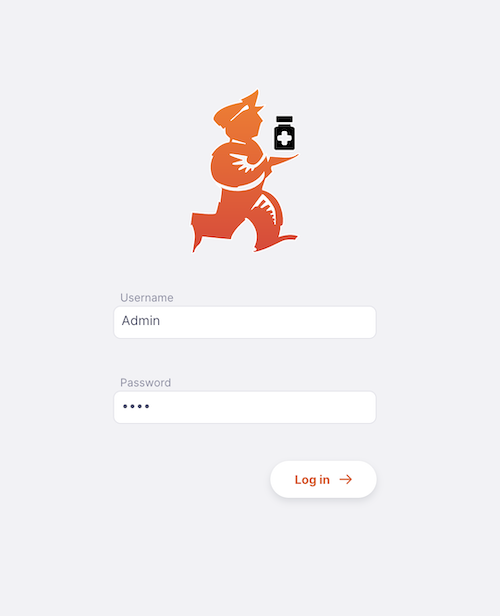
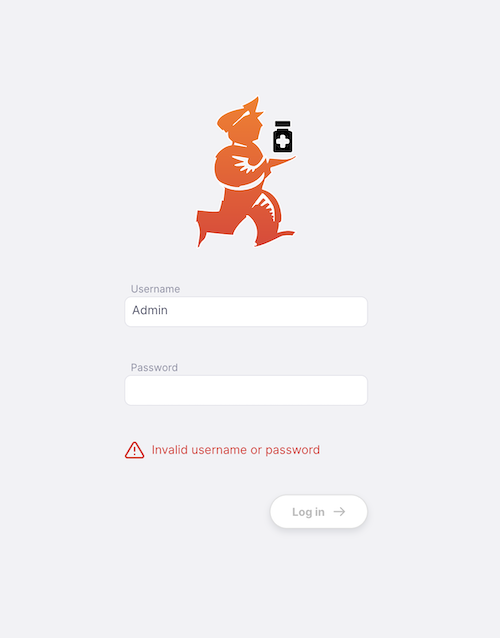
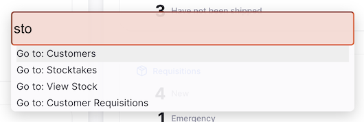
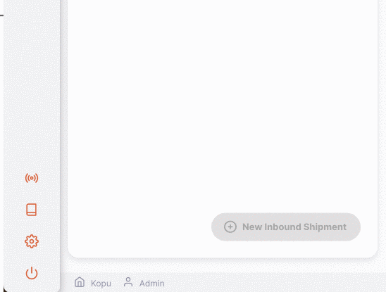
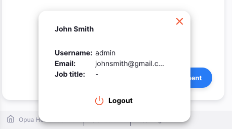
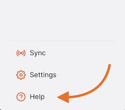

+++
title = "Tutorial"
description = "Introductory tutorial for Open mSupply."
date = 2022-03-19
updated = 2022-03-19
draft = false
weight = 40
sort_by = "weight"
template = "docs/page.html"

[extra]
toc = true
+++

## Open mSupply Tutorial

This tutorial is designed to guide you through the basics of using Open mSupply.

## Logging in

1. For a start, you'll need to open your web browser. We like Firefox, but Chrome and its myriad children will also suffice.
2. Enter the web address (URL) of your mSupply server. In our case we're using https://demo-open.msupply.org - our test web site.
3. After pressing `enter` on your keyboard you'll be shown the login page

4. Enter your user name and password and press `enter` on your keyboard, or click the [Log in] button

If everything is going well, you'll be redirected to the dashboard page.
BUT if there was a problem, you'll see an error message, like this:

Try re-typing the username and password (note that both are case-sensitive).
When you log in, the default store for your user is selected as the current store. If you have access to other stores, you'll be able to change stores after logging in (see below).
If you have logged in previously, and changed stores, then the most recent store will be selected for you when you log in.

## Navigating around

The main menu is on the left side of the screen. If you have a small screen size, then it will be collapsed by default - for larger screens it will instead be open by default.
To open and close you can click on the logo at the top, as shown below. The menu remains either open or closed once you have selected an option.

If the menu is closed, simply hovering over the menu items will open it, in which case clicking on an item will close the menu again. If you are on a tablet, clicking on a menu item will have the same effect.

On some screens you'll see that the header shows a heading, such as **Outbound Shipment** in the example above. Clicking on a specific shipment then changes that heading to **Outbound Shipment / #[the shipment number]**. You are able to click on the **Outbound Shipment** part to return to the list - or use the main navigation on the left.

### Keyboard shortcuts

There are keyboard shortcuts used throughout Open mSupply. Rather than remember them all, to get started you simply have to remember the combination `control (ctrl)`+`k` (windows and linux) or `cmd (⌘)`+`k` (mac)

This will bring up the following window, no matter which page you are on:

This shows you the list of globally available shortcuts, for example pressing `Alt+D` (or `Option+D` on a mac) on your keyboard will take you to the dashboard (unless you are entering text into an input field!).

However, you can also click on an item in the list using your mouse, or search available commands:

You can then use the arrow keys on the keyboard to move up and down the list and click Enter/Return on the line highlighted in grey.

There are also various places where specific keyboard shortcuts are available. An example is the tab control used in both Stocktakes and Inbound Shipments. Here you can use `control`+`1` to navigate to the first tab (Quantities) or `control`+`2` for the second tab (Pricing) etc. If you press `+` on your keyboard, you can add a new batch.

## Footer

The bottom of the screen contains some useful information and is shown on every screen

Some users have access to more than one store. To change the store which is currently selected, simply click on the store name in the footer:

You will see the notification and the store name in the footer will be updated. From now, all actions will be in the newly selected store.

You can view your user information by clicking on your username:

You can also log out from here:

In a similar way, you can select another language by clicking on the current language in the footer:

If store properties have been configured for your Open mSupply system, you will also see an `Edit` button next to the store selector, where you can [view and edit your store properties](/docs/manage/facilities/#editing-your-store-properties):

## Help!

If you get stuck at any time when using the site, click on the `Help` menu item.

Use the [Help](/docs/help/help) page to access the Open mSupply User Guide (where you are now!) The Help page is also where you can reach out to us with any feedback or support requests.
