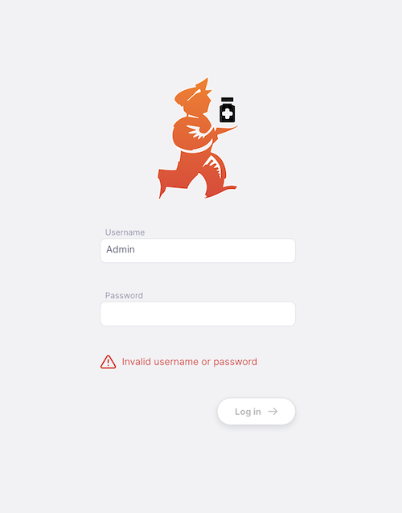

+++
title = "Tutorial"
description = "Tutorial de Introdução ao Open mSupply."
date = 2022-03-19
updated = 2022-03-19
draft = false
weight = 40
sort_by = "weight"
template = "docs/page.html"

[extra]
toc = true
+++

## Tutorial aberto do mSupply

Este tutorial foi criado para o orientar sobre os conceitos básicos de utilização do Open mSupply.

## Efetuando login

1.º Para começar, terá de abrir o seu navegador da Web. Gostamos do Firefox, mas o Chrome e os seus inúmeros descendentes também serão suficientes.
2.º Introduza o endereço web (URL) do seu servidor mSupply. No nosso caso, estamos a utilizar o https://demo-open.msupply.org - o nosso site de teste. 3. Após premir `enter` no seu teclado, será apresentada a página de login

4.º Introduza o seu nome de utilizador e palavra-passe e prima `enter` no seu teclado ou clique no botão [Login]

Se tudo estiver a correr bem, será redirecionado para a página do painel.
MAS se houver um problema, verá uma mensagem de erro, como esta:

Tente introduzir novamente o nome de utilizador e a palavra-passe (note que ambos são sensíveis a maiúsculas e minúsculas).
Ao efetuar login, a loja predefinida do seu utilizador é selecionada como a loja atual. Se tiver acesso a outras lojas, pode trocá-las após fazer login (ver abaixo).
Se já tiver iniciado sessão anteriormente e mudado de loja, a loja mais recente será selecionada quando iniciar sessão.

## Navegando por aí

O menu principal encontra-se no lado esquerdo do ecrã. Se tiver um ecrã pequeno, este será recolhido por defeito.
Para abrir e fechar, pode clicar no logótipo na parte superior, como mostrado abaixo. O menu permanece aberto ou fechado depois de selecionar uma opção.

Se o menu estiver fechado, basta passar o rato sobre os itens do menu para o abrir. Nesse caso, clicar num item fechará o menu novamente. Se estiver num tablet, clicar num item de menu terá o mesmo efeito.

Em alguns ecrãs, verá que o cabeçalho mostra um título, como **Remessa de saída** no exemplo acima. Clicar numa remessa específica altera o título para **Remessa de saída / #[número da remessa]**. Pode clicar na parte **Envio de saída** para voltar à lista ou utilizar a navegação principal à esquerda.

### Atalhos de teclado

Existem atalhos de teclado utilizados em todo o Open mSupply. Em vez de se lembrar de todos eles, para começar tem simplesmente de se lembrar da combinação `control (ctrl)`+`k` (windows e linux) ou `cmd (⌘)`+`k` (mac)

Isto abrirá a seguinte janela, independentemente da página em que se encontra:

Isto mostra a lista de atalhos disponíveis globalmente, por exemplo, pressionando `Alt+D` (ou `Option+D` em um mac) no seu teclado irá levá-lo ao painel (a menos que esteja a introduzir texto num campo de entrada!).

No entanto, também pode clicar num item da lista ou pesquisar os comandos disponíveis:

Além disso, existem vários locais onde estão disponíveis atalhos de teclado específicos. Um exemplo é o controlo de separadores utilizado em Inventários e Remessas de Entrada. Aqui pode usar `control`+`1` para navegar até ao primeiro separador (Quantidades) ou `control`+`2` para o segundo separador (Preços) etc. Se premir `+` no seu teclado, pode adicionar um novo lote.

## Rodapé

A parte inferior do ecrã contém algumas informações úteis e é apresentada em todos os ecrãs

Alguns utilizadores têm acesso a mais do que uma loja. Para alterar a loja atualmente selecionada, basta clicar no nome da loja no rodapé:

Verá a notificação e o nome da loja no rodapé será atualizado. A partir de agora, todas as ações serão na loja recém-selecionada.

Pode visualizar as suas informações de utilizador clicando no seu nome de utilizador:

Também pode sair daqui:

De forma semelhante, pode selecionar outro idioma clicando no idioma atual no rodapé:

Se as propriedades da loja tiverem sido configuradas para o seu sistema Open mSupply, verá também um botão `Editing` junto ao selector de loja, onde pode [visualizar e editar as propriedades da sua loja](/docs/manage/facilities/#editing-your-store-properties):

## Ajuda!

Caso fique com dúvida em algum momento ao utilizar o site, clique no item de menu `Ajuda`.

Utilize a página [Ajuda](/docs/help/help) para aceder ao Guia do Utilizador do Open mSupply (onde se encontra agora!). A página de Ajuda é também o local onde nos pode contactar para enviar qualquer feedback ou pedido de assistência.
