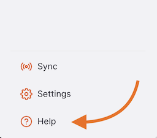
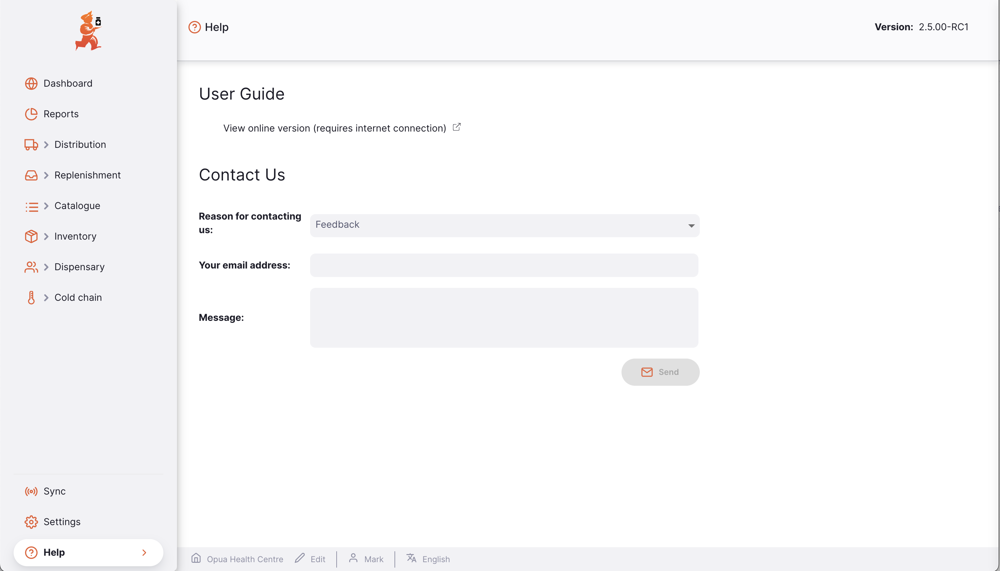
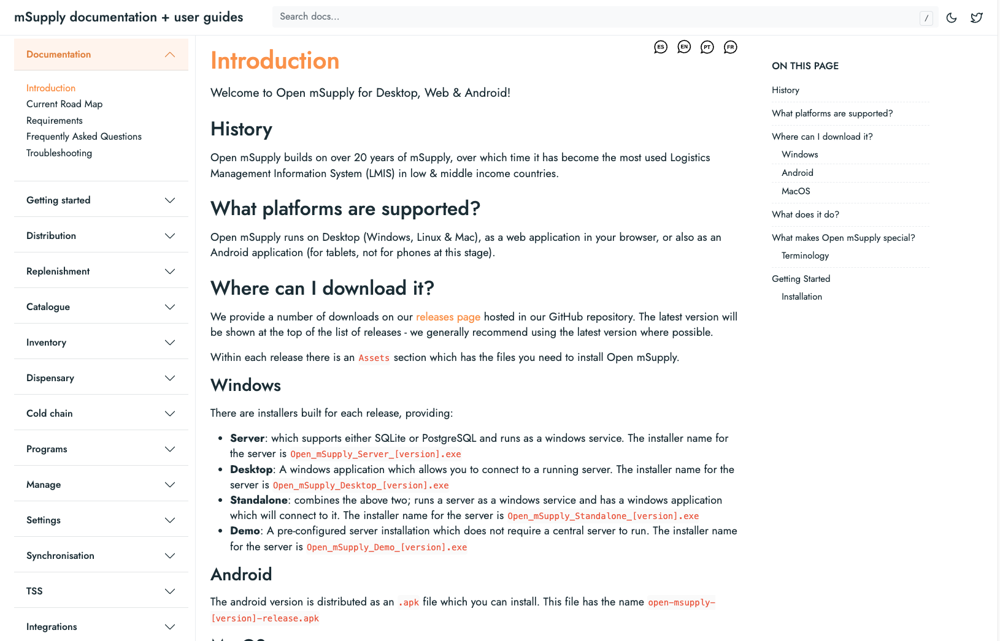
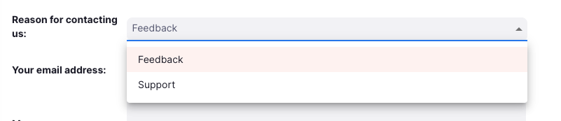
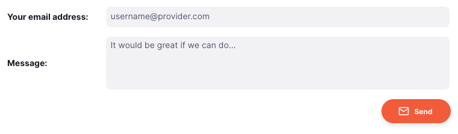

+++
title = "Ayuda"
description = "Guía del usuario y formulario de contacto"
date = 2025-01-06
updated = 2025-01-06
template = "docs/page.html"
sort_by = "weight"
weight = 1
draft = false

[extra]
toc = true
top = false
+++

La página de ayuda le permite ponerse en contacto con nosotros para enviarnos cualquier comentario o solicitud de asistencia.

## Cómo ver la página de ayuda

Para ver la página de ayuda, vaya a «Ayuda» en la sección inferior del panel de navegación:

Esto le llevará a la página de ayuda:

### Guía del usuario

Para ver nuestra documentación, haga clic en «Ver versión en línea»:

Esto le llevará a la página de documentación y guías de usuario de mSupply:

### Contáctenos

Indíquenos el motivo por el que se pone en contacto con nosotros haciendo clic en el menú desplegable:

Rellene el resto del formulario según corresponda:

Una vez rellenado el formulario, haga clic en «Enviar» cuando esté satisfecho con su mensaje:

El equipo de asistencia de mSupply recibirá su mensaje y se pondrá en contacto con usted en breve para responder a sus solicitudes de asistencia.
