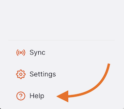
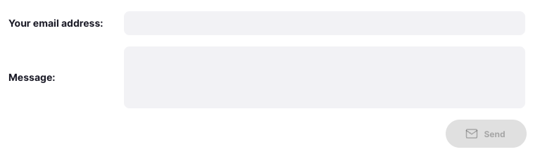

+++
title = "Help"
description = "Contact mSupply Foundation"
date = 2025-01-06
updated = 2025-01-06
template = "docs/page.html"
sort_by = "weight"
weight = 1
draft = false

[extra]
toc = true
top = false
+++

La page d'aide vous permet de nous contacter afin de solliciter notre assistance ou de nous faire des retours.

## Affichage de la page d'aide

Pour afficher la page d'aide, accédez à « Aide » dans la partie inférieure du panneau de navigation :

Vous serez redirigé vers la page d'aide :

### Guide de l'utilisateur

Pour consulter notre documentation, cliquez sur « Voir la version en ligne » :

Vous serez alors redirigé vers la page web de documentation et des guides de l'utilisateur :

### Contactez-nous

Indiquez-nous la raison de votre prise de contact en cliquant sur le menu déroulant :

Remplissez le reste du formulaire incluant les détails de votre demande ou retour :

Une fois le formulaire rempli, cliquez sur « Envoyer » lorsque vous êtes satisfait de votre message :

L'équipe d'assistance mSupply recevra votre message et vous contactera rapidement pour répondre à votre demande.
