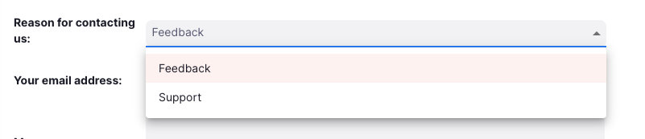

+++
title = "Ajuda"
description = "Guia do utilizador e formulário de contacto"
date = 2025-01-06
updated = 2025-01-06
template = "docs/page.html"
sort_by = "weight"
weight = 1
draft = false

[extra]
toc = true
top = false
+++

A página de Ajuda permite que nos envie comentários ou solicitações de suporte.

## Visualizando a página de Ajuda

Para visualizar a página de Ajuda, aceda a `Ajuda` na seção inferior do painel de navegação:

Isso o levará à página de Ajuda:

### Guia do utilizador

Para visualizar a nossa documentação, clique em «Ver versão online»:

Isto irá levá-lo para a página de documentação e guias do utilizador do mSupply:

### Contacte-nos

Informe-nos o motivo pelo qual está a entrar em contacto clicando no menu suspenso:

Preencha o restante do formulário de acordo com o necessário:

Depois de preencher o formulário, clique em enviar quando estiver satisfeito com a sua mensagem:

A equipa de suporte do mSupply receberá a sua mensagem e entrará em contacto em breve para responder às solicitações de suporte.
