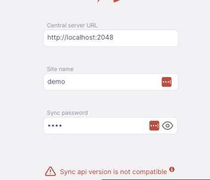

+++
title = "Requisitos"
description = "Requirements for Open mSupply."
date = 2022-06-10T11:38:00+00:00
updated = 2022-06-10T11:38:00+00:00
draft = false
weight = 30
sort_by = "weight"
template = "docs/page.html"
ai_generated = true

[extra]
toc = true
top = true
+++

## Requisitos de Open mSupply

Open mSupply se ejecuta en varias plataformas y para una instalación básica tiene requisitos de hardware muy modestos.
El cliente puede ser un navegador web, una tableta Android o una PC con Windows, Linux o Mac OS.
El servidor requiere un poco más de memoria y capacidad de procesamiento, dependiendo del número de usuarios.

## Requisitos de hardware

### Recomendaciones generales de hardware

- En entornos con cortes de energía regulares, se recomienda encarecidamente adquirir computadoras portátiles en lugar de computadoras de escritorio. Las computadoras portátiles serán casi siempre la mejor solución en términos de costo y eficacia por las siguientes razones:
  - En entornos con suministro eléctrico de baja calidad, las computadoras portátiles generalmente serán más confiables que las computadoras de escritorio con protección UPS. En tales entornos, las baterías UPS normalmente morirán dentro de los 2 años. Las baterías de las computadoras portátiles tienen un mejor manejo de energía y duran más.
  - Incluso cuando se agota la batería de una computadora portátil, la administración de energía normalmente hará que la máquina se apague correctamente.
  - Las computadoras portátiles tienen micrófono y cámara incorporados para proporcionar soporte.
  - Las computadoras portátiles tienen un adaptador Wi-Fi incorporado para la conexión de red.
  - Las computadoras portátiles son más pequeñas y livianas que las computadoras de escritorio, por lo que son menos costosas de enviar.
- No es absolutamente necesario tener una impresora conectada en todas las situaciones, pero en la mayoría de las situaciones es un requisito. Es preferible una impresora de inyección de tinta o láser.
- Adquiera hardware para el cual haya un buen soporte postventa disponible.
- Adquiera marcas con reputación de calidad (incluso si significa comprar una máquina más lenta/antigua).

### Requisitos de desktop/portátil

Los requisitos de hardware varían ampliamente según para lo que desee usar Open mSupply. Aquí hay una guía aproximada:

| Máquina                                    | Mínimo Técnico                                                                                                                                              | Recomendado                                                                                                                                                                                                                               |
| :----------------------------------------- | :------------------------------------------------------------------------------------------------------------------------------------------------------------- | :---------------------------------------------------------------------------------------------------------------------------------------------------------------------------------------------------------------------------------------- |
| Máquina cliente Windows para usar con servidor | Procesador de 64 bits Windows 10 4 Gb de RAM, 300Mb de espacio en disco                                                                                              | Procesador de 64 bits Windows 10 8 Gb de RAM, 500Mb de espacio en disco                                                                                                                                                                         |
| Máquina cliente Mac para usar con servidor     | Procesador de 64 bits macOS Mojave (10.14) – macOS Big Sur (11)(Se requiere la última versión de la versión principal, como 10.14.6) 4 Gb de RAM, 300Mb de espacio en disco | Procesador de 64 bits Mac OS 10.14.6 o posterior 8 Gb de RAM, 500Mb de espacio en disco                                                                                                                                                            |
| Servidor Windows                             | Procesador de 64 bits Windows 10 Pro o Win server 2019 16 Gb de RAM 100 GB de volumen HDD/SDD con copias de seguridad diarias a un volumen externo                        | Procesador de 64 bits Windows Server 2019+ 32 Gb de RAM 4 x volúmenes HDD/SDD, 3 configurados como RAID1 o RAID5 con repuesto en caliente Copias de seguridad diarias al cuarto volumen más copias de seguridad diarias fuera del sitio Conectado a un Smart UPS (ver abajo) |
| Cliente o servidor Linux                     | Procesador de 64 bits Ubuntu 20+ o similar 4 Gb de RAM 256 Gb de almacenamiento                                                                                     | Procesador de 64 bits Ubuntu 20+ o similar 8 Gb de RAM 512 Gb de almacenamiento                                                                                                                                                                |

El registro de transacciones de inventario es una actividad fundamental de Open mSupply. La mayoría de los datos de transacciones de inventario son numéricos. Un teclado numérico es a menudo útil para máquinas que tienen mucha entrada de datos.

### Requisitos para móviles/tabletas

Puedes usar un navegador en una tableta para conectarte a un servidor de Open mSupply, y el único requisito aquí es una tableta lo suficientemente rápida con un navegador como Chrome o Firefox.

Para una solución independiente y sin conexión, también está disponible una aplicación móvil para dispositivos Android.

Especificaciones recomendadas:
En resumen, Open mSupply mobile funciona en tabletas Android (no en teléfonos, ya que hay demasiados datos para usar bien en pantallas pequeñas de teléfonos).
La aplicación requiere al menos Android 10.

|                 | Mínimo           | Recomendado       |
| :-------------- | :---------------- | :---------------- |
| Tamaño de pantalla    | 9.8 pulgadas        | 10.1 pulgadas       |
| Resolución      | 768 x 1024 píxeles | 800 x 1200 píxeles |
| Versión de Android | 10                | 14                |
| Procesador       | 64 bits            | 64 bits            |
| RAM             | 2 Gb              | 4 Gb              |
| Almacenamiento         | 32 Gb             | 64 Gb             |
| Chrome Browser  | 138.0.7204.63     | Latest Version    |

Para proporcionar soporte, el dispositivo también debe ser compatible con el software de gestión de dispositivos móviles (MDM) y admitir los servicios de Google.  
Recomendamos encarecidamente tabletas <strong>Samsung</strong> más nuevas, ya que es lo que utilizan nuestros equipos de desarrollo y pruebas.  
Comunícate con <a href="https://msupply.foundation/#contact">mSupply Foundation</a> para obtener requisitos específicos y detalles de compatibilidad antes de comprar grandes cantidades de dispositivos.

Por favor, contáctanos para pruebas y/o consejos antes de realizar una gran compra de hardware.

### UPS inteligente

Un UPS 'inteligente' ([Sistema de Alimentación Ininterrumpida](https://en.wikipedia.org/wiki/Uninterruptible_power_supply)) detecta cuándo la batería está a punto de agotarse y envía una notificación al software del servidor que desencadena un cierre adecuado del ordenador. Para activar esto, debe haber una conexión por cable (normalmente USB) entre el UPS y el ordenador combinada con software ejecutándose en el ordenador.

En nuestra experiencia, la principal causa de fallos en el hardware del ordenador es la corrupción de datos debido a los apagados inadecuados. Esto ocurre cuando se corta instantáneamente la alimentación del ordenador sin ninguna notificación para que se apague correctamente. Si la máquina está 'protegida' por un UPS normal, entonces esto aún puede suceder cuando se agota la energía de la batería. Incluso si la máquina está teóricamente protegida por un UPS 'inteligente', hay varias circunstancias en las que esta protección del UPS falla:

- La conexión por cable y el software pueden fallar.
  - El cable se desconecta
  - El software no está configurado correctamente
  - El software no se inicia
- Las baterías del UPS se degradan (normalmente en un plazo de 2 años desde la instalación en entornos con cortes regulares de energía) y hay muy poca capacidad para funcionar el tiempo suficiente para que el ordenador se apague correctamente después de recibir la notificación del UPS.

Los ordenadores portátiles tienden a ser mucho más resistentes a los fallos de energía:

- El UPS 'inteligente' integrado en un portátil es muy fiable
- Las baterías internas duran mucho más que las baterías UPS
- Incluso si la batería interna del portátil se degrada, la función 'inteligente' parece funcionar de manera mucho más fiable que un UPS independiente comunicándose con un ordenador de escritorio.

Aquí hay algunas ventajas adicionales de los portátiles frente a las máquinas de escritorio:

- Menor costo de envío:
  - Para enviar la máquina al lugar
  - Para enviar piezas de repuesto para reparación en el lugar
  - Para recuperar la máquina del lugar para cualquier reparación que no se pueda realizar en el lugar
- Es estándar tener características como Wi-Fi, Bluetooth y cámara incluidas por defecto y esto puede no ser el caso con los ordenadores de escritorio.

Una preocupación con los ordenadores portátiles es la seguridad. Es más fácil robar un ordenador portátil de una oficina que robar un ordenador de escritorio. Por esta razón, los portátiles normalmente están configurados con una característica de bloqueo físico como [Kensington lock slot](https://en.wikipedia.org/wiki/Kensington_Security_Slot).

Debido a que Open mSupply está tratando con muchos números (cantidades de inventario), <strong>es muy recomendable tener un teclado con un teclado numérico</strong>. Los ordenadores portátiles más pequeños (pantalla de 14" o menos) no tendrán esto. Los ordenadores portátiles más pequeños normalmente tienen una pantalla imprácticamente pequeña. Por lo tanto, se recomienda adquirir un ordenador portátil con un teclado que incluya un teclado numérico - lo que necesariamente implicará una pantalla más grande.

Accesorios útiles de productividad para ordenadores portátiles incluyen:

- Ratón externo (no inalámbrico - la sustitución de baterías es costosa y problemática para el medio ambiente)
- Teclado externo (no inalámbrico - la sustitución de baterías es costosa y problemática para el medio ambiente)
- Pantalla externa

## Requisitos de ancho de banda y latencia

En primer lugar, este es un buen momento para mencionar nuestro sistema de sincronización, ¡que ha salvado a muchos países de una instalación fallida!

#### Modo offline (Sincronización)

- 128kbps de ancho de banda
- alta latencia (ej. satélite) está bien, y los usuarios no lo notarán en las operaciones del día a día, ya que la sincronización se ejecuta en segundo plano, y las solicitudes de datos se cumplen desde la base de datos local, no a través de internet.
- intermitente (digamos solo una vez por semana) está bien

#### Modo alojado en la nube (En línea)

- La descarga inicial del código Javascript es de alrededor de 1 Mb, por lo que una conexión de 512kbps o más rápida es mejor (carga en 10 segundos más o menos)
- Necesitas una conexión a internet para usar Open mSupply en este modo.
- alta latencia (ej. un satélite o conexión sobrecargada) resultará en un rendimiento más lento

## Sistema de respaldo

Una vez que comiences a usar Open mSupply, es importante que tengas un método de respaldar tus datos. En una instalación por defecto, Open mSupply almacena todos sus datos en un archivo que rápidamente se vuelve grande. Necesitas, por lo tanto, tener un dispositivo de almacenamiento extraíble de alta capacidad. Recomendamos encarecidamente el uso de un disco duro externo usando Firewire (IEEE 1394) o USB2 para facilitar el almacenamiento fuera del sitio de los respaldos.

- Si no usas nuestro servicio de respaldo por internet, necesitas poder almacenar los datos respaldados fuera del sitio para prevenir el riesgo de pérdida por fuego, robo, etc.

## Antivirus

Los sistemas operativos basados en Windows son particularmente propensos al malware si no se toman precauciones. Recomendamos las siguientes precauciones:

- Instala un programa antivirus confiable, incluyendo protección web si la computadora tiene acceso a internet
- Desactiva los puertos USB - consulta [este sitio](http://www.thewindowsclub.com/disable-enable-usb-windowunlock-pen-drive-at-office-or-school-computer) para métodos sugeridos

Asegúrate de que el acceso a las contraseñas que permiten excepciones a las dos medidas anteriores se mantenga seguro.

## Base de datos

Open mSupply soporta tanto SQLite como PostgreSQL como servidores de base de datos, con la selección hecha al momento de la instalación.
Recomendamos usar PostgreSQL cuando ejecutes un servidor centralizado o de alto uso ya que puede proporcionar mayor rendimiento que SQLite. PostgreSQL requiere una instalación separada - puedes usar una instalación existente, instalar separadamente a Open mSupply, o seleccionar la casilla que es parte de la instalación del servidor.

Hay una versión mínima para PostgreSQL de versión 12.

## Servidores Centrales

Una instalación de mSupply es actualmente requerida cuando ejecutas Open mSupply. Esto se usa para manejar varios aspectos centralizados del sistema.

Desde v2.0.00, el servidor central Open mSupply también es requerido para sincronización exitosa. Ve [Open mSupply central server](/docs/getting_started/central-server/) y [Open mSupply central server site configuration in mSupply](https://docs.msupply.org.nz/synchronisation:sync_sites#open_msupply_central_server_settings) para más detalles.

Obtendrás el siguiente mensaje de error si el servidor central Open mSupply no está configurado:

Las versiones de ambos servidores centrales y tu sitio remoto Open mSupply son importantes, ya que no todas las versiones de cada uno son compatibles entre sí.

La tabla de abajo muestra qué versiones de mSupply y Open mSupply Central necesitarás cuando ejecutes como un sitio remoto Open mSupply:

| Open mSupply Remote | mSupply Central | Open mSupply Central |
| :------------------ | :-------------- | -------------------- |
| 1.1.00 - 1.1.16     | 7.04.01+        | N/A                  |
| 1.2.00+             | 7.05.05+        | N/A                  |
| 1.4.00+             | 7.09.00+        | N/A                  |
| 2.0.00+             | 7.14.04+        | 2.0.00+              |
| 2.1.00+             | 7.14.04+        | 2.1.00+              |
| 2.2.00+             | 7.14.04+        | 2.2.00+              |
| 2.3.00+             | 7.17.01+        | 2.3.00+              |
| 2.7.00+             | 8.01.03+        | 2.7.00+              |
| 2.8.00+             | 8.02.00+        | 2.7.00+              |

Si intentas conectarte a un servidor incompatible obtendrás un mensaje de error como este:

