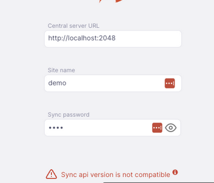

+++
title = "Requisitos"
description = "Requisitos for Open mSupply."
date = 2022-06-10T11:38:00+00:00
updated = 2022-06-10T11:38:00+00:00
draft = false
weight = 30
sort_by = "weight"
template = "docs/page.html"

[extra]
toc = true
top = true
+++

## Requisitos do Open mSupply

O Open mSupply corre em diversas plataformas e, para uma instalação básica, tem requisitos de hardware muito modestos.
O cliente pode ser um navegador web, um tablet Android ou um PC com Windows, Linux ou Mac OS.
O servidor requer um pouco mais de memória e capacidade de processamento, dependendo do número de utilizadores.

## Requisitos de hardware

### Recomendações gerais de hardware

- Em ambientes com falhas de energia regulares, é altamente recomendável adquirir máquinas portáteis em vez de desktops. Os portáteis serão quase sempre a melhor solução em termos de custo e eficácia pelas seguintes razões:
- Em ambientes com um fornecimento de energia elétrica de baixa qualidade, os computadores portáteis serão geralmente mais fiáveis ​​do que os computadores de secretária com proteção UPS. Em tais ambientes, as baterias do UPS morrem normalmente em 2 anos. As baterias dos portáteis têm uma melhor gestão de energia e duram mais
- Mesmo quando a bateria de um portátil se esgota, a gestão de energia normalmente fará com que a máquina se desligue normalmente
- Microfone e câmara integrados para fornecimento de suporte
- Adaptador Wi-Fi integrado para ligação de rede
- Os computadores portáteis são mais pequenos e mais leves do que os computadores de secretária e, por isso, são mais baratos de enviar
- Uma impressora ligada não é absolutamente necessária em todas as situações, mas na maioria delas é um requisito. É preferível um jato de tinta ou laser
- Adquira hardware para o qual exista um bom suporte pós-venda disponível
- Compre marcas com reputação de qualidade (mesmo que isso implique comprar uma máquina mais antiga/lenta)

### Requisitos de desktop/portátil

Os requisitos de hardware variam muito dependendo do objetivo da utilização do Open mSupply. Aqui está um guia aproximado:

| Máquina                                    | Especificação técnica mínima                                                                                                                                   | Recommendada                                                                                                                                                                                                                              |
| :----------------------------------------- | :------------------------------------------------------------------------------------------------------------------------------------------------------------- | :---------------------------------------------------------------------------------------------------------------------------------------------------------------------------------------------------------------------------------------- |
| Windows Client machine for use with server | 64 bit processor Windows 10 4 Gb RAM, 300Mb of disk space                                                                                              | 64 bit processor Windows 10 8 Gb RAM, 500Mb of disk space                                                                                                                                                                         |
| Mac Client machine for use with server     | 64 bit processor macOS Mojave (10.14) – macOS Big Sur (11)(Latest release of major version is required, such as 10.14.6) 4 Gb RAM, 300Mb of disk space | 64 bit processor Mac OS 10.14.6 or later 8 Gb RAM, 500Mb of disk space                                                                                                                                                            |
| Windows server                             | 64 bit processor Windows 10 Pro or Win server 2019 16 Gb RAM 100 GB HDD/SDD volume with daily backups to an external volume                        | 64 bit processor Windows Server 2019+ 32 Gb RAM 4 x HDD/SDD volumes, 3 configured as RAID1 or RAID5 with hot spare Daily backups to the fourth volume plus daily off-site backups Attached to a Smart UPS (see below) |
| Linux client or server                     | 64 bit processor Ubuntu 20+ or similar 4 Gb RAM 256 Gb storage                                                                                     | 64 bit processor Ubuntu 20+ or similar 8 Gb RAM 512 Gb storage                                                                                                                                                                |

O registo de transações de stock é uma atividade essencial do Open mSupply. A maioria dos dados de transações de ações são numéricos. Um teclado numérico é geralmente útil para máquinas que exigem muita introdução de dados.

### Requisitos Mobile / tablet

Pode utilizar um browser num tablet para se ligar a um servidor Open mSupply, e o único requisito aqui é um tablet suficientemente rápido com um browser como o Chrome ou o Firefox.

Para uma solução autónoma e offline, também está disponível uma aplicação móvel para dispositivos Android.

Especificações recomendadas:
Em suma, o Open mSupply mobile corre em tablets Android (não em telemóveis, pois há muitos dados para serem bem utilizados em ecrãs pequenos).
A aplicação requer pelo menos Android 10

|                    | Mínimo            | Recomendado       |
| :----------------- | :---------------- | :---------------- |
| Tamanho do Display | 9.8 inches        | 10.1 inches       |
| Resolução          | 768 x 1024 pixels | 800 x 1200 pixels |
| Versão Android     | 10                | 14                |
| Processor          | 64 bit            | 64 bit            |
| Memória RAM        | 2 Gb              | 4 Gb              |
| Armazenamento      | 32 Gb             | 64 Gb             |

Para fornecer suporte, o dispositivo também deve ser compatível com o software MDM (Mobile Device Management) e suportar os serviços da Google. Contacte a [mSupply Foundation](https://msupply.foundation/#contact) para mais detalhes.

Contacte-nos para testes e/ou aconselhamento antes de fazer uma grande compra de hardware.

### UPS inteligente

Um UPS ([Fonte de Alimentação Ininterrupta](https://en.wikipedia.org/wiki/Uninterruptible_power_supply)) 'inteligente' deteta quando a bateria está prestes a esgotar-se e envia uma notificação para o software no servidor, o que desencadeia um encerramento suave do computador. Para activar isto, é necessário existir uma ligação por cabo (normalmente USB) entre a UPS e o computador, combinada com um software em execução no computador.

Na nossa experiência, a principal causa de falha de hardware de computador é a corrupção de dados devido a encerramentos inadequados. Isto acontece quando a energia do computador é cortada instantaneamente, sem qualquer notificação para que se desligue normalmente. Se a máquina estiver "protegida" por um UPS normal, isto ainda poderá acontecer quando a bateria estiver descarregada. Mesmo que a máquina esteja teoricamente protegida por um UPS "inteligente", há uma série de circunstâncias em que esta proteção do UPS falha:

- A ligação do cabo e o software podem falhar.
- O cabo fica desligado
- O software não está configurado corretamente
- O software não arranca
- As baterias do UPS degradam-se (normalmente dentro de 2 anos de instalação em ambientes com cortes regulares de energia) e há muito pouca capacidade para funcionar o suficiente para que o computador se desligue normalmente após receber a notificação do UPS

Os portáteis tendem a ser muito mais resistentes a falhas de energia:

- O UPS 'inteligente' integrado num portátil é muito fiável
- As baterias internas duram muito mais tempo que as baterias UPS
- Mesmo que a bateria interna do portátil se degrade, a função "inteligente" parece funcionar de forma muito mais fiável do que um UPS autónomo a comunicar com um computador "torre".

Aqui estão algumas vantagens adicionais dos portáteis em relação a: máquinas de mesa:

- Menor custo de frete:
- Para enviar a máquina para o local
- Enviar peças de substituição para reparação no local
- Para recuperar a máquina do local para quaisquer reparações que não possam ser realizadas no local
- É padrão ter características como Wi-Fi, Bluetooth e câmara incluídas por defeito e isso pode não ser o caso com os desktops

Uma preocupação com os portáteis é a segurança. É mais fácil roubar um portátil de um escritório do que roubar um computador de secretária. Por este motivo, os portáteis são normalmente configurados com uma funcionalidade de bloqueio físico, como [slot para bloqueio Kensington](https://en.wikipedia.org/wiki/Kensington_Security_Slot).

Uma vez que o Open mSupply lida com muitos números (quantidades de stock), <strong>é altamente recomendável ter um teclado com teclado numérico</strong>. Os computadores portáteis mais pequenos (ecrã de 14" ou menos) não terão isto. Os computadores portáteis mais pequenos têm normalmente um ecrã impraticavelmente pequeno. Por conseguinte, é recomendado adquirir um computador portátil com um teclado que inclua um teclado numérico - o que implicará necessariamente um ecrã maior.

Os acessórios de produtividade úteis para portáteis incluem

- Rato externo (não sem fios - a substituição da bateria é dispendiosa e problemática para o ambiente)
- Teclado externo (não sem fios - a substituição da bateria é dispendiosa e problemática para o ambiente)
- Ecrã externo

## Requisitos de largura de banda e latência

Em primeiro lugar, este é um bom momento para mencionar o nosso sistema de sincronização, que salvou muitos países de uma instalação mal sucedida!

#### Modo offline (sincronização)

- Largura de banda de 128 kbps
- a alta latência (por exemplo, satélite) é aceitável, e os utilizadores não se aperceberão disso nas operações do dia a dia, uma vez que a sincronização é executada em segundo plano e os pedidos de dados são atendidos pela base de dados local, e não pela Internet.
- intermitente (digamos, apenas uma vez por semana) está OK

#### Modo alojado na nuvem (online)

- O download inicial do código Javascript é de cerca de 1 Mb, pelo que é melhor uma ligação de 512 kbps ou mais rápida (carrega em 10 segundos ou mais)
- Necessita de uma ligação à Internet para utilizar o Open mSupply neste modo.
- latência elevada (por exemplo, uma ligação por satélite ou sobrecarregada) resultará num desempenho mais lento

## Sistema de backup

Depois de começar a utilizar o Open mSupply, é importante que tenha um método de fazer cópias de segurança dos seus dados. Numa instalação padrão, o Open mSupply armazena todos os seus dados num ficheiro que rapidamente se torna grande. Precisa, portanto, de ter um dispositivo de armazenamento amovível de alta capacidade. Recomendamos vivamente a utilização de um disco rígido externo com Firewire (IEEE 1394) ou USB2 para facilitar o armazenamento externo de cópias de segurança.

- Se não estiver a utilizar o nosso serviço de cópia de segurança através da Internet, terá de armazenar os dados de cópia de segurança fora do local para evitar o risco de perda por incêndio, roubo, etc.

## Antivírus

Os sistemas operativos baseados em Windows são particularmente propensos a malware se não forem tomadas precauções. Recomendamos as seguintes precauções:

- Instale um programa antivírus fiável, incluindo proteção na Web, se o computador tiver acesso à Internet
- Desactive as portas USB - consulte [este site](http://www.thewindowsclub.com/disable-enable-usb-windowunlock-pen-drive-at-office-or-school-computer) para obter métodos sugeridos

Garanta que o acesso às palavras-passe que permitem exceções às duas medidas acima referidas são mantidas em segurança.

## Base de dados

O Open mSupply suporta SQLite e PostgreSQL como servidores de base de dados, sendo a seleção feita no momento da instalação.
Recomendamos a utilização do PostgreSQL ao executar um servidor centralizado ou de elevada utilização, pois pode proporcionar um maior desempenho do que o SQLite. O PostgreSQL requer uma instalação separada - pode utilizar uma instalação existente, instalar separadamente no Open mSupply ou marcar a caixa de selecção que faz parte da instalação do servidor.

Existe uma versão mínima para o PostgreSQL da versão 12.

## Servidores Centrais

Atualmente, é necessária a instalação do mSupply ao executar o Open mSupply. Este é utilizado para gerir vários aspetos centralizados do sistema.

A partir da versão 2.0.00, o servidor central Open mSupply também é necessário para uma sincronização bem-sucedida. Consulte [Open mSupply central server](/docs/getting_started/central-server/) e [Open mSupply central server site configuration in mSupply](https://docs.msupply.org.nz/synchronisation:sync_sites#open_msupply_central_server_settings) para obter mais detalhes.

Receberá a seguinte mensagem de erro se o servidor central do Open mSupply não estiver configurado:

As versões dos servidores centrais e do seu site remoto do Open mSupply são importantes, uma vez que nem todas as versões de cada um são compatíveis entre si.

A tabela abaixo mostra quais as versões do mSupply e do Open mSupply Central de que necessitará ao executar como um site remoto do Open mSupply:

| Open mSupply Remoto | mSupply Central | Open mSupply Central |
| :------------------ | :-------------- | -------------------- |
| 1.1.00 - 1.1.16     | 7.04.01+        | N/A                  |
| 1.2.00+             | 7.05.05+        | N/A                  |
| 1.4.00+             | 7.09.00+        | N/A                  |
| 2.0.00+             | 7.14.04+        | 2.0.00+              |
| 2.1.00+             | 7.14.04+        | 2.1.00+              |
| 2.2.00+             | 7.14.04+        | 2.2.00+              |
| 2.3.00+             | 7.17.01+        | 2.3.00+              |
| 2.7.00+             | 8.01.03+        | 2.7.00+              |
| 2.8.00+             | 8.02.00+        | 2.7.00+              |
| 2.9.00+             | 8.03.04+        | 2.7.00+              |
| 2.9.02+             | 8.03.12+        | 2.9.02+              |

Caso tente se conectar com um servidor incompatível, verás uma mensagem de erro como a seguinte:

