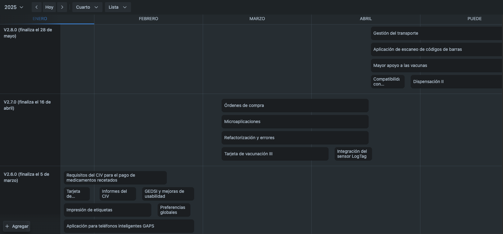

+++
title = "Plan de Trabajo Actual"
description = "Open mSupply Road Map."
date = 2022-11-10T18:20:00+00:00
updated = 2022-11-10T18:20:00+00:00
draft = false
weight = 20
sort_by = "weight"
template = "docs/page.html"

[extra]
toc = true
+++

Este mapa de ruta se actualizará aproximadamente cada seis semanas y solo cubre nuestro flujo de trabajo comprometido inmediato. Nuestra lista de funciones planificadas es mucho más extensa.

### Plan de trabajo

### Características planificadas

| Área    | Transacción    | Característica / Capacidad     | 
|-----------------------------------------------------|------------------------------------------|-------------------------------------------------------------------------------------------------------------------------------------------------------------------------| 
| CUANTIFICACIÓN | Planificación de la demanda  | Cálculo basado en reglas del volumen estimado de productos requeridos X por nivel de distribución y períodos de tiempo definidos por el usuario | 
| CUANTIFICACIÓN | Planificación de suministros  |   | 
| CUANTIFICACIÓN  | Planificación de la demanda  | Editar manualmente las previsiones    | 
| ADQUISICIONES  | Licitación/Solicitud de cotización   | Comprador: crear una nueva licitación   | 
| ADQUISICIONES   | Licitación/Solicitud de cotización    | Comprador: publicar la licitación en una lista de proveedores  | 
| ADQUISICIONES  | Licitación/Solicitud de cotización    | Comprador: crear una solicitud electrónica de cotización (EDI 840)   | 
| ADQUISICIONES   | Licitación/Solicitud de cotización     | Comprador: crear precios de referencia | 
| ADQUISICIONES   | Licitación/Solicitud de cotización     | Proveedores: pueden cargar sus respuestas en Open mSupply (portal web)  | 
| ADQUISICIONES   | Licitación/Solicitud de cotización     | Comprador: recibir manualmente las respuestas / cotizaciones del proveedor    | 
| ADQUISICIONES  | Licitación/Solicitud de cotización     | Comprador: recibir automáticamente las respuestas / cotizaciones del proveedor (portal web)  | 
| ADQUISICIONES   | Licitación/Solicitud de cotización    | Comprador: recibir una respuesta electrónica a una solicitud de cotización (EDI 843 / PEPPOL)    | 
| ADQUISICIONES   | Licitación/Solicitud de cotización     | Compradores: evaluatón de cotizaciones recibidas   | 
| ADQUISICIONES   | Licitación/Solicitud de cotización     | Compradores: seleccionar proveedores preferidos (adjudicación)  | 
| ADQUISICIONES   | Licitación/Solicitud de cotización     | Gestión de contratos y subvenciones  | 
| ADQUISICIONES   | Órdenes de compra  | Crear una orden de compra a partir de una licitación     | 
| ADQUISICIONES  | Órdenes de compra  | Crear una orden de compra calculada     | 
| ADQUISICIONES   | Órdenes de compra  | Crear una orden de compra en blanco   | 
| ADQUISICIONES   | Órdenes de compra   | Crear una orden de compra electrónica (EDI 850)   | 
| ADQUISICIONES   | Órdenes de compra  | Agregar elementos de la lista maestra    | 
| ADQUISICIONES   | Órdenes de compra   | Categorías de orden de compra   | 
| ADQUISICIONES  | Órdenes de compra  | Atributos de línea de orden de compra  | 
| ADQUISICIONES   | Gestión de proveedores  | Crear / Ver / Editar proveedores   | 
| ADQUISICIONES   | Aviso de Envío Avanzado | Crear un aviso de envío avanzado (ASN) manual a partir de una orden de compra (PO)   | 
| ADQUISICIONES   | Aviso de Envío Avanzado | Recibir un ASN electrónico (EDI 856)  | 
| ADQUISICIONES   | Recepción de bienes   | Imprimir un formulario de recepción de mercancías (PDF, CSV) de un envío entrante (cuando se confirma el estado VERIFICADO)  | 
| ADQUISICIONES   | Pagos | Imprimir un formulario de factura de proveedor (PDF, CSV) de un envío entrante (cuando se confirma el estado VERIFICADO) | 
| ADQUISICIONES   | Pagos| Registrar los pagos realizados a proveedores (a partir de una factura de proveedor)    | 
| RECEPCIÓN   | Entradas(excluyendo facturas de proveedores) | Aceptar notificación de llegada del envío    | 
| RECEPCIÓN   | Entradas(excluyendo facturas de proveedores) | Recibir automáticamente los datos del envío antes de la llegada  | 
| RECEPCIÓN  | Entradas(excluyendo facturas de proveedores) | Registrar manualmente los datos del envío antes de la llegada    | 
| RECEPCIÓN  | Entradas(excluyendo facturas de proveedores) | Mostrar cualquier diferencia entre las cantidades solicitadas (req o PO) y las cantidades notificadas | 
| RECEPCIÓN   | Entradas(excluyendo facturas de proveedores) | Notificar a las partes correspondientes las discrepancias   | 
| RECEPCIÓN   | Entradas(excluyendo facturas de proveedores) | Rechazar el pedido si es necesario   | 
| RECEPCIÓN  | Entradas(excluyendo facturas de proveedores) | Mostrar los requisitos de almacenamiento en función de la cantidad enviada y el volumen bruto | 
| RECEPCIÓN   | Entradas(excluyendo facturas de proveedores) | Mostrar la cantidad de espacio de almacenamiento disponible por tipo | 
| RECEPCIÓN  | Entradas(excluyendo facturas de proveedores) | Marcar si no hay suficiente espacio de almacenamiento por tipo   | 
| RECEPCIÓN  | Entradas(excluyendo facturas de proveedores) | Confirmar la llegada del envío entrante      | 
| RECEPCIÓN  | Entradas(excluyendo facturas de proveedores) | Registrar manualmente los datos de la entrada al llegar  | 
| RECEPCIÓN   | Entradas(excluyendo facturas de proveedores) | Escaneo de códigos de barras para la recepción de bienes     | 
| RECEPCIÓN   | Entradas(excluyendo facturas de proveedores) | Indicar las discrepancias en comparación con el envío recibido    | 
| RECEPCIÓN   | Entradas(excluyendo facturas de proveedores) | Registrar daños, discrepancias, no coincidencia de lotes, indicador e información de variación para cada línea de producto   | 
| RECEPCIÓN   | Entradas(excluyendo facturas de proveedores)| Registrar notas sobre las discrepancias y variaciones en los bienes recibidos | 
| RECEPCIÓN   | Entradas(excluyendo facturas de proveedores) | Informar los daños y discrepancias a las personas correspondientes    | 
| RECEPCIÓN  | Entradas(excluyendo facturas de proveedores) | Confirmar los bienes en el stock (actualizar los registros de inventario)    | 
| RECEPCIÓN   | Entradas(excluyendo facturas de proveedores) | Imprimir informes de recepción, formulario de liberación de stock, autorización de recepción, etc...   | 
| RECEPCIÓN  | Entradas(excluyendo facturas de proveedores) | Asignar un operario a una entrada para ubicar el stock recibido   | 
| RECEPCIÓN  | Entradas(excluyendo facturas de proveedores) | Aplicación de ubicación: carga la lista de artículos y las instrucciones de ubicación de ña entrada  | 
| RECEPCIÓN  | Entradas(excluyendo facturas de proveedores) | Mostrar las condiciones de almacenamiento de los artículos (por ejemplo, control de temperatura)  | 
| RECEPCIÓN  | Entradas(excluyendo facturas de proveedores)| Mostrar la ubicación de almacenamiento predeterminada para cada artículo   | 
| RECEPCIÓN   | Entradas(excluyendo facturas de proveedores)| Proponer el espacio/posición para cada artículo en inventario basado en reglas definidas (por ejemplo, la disponibilidad actual de espacio, basado en la categoría ABC)   | 
| RECEPCIÓN  | Entradas(excluyendo facturas de proveedores) | Imprimir etiqueta de paleta/estante que especifique el estado de la mercancía, si es apropiado  | 
| GESTIÓN DE INVENTARIO     | Ubicaciones   | Crear/editar ubicaciones de almacenamiento de inventario (pasillo, bin, slot, etc.)  | 
| GESTIÓN DE INVENTARIO     | Ubicaciones   | Definir la jerarquía de las ubicaciones de almacenamiento  | 
| GESTIÓN DE INVENTARIO    | Ubicaciones    | Definir condiciones de almacenamiento (cadena de frío, volumen, restricciones de elementos, restricciones de uso, etc...)    | 
| GESTIÓN DE INVENTARIO     | Ubicaciones   | Registrar las temperaturas para las ubicaciones de almacenamiento (ver categoría CADENA DE FRÍO)  | 
| GESTIÓN DE INVENTARIO     | Artículos - Movimiento de stock y caducidad  | Registrar el estado VVM   | 
| GESTIÓN DE INVENTARIO     | Ubicaciones     | Registrar el estado de las condiciones de congelación   | 
| GESTIÓN DE INVENTARIO     | Artículos - Datos maestros  | Establecer condiciones de umbral de temperatura por producto, según corresponda  | 
| GESTIÓN DE INVENTARIO    | Artículos - Movimiento de stock y caducidad  | Condiciones de alerta fuera del umbral  | 
| GESTIÓN DE INVENTARIO    | Artículos - Movimiento de stock y caducidad  | Realizar seguimiento de lotes y fechas de caducidad    | 
| GESTIÓN DE INVENTARIO    | Artículos - Movimiento de stock y caducidad   | Transferir el stock de una ubicación a otra    | 
| GESTIÓN DE INVENTARIO    | Artículos - Movimiento de stock y caducidad  | Mostrar y transmitir alertas y notificaciones de caducidades pendientes  | 
| GESTIÓN DE INVENTARIO    | Artículos - Movimiento de stock y caducidad   | Mostrar y transmitir alertas y notificaciones de stock agotado, sobreestock, subestock  | 
| GESTIÓN DE INVENTARIO    | Artículos - Datos maestros  | Marcar artículos como peligrosos, según corresponda    | 
| GESTIÓN DE INVENTARIO    | Toma de inventario   | Crear/editar una toma de inventario para una lista de artículos    | 
| GESTIÓN DE INVENTARIO    | Toma de inventario    | iltrar el stock a incluir: por atributos de artículo (categoría, departamento, fecha de caducidad, etc...)   | 
| GESTIÓN DE INVENTARIO    | Toma de inventario   | Filtrar el stock a incluir: por ubicación  | 
| GESTIÓN DE INVENTARIO    | Toma de inventario    | Filtrar el stock a incluir: por lista maestra   | 
| GESTIÓN DE INVENTARIO     | Toma de inventario    | Imprimir hojas de toma de inventario (formato PDF)  | 
| GESTIÓN DE INVENTARIO     | Toma de inventario   | Imprimir hojas de toma de inventario (formato CSV)  | 
| GESTIÓN DE INVENTARIO    | Toma de inventario    |   | 
| GESTIÓN DE INVENTARIO     | Toma de inventario    | Aplicación de toma de inventario: cargar la hoja de toma de inventario en un dispositivo móvil    | 
| GESTIÓN DE INVENTARIO     | Toma de inventario    | Aplicación de toma de inventario: usa un escáner de código de barras o la cámara del dispositivo móvil para seleccionar el artículo que el operario está contando | 
| GESTIÓN DE INVENTARIO     | Toma de inventario    | Escaneo de código de barras para la toma de inventario | 
| GESTIÓN DE INVENTARIO     | Toma de inventario    | Crear ajustes de inventario (finalizar la toma de inventario)  | 
| GESTIÓN DE INVENTARIO    | Toma de inventario   | Agregar razones para los ajustes de inventario  | 
| GESTIÓN DE INVENTARIO    | Toma de inventario   | Conteo cíclico  | 
| GESTIÓN DE INVENTARIO    | Kits  |   | 
| GESTIÓN DE INVENTARIO    | Ajustes de inventario |   | 
| GESTIÓN DE INVENTARIO    | Reempacar |   | 
| GESTIÓN DE INVENTARIO    | Artículos - Movimiento de stock y caducidad   | Dividir línea de stock  | 
| GESTIÓN DE INVENTARIO     | Artículos - Movimiento de stock y caducidad   | Combinar línea de stock  | 
| GESTIÓN DE INVENTARIO     | Reposición de pickface (zona de alta rotación) |   | 
| GESTIÓN DE INVENTARIO     | Gestión de personal   | Crear/editar operarios de almacén  | 
| DESPACHOS  | Salidas  | Crear una hoja de recogida a partir de una salida asignada    | 
| DESPACHOS  | Salidas  | Hoja de recogida: mostrar la ubicación actual de los artículos requeridos   | 
| DESPACHOS   | Salidas  | Hoja de recogida: crear hoja de recogida ordenada por ubicaciones de almacenamiento     | 
| DESPACHOS  | Salidas | Hoja de recogida: mostrar la fecha de caducidad del stock    | 
| DESPACHOS  | Salidas  | Aplicación de hoja de recogida: cargar una hoja de recogida en un dispositivo móvil  | 
| DESPACHOS   | Salidas  | Escaneo de códigos de barras y recogida de pedidos  | 
| DESPACHOS  | Salidas  | Confirmar la salida como alistada | 
| DESPACHOS  | Salidas  | Empaque de pedido    | 
| DESPACHOS  | Salidas | Empaque de pedido: caja/cartonización  | 
| DESPACHOS  | Salidas | Imprimir documentos para la entrega: lista de embalaje, factura del cliente, nota de recepción de mercancías | 
| DESPACHOS  | Salidas | Confirmar la salida como enviada (actualización de los registros de inventario)  | 
| TRANSPORT   | Transport order/request | Draft transport order     | 
| TRANSPORT   | Transport order/request | Assign one or multiple "picked" outbound shipments to transport order (same trip or location)   | 
| TRANSPORTE   | Orden/Solicitud de transporte | Determinar la carga útil, volumen y dimensiones    | 
| TRANSPORTE   | Orden/Solicitud de transporte | Seleccionar el modo y tipo de transporte | 
| TRANSPORTE   | Orden/Solicitud de transporte| Determinar los reShare+quisitos de control de temperatura    | 
| TRANSPORTE   | Orden/Solicitud de transporte | Confirmar la orden de transporte   | 
| TRANSPORTE   | Orden/Solicitud de transporte| Programar los recursos de transporte  | 
| TRANSPORTE   | Orden/Solicitud de transporte | Registrar/Mostrar las instrucciones de entrega     | 
| TRANSPORTE   | Orden/Solicitud de transporte| Registrar/Mostrar el número de seguimiento, vehículo, conductor   | 
| TRANSPORTE   | Orden/Solicitud de transporte| Confirmar que se han cargado las salidas   | 
| TRANSPORTE   | Orden/Solicitud de transporte | Rastrear la ubicación y actualizar la hora estimada de llegada  | 
| TRANSPORTE   | Orden/Solicitud de transporte | Registrar el historial de transporte (ubicación, temperatura)  | 
| TRANSPORTE   | Orden/Solicitud de transporte | Confirmar la entrega / imprimir/enviar prueba de entrega   | 
| TRANSPORTE   | Transportista | Create/edit Carriers     | 
| TRANSPORTE   | Ruta | Crear/editar transportistas   | 
| TRANSPORTE   | Gestión de flotas   |   | 
| REQUISICIONES  | Requisición de Solicitud General (Orden Interna) | Sugerir cantidades de pedido basadas en datos de consumo pasado (por ejemplo, AMC)  | 
| REQUISICIONES  | Requisición de Solicitud General (Orden Interna) | Sugerir cantidades de pedido basadas en el umbral de cantidad mínima  | 
| REQUISICIONES  | Requisición de Solicitud General (Orden Interna) | Sugerir cantidades de pedido basadas en los registros de pacientes / datos de registro  | 
| REQUISICIONES  | Requisición de Solicitud General (Orden Interna) | Estimar las necesidades de stock basándose en la agregación de requisiciones por niveles intermedios   | 
| REQUISICIONES  | Requisición de Solicitud General (Orden Interna)| Estimar las necesidades de stock basándose en poblaciones objetivo  | 
| REQUISICIONES  | Requisición de Solicitud General (Orden Interna) | Estimar las cantidades necesarias de stock basándose en pronósticos estadísticos  | 
| REQUISICIONES  | Requisición de Solicitud General (Orden Interna) | Estimar el punto de necesidades de stock basándose en criterios definidos por el usuario    | 
| REQUISICIONES  | Requisición de Solicitud General (Orden Interna) | Mostrar datos pasados de consumo  | 
| REQUISICIONES  | Requisición de Solicitud General (Orden Interna) | Mostrar la cantidad actual disponible y utilizable en inventario de cada artículo de stock    | 
| REQUISICIONES  | Requisición de Solicitud General (Orden Interna) | Mostrar órdenes abiertas y entradas    | 
| REQUISICIONES  | Requisición de Solicitud General (Orden Interna) | Mostrar órdenes de salida abiertas y uso proyectado  | 
| REQUISICIONES  | Requisición de Solicitud General (Orden Interna) | Mostrar los niveles de stock actuales (SOH) en todos los niveles relevantes    | 
| REQUISICIONES  | Requisición de Solicitud General (Orden Interna) | Mostrar las fechas de vencimiento de los productos en stock disponible     | 
| REQUISICIONES  | Requisición de Solicitud General (Orden Interna) | Generar cantidades sugeridas de pedido (Solicitado - En existencia) = Cantidad sugerida| 
| REQUISICIONES  | Requisición de Solicitud General (Orden Interna) | Mostrar el tiempo de espera para el cumplimiento del pedido     | 
| REQUISICIONES  | Requisición de Solicitud General (Orden Interna) | Mostrar el costo del artículo al momento en que se genera la solicitud  | 
| REQUISICIONES  | Requisición de Solicitud General (Orden Interna)| Calcular el costo del pedido en el momento en que se genera la solicitud    | 
| REQUISICIONES  | Requisición de Solicitud General (Orden Interna) | Enviar la solicitud (electrónicamente o manualmente)   | 
| REQUISICIONES  | Requisición de Solicitud General (Orden Interna) | Proporcionar un mecanismo de aprobación/rechazo a niveles apropiados    | 
| REQUISICIONES  | Requisición de Solicitud General (Orden Interna) | El aprobador puede modificar la solicitud, si es necesario   | 
| REQUISICIONES  | Requisición de Solicitud General (Orden Interna) | Registrar la fecha de aprobación de la solicitud | 
| DISPENSACIÓN POR PACIENTE    | Dispensing    | Record dispensed medicines to an individual patient  | 
| DISPENSACIÓN POR PACIENTE    | Prescripción    | Crear/editar una prescripción    | 
| DISPENSACIÓN POR PACIENTE    | Prescripción    | Abreviaciones  | 
| DISPENSACIÓN POR PACIENTE    | Prescripción    | Grupo de Interacciones de Medicamentos     | 
| DISPENSACIÓN POR PACIENTE    | Prescripción    | Pagos y recibos / caja registradora    | 
| DISPENSACIÓN POR PACIENTE    | Prescripción    | Crear/editar pacientes    | 
| DISPENSACIÓN POR PACIENTE    | Prescripción    | Crear/editar prescriptores     | 
| DISPENSACIÓN POR PACIENTE    | Prescripción    | Repeticiones    | 
| ADQUISICIONES  | Confirmación de recepción para verificar el stock en las ordenes de compra   | Crear recibo de mercancía / entradas   | 
| ADQUISICIONES   | Confirmación de recepción para verificar el stock en las ordenes de compra  | Agregar líneas de una orden de compra a una entrada    | 
| CADENA DE FRÍO   | Monitoreo de temperatura | Mostrar y transmitir alertas de incumplimiento de temperatura (tablero de control de la pantalla principal), asignar uno o varios sensores de temperatura a una ubicación de almacenamiento, definir umbral por artículo | 
| CADENA DE FRÍO   | Monitoreo de temperatura | Sincronización de registros de temperatura al servidor para alimentar el tablero de control de mSupply (a través de la aplicación Cold Chain)   | 
| CADENA DE FRÍO   | Monitoreo de temperatura | Integración con registradores de temperatura Berlinger y pestaña de refrigerador.   | 
| SINCRONIZACIÓN   | Sincronización de datos pendientes por transferir   | https://github.com/openmsupply/open-msupply/issues/608     | 
| SISTEMA EN GENERAL | Permiso de usuario   | Crear acceso variable de usuario   | 
| SISTEMA EN GENERAL  | Moneda| Capacidad para alojar varias monedas y sus tasas de cambio    | 
| SISTEMA EN GENERAL  | General  | Cargar documentos escaneados   | 
| ADQUISICIONES   | Gestionar plantillas   | Capacidad para mantener plantillas   | 
| TABLEROS DE CONTROL   | Ver datos en tableros de control |  Informes sobre el consumo de inventario | 
| ADQUISICIONES   | Ordenes de compra   | Todos los aprobadores pueden acceder al sistema para aprobar formatos de compra  | 
| REQUISICIONES  | Solicitud General de Requisición (Orden Interna) |  Plantilla intuitiva de requisición con menús desplegables  | 
| REQUISICIONES  | Solicitud General de Requisición (Orden Interna) | Los elementos solicitados pueden ser enrutados para su liberación de almacenamiento o compra   | 
| REQUISICIONES   | Agregar notas y procesar exenciones   | Capacidad para documentar notas en el archivo y exenciones del proceso de adquisiciones  | 
| SISTEMA EN GENERAL  | General  | Capacidad para almacenar contratos y Notas de Recepción de Mercancías (GRN) en el sistema | 
| ADQUISICIONES   | Referencia    | Facilitar la conciliación de 3 vías para los pagos a proveedores (Orden de compra, Nota de Recepción de Mercancías, factura)  | 
| ADQUISICIONES   | Ordenes de Compra   | Notificar cambios en el estado de la Orden de Compra a diferentes usuarios o cuando la Orden de Compra completa no se cumple  | 
| ADQUISICIONES   | Información de conciliación | Los módulos de adquisiciones e inventario se comunican entre sí para compartir datos sobre bienes recibidos, órdenes de compra y listas maestras    | 
| DESPACHOS  | Salidas  | Enviar una notificación de salida aprobada  | 
| DESPACHOS   | Salidas | Sistema de aprobación de salidas    | 
| ADQUISICIONES   | Generar Nota de Entrega | Generar Nota de Entrega y Carta de Porte/Listado de Empaque   | 
| TRANSPORTE   | Hoja de datos de vehículo   | Registro para cada vehículo con parámetros clave (VIN, modelo, placa, tipo de combustible, año del modelo, datos y número de registro, fecha y número de póliza de seguro, precio, etc.) | 
| TRANSPORTE   | Reportes    | Seguimiento de datos clave de vehículos mensuales (# de días que el vehículo está en uso y en reparación, km recorridos, lectura del odómetro, costo de combustible, litros de combustible consumidos)    | 
| TRANSPORTE   | Reportes    |  Seguimiento de datos clave mensuales de generadores (horas de funcionamiento, costos de mantenimiento, combustible consumido) | 
| Add notifications when expected levels are not met" |   |   | 
| TRANSPORTE   | Reportes    | Registrar reparaciones por vehículo y generador (tipo, fecha, costo, repuestos y consumibles utilizados)  | 
| Agregar notificaciones cuando no se cumplen los niveles esperados |   |   | 
| TRANSPORTE   | Interoperabilidad   | Puede integrarse con hardware de seguimiento de vehículos para capturar los kilómetros recorridos | 
| TRANSPORTE   | General | Enviar notificaciones cuando los documentos clave estén próximos a vencer (seguro, registro, etc.)    | 
| SISTEMA EN GENERAL  | Comentarios | Los usuarios pueden comunicarse en la plataforma (por ejemplo, dejar comentarios durante el proceso de aprobación) | 
| COTIZACIONES   | General | Gestionar el proceso de licitación competitiva | 
| COTIZACIONES    | General | Mantener una lista de precios fijos para proveedores preferidos  | 
| COTIZACIONES    | General | Mantener una lista estándar de productos con precios estimados  | 
