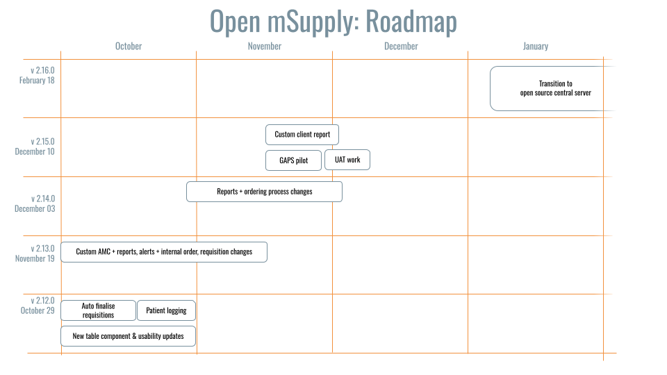

+++
title = "Road Map Atual"
description = "Road Map do Open mSupply."
date = 2022-11-10T18:20:00+00:00
updated = 2022-11-10T18:20:00+00:00
draft = false
weight = 20
sort_by = "weight"
template = "docs/page.html"
ai_generated = true

[extra]
toc = true
+++

Este road map será atualizado aproximadamente uma vez a cada seis semanas.
Cobre apenas o nosso fluxo de trabalho imediato comprometido. A nossa lista de funcionalidades planeadas é muito maior.

### Road map

### Funcionalidades planeadas

| Área                   | Transação                              | Funcionalidade / Capacidade                                                                                                                                    |
| ---------------------- | ---------------------------------------- | ------------------------------------------------------------------------------------------------------------------------------------------------------- |
| QUANTIFICAÇÃO         | Planeamento da Procura                          | Cálculo baseado em regras do volume estimado de produtos necessários X por nível de distribuição e períodos de tempo definidos pelo utilizador                                    |
| QUANTIFICAÇÃO         | Planeamento do Fornecimento                          |                                                                                                                                                         |
| QUANTIFICAÇÃO         | Planeamento da Procura                          | Editar previsões manualmente                                                                                                                                 |
| AQUISIÇÃO            | Concorrência/Pedido de cotação             | Comprador: criar uma nova concorrência                                                                                                                          |
| AQUISIÇÃO            | Concorrência/Pedido de cotação             | Comprador: publicar concorrência para uma lista de fornecedores                                                                                                        |
| AQUISIÇÃO            | Concorrência/Pedido de cotação             | Comprador: criar pedido eletrónico de cotação (EDI 840)                                                                                            |
| AQUISIÇÃO            | Concorrência/Pedido de cotação             | Comprador: criar preços de referência                                                                                                                      |
| AQUISIÇÃO            | Concorrência/Pedido de cotação             | Fornecedores: podem fazer upload da sua resposta no Open mSupply (portal web)                                                                                       |
| AQUISIÇÃO            | Concorrência/Pedido de cotação             | Comprador: receber manualmente as respostas/cotações dos fornecedores                                                                                             |
| AQUISIÇÃO            | Concorrência/Pedido de cotação             | Comprador: receber automaticamente as respostas/cotações dos fornecedores (portal web)                                                                           |
| AQUISIÇÃO            | Concorrência/Pedido de cotação             | Comprador: receber uma resposta eletrónica a um pedido de cotação (EDI 843 / PEPPOL)                                                                 |
| AQUISIÇÃO            | Concorrência/Pedido de cotação             | Compradores: avaliação das cotações recebidas                                                                                                           |
| AQUISIÇÃO            | Concorrência/Pedido de cotação             | Compradores: selecionar fornecedores preferidos (atribuição)                                                                                                       |
| AQUISIÇÃO            | Concorrência/Pedido de cotação             | Gestão de contratos e subvenções                                                                                                                         |
| AQUISIÇÃO            | Ordens de Compra                          | Criar OC a partir de uma concorrência                                                                                                                                 |
| AQUISIÇÃO            | Ordens de Compra                          | Criar OC Calculada                                                                                                                                    |
| AQUISIÇÃO            | Ordens de Compra                          | Criar OC em Branco                                                                                                                                         |
| AQUISIÇÃO            | Ordens de Compra                          | Criar uma Ordem de Compra eletrónica (EDI 850)                                                                                                           |
| AQUISIÇÃO            | Ordens de Compra                          | Adicionar itens da lista mestra                                                                                                                              |
| AQUISIÇÃO            | Ordens de Compra                          | Categorias de OC                                                                                                                                           |
| AQUISIÇÃO            | Ordens de Compra                          | Atributos da linha de OC                                                                                                                                      |
| AQUISIÇÃO            | Gestão de Fornecedores                        | Criar/Ver/Editar Fornecedores                                                                                                                                |
| AQUISIÇÃO            | Aviso de Expedição Avançado                 | Criar um ASN manual a partir de uma OC                                                                                                                           |
| AQUISIÇÃO            | Aviso de Expedição Avançado                 | Receber um ASN eletrónico (EDI 856)                                                                                                                     |
| AQUISIÇÃO            | Recibos de Mercadorias                            | Imprimir um formulário de recibo de mercadorias (pdf, csv) a partir de uma expedição recebida (quando o status VERIFICADO é confirmado)                                                       |
| AQUISIÇÃO            | Pagamentos                                 | Imprimir um formulário de fatura de fornecedor (pdf, csv) a partir de uma expedição recebida (quando o status VERIFICADO é confirmado)                                                   |
| AQUISIÇÃO            | Pagamentos                                 | Registar pagamentos feitos a fornecedores (a partir de uma fatura de fornecedor)                                                                                             |
| AQUISIÇÃO            | Gerir modelos                         | Capacidade de manter modelos                                                                                                                           |
| AQUISIÇÃO            | Recibo de mercadorias para verificar stock nas OCs      | Criar Recibo de Mercadorias / Expedição Recebida                                                                                                                 |
| AQUISIÇÃO            | Recibo de mercadorias para verificar stock nas OCs      | Adicionar linhas de uma OC a uma Expedição Recebida                                                                                                              |
| AQUISIÇÃO            | Ordens de Compra                          | Todos os aprovadores podem aceder ao sistema para aprovar formulários de aquisição                                                                                            |
| AQUISIÇÃO            | Adicionar notas e processar dispensas            | Capacidade de documentar notas para arquivo e dispensas do processo de aquisição                                                                                       |
| AQUISIÇÃO            | Referenciação                              | Facilitar correspondência de 3 vias para pagamentos de fornecedores (OC, GRN, fatura)                                                                                        |
| AQUISIÇÃO            | Ordens de Compra                          | Notificar alteração de status da OC a diferentes utilizadores ou quando a OC completa não é cumprida                                                                      |
| AQUISIÇÃO            | Informação de correspondência                     | Módulos de aquisição e inventário comunicam dados sobre mercadorias recebidas, OCs e listas mestras entre si                                             |
| AQUISIÇÃO            | Gerar Nota de Entrega                   | Gerar Nota de Entrega e Guia/Lista de Embalagem                                                                                                         |
| RECEÇÃO              | Expedições Recebidas (ex Faturas de Fornecedor) | Mostrar qualquer diferença entre quantidades encomendadas (req ou OC) e quantidades notificadas                                                                   |
| RECEÇÃO              | Expedições Recebidas (ex Faturas de Fornecedor) | Notificar partes apropriadas de discrepâncias                                                                                                             |
| RECEÇÃO              | Expedições Recebidas (ex Faturas de Fornecedor) | Mostrar os requisitos de armazenamento baseados na quantidade expedida volume bruto                                                                                 |
| RECEÇÃO              | Expedições Recebidas (ex Faturas de Fornecedor) | Mostrar quantidade de espaço de armazenamento disponível por tipo                                                                                                       |
| RECEÇÃO              | Expedições Recebidas (ex Faturas de Fornecedor) | Sinalizar se espaço de armazenamento insuficiente por tipo                                                                                                              |
| RECEÇÃO              | Expedições Recebidas (ex Faturas de Fornecedor) | Digitalização de código de barras para receção de mercadorias                                                                                                                    |
| RECEÇÃO              | Expedições Recebidas (ex Faturas de Fornecedor) | Sinalizar discrepâncias comparadas com a expedição recebida                                                                                                    |
| RECEÇÃO              | Expedições Recebidas (ex Faturas de Fornecedor) | Registar danos, discrepância, incompatibilidade de lote, indicador e informação de variação para itens de linha individuais                                              |
| RECEÇÃO              | Expedições Recebidas (ex Faturas de Fornecedor) | Reportar danos e discrepâncias a indivíduos apropriados                                                                                             |
| RECEÇÃO              | Expedições Recebidas (ex Faturas de Fornecedor) | Atribuir um operador a uma Expedição Recebida para arrumar stock recebido                                                                               |
| RECEÇÃO              | Expedições Recebidas (ex Faturas de Fornecedor) | App de arrumação: carregar a lista de itens da expedição recebida e instruções para arrumação.                                                                       |
| RECEÇÃO              | Expedições Recebidas (ex Faturas de Fornecedor) | Mostrar condições de armazenamento para itens (ex. controlado por temperatura)                                                                                       |
| RECEÇÃO              | Expedições Recebidas (ex Faturas de Fornecedor) | Mostrar localização de armazenamento padrão para cada item                                                                                                          |
| RECEÇÃO              | Expedições Recebidas (ex Faturas de Fornecedor) | Propor espaço/posições para cada item de stock baseado em regras definidas (ex. disponibilidade de espaço atual, baseado na categoria ABC)                               |
| RECEÇÃO              | Expedições Recebidas (ex Faturas de Fornecedor) | Imprimir etiqueta de palete/prateleira especificando status das mercadorias, se apropriado                                                                                       |
| GESTÃO DE INVENTÁRIO   | Localizações                                | Definir hierarquia de localizações de armazenamento                                                                                                                      |
| GESTÃO DE INVENTÁRIO   | Localizações                                | Definir condições de armazenamento (volume, restrições de item, restrições de uso, etc...)                                                                         |
| GESTÃO DE INVENTÁRIO   | Localizações                                | Registar status de condições congeladas                                                                                                                         |
| GESTÃO DE INVENTÁRIO   | Itens - Movimento de Stock e Expiração        | Registar status VVM                                                                                                                                       |
| GESTÃO DE INVENTÁRIO   | Itens - Dados mestres                      | Definir condições de limiar de temperatura por produto, conforme apropriado                                                                                        |
| GESTÃO DE INVENTÁRIO   | Itens - Movimento de Stock e Expiração        | Alertar condições fora do limiar                                                                                                                      |
| GESTÃO DE INVENTÁRIO   | Itens - Movimento de Stock e Expiração        | Mostrar e transmitir alertas e notificações para expirações pendentes                                                                                      |
| GESTÃO DE INVENTÁRIO   | Itens - Movimento de Stock e Expiração        | Mostrar e transmitir alertas e notificações para stocks esgotados, excesso de stock, stock insuficiente                                                                     |
| GESTÃO DE INVENTÁRIO   | Itens - Dados mestres                      | Sinalizar itens como perigosos, conforme apropriado                                                                                                                 |
| GESTÃO DE INVENTÁRIO   | Contagem de Stock                                | Filtrar o stock a ser incluído: por atributos de item (categoria, departamento, data de expiração, etc...)                                                         |
| GESTÃO DE INVENTÁRIO   | Contagem de Stock                                | Imprimir folhas de contagem de stock (formato CSV)                                                                                                                     |
| GESTÃO DE INVENTÁRIO   | Contagem de Stock                                | App de contagem de stock: carregar a folha de contagem de stock num dispositivo móvel                                                                                              |
| GESTÃO DE INVENTÁRIO   | Contagem de Stock                                | App de contagem de stock: usar um scanner de código de barras/câmara de dispositivo móvel para selecionar o item que o operador está a contar                                                   |
| GESTÃO DE INVENTÁRIO   | Contagem de Stock                                | Digitalização de código de barras para contagem de stock                                                                                                                        |
| GESTÃO DE INVENTÁRIO   | Contagem de Stock                                | Contagem de ciclo                                                                                                                                          |
| GESTÃO DE INVENTÁRIO   | Kits                                     |                                                                                                                                                         |
| GESTÃO DE INVENTÁRIO   | Reabastecimentos de face de picking                  |                                                                                                                                                         |
| GESTÃO DE INVENTÁRIO   | Gestão de Trabalho                        | Criar/editar operadores de armazém                                                                                                                         |
| EXPEDIÇÃO               | Expedição de Saída                        | Criar uma folha de picking a partir de uma expedição de saída alocada                                                                                                  |
| EXPEDIÇÃO               | Expedição de Saída                        | Folha de picking: Mostrar localização(ões) atual(is) para itens requisitados                                                                                          |
| EXPEDIÇÃO               | Expedição de Saída                        | Folha de picking: criar folha de picking ordenada por localizações de armazenamento                                                                                                 |
| EXPEDIÇÃO               | Expedição de Saída                        | Folha de picking: Mostrar data de expiração do stock                                                                                                                    |
| EXPEDIÇÃO               | Expedição de Saída                        | App de folha de picking: carregar uma folha de picking num dispositivo móvel.                                                                                                     |
| EXPEDIÇÃO               | Expedição de Saída                        | Embalar Encomenda                                                                                                                                              |
| EXPEDIÇÃO               | Expedição de Saída                        | Embalar Encomenda: Caixa / cartonização                                                                                                                         |
| EXPEDIÇÃO               | Expedição de Saída                        | Imprimir documentos para entrega: lista de embalagem, fatura do cliente, nota de mercadorias recebidas                                                                       |
| TRANSPORTE              | Ordem/pedido de transporte                  | Rascunho de ordem de transporte                                                                                                                                   |
| TRANSPORTE              | Ordem/pedido de transporte                  | Atribuir uma ou múltiplas expedições de saída "picked" à ordem de transporte (mesma viagem ou localização)                                                           |
| TRANSPORTE              | Ordem/pedido de transporte                  | Determinar Carga Útil, Volume e Dimensões                                                                                                               |
| TRANSPORTE              | Ordem/pedido de transporte                  | Selecionar Modo e Tipo de Transporte                                                                                                                     |
| TRANSPORTE              | Ordem/pedido de transporte                  | Determinar requisitos de controlo de temperatura                                                                                                              |
| TRANSPORTE              | Ordem/pedido de transporte                  | Confirmar ordem de transporte                                                                                                                                 |
| TRANSPORTE              | Ordem/pedido de transporte                  | Agendar recursos de transporte                                                                                                                            |
| TRANSPORTE              | Ordem/pedido de transporte                  | Registar/Mostrar instruções de entrega                                                                                                                    |
| TRANSPORTE              | Ordem/pedido de transporte                  | Registar/Mostrar número de rastreamento, veículo, condutor                                                                                                         |
| TRANSPORTE              | Ordem/pedido de transporte                  | Confirmar que as expedições de saída foram carregadas                                                                                                             |
| TRANSPORTE              | Ordem/pedido de transporte                  | Rastrear localização e atualizar ETA                                                                                                                           |
| TRANSPORTE              | Ordem/pedido de transporte                  | Registar histórico de transporte (localização, temperatura)                                                                                                        |
| TRANSPORTE              | Ordem/pedido de transporte                  | Confirmar entrega / imprimir/enviar prova de entrega                                                                                                         |
| TRANSPORTE              | Transportador                                  | Criar/editar Transportadores                                                                                                                                    |
| TRANSPORTE              | Rota                                    | Criar/editar Rotas                                                                                                                                      |
| TRANSPORTE              | Gestão de Frota                         |                                                                                                                                                         |
| REQUISIÇÕES           | Requisição de Pedido Geral (Encomenda Int.) | Sugerir quantidades de encomenda baseadas em registos de pacientes / dados de registo                                                                                       |
| REQUISIÇÕES           | Requisição de Pedido Geral (Encomenda Int.) | estimar necessidades de stock baseadas na agregação de requisições por níveis intermédios                                                                           |
| REQUISIÇÕES           | Requisição de Pedido Geral (Encomenda Int.) | estimar necessidades de stock baseadas em populações-alvo                                                                                                        |
| REQUISIÇÕES           | Requisição de Pedido Geral (Encomenda Int.) | estimar quantidades de necessidades de stock baseadas em previsões estatísticas                                                                                          |
| REQUISIÇÕES           | Requisição de Pedido Geral (Encomenda Int.) | estimar ponto de necessidades de stock baseado em critérios definidos pelo utilizador                                                                                               |
| REQUISIÇÕES           | Requisição de Pedido Geral (Encomenda Int.) | Mostrar níveis de stock atuais (SOH) em todos os níveis relevantes                                                                                               |
| REQUISIÇÕES           | Requisição de Pedido Geral (Encomenda Int.) | Mostrar datas de expiração para stock em mão                                                                                                                  |
| REQUISIÇÕES           | Requisição de Pedido Geral (Encomenda Int.) | Mostrar tempo de entrega para cumprimento da encomenda                                                                                                                  |
| REQUISIÇÕES           | Requisição de Pedido Geral (Encomenda Int.) | Mostrar custo do item no momento em que a requisição é gerada                                                                                                      |
| REQUISIÇÕES           | Requisição de Pedido Geral (Encomenda Int.) | Calcular custo da encomenda no momento em que a requisição é gerada                                                                                                   |
| REQUISIÇÕES           | Requisição de Pedido Geral (Encomenda Int.) | Modelo de requisição intuitivo com menus dropdown                                                                                                     |
| REQUISIÇÕES           | Requisição de Pedido Geral (Encomenda Int.) | Itens requisitados podem ser encaminhados para liberação de armazenamento ou compra                                                                                           |
| DISPENSAÇÃO POR PACIENTE | Prescrição                             | Abreviações                                                                                                                                           |
| DISPENSAÇÃO POR PACIENTE | Prescrição                             | Grupo de Interações Medicamentosas                                                                                                                                 |
| DISPENSAÇÃO POR PACIENTE | Prescrição                             | Pagamentos e recibo / caixa registadora                                                                                                                    |
| DISPENSAÇÃO POR PACIENTE | Prescrição                             | Criar/editar prescritores                                                                                                                                 |
| DISPENSAÇÃO POR PACIENTE | Prescrição                             | Repetições                                                                                                                                                 |
| CADEIA DE FRIO             | Monitorização de temperatura                   | Mostrar e transmite alertas para violação de temperatura no dashboard, definir limiar por item                                                         |
| SINCRONIZAÇÃO                   | Sincronização Carry over                          | https://github.com/openmsupply/open-msupply/issues/608                                                                                                  |
| SISTEMA GERAL         | Permissão de utilizador                          | Construir em acesso variável de utilizador                                                                                                                           |
| SISTEMA GERAL         | Qualquer                                      | Fazer upload de documentos digitalizados                                                                                                                                |
| SISTEMA GERAL         | Qualquer                                      | Capacidade de armazenar contratos e Nota de Mercadorias Recebidas (GRN) no sistema                                                                                  |
| SISTEMA GERAL         | Qualquer                                      | Adicionar notificações quando níveis esperados não são atingidos                                                                                                      |
| DASHBOARDS             | Ver dados nos dashboards                  | Relatórios sobre consumo de stock                                                                                                                            |
| EXPEDIÇÃO               | Expedição de Saída                        | Enviar uma notificação de expedição de saída aprovada                                                                                                       |
| EXPEDIÇÃO               | Expedição de Saída                        | Sistema de aprovação de expedição de saída                                                                                                                    |
| TRANSPORTE              | Folha de dados do veículo                       | Registar para cada veículo com parâmetros-chave (VIN, modelo, matrícula, tipo de combustível, ano do modelo, dados de reg. & número, data de seguro & número da apólice, preço, etc.) |
| TRANSPORTE              | Relatórios                                | Rastrear dados mensais-chave do veículo (# de dias veículo em uso e sob reparação, km conduzidos, leitura do odómetro, custo de combustível, litros de combustível consumidos)             |
| TRANSPORTE              | Relatórios                                | Rastrear dados mensais-chave do gerador (horas de funcionamento, custos de manutenção, combustível consumido)                                                                      |
| TRANSPORTE              | Relatórios                                | Adicionar notificações quando níveis esperados não são atingidos                                                                                                  |
| TRANSPORTE              | Relatórios                                | Rastrear reparações por veículo e gerador (tipo, data, custo, peças sobresselentes & consumíveis usados)                                                              |
| TRANSPORTE              | Interoperabilidade                         | Pode ser integrado com hardware de rastreamento de veículos para capturar km percorridos                                                                                |
| TRANSPORTE              | Geral                                  | Enviar notificações quando documentos-chave estão prestes a expirar (seguro, registo, etc.)                                                                |
| CONCORRÊNCIA                 | Geral                                  | Gerir processo de licitação competitiva                                                                                                                      |
| CONCORRÊNCIA                 | Geral                                  | manter lista de preços fixos para fornecedores preferidos                                                                                                         |
| CONCORRÊNCIA                 | Geral                                  | manter lista padrão de produtos com preços estimados                                                                                                | 