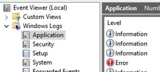

+++
title = "Resolución de problemas"
description = "Resolución de problemas cuando instalamos Open mSupply"
date = 2023-11-10T16:20:00+00:00
updated = 2023-11-10T16:20:00+00:00
draft = false
weight = 50
sort_by = "weight"
template = "docs/page.html"

[extra]
lead = "Si tienes dificultades para configurar o usar la instalación de Open mSupply, ten en cuenta estas actualizaciones y soluciones."
toc = true
top = false
+++


## Si no te puedes conectar al servidor en tu computador
Si has instalado Open mSupply client o la versión independiente en tu computador, pero no te puedes conectar al servidor, intenta los siguientes pasos: 

1. Verifica el nombre del computador. Si estás usando un computador con Windows, se puede encontrar generalmente en el panel de control > Sistema y Seguridad > Sistema. Cambia el nombre del PC para asegurar que no tenga cracteres especiales y no sea muy largo. Reinicia el equipo e intenta conectarte nuevamente
2. Si el paso anterior no funciona, es posible que necesites instalar un adaptador de red virtual en tu equipo. Para hacerlo, sigue las instrucciones que encontrarás en [este enlace](https://learn.microsoft.com/en-us/troubleshoot/windows-server/networking/install-microsoft-loopback-adapter#method-2). 

## El Windows, si el servicio no se inicia

Si el servicio no se inicia en Windowsa, puede ser un poco frustrante, sobre todo poque no siempre se muestran los errores. 
Aquí tienes algunas cosas que puedes probar:
1. Revisa el Visor de eventos en Windows
2. Asegúrate de que el Visor de eventos está habilitado y revisa el archivo del evento de Open mSupply
3. Verifica que los archivos ejecutables de PostgreSQL estén disponibles, si los estás usando
4. Intenta cambiar la cuenta de usuario con la que el servicio inicia sesión

Cualquier error que ocurra mientras el servicio se está iniciando se registrará en el Visor de eventos de Windows. Revisa que el Registro de Aplicaiones para ver si hay entradas de Open mSupply. Luego, se activará el registro estándar; configura el registro a nivel de archivos, como se indica en el archivo `example.yaml`, e intenta iniciar el servicio nuevamente. Los errores aparecerán registrados ahí. 

**Visor de eventos de Windows:**



Otra posible causa es que el servicio no pueda iniciarse por falta de permisos. Intenta cambiar los detalles de inicio de sesión del servicio a una cuenta que tenga derechos de administrador.


Si estás utilizando la versión con PostgreSQL, es posible que el servicio no pueda encontrar los archivos binarios de PostgreSQL. Asegúrate de que la ruta de PostgreSQL esté añadida a la variable de entorno `path` , por ejemplo:
```
C:\Program Files\PostgreSQL\14\lib;
```

## No se puede iniciar sesión

Si has creado un usuario, configurado los permisos y aún sigues viendo un error al intentar iniciar sesión, prueba los siguientes pasos:
* Asegúrate de que el usuario tenga marcado un almacén marcado como 'Almacén predeterminado' en la [pantalla de administración de usuarios](https://docs.msupply.org.nz/admin:managing_users#login_rights_tab)
* Verifica que también esté seleccionada la opción `Iniciar sesión como usuario de escritorio`
* Revisa que el usuario [tenga permisos](https://docs.msupply.org.nz/admin:managing_users#permissions_tabs) para iniciar sesión en un almacén que esté sincronizado con el sistema
* Edita el usuario en mSupply y asegúrate de que no esté bloqueado (si lo está, Open mSupply mostrará un error específico)
* Si usas la versión web, intenta refrescar la página

<div class="note">¡Los nombres de usuario no distinguen entre mayúsculas y minúsculas, pero las contraseñas sí!</div>