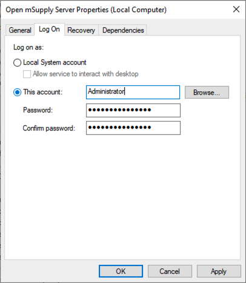

+++
title = "Troubleshooting"
description = "Troubleshooting an Open mSupply Installation"
date = 2023-11-10T16:20:00+00:00
updated = 2023-11-10T16:20:00+00:00
draft = false
weight = 50
sort_by = "weight"
template = "docs/page.html"

[extra]
lead = "If you're having trouble setting up or working with an Open mSupply installation, consider these updates and fixes."
toc = true
top = false
+++

## If you are unable to connect to the server on your machine

If you have installed Open mSupply client or standalone on your machine, but are unable to connect to the server, try the following steps:

1. Check the name of the computer. If you are on a Windows machine, this can generally be found by going through the Control Panel > System and Security > System. Change the PC name to ensure it is 15 characters long or shorter. The name can contain letters, numbers or hyphens, but cannot be too long. Restart the computer and try connecting again.
2. If the step above doesn't work, you may need to install a network loopback adaptor on your computer using [these instructions](https://learn.microsoft.com/en-us/troubleshoot/windows-server/networking/install-microsoft-loopback-adapter#method-2).

## On windows, if the service doesn't start

If the service doesn't start on windows, this can be frustrating! It's hard to know what to change if the service quietly fails.
Here are some things to try:

1. Check the windows event Application log
2. Ensure that logging is enabled and check the Open mSupply log file
3. Check that the postgreSQL binaries are available, if used
4. Try changing the login used by the service

Any errors encountered while the service is starting are logged to the windows event log, check under the Application log to see if there are entries from Open mSupply. After this, the standard logging is started; configure file level logging, as shown in the `example.yaml` file and try to start the service. Any errors will be logged there.

**Windows event viewer:**


Another possibility is that the service cannot start due to permissions. You could try to set the login details for the service to an account which has administrative rights.



If you are running the postgreSQL version, there may be an issue with the service not being able to find the postgreSQL binary files. Ensure that you have the postgreSQL path added to the `path` environment variable: e.g.

```
C:\Program Files\PostgreSQL\14\lib;
```

## Unable to login

If you have created a user, configured permissions, and are still getting an error when trying to login, here are some steps to try:

- Ensure that the user has a store checked as 'Default store' in the mSupply [user administration screen](https://docs.msupply.org.nz/admin:managing_users#login_rights_tab)
- Check that the user also has `Login as Desktop user` checked
- Check that the user [has permission](https://docs.msupply.org.nz/admin:managing_users#permissions_tabs) to login to a store which is part of the sync site
- Edit the user in mSupply and check that the user isn't blocked ( you'll see a specific error relating to this in Open mSupply )
- Try refreshing the page if you are using the web version

<div class="note">Usernames are not case-sensitive, but passwords are!</div>
