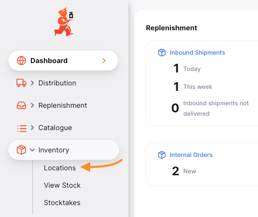
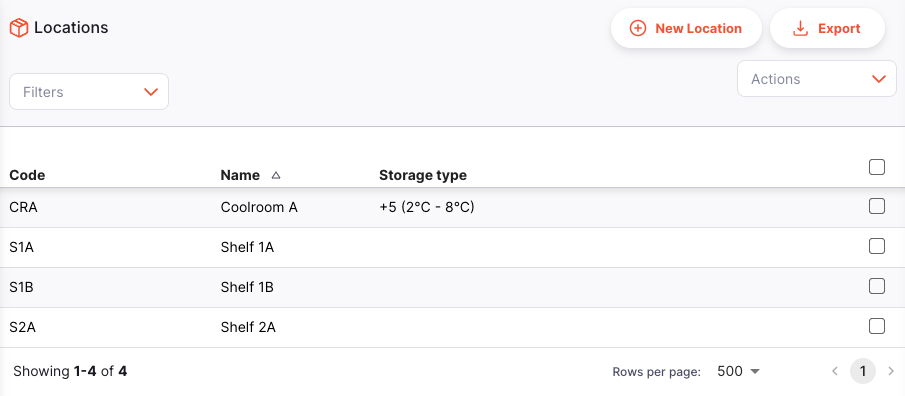
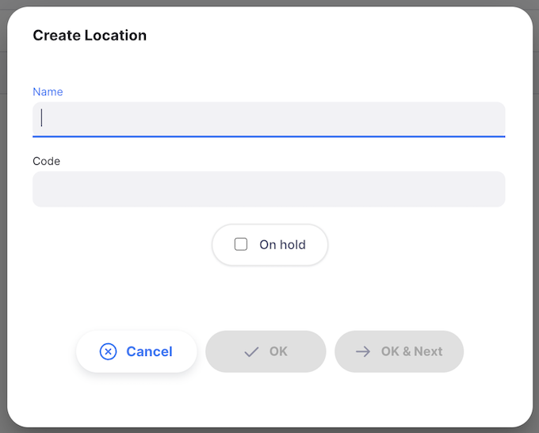

+++
title = "Ubicaciones"
description = "Gestionar las ubicaciones de almacenamiento"
date = 2023-05-12T18:20:00+00:00
updated = 2023-05-12T18:20:00+00:00
draft = false
weight = 1
sort_by = "weight"
template = "docs/page.html"

[extra]
lead = "Ver y gestionar las ubicaciones de almacenamiento"
toc = true
top = false
+++

Llevar un registro de dónde se encuentra el inventario en tu almacén es una parte importante de las buenas prácticas de gestión de almacenes. No querrás perder tiempo y energía buscando inventario por todo el almacén cuando mSupply puede decirte exactamente dónde está.

Las ubicaciones en mSupply son los lugares donde almacenas el inventario.

## Ver las ubicaciones de tu almacén

Para ver las ubicaciones de almacenamiento de tu almacén, ve a `Invenario` > `Ubicaciones` en el panel de navegación:

Verás una lista de tus ubicaciones de almacenamiento:

## Buscar una ubicación específica

Puedes filtrar la lista por nombre de ubicación o por estado de espera.

## Crear una nueva ubicación

Para crear una nueva ubicación, haz clic en el botón `Nueva Ubicación` en la esquina superior derecha de la pantalla:

Se abrirá una ventana como esta:

1. **Nombre**: Ingresa el nombre de la nueva ubicación.
2. **Código**: Código: Ingresa un código para la nueva ubicación
3. **En espera** (casilla de verificación): Si marcas esta casilla, los productos en esta ubicación no podrán seleccionarse para entregarse a los clientes. Los productos pueden moverse hacia y desde la ubicación, pero no se pueden emitir desde esta ubicación.

Poner una ubicación en espera puede ser útil si:
  
- El inventario necesita permanecer sin ser entregado hasta completar una inspección/aprobación (por ejemplo, cuarentena o bienes bajo fianza).
  
- El inventario es una cantidad a granel con la misma fecha de caducidad que otro lote en una ubicación diferente desde la cual deseas emitir productos. Puedes usar esta función para forzar que mSupply siempre sugiera emitir el inventario desde la ubicación "de emisión" en lugar de esta ubicación "de almacenamiento a granel". Cuando termines de emitir productos desde la ubicación "de emisión" y desees emitir productos desde la ubicación "de almacenamiento a granel", deberás desmarcar la opción de espera en esta ubicación o mover el inventario (completo o dividido) a otra ubicación.

## Editar una ubicación

Para editar una ubicación, simplemente haz clic en una de la lista de ubicaciones.

## Eliminar una ubicación

Para eliminar una ubicación:

1. Marca la casilla de la ubicación que deseas eliminar en la lista de ubicaciones.
2. Haz clic en el menú desplegable `Seleccionar` y selecciona `Eliminar línea seleccionada`
