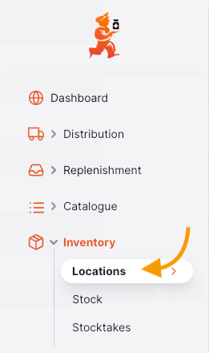
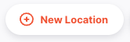
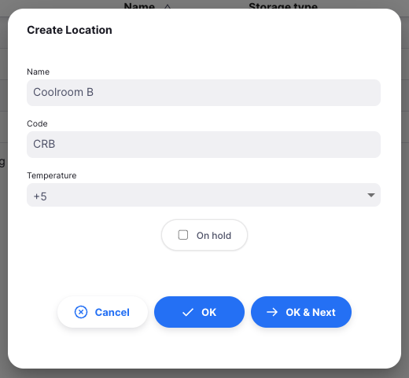

+++
title = "Emplacements"
description = "Gérer vos emplacements"
date = 2022-03-19T18:20:00+00:00
updated = 2022-03-19T18:20:00+00:00
draft = false
weight = 1
sort_by = "weight"
template = "docs/page.html"

[extra]
lead = "Consulter et gérer vos emplacements de stockage"
toc = true
top = false
+++

Identifier et nommer l'endroit où se trouve le stock dans votre dépôt est une partie importante des bonnes pratiques d'entrepôsage. Vous ne voulez pas avoir à parcourir tout votre dépôt pour trouver du stock, perdre du temps et de l'énergie alors que mSupply peut vous dire exactement où il se trouve !

Les emplacements dans mSupply sont les espaces aménagés où vous rangez le stock. 

## Consulter les emplacements de votre dépôt

Pour consulter les emplacements de votre dépôt, allez à `Gestion des stocks` > `Emplacements` dans le panneau de navigation à gauche: 

Vous verrez afficher la liste des emplacements de votre dépôt: 

## Ajouter un nouvel emplacement

Pour ajouter un nouvel emplacement, cliquez sur le boutton `Nouvel Emplacement` dans le coin supérieur droit de votre écran:

Une fenêtre comme celle ci-dessous s'ouvre: 

1. **Nom**: Entrez le nom de l'emplacement
2. **Code**: Entrez un code pour le nouvel emplacement
3. **En Attente** (case à cocher): Si vous cochez cette case, les stocks dans cet emplacement ne peuvent être servis aux clients. Le stock peut entrer et sortir de cet emplacement mais ne peut être directement destiné à un client. 

Mettre un emplacement En Attente peut être utile si: 
  
- Le stock doit être empêché d'être servi jusqu'à une inspection / approbation (par exemple, quarantaine ou sous caution)
  
- Le stock est une quantité en vrac avec la même date d'expiration qu'une autre ligne de stock dans un autre emplacement à partir duquel vous souhaitez que le stock soit servi. Vous pouvez utiliser cette fonctionnalité pour forcer mSupply à toujours suggérer de sortir le stock de cet article à partir de l'emplacement "d'émission" plutôt que de cet emplacement "en vrac". Lorsque vous avez fini de sortir du stock à partir de l'emplacement « d'émission », et vous souhaitez émettre le stock qui se trouve dans l'emplacement "en vrac", vous devrez soit retirer l'emplacement "en vrac" de l'attente, soit déplacer tout ou partie (diviser) le stock de l'emplacement "en vrac" vers un emplacement « d'émission ».

## Modifier un nouvel emplacement

Pour modifier un emplacement, cliquez simplement sur une ligne de la liste des emplacements. 

## Supprimer un emplacement

Pour supprimer un emplacement:
1. Cochez la case de l'emplacement que vous souhaitez supprimer dans la liste des emplacements
2. Cliquez sur le menu déroulant `Sélectionner` et sélectionnez `Supprimer la ligne sélectionnée`