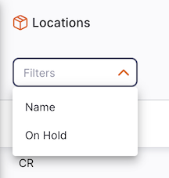

+++
title = "Locations"
description = "Manage your storage location"
date = 2023-05-12T18:20:00+00:00
updated = 2023-05-12T18:20:00+00:00
draft = false
weight = 1
sort_by = "weight"
template = "docs/page.html"

[extra]
lead = "View and manage your storage locations"
toc = true
top = false
+++

Keeping track of where stock is in your store is an important part of good warehouse practice. You don't want to have to go hunting through your whole store for stock, wasting time and energy when mSupply can tell you exactly where it is!

Locations in mSupply are the places you store stock.

## Viewing your store's locations

To view the storage locations of your store, go to `Inventory` > `Locations` in the navigation panel:

You will see a list of your storage locations:

## Looking for a specific location

You can filter the list by location name or on hold status.

## Creating a new location

To create a new location, tap on the `New Location` button in the top right corner of the screen:

A window like this opens:

1. **Name**: Enter the name of the new location
2. **Code**: Enter a code for the new location
3. **Location type** (optional): Select the location type. These [Location Types](https://docs.msupply.org.nz/items:item_locations?s[]=location&s[]=type#location_types) are configured on the mSupply Central Server.
4. **Volume** (optional): Storage volume of the location in m³. `Volume used` shows the total volume of stock currently in the location.
5. **On Hold** (checkbox): If you check this box, then goods in this location cannot be selected for issue to customers. Goods can be moved in to, and out, of the location but they cannot be issued from that location.

Putting a location on hold can be useful if:
  
- The stock needs to be kept from being issued until some inspection / approval (e.g. quarantine or under bond)
  
- The stock is a bulk quantity with the same expiry date as another stock line in another location from which you want stock issued. You can use this feature to force mSupply to always suggest issuing stock of this item from the 'issue' location rather than this 'bulk' location. When you have finished issuing stock from the 'issue' location, and you want to issue the stock that is in the 'bulk' location, you will need to either take the 'bulk' location off hold, move all stock or some of it (split) from the 'bulk' location into another location.

## Editing a new location

To edit a location, simply tap on one in the location list.

## Deleting a location

To delete a location:

1. Select location that you want to delete using the checkbox on the left hand side of the list
2. The `Actions` footer will display at the bottom of the screen when a location is selected. It will display the number of locations selected and the actions which can be taken. Click `Delete`

## Assigning locations to stock

Stock can be assigned to a location when receiving or adjusting stock (i.e. during an Inbound Shipment, or during a Stocktake).

When doing so, you'll be able to filter the locations based on available volume, so you can easily find a location that has enough space for your stock:

Also note that items can have a [restricted location type](https://docs.msupply.org.nz/items:item_basics:tab_storage?s[]=restricted&s[]=location&s[]=type#restricted_to) configured. When selecting a location for these items, only locations with the same type will be shown in the picker.
