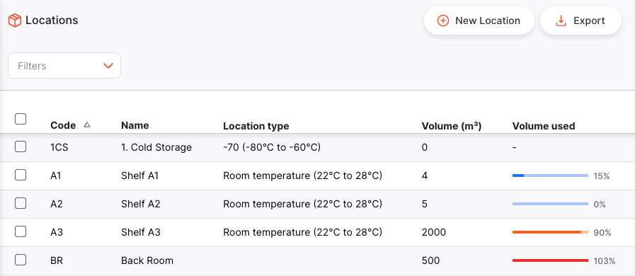
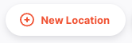
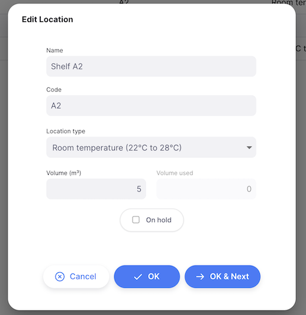

+++
title = "Localizações"
description = "Gerencie suas localizações de armazenamento"
date = 2023-05-12T18:20:00+00:00
updated = 2023-05-12T18:20:00+00:00
draft = false
weight = 1
sort_by = "weight"
template = "docs/page.html"

[extra]
lead = "Veja e gerencie as localizações de armazenamento"
toc = true
top = false
+++

Acompanhar onde está o stock na sua loja é uma parte importante das boas práticas de armazém. Não quer ter de procurar stock em toda a loja, desperdiçando tempo e energia, quando a mSupply pode dizer-lhe exatamente onde está!

Os locais no mSupply são os locais onde armazena stock.

## Visualizar os locais da sua loja

Para visualizar os locais de armazenamento da sua loja, aceda a `Inventário` > `Locais` no painel de navegação:

Verá uma lista dos seus locais de armazenamento:

## Procurar um local específico

Pode filtrar a lista por nome do local ou estado de espera.

## Criação de um novo local

Para criar um novo local, toque no botão `Novo local' no canto superior direito do ecrã:

Uma janela como esta é aberta:

1. **Nome**: Introduza o nome do novo local
2. **Código**: Introduza um código para o novo local
3. **Temperatura** (opcional): Selecione o intervalo de temperatura de armazenamento. Estas opções estão configuradas como [Tipos de localização](https://docs.msupply.org.nz/items:item_locations?s[]=location&s[]=type#location_types) no mSupply Central Server.
4. **Em espera** (caixa de seleção): Se assinalar esta caixa, as mercadorias neste local não poderão ser selecionadas para emissão aos clientes. As mercadorias podem ser movimentadas para dentro e para fora do local, mas não podem ser emitidas a partir do mesmo.

Colocar um local em espera pode ser útil se:
  
- O stock necessita de ser mantido fora de circulação até alguma inspeção/aprovação (por exemplo, quarentena ou sob fiança)
  
- O stock é uma quantidade em massa com a mesma data de validade de outra linha de stock noutro local de onde pretende que o stock seja emitido. Pode utilizar esta funcionalidade para forçar o mSupply a sugerir sempre a emissão de stock deste artigo do local de "emissão" em vez deste local de "a granel". Quando terminar de emitir ações do local de "emissão" e quiser emitir as ações que estão no local de "massa", será necessário retirar o local de "massa" da espera ou mover todas as ações ou algumas delas (dividir) do local de "massa" para outro local.

## Editar um novo local

Para editar um local, basta tocar num da lista de locais.

## Apagar um local

Para eliminar um local:

1. Selecione o local que pretende eliminar utilizando a caixa de seleção do lado esquerdo da lista
2. O rodapé `Ações` será apresentado na parte inferior do ecrã quando um local for selecionado. Irá exibir o número de locais selecionados e as ações que podem ser tomadas. Clique em `Apagar`

