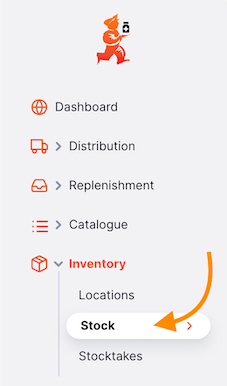
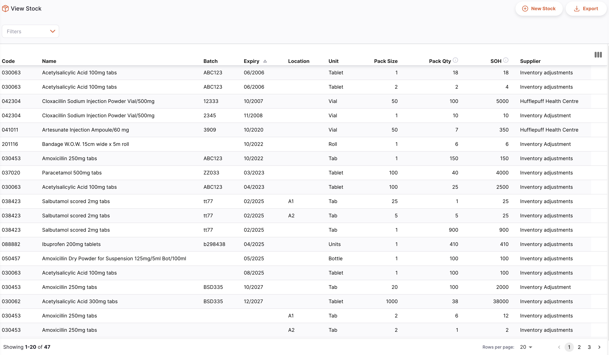
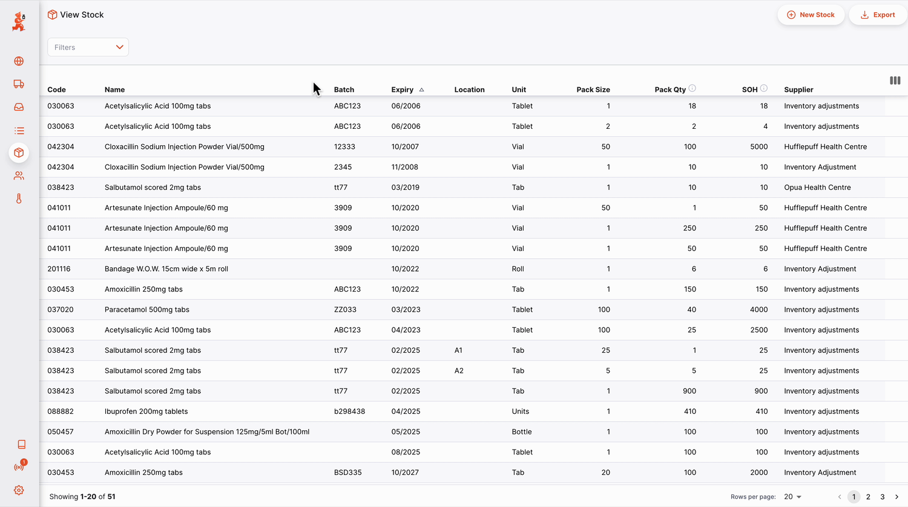

+++
title = "Inventario"
description = "Ver el Inventario"
date = 2022-03-19T18:20:00+00:00
updated = 2022-03-19T18:20:00+00:00
draft = false
weight = 62
sort_by = "weight"
template = "docs/page.html"

[extra]
toc = true
top = false
+++

Una de las tareas más importantes pero más fáciles en mSupply es verificar cuánto stock tienes disponible. Cuando creas una salida y agregas un artículo, mSupply te informará si tienes suficiente stock. Pero en muchas otras ocasiones, es posible que desees verificar rápidamente, y es muy sencillo hacerlo.

## Ver el Inventario

En el panel de navegación, ve a `Inventario` y toca en el submenú `Stock`:

Se muestra una lista de tu inventario:

La lista se divide en 8 columnas:

- **Código**: Este es el código asignado a este artículo en mSupply
- **Nombre**: Este es el nombre por el que mSupply se referirá al artículo
- **Lote**: Número de lote de la línea de stock
- **Caducidad**: Fecha de caducidad del lote
- **Ubicación**: Donde se almacena el artículo en tu almacén
- **Unidad**: La unidad que utilizas para este artículo
- **Tamaño del paquete**: Número de unidades por paquete
- **Cantidad de paquetes**: Número de paquetes disponibles en tu almacén
- **SOH**: La cantidad total de stock en mano, en número de paquetes
- **Proveedor** Muestra la fuente de este artículo de stock

## Buscando un artíuclo específico

Puedes filtrar la lista por nombre o código del artículo. Esto puede ser útil si buscas un artículo en particular.

Escribe parte del nombre o código del artículo en el campo `Ingresar código o nombre del artículo`:

