+++
title = "Stock"
description = "Stock"
date = 2022-03-19T18:20:00+00:00
updated = 2022-03-19T18:20:00+00:00
draft = false
weight = 62
sort_by = "weight"
template = "docs/page.html"

[extra]
toc = true
top = false
+++

L'une des tâches les plus importantes — mais aussi les plus simples — dans mSupply est de vérifier la quantité de stock disponible. Lorsque vous créez une Livraison Sortante et ajoutez un article, mSupply vous indique si vous avez suffisamment de stock. Mais à bien d'autres moments, vous pouvez avoir besoin de vérifier rapidement, et c'est très simple à faire.

## Consulter le stock

Dans le panneau de navigation, allez dans `Gestion des stocks` et appuyez sur le sous-menu `Stock` :

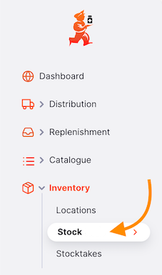

Une liste détaillée de votre inventaire apparaît :

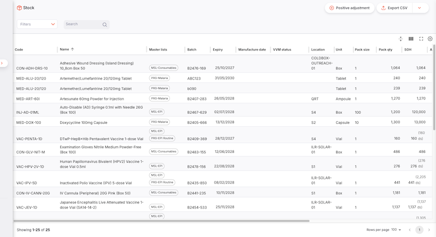

| Colonne                       | Description                                                                                                                                                                                        |
| :---------------------------- | :------------------------------------------------------------------------------------------------------------------------------------------------------------------------------------------------- |
| **Code**                      | Code assigné à cet article dans mSupply                                                                                                                                                            |
| **Nom**                       | C'est le nom par lequel mSupply fera référence à l'article                                                                                                                                         |
| **Lot**                       | Numéro de lot de la ligne de stock                                                                                                                                                                 |
| **Expiration**                | Date d'expiration du lot. Notez que la date s'affiche en rouge s'il reste moins de quatre mois avant la date d'expiration.                                                                         |
| **Statut VVM\***              | 
Indique la viabilité du vaccin.
 <small>\*Activé via la préférence de dépôt [Gérer le statut VVM pour le stock](/docs/manage/facilities/#store-preferences)</small> |
| **Emplacement**               | L'endroit où l'article est stocké dans votre dépôt                                                                                                                                                 |
| **Unité**                     | L'unité de mesure de l'article                                                                                                                                                                     |
| **Taille de conditionnement** | La taille de conditionnement de l'article (=nombre d'unités par conditionnement)                                                                                                                   |
| **Qté conditionnements**      | Quantité totale de stock dans votre dépôt, en conditionnements                                                                                                                                     |
| **Stock total**               | Quantité totale de stock dans votre dépôt, en unités                                                                                                                                               |
| **Stock utilisable**          | Stock en dépôt utilisable (non alloué à la distribution), en unités                                                                                                                                |
| **Coût conditionnement**      | Coût par conditionnement                                                                                                                                                                           |
| **Total**                     | Valeur totale du stock utilisable (`Qté conditionnements x Coût conditionnement`)                                                                                                                  |
| **Fabricant**                 | Le fabricant de cet article en stock. Défini automatiquement lors de la sélection d'une variante d'article, ou peut être saisi manuellement                                                        |
| **Fournisseur**               | Indique la source de cet article en stock                                                                                                                                                          |

### Rechercher un article spécifique

Plusieurs filtres sont disponibles pour vous aider à trouver le stock recherché. Vous pouvez également utiliser la barre de recherche pour filtrer par nom d'article, code ou numéro de lot.

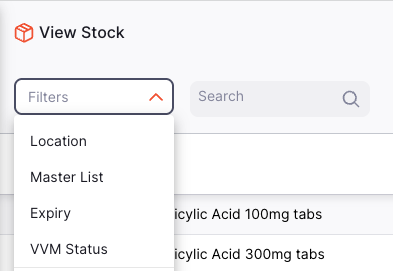

### Exporter le stock

La liste du stock peut être exportée en fichier CSV. Cliquez simplement sur le bouton d'export (à droite, en haut de la page) pour télécharger le fichier :

La fonction d'export téléchargera toutes les lignes de stock, pas seulement la page actuelle, si vous en avez plus de 20.

### Articles non standards

Que se passe-t-il si un fournisseur vous envoie du stock d'un article qui n'est pas actuellement visible dans votre dépôt ?

Dans ce cas :

- La ligne de stock pour cet article apparaît dans votre dépôt et est visible dans la liste Stock
- L'article s'affiche maintenant dans votre liste d'articles
- Vous pouvez émettre ce stock dans une livraison sortante ou une prescription

Notez que l'article ne s'affichera que tant que vous avez du stock disponible — si vous émettez tout le stock, il n'apparaîtra plus dans votre liste d'articles.

Vous ne pouvez pas non plus commander davantage de cet article — il ne peut pas être ajouté à une livraison entrante manuelle ni à une commande interne.

## Créer une nouvelle ligne de stock (ajustement positif)

Il est rare que vous ayez besoin de créer une nouvelle ligne de stock de cette façon. Votre stock devrait être introduit via des Livraisons Entrantes, ou ajusté via un Inventaire.

Pour créer une nouvelle ligne de stock (i.e., un ajustement positif), cliquez sur le bouton `Ajouter du Stock` en haut à droite de votre écran.

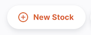

La fenêtre `Détails de la ligne de stock` apparaîtra, où vous pouvez sélectionner l'article pour lequel vous créez cette nouvelle ligne de stock.

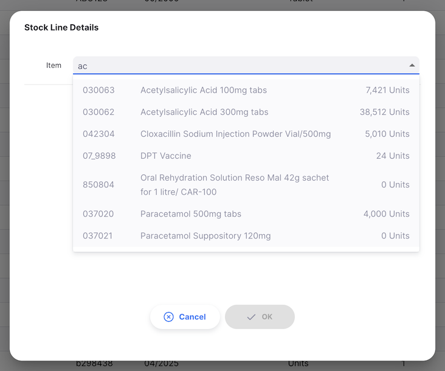

Vous pouvez rechercher un article en :

- Parcourant la liste des articles disponibles
- Saisissant tout ou partie du nom de l'article
- Saisissant tout ou partie d'un code article

Cliquez sur le nom, ou utilisez les touches fléchées pour naviguer jusqu'à l'article souhaité et appuyez sur `Entrée`.

Après avoir sélectionné un article, vous pouvez saisir les informations pour cette nouvelle ligne de stock. Vous devez au minimum fournir une quantité de paquets et une taille de paquet.

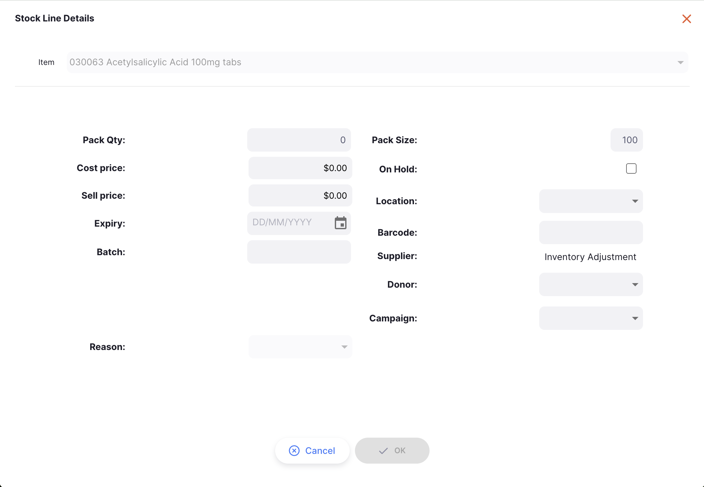

Voir la page [Campagnes](/docs/manage/campaigns/) pour plus de détails sur la configuration des campagnes.

Lors de l'ajout d'un lot, la <code>Taille de conditionnement</code> et le <code>Prix de vente</code> auront par défaut la valeur spécifiée par la <a href="https://docs.msupply.org.nz/items:item_basics:tab_storage?s%5B%5D=preferred&s%5B%5D=pack&s%5B%5D=size#preferred_pack_size">Taille de conditionnement préférée</a> et le <a href="https://docs.msupply.org.nz/items:item_basics:tab_general#default_sell_price_of_preferred_pack_size">Prix de vente par défaut de la taille de conditionnement préférée</a> si ceux-ci ont été spécifiés pour l'article actuel.

Certains champs ne s'affichent que s'ils sont activés :

### Raisons

Si vous avez configuré des [raisons d'ajustement d'inventaire](https://docs.msupply.org.nz/preferences:options?s[]=reasons) sur votre serveur central mSupply, vous devez également saisir une raison lors de la création d'une nouvelle ligne de stock.

Si c'est le cas, le champ de raison sera activé comme ci-dessous :

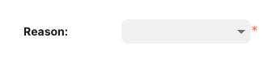

### Variante d'article

Les [Variantes d'Articles](/docs/catalogue/items/#item-variants) seront disponibles pour la sélection si elles sont configurées dans votre système. Lors de la sélection d'une variante, un panneau coulissant affiche les variantes disponibles sous forme de cartes cliquables indiquant le nom de la variante, le fabricant et le type VVM (pour les vaccins). Vous pouvez également choisir `Saisie manuelle` pour saisir les détails manuellement.

Les variantes d'articles incluent des informations de conditionnemnet — si votre nouvelle ligne de stock a une taille de conditionnement correspondante, le champ `Volume par conditionnement` sera automatiquement rempli.

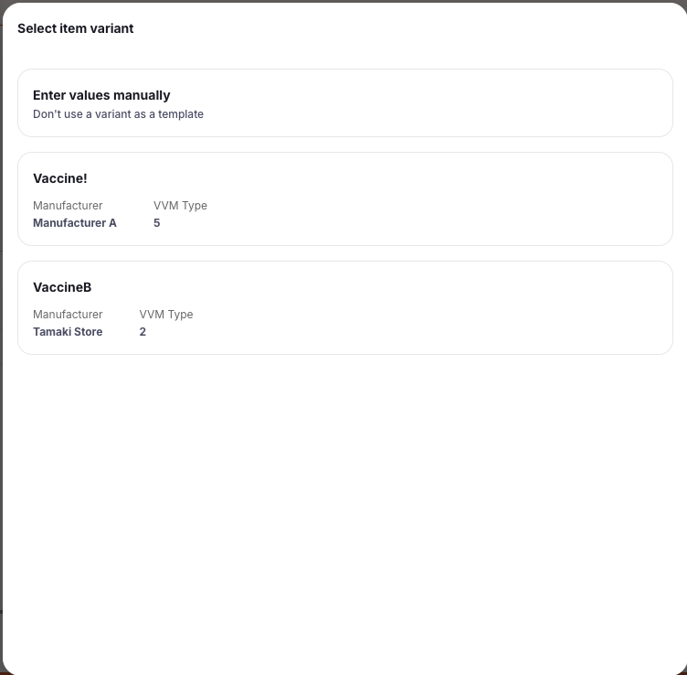

### Fabricant

Vous pouvez consulter et modifier le fabricant d'une ligne de stock. Le fabricant est affiché en lecture seule dans la liste de stock, et peut être modifié depuis la vue détaillée de la ligne de stock. Si une variante d'article est sélectionnée, le fabricant sera automatiquement défini depuis la variante. Sinon, vous pouvez saisir manuellement un fabricant.

### Volume par conditionnement

Spécifiez le volume d'un seul conditionnement en mètres cubes. Cela est utilisé pour calculer l'espace de stockage disponible lorsque le stock est stocké dans un emplacement. Notez que vous devrez également enregistrer le volume de l'emplacement pour voir la [capacité restante](/docs/inventory/locations/#assigning-locations-to-stock) de l'emplacement.

Le champ `Volume total` ci-dessous affiche la valeur calculée du volume utilisé par cette ligne de stock, qui correspond au volume par paquet multiplié par le nombre de conditionnement (`Qté conditionnements`).

### Donateur

Si la préférence globale [Permettre le suivi du stock par donateur](/docs/manage/global-preferences/) est activée, vous pouvez attribuer un donateur à cette ligne de stock.

### Doses

Si la préférence de dépôt [Gérer les vaccins en doses](/docs/manage/facilities/#store-preferences) est activée, vous verrez un champ de doses totales sous les champs de quantité de paquets lorsque vous travaillez avec des articles Vaccin.

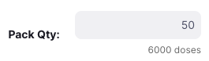

Une fois satisfait des informations du lot, cliquez sur `OK`. Cela enregistrera votre nouvelle ligne de stock en créant un `Ajustement d'inventaire`. Vous serez redirigé vers la page de détails de la ligne de stock.

## Consulter les détails d'une ligne de stock

Pour voir les détails d'un lot spécifique, cliquez sur cette ligne depuis la vue liste `Stock`. Vous serez redirigé vers la page de détails du stock.

### Onglet Détails

Dans l'onglet principal `Détails`, vous pouvez consulter et modifier les propriétés de ce lot.

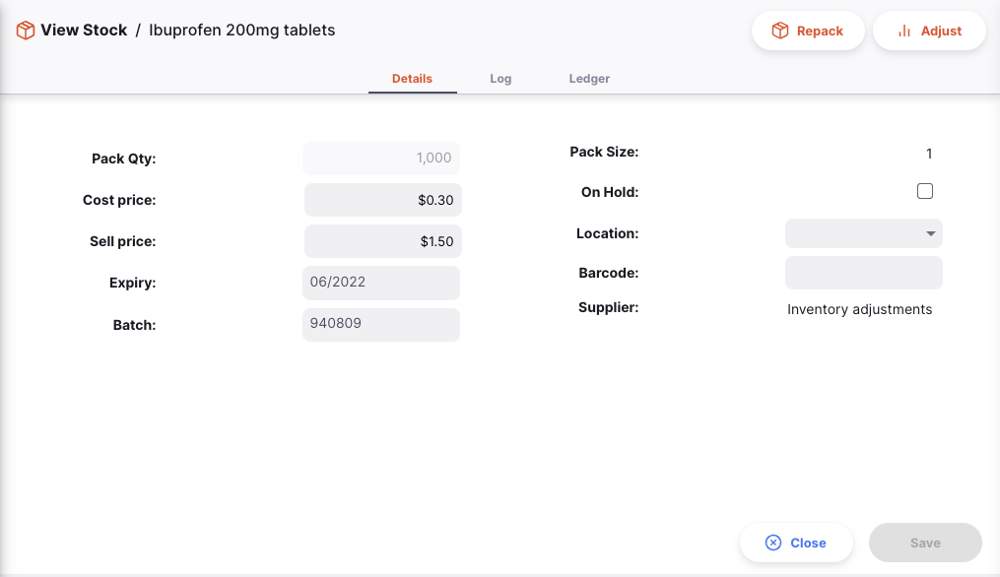

Une fois satisfait de vos modifications, appuyez sur le bouton `Enregistrer` en bas à droite. Vous pouvez également utiliser le bouton `Annuler` pour réinitialiser vos modifications.

Notez que vous ne pouvez pas modifier `Qté conditionnements` ou `Taille de conditionnement` depuis cette vue. Vous pouvez le faire via les fonctions [Reconditionnement](#reconditionner-le-stock) et [Ajustements](#ajuster-le-niveau-de-stock).

`Case à cocher Bloquer` : Pour mettre une ligne de stock en attente, cochez la case Bloquer. Une fois une ligne de stock mise en attente, elle ne peut plus être émise. Elle sera toujours incluse dans le calcul du stock disponible, mais les lignes de stock en attente ne sont pas disponibles pour l'émission dans les livraisons sortantes ni les prescriptions.

#### Mettre à jour le code-barres

Cette fonctionnalité est disponible lors de l'exécution des versions Android ou desktop d'Open mSupply. Un bouton supplémentaire s'affiche lors de la modification d'une ligne de stock :

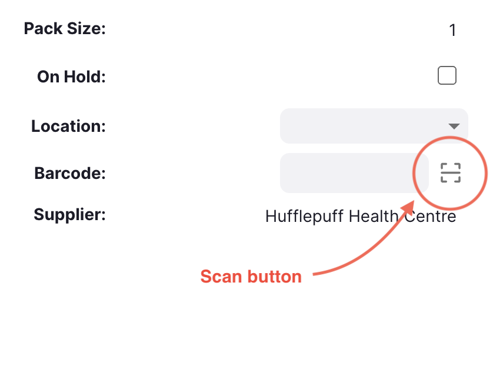

Cliquer dessus démarrera le scanner de codes-barres — si un est connecté, lors de l'exécution sur desktop. Sur Android, l'appareil photo est utilisé. Si un code-barres est scanné avec succès, le champ code-barres est rempli avec la valeur scannée. Si un QR code contenant des informations de lot et d'expiration est scanné, ces champs sont également remplis depuis le code scanné.

Vous pouvez également appuyer simultanément sur les touches 'Ctrl' et 's' pour démarrer le scanner de codes-barres

Une fois le code-barres mis à jour, ce code est associé à l'article pour cette taille de conditionnement particulière. Cet article sera maintenant automatiquement détecté lors de l'ajout d'articles à une Livraison Sortante via un scanner de codes-barres.

Les codes-barres mis à jour de cette façon seront également synchronisés avec d'autres dépôts, ce qui signifie que les codes que vous scannez ici permettront à d'autres dépôts d'ajouter automatiquement ces articles à des Livraisons Sortantes via un scanner de codes-barres.

### Onglet Journal

Pour voir les modifications apportées à cette ligne de stock, cliquez sur l'onglet `Journal`. La liste affiche les détails de chaque modification, ainsi que la date et l'heure de la modification et l'utilisateur qui l'a effectuée.

Journal, affichant les modifications apportées à ce lot

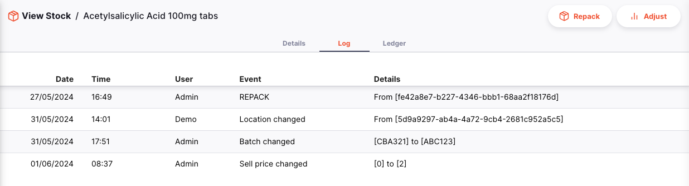

### Onglet Grand Livre

L'onglet `Journal` affiche les modifications relatives au lot, telles que les changements d'emplacement ou de tarification. L'onglet `Grand Livre` affiche les mouvements de stock pour une ligne de stock particulière. Il peut s'agir de résultats d'Livraisons Entrantes/Sortantes, de Retours, de Reconditionnements ou d'Ajustements d'Inventaire.

Grand Livre, affichant les mouvements de stock de ce lot

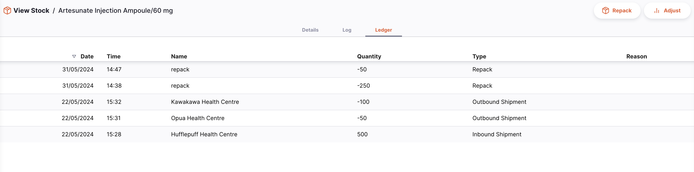

### Onglet Historique VVM

Lors de la consultation d'une ligne de stock pour un vaccin, vous verrez, en plus des onglets listés ci-dessus, un onglet `Historique VVM`. Vous pouvez y consulter la liste des entrées de statut VVM pour cette ligne de stock.

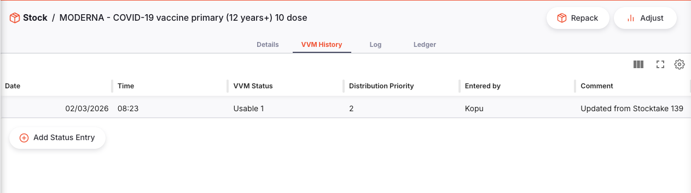

Pour mettre à jour le statut VVM de ce stock, cliquez sur le bouton `Nouveau statut`. Une fenêtre s'ouvre vous permettant de choisir le niveau de statut et d'entrer un commentaire (optionnel).

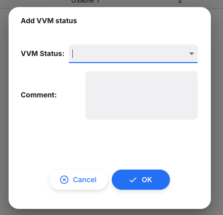

Les statuts VVM sont configurés sur le serveur central mSupply. Consultez la <a href="https://docs.msupply.org.nz/cold_chain_equipment:configure#set_up_vaccine_vial_monitor_vvm_statuses">documentation</a> pour savoir comment procéder.

## Reconditionner le stock

La fonctionnalité de reconditionnement permet de fractionner le stock en tailles de conditionnement plus petites, de le regrouper en tailles plus grandes ou de déplacer tout ou partie d'une ligne de stock vers un nouvel emplacement.

Dans le coin supérieur droit de la page de détails de la ligne de stock, cliquez sur le bouton `Reconditionnement`.

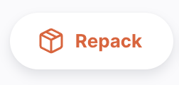

Au départ, la ligne de stock n'aura aucun reconditionnement affiché, vous verrez donc une fenêtre comme celle-ci :

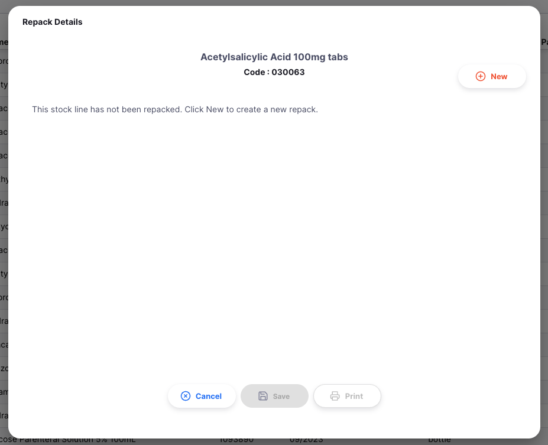

Cliquez sur le bouton `Nouveau` pour démarrer un reconditionnement :

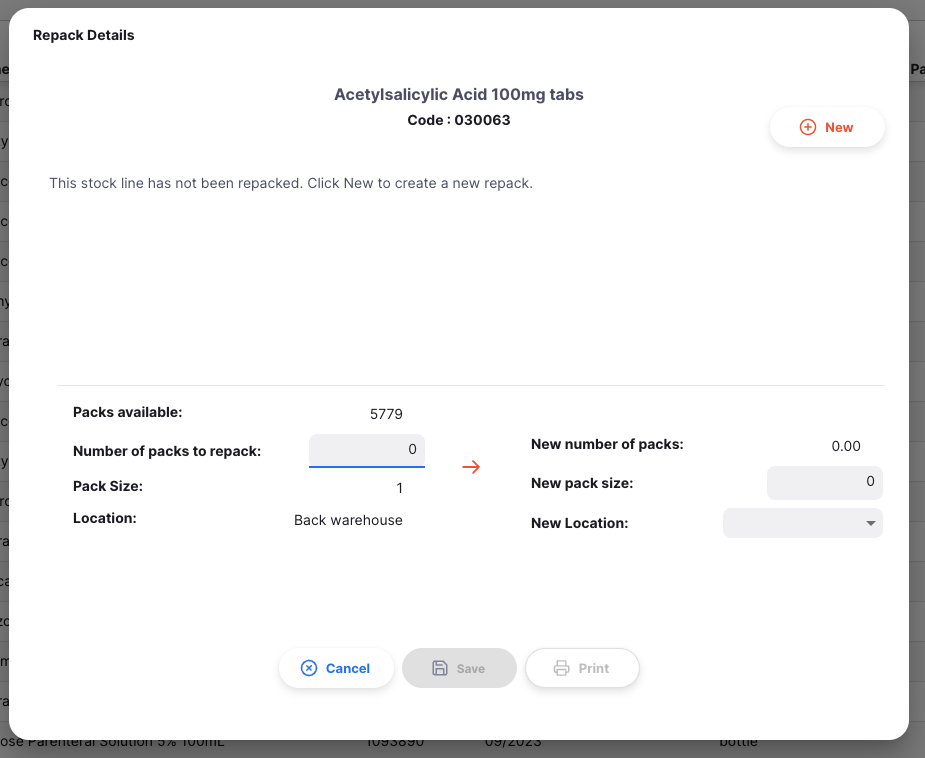

Depuis ici, vous pouvez saisir le nombre de paquets que vous souhaitez reconditionner, jusqu'à un maximum du nombre actuel de conditionnements en stock (représenté par le nombre à côté de `conditionnements disponibles`) — dans ce cas, 5 779 conditionnements sont disponibles.

Vous pouvez ensuite saisir une nouvelle taille de conditionnement, et un emplacement pour le nouveau stock (optionnel). Le `Nouveau nombre de conditionnements` est calculé automatiquement. Cliquez sur `Enregistrer` pour sauvegarder les modifications. Cliquer sur `Imprimer` vous permettra d'imprimer les détails de cette opération de reconditionnement.

Les reconditionnements effectués depuis cet article de stock sont affichés dans une liste :

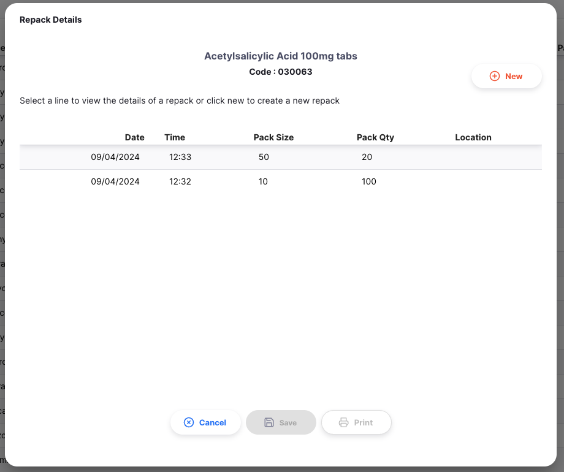

Cliquer sur l'une des lignes affichera les détails du reconditionnement et permettra de l'imprimer :

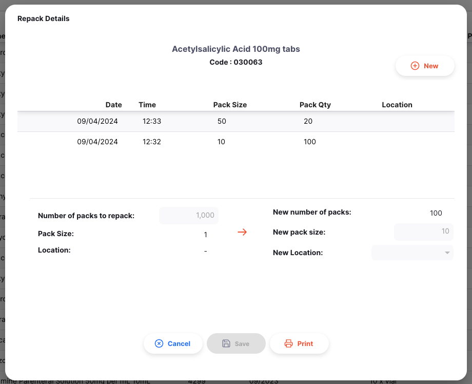

Cliquez sur le bouton `Annuler` à tout moment pour fermer la fenêtre de reconditionnement.

## Ajuster le niveau de stock

En règle générale, les ajustements d'inventaire se font via un Inventaire. L'ajustement d'une seule ligne de stock ne devrait se faire qu'occasionnellement, par exemple pour réduire le niveau de stock si des flacons sont cassés.

La fonctionnalité `Ajuster` permet d'augmenter ou de diminuer le niveau de stock d'un seul lot, sans passer par le processus complet d'inventaire.

Dans le coin supérieur droit de la page de détails de la ligne de stock, cliquez sur le bouton `Ajuster`.

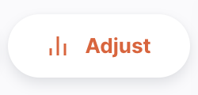

Une nouvelle fenêtre s'ouvrira, où vous pouvez indiquer si vous souhaitez augmenter ou diminuer la quantité de conditionnements, et de combien.

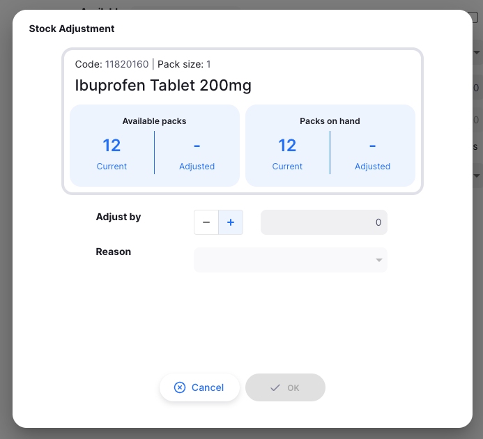

Si vous avez configuré des [raisons d'ajustement d'inventaire](https://docs.msupply.org.nz/preferences:options?s[]=reasons) sur votre serveur central, vous devez également saisir une raison lors de l'ajustement de la quantité de conditionnements.

Si c'est le cas, le champ de raison sera activé comme ci-dessous :

Lorsque vous êtes prêt à ajuster le niveau de stock, cliquez sur le bouton `OK`. Vous verrez alors votre quantité de conditionnements mise à jour dans l'[onglet Détails](#onglet-details), et pourrez consulter l'ajustement dans l'[onglet Grand Livre](#onglet-grand-livre).

Cliquez sur le bouton `Annuler` à tout moment pour fermer la fenêtre d'ajustement.

### Types de raisons

Il existe plusieurs [types de raisons](https://docs.msupply.org.nz/preferences:options?s[]=reasons) configurables dans mSupply. Vous aurez différentes options disponibles selon le type d'ajustement que vous effectuez et le type d'article.

| Ajustement                 | Article              | Type de dépôt        | Types de raisons                            |
| :------------------------- | :------------------- | :------------------- | :------------------------------------------ |
| **Ajout d'inventaire**     | Vaccin ou non-vaccin | Dépôt ou Dispensaire | Ajustement positif d'inventaire             |
| **Réduction d'inventaire** | Non-vaccin           | Dépôt ou Dispensaire | Ajustement négatif d'inventaire             |
|                            | Vaccin               | Dépôt                | Gaspillage de flacon fermé                  |
|                            |                      | Dispensaire          | Gaspillage de flacon fermé et flacon ouvert |
