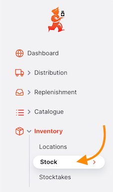
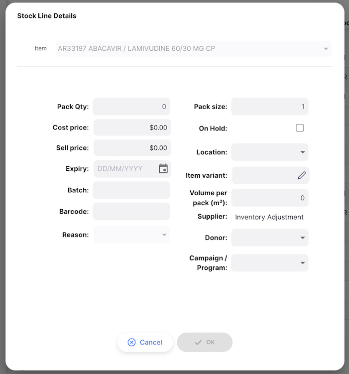
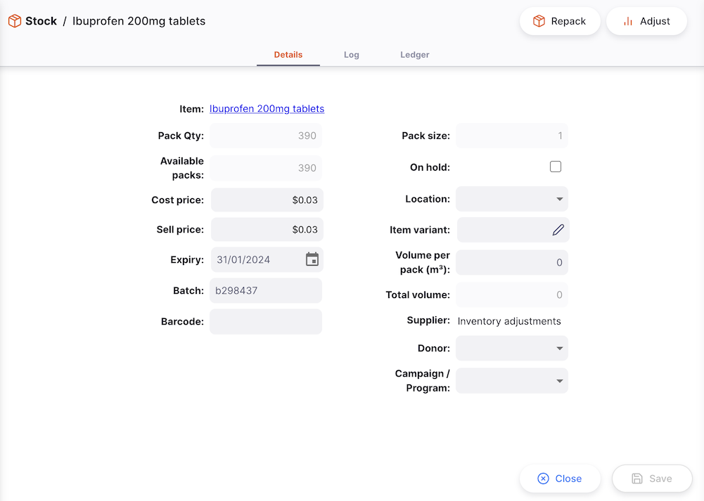

+++
title = "Stock"
description = "View Stock"
date = 2022-03-19T18:20:00+00:00
updated = 2022-03-19T18:20:00+00:00
draft = false
weight = 62
sort_by = "weight"
template = "docs/page.html"

[extra]
toc = true
top = false
+++

One of the most important - but easiest - tasks in mSupply is to check how much stock you have on hand. When you create an Outbound Shipment and add an item, mSupply will tell you if you have enough stock. But at many other times, you might want to quickly check, and it is very simple to do so.

## Viewing stock

In the navigation panel, Go to `Inventory` and tap on the `Stock` submenu:

A detailed list of your inventory appears:

The list is divided into 9 columns:

| Column        | Description                                              |
| :------------ | :------------------------------------------------------- |
| **Code**      | Code assigned to this item in mSupply                    |
| **Name**      | This is the name by which mSupply will refer to the item |
| **Batch**     | Batch number of the stock line                           |
| **Expiry**    | Expiry date of the batch                                 |
| **Location**  | Where the item is being stored in your facility          |
| **Unit**      | The unit of measure for the item                         |
| **Pack Size** | The pack size of the item                                |
| **Pack Qty**  | Number of packs available in your store                  |
| **SOH**       | The total quantity of stock on hand, in number of packs  |
| **Supplier**  | Shows the source of this stock item                      |

### Looking for a specific item

You can filter the list by item name or code, location or by expiry. This can be useful if you're looking for one particular item.

Click on the `Filters` to show the available filters, select an option, for example `Code or Name`, and type as much of an item name or code in the `Code or Name` field:

### Exporting Stock

The list of Stock can be exported to a comma separated file (csv). Simply click the export button (on the right, at the top of the page) to download the file:

The export function will download all stock lines, not just the current page, if you have more than 20 of them.

## Creating a new stock line

It's rare that you should need to create a new Stock line in this way. Your stock should be introduced by Inbound Shipments, or adjusted via a Stocktake.

To create a new stock line, click the `New Stock` button in the top right of your screen.

The `Stock Line Details` window will appear, where you can select the item you are creating this new stock line for.

You can look up an item by:

- Reading through the list of available items
- Typing some or all of the item name
- Typing some or all of an item code

Click on the name, or use the arrow keys to navigate to your desired item and press `Enter`.

After selecting an item, you can enter the information for this new stock line. You must at least provide a pack quantity and pack size.

See the [Campaigns](/docs/manage/campaigns/) page for details of how to configure campaigns.

There are some fields which only show if enabled:

### Reasons

If you have [inventory adjustment reasons](https://docs.msupply.org.nz/preferences:options?s[]=reasons) configured in your central server, then you are also required to enter a reason when creating a new stock line.

If this is the case, the reason input will be enabled as below:

### Donor

If the [Allow tracking of stock by donor](/docs/manage/global-preferences/) global preference is enabled then you can allocate a donor to this stock line.

Once you are happy with the batch information, click `OK`. This will save your new stock line by creating an `Inventory Adjustment`. You will be redirected to the Stock line details page.

## Viewing stock line details

To view the details on a specific batch, click that line from the `View Stock` list view. You will be redirected to the Stock details page.

### Details tab

On the main `Details` tab, you can view and change the properties of this batch.

Once you are happy with your changes, press the `Save` button in the bottom right. You can also use the `Cancel` button to reset your changes.

You'll note that you can't edit `Pack Qty` or `Pack Size` from this view. You can do this via [Repacks](#repacking-stock) and [Adjustments](#adjusting-stock-level).

#### Updating barcode

This feature is available when running either the android or desktop versions of Open mSupply.
There is an additional button shown when editing a stock line:

Clicking this will start the barcode scanner - if one is attached, when running desktop. If running on android, the camera on the device is used.
If a barcode is scanned successfully, then the barcode field is populated with the scanned value. If a QR code which has a batch and expiry information is scanned, then these fields on the stock edit window are also populated from the scanned code.

You can also press the 'control (ctrl)' and 's' keys at the same time to start the barcode scanner

Once you have updated the barcode, this code is associated with the item, for this particular pack size. This item will now be automatically detected when adding items to an Outbound Shipment using a barcode scanner.

Barcodes updated in this way will also synchronised with other stores, which means that codes you scan here will allow other stores to automatically add these items to Outbound Shipments using a barcode scanner.

### Log tab

To see changes made to this stock line, you can click the `Log` tab. The list shows details of each change, along with the date and time of the change and the user that made the change.

Log, showing changes made to this batch

### Ledger tab

The `Log` tab shows changes relating to the batch, such as changes in location or pricing. The `Ledger` tab shows the stock movements for a particular stock line. These could be the result of Inbound/Outbound Shipments, Returns, Repacks or Inventory Adjustments.

Ledger, showing stock movements of this batch

## Repacking stock

The repack feature gives us the ability to break down stock into smaller pack sizes, consolidate it into larger pack sizes or move part or all of a stock line to a new location.

In the top right corner of the stock line detail page, click the `Repack` button.

To begin with, the stock line won't have any repacks showing, so you'll see a window like this:

Click the `New` button to start a repack:

From here, you can enter the number of packs which you'd like to repack, up to a maximum of the current number of packs in stock (represented by the number next to `Packs available`) - in this case there are 5779 packs available.

You can then enter a new pack size, and optionally, enter a location for the new stock. The `New number of packs` is calculated automatically.
Click `Save` to save the changes. Clicking `Print` will allow you to print details of this repack action.

The repacks made from this stock item are shown in a list:

Clicking on one of the lines will show details of the repack, and allow printing of it:

Click the `Cancel` button at any time to close the repack modal.

## Adjusting stock level

Typically, inventory adjustments would be done via a Stocktake. Adjusting a singular stock line should only happen on one-off occasions, such as reducing the stock level if some vials are broken.

The `Adjust` feature gives us the ability to increase or decrease the stock level of a single batch, without needing to go through the full stocktake process.

In the top right corner of the stock line detail page, click the `Adjust` button.

A new window will open, where you can enter whether you would like to increase or decrease the quantity of packs, and by how many.

If you have [inventory adjustment reasons](https://docs.msupply.org.nz/preferences:options?s[]=reasons) configured in your central server, then you are also required to enter a reason when adjusting the pack quantity.

If this is the case, the reason input will be enabled as below:

When you are ready to adjust the stock level, click the `OK` button. You will then see your updated pack quantity in the [Details tab](#details-tab), and can review the adjustment in the [Ledger tab](#ledger-tab).

Click the `Cancel` button at any time to close the adjust modal.

### Reason Types

There are several [reason types](https://docs.msupply.org.nz/preferences:options?s[]=reasons) configurable in mSupply. You'll have different options available depending on the type of adjustment you are making, and the type of item.

| Adjustment              | Item                   | Facility Type       | Reason types                              |
| :---------------------- | :--------------------- | :------------------ | :---------------------------------------- |
| **Inventory addition**  | Vaccine or non-vaccine | Store or Dispensary | Positive Inventory Adjustment             |
| **Inventory reduction** | Non-vaccine            | Store or Dispensary | Negative Inventory adjustment             |
|                         | Vaccine                | Store               | Closed Vial Wastage                       |
|                         |                        | Dispensary          | Closed Vial Wastage and Open Vial Wastage |
