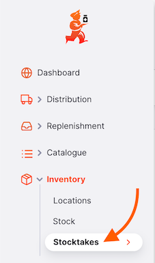
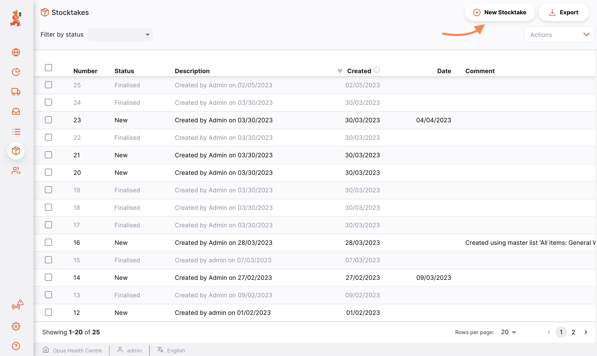
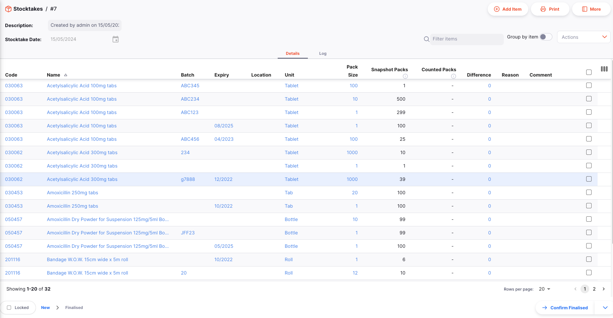
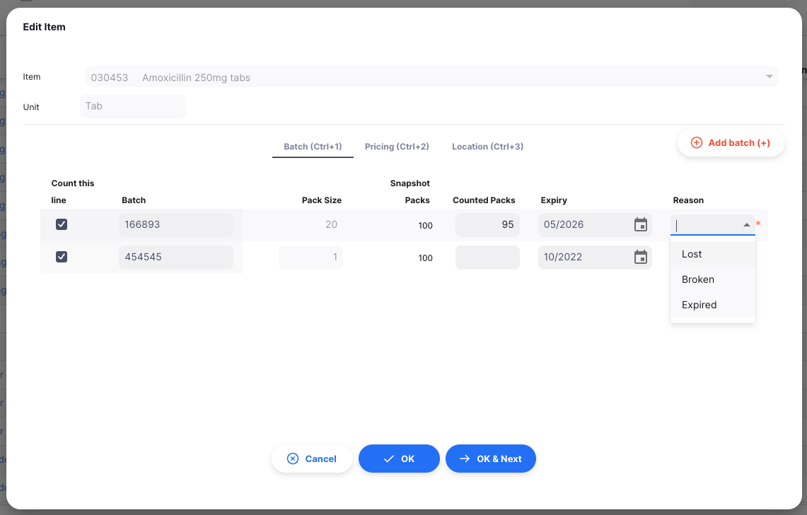
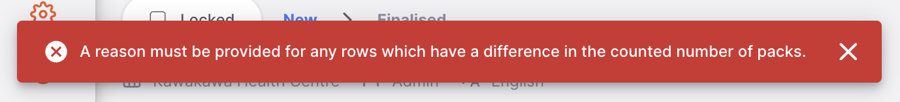

+++
title = "Tomas de Inventario"
description = "Conteo y ajuste de inventario"
date = 2022-03-19T18:20:00+00:00
updated = 2022-03-19T18:20:00+00:00
draft = false
weight = 63
sort_by = "weight"
template = "docs/page.html"

[extra]
lead = "Conteo y ajuste de inventario"
toc = true
top = false
+++

mSupply automáticamente llevará un registro de tus niveles de stock a medida que lo recibas y lo distribuyas. Sin embargo, a veces se ingresan datos incorrectamente o el stock se agota sin que se realice una entrada en el sistema.

Por supuesto, intentamos evitar que esto ocurra, pero si sucede, podemos corregirlo. La forma más fácil de corregir errores es hacer un **Toma de inventario**.

En mSupply, puedes realizar fácilmente un inventario para:

- Todo el inventario
- Un rango limitado de artículos
- A Un solo artículo

## Ver el listado de tomas de inventario

Para ver tus recuentos de stock, ve a `Inventario` y luego a `Tomas de inventario` en el panel de navegación:

Esto muestra una lista de todos tus tomas de inventario:

Por cada toma de inventario puedes ver:

- El **número** de la toma de inventaqrio
- El **estado** de la toma de inventario. Existen dos estados de toma de inventario:
  - _Nuevo_: una toma de inventario en la que te encuentres trabajando
  - _Finalizado_: una toma de inventario que ya se ha llevado a cabo. Ya no la puedes editar.
- Una **descripción** de la toma de inventario (por ejemplo, Toma de inventario de marzo)
- Si lo hay, un **comentario** sobre la toma de inventario
- La **fecha** de la verificación de inventario

No tiene mucho sentido mantener antiguas tomas de inventario con estado = <code>NUEVO</code>, especialmente si estás a punto de crear una que contiene los mismos elementos. De hecho, puede ser bastante peligroso dejar antiguas tomas de inventario con estado  <code>NUEVO</code> en tu sistema. Si ha pasado un tiempo desde que se creó la toma de inventario, es casi seguro que las cantidades de la instantánea y las cantidades reales sean incorrectas. Por razones de limpieza, es una buena práctica eliminar las antiguas tomas de inventario <code>NUEVO</code>.

## Crear una nueva toma de inventario

Empecemos una toma de inventario. Para esto, da clic en el botón `Nueva Toma de Inventario` en la esquina superior derecha.

Aparecerá una ventana, donde puedes optar por crear una toma de inventario basada en elementos de una lista maestra, inventario en una ubicación particula o una toma de inventario vacía:

Haz clic en aceptar cuando hayas seleccionado la opción que deseas.

Luego se creará la toma de inventario y las líneas de stock existentes se utilizarán para poblar los valores de lote, vencimiento, tamaño de paquete y número de instantánea de paquetes. Las líneas se muestran en color azul claro y cambiarán a negro cuando se ingrese un valor para la cantidad contada.

No es posible editar el tamaño del paquete de las filas del inventario que están vinculadas a una línea de inventario existente. Si desea cambiar el tamaño del paquete, deberá eliminar la fila y agregar una nueva fila o filas según sea necesario..

No te preocupes si un elemento falta en tu nueva toma de inventario. Después tendrás la posibilidad de agregar más elementos a tu toma de inventario. 

### Ingresar razones

Si tienes opciones de ajuste de inventario configuradas en su servidor central, se te pedirá que ingreses una razón cuando el `número de paquetes contados` especificado no coincida con el número de paquetes en la toma instantánea.

Por ejemplo, ingresar `100` para la cantidad contada de Salbutamol, agregará un asterisco rojo a la derecha del campo `Razón` y mostrará las razones de ajuste de inventario negativas:

Si intenta guardar la fila del inventario sin ingresar una razón, se mostrará un error:

### Printing Stocktake sheet

Al ver una toma de inventario específica, simplemente haz clic en el botón `Imprimir` que se encuentra en la parte superior derecha de la página.
Al imprimir, se genera un archivo PDF para ti, que se abrirá en una nueva pestaña del navegador. Luego, esto se puede imprimir usando tu navegador haciendo clic en imprimir o utilizando las teclas `control`+`P` (si usas Windows) o`cmd`+`P` en tu teclado (si usas un Mac).

Esto mostrará

- Un menú de posibles informes para que selecciones antes de crear un archivo PDF. Esto ocurrirá si hay más de un informe definido para el tipo de informe `Toma de inventario`
- Creará un archivo PDF de inmediato si solo hay un informe para seleccionar

