+++
title = "Inventaires"
description = "Compter et ajuster le stock."
date = 2022-03-19T18:20:00+00:00
updated = 2022-03-19T18:20:00+00:00
draft = false
weight = 63
sort_by = "weight"
template = "docs/page.html"

[extra]
lead = "Compter et ajuster le stock"
toc = true
top = false
+++

Open mSupply suit automatiquement vos niveaux de stock au fur et à mesure que vous le recevez et le distribuez. Mais parfois, des données sont saisies incorrectement ou du stock sort sans qu'aucune entrée ne soit faite dans le système.

Bien sûr, nous essayons d'éviter cela, mais si cela arrive, nous pouvons effectuer des corrections. La façon la plus simple de maintenir des enregistrements de stock précis dans le système est d'effectuer régulièrement un **Inventaire**.

Dans Open mSupply, vous pouvez facilement effectuer un inventaire pour :

- Un inventaire complet
- Une liste limitée d'articles
- Un seul article

## Consulter les inventaires

Pour consulter vos inventaires, allez dans `Gestion des stocks` puis `Inventaires` dans le panneau de navigation :

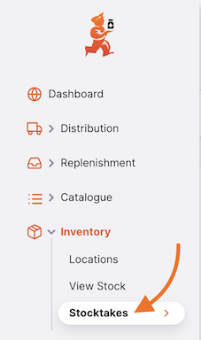

Une liste de tous vos inventaires apparaît :

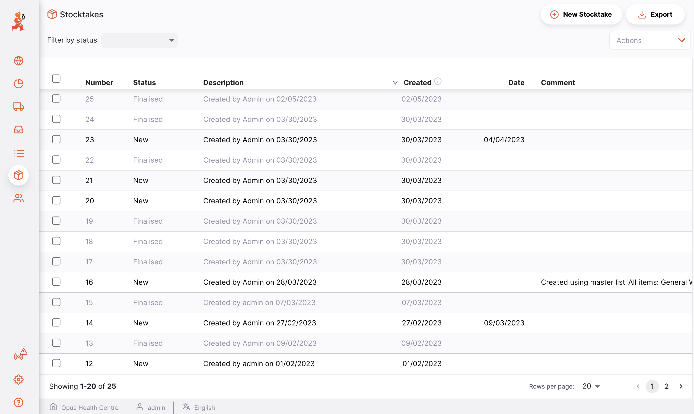

Pour chaque inventaire, vous pouvez voir :

| Colonne         | Description                                                                                                                                              |
| :-------------- | :------------------------------------------------------------------------------------------------------------------------------------------------------- |
| **Numéro**      | Le numéro de l'inventaire                                                                                                                                |
| **Statut**      | Le statut de l'inventaire. _Nouveau_ : un inventaire actuellement actif. _Finalisé_ : l'inventaire a déjà été effectué. Vous ne pouvez plus le modifier. |
| **Description** | La description de l'inventaire (ex. Inventaire de mars)                                                                                                  |
| **Créé**        | La date de création de l'inventaire                                                                                                                      |
| **Date**        | La date à laquelle l'inventaire a été effectué                                                                                                           |
| **Commentaire** | Commentaire sur l'inventaire, le cas échéant                                                                                                             |

Il est peu utile de conserver d'anciens inventaires avec le statut <code>NOUVEAU</code>, et cela peut même être dangereux, surtout si vous êtes sur le point de créer un nouvel inventaire contenant les mêmes articles. Si du temps s'est écoulé depuis la création de l'inventaire, les quantités instantanées et réelles sont presque certainement incorrectes. Pour des raisons de bonne gestion, il est recommandé de supprimer les anciens inventaires <code>NOUVEAU</code>.

## Inventaire initial

Le premier inventaire enregistré dans un dépôt doit être un inventaire initial. Il est conçu pour faciliter la saisie du stock dans votre dépôt dans Open mSupply pour la première fois.

Pour créer un inventaire initial, cliquez sur le bouton Inventaires initiaux dans la page des inventaires.

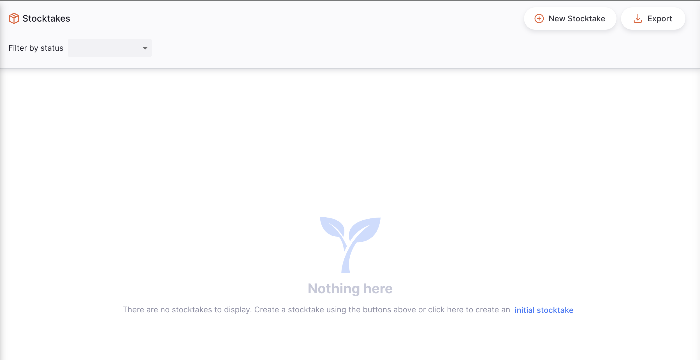

Vous ne pouvez créer un inventaire initial que si aucun inventaire n'a été créé précédemment pour votre dépôt.

Un inventaire initial aura des lignes de remplacement pour tous les articles visibles dans votre dépôt. Comme tous les articles comptés sont ajoutés pour la première fois, la [saisie des raisons](#saisir-les-raisons) n'est pas requise pour cet inventaire.

## Créer un nouvel inventaire

Commençons un nouvel inventaire. Pour ce faire, appuyez sur le bouton `Nouvel Inventaire` dans le coin droit de l'écran.

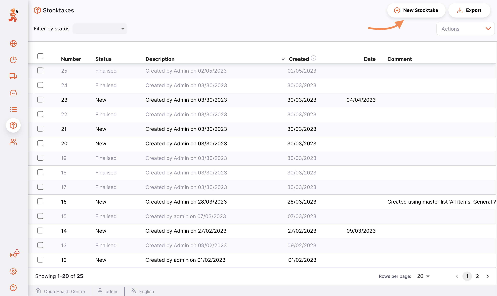

Une fenêtre « Nouvel Inventaire » apparaît.

Ne sélectionner aucune option inclura toutes les lignes de stock avec du stock restant dans le système. Alternativement, sélectionnez le bouton radio « Tous les articles » qui inclura les articles même si aucun stock n'est enregistré dans le système.

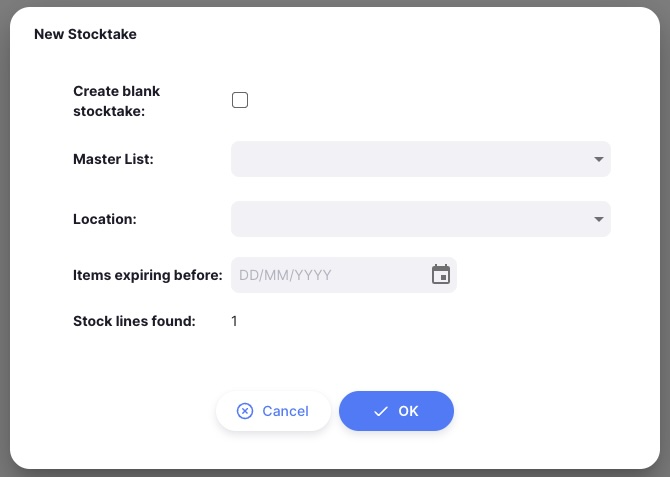

Sélectionner « Créer un inventaire avec filtres » affichera les champs vous permettant de filtrer les lignes de stock par liste maîtresse, emplacement ou date d'expiration.

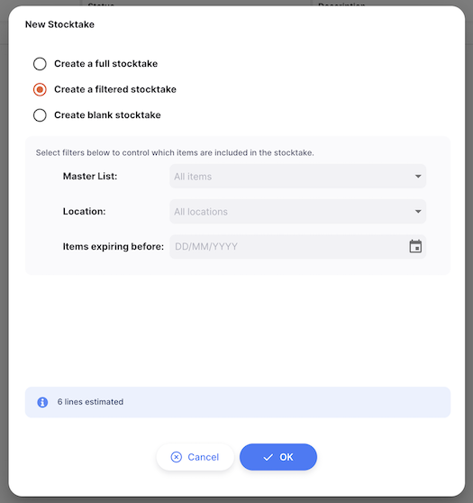

Sélectionner « Créer un inventaire vierge » créera un inventaire sans lignes. Vous pourrez toujours ajouter manuellement des articles individuellement dans l'inventaire créé.

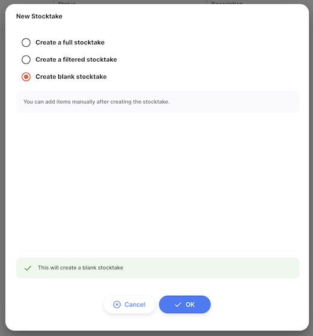

Si la préférence de dépôt <a href="/docs/manage/facilities/#store-preferences">Gérer le statut VVM pour le stock</a> est activée, un filtre de statut VVM sera également disponible.

Cliquez sur OK une fois que vous avez sélectionné les filtres souhaités.

L'inventaire sera alors créé et les lignes de stock seront utilisées pour remplir les valeurs de lot, d'expiration, de taille de conditionnement et de nombre de conditionnements théorique. Les lignes s'affichent en bleu clair et passent en noir lorsqu'une valeur est saisie pour la quantité comptée.

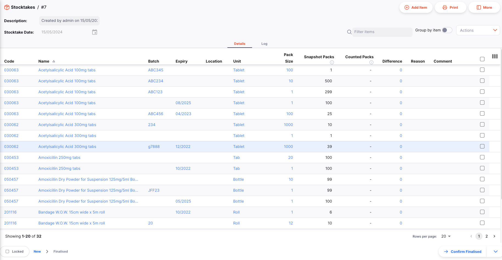

Ne vous inquiétez pas si un article manque dans votre inventaire nouvellement créé. Vous aurez la possibilité d'ajouter d'autres articles à votre inventaire par la suite.

#### Vaccins

Si la préférence de dépôt [Gérer les vaccins en doses](/docs/manage/facilities/#store-preferences) est activée, vous verrez une colonne `Doses par unité`. Pour les lignes d'inventaire d'articles vaccins, le nombre de doses par unité (ex. `Flacon`) est affiché dans cette colonne. La colonne `Différence` affichera également la différence en doses ainsi qu'en conditionnements :

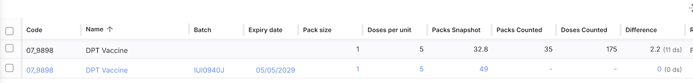

### Saisir les paquets comptés

Pour commencer à saisir des données d'inventaire pour un article, cliquez sur la ligne d'inventaire que vous souhaitez modifier. Une fenêtre apparaît, où vous pouvez saisir le nombre de conditionnements comptés. Vous pouvez également mettre à jour d'autres données depuis cette fenêtre, comme la date d'expiration, la tarification, les informations d'emplacement ou le fabricant pour un lot particulier.

Si des [Variantes d'Articles](/docs/catalogue/items/#item-variants) sont configurées, vous pouvez sélectionner une variante via le panneau de sélection de Variante d'Article, qui affiche les variantes sous forme de cartes cliquables indiquant le nom de la variante, le fabricant et le type VVM (pour les vaccins). La sélection d'une variante définira automatiquement le fabricant. Vous pouvez également choisir `Saisie manuelle` pour saisir un fabricant manuellement.

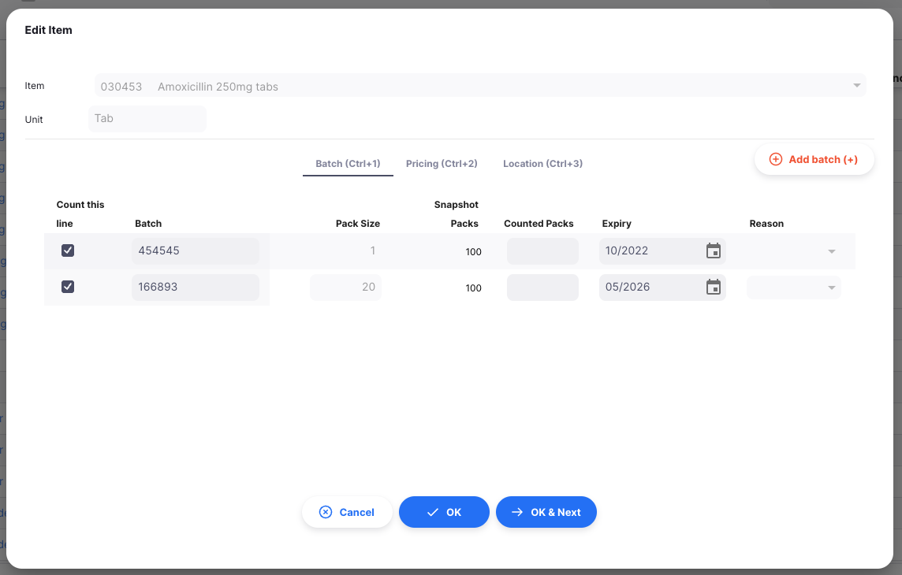

Vous pouvez utiliser le bouton `Ajouter un lot (+)` pour ajouter d'autres lots d'un article particulier lors de votre inventaire. Cela ajoutera une nouvelle ligne vide, où vous pouvez saisir les informations du lot et le nombre de conditionnements comptés.

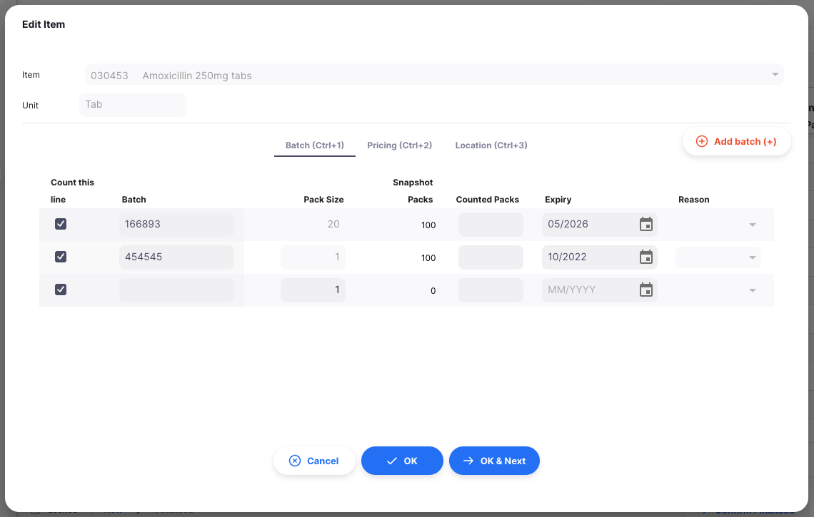

Vous ne pouvez pas modifier la taille de paquet des lignes d'inventaire liées à une ligne de stock existante. Si vous souhaitez reconditionner, suivez les instructions dans <a href="/docs/inventory/stock-view/#repacking-stock">Reconditionnement</a>.

### Saisir les raisons

Si vous avez configuré des [options d'ajustement d'inventaire](https://docs.msupply.org.nz/preferences:options?s[]=reasons) sur votre serveur central mSupply, vous devez saisir une raison lorsque les `conditionnements comptés` spécifiés ne correspondent pas au nombre de conditionnements théorique.

Par exemple, après avoir saisi `95` pour la quantité comptée d'Amoxicilline 250mg comprimés — lot 166893, un \* rouge apparaîtra à droite du champ `Raison`, et vous devrez sélectionner l'une des raisons d'ajustement négatif d'inventaire :

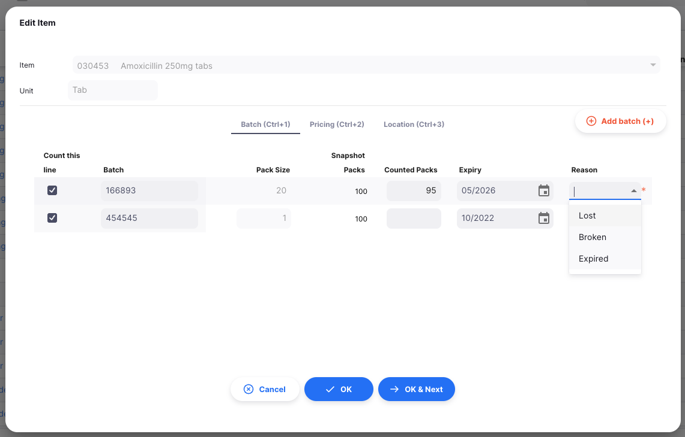

Si vous essayez d'enregistrer la ligne d'inventaire sans saisir de raison, vous verrez une erreur :

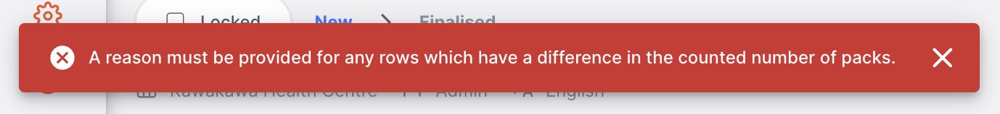

et la ligne d'inventaire nécessitant une raison sera mise en surbrillance en rouge comme indiqué ci-dessous.

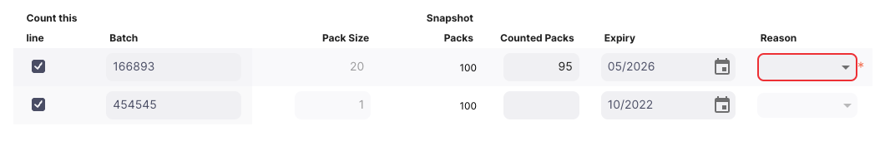

### Types de raisons

Il existe plusieurs [types de raisons](https://docs.msupply.org.nz/preferences:options?s[]=reasons) configurables dans mSupply. Vous aurez différentes options disponibles selon le type d'ajustement que vous effectuez et le type d'article.

| Ajustement                    | Article              | Type de dépôt        | Types de raisons                               |
| :---------------------------- | :------------------- | :------------------- | :--------------------------------------------- |
| **Ajout d'inventaire**        | Vaccin ou non-vaccin | Dépôt ou Dispensaire | Ajustement positif d'inventaire                |
| **Réduction d'inventaire**    | Non-vaccin           | Dépôt ou Dispensaire | Ajustement négatif d'inventaire                |
|                               | Vaccin               | Dépôt                | Gaspillage de flacon fermé                     |
|                               |                      | Dispensaire          | Gaspillage de flacon fermé et flacon ouvert    |

### Statut VVM

Vous pouvez mettre à jour de nombreuses informations sur la ligne de stock lors de votre inventaire, comme le numéro de lot, la date d'expiration et l'emplacement. Si vous utilisez la préférence de dépôt <a href="/docs/manage/facilities/#store-preferences">Gérer le statut VVM pour le stock</a>, vous pourrez également mettre à jour le statut VVM des articles vaccins.

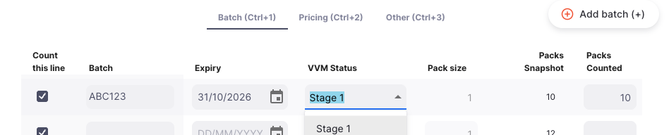

Les modifications du statut VVM seront appliquées lors de la finalisation de l'inventaire. Vous pouvez voir le changement de statut dans l'historique du statut VVM de la ligne de stock.

### Ajouter des articles

Si un article n'était pas inclus dans les lignes d'inventaire générées lors de la création de votre inventaire, vous pouvez l'ajouter manuellement en cliquant sur le bouton `Ajouter un Article` en haut à droite de votre écran.

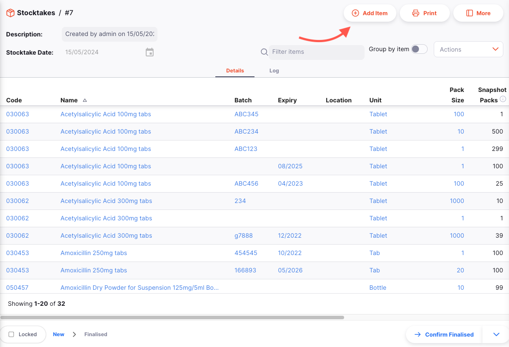

Une fenêtre `Ajouter un Article` apparaîtra, où vous pouvez sélectionner l'article que vous souhaitez ajouter à votre inventaire.

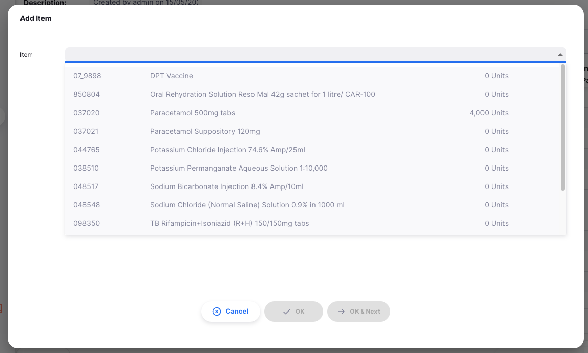

Une fois que vous sélectionnez un article, des lignes d'inventaire seront générées pour tous les lots de cet article ayant du stock, et vous pouvez procéder à la saisie des données d'inventaire comme ci-dessus.

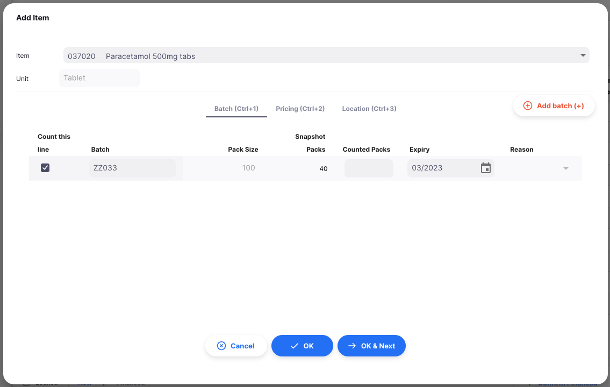

S'il n'y a pas de lots avec du stock pour cet article, votre liste de lots sera vide. Le bouton `Ajouter un lot (+)` ajoutera une nouvelle ligne vide, où vous pouvez saisir les informations du lot et le nombre de conditionnements compté.

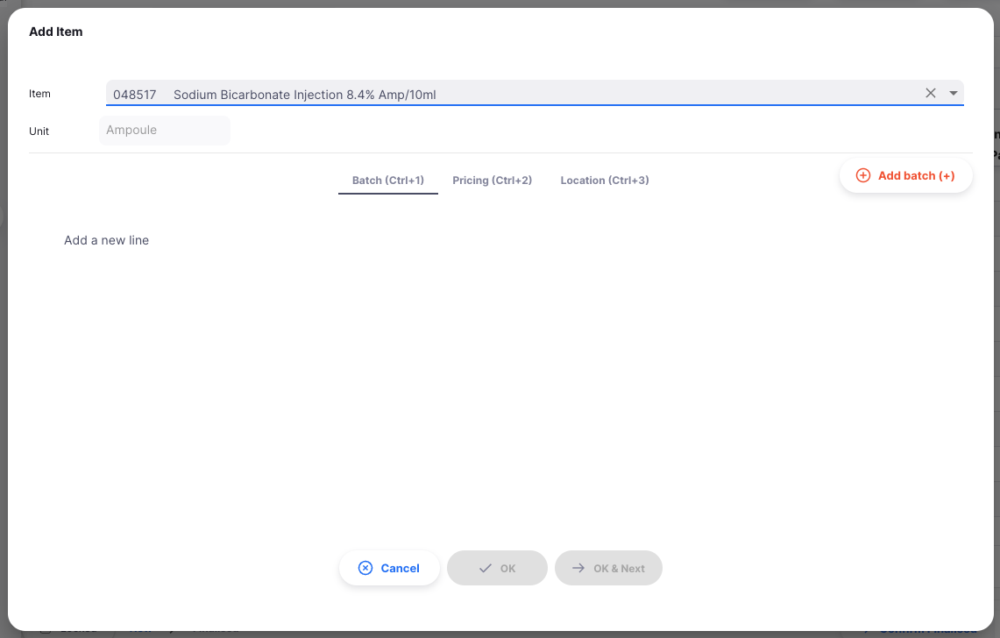

Lors de l'ajout d'un lot, la <code>Taille de conditionnement</code> et le <code>Prix de vente conditionnement</code> auront par défaut la valeur spécifiée par la <a href="https://docs.msupply.org.nz/items:item_basics:tab_storage?s%5B%5D=preferred&s%5B%5D=pack&s%5B%5D=size#preferred_pack_size">Taille de conditionnement préférée</a> et le <a href="https://docs.msupply.org.nz/items:item_basics:tab_general#default_sell_price_of_preferred_pack_size">Prix de vente par défaut de la taille de conditionnement préférée</a> si ceux-ci ont été spécifiés pour l'article actuel.

## Imprimer la feuille d'inventaire

Lors de la consultation d'un inventaire spécifique, cliquez simplement sur le bouton `Imprimer` en haut à droite de la page. Un fichier PDF est généré et s'ouvrira dans un nouvel onglet du navigateur. Il peut ensuite être imprimé via votre navigateur en cliquant sur imprimer ou en utilisant les touches `Ctrl`+`P` (sous Windows) ou `Cmd`+`P` (sous Mac).

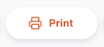

Cela affichera soit :

- Un PDF immédiatement, s'il n'y a qu'un seul rapport `Inventaire` configuré
- Un menu de rapports disponibles parmi lesquels choisir avant de créer le PDF, si plus d'un rapport est défini pour le type de rapport `Inventaire`.

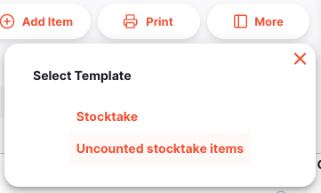

## Filtrer les lignes

La liste des lignes d'inventaire peut devenir très longue pour un grand inventaire. Pour faciliter la gestion, vous pouvez filtrer la liste par nom ou code d'article.

Dans le champ de recherche `Filtrer les articles`, saisissez tout ou partie d'un code article :

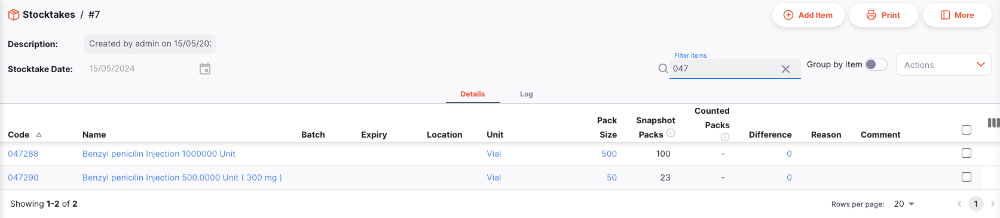

Ou saisissez tout ou partie du nom d'un article :

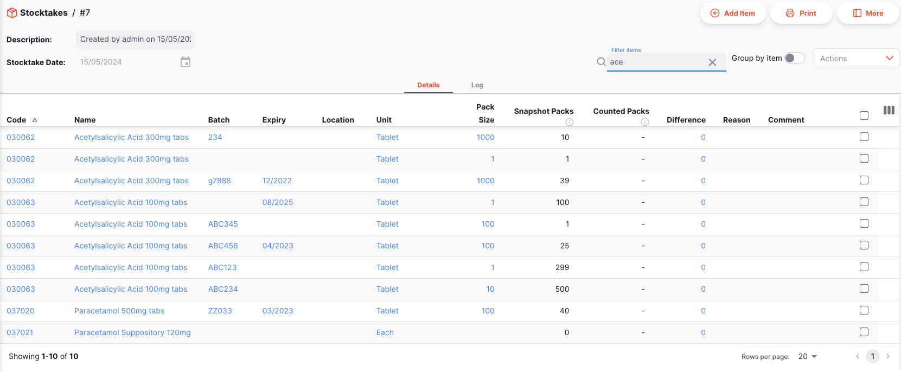

Vous pouvez également regrouper les lignes par article en activant le bouton `Grouper par article`.

## Actions groupées

Parfois, vous pouvez vouloir apporter des modifications à plusieurs lignes ou à toutes les lignes de votre inventaire. Des actions groupées sont disponibles pour certaines de ces modifications.

### Changer l'emplacement

Utilisez la colonne des cases à cocher pour sélectionner les lignes dont vous souhaitez changer l'emplacement. Le pied de page `Actions` s'affichera en bas de l'écran lorsqu'une ligne d'inventaire est sélectionnée. Il affichera le nombre de lignes sélectionnées et les actions disponibles. Cliquez sur `Changer l'emplacement`.

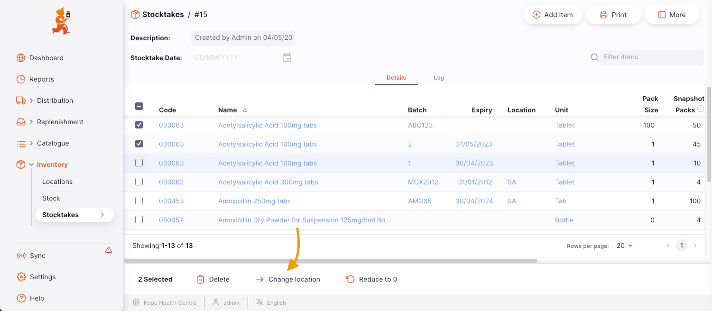

Une fenêtre s'ouvrira où vous pouvez sélectionner l'emplacement vers lequel vous souhaitez déplacer les lignes de stock :

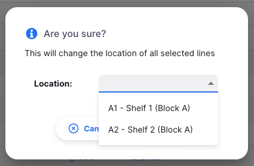

Notez que si les articles sélectionnés ont des types d'emplacement restreints, seuls les emplacements du type correspondant seront disponibles. Si c'est le cas, un message d'avertissement s'affichera en haut de la fenêtre :

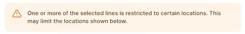

Sélectionnez un emplacement et appuyez sur OK. Toutes les lignes de stock sélectionnées auront maintenant un emplacement mis à jour.

### Réduire le nombre de conditionnements à 0

Utilisez la colonne des cases à cocher pour sélectionner les lignes que vous souhaitez réduire à 0. Cliquez sur le bouton `Réduire à 0` qui apparaît en bas de la page.

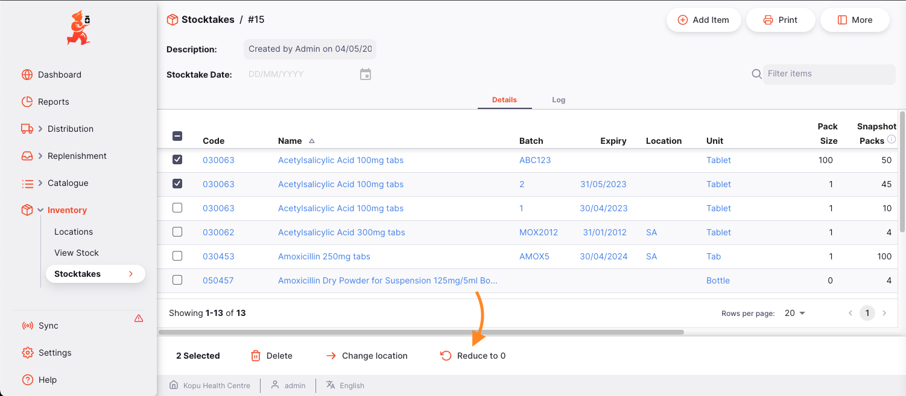

Une fenêtre de confirmation apparaîtra :

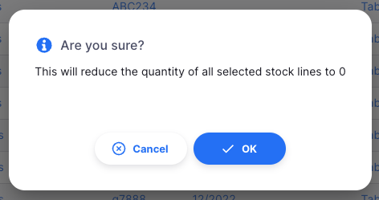

Si des [raisons d'ajustement d'inventaire](https://docs.msupply.org.nz/preferences:options?s[]=reasons) sont configurées depuis le serveur central, vous devrez également fournir la raison de la réduction du niveau de stock :

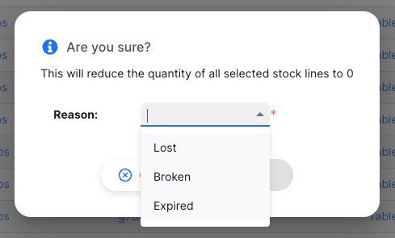

Sélectionnez une raison et appuyez sur OK. Toutes les lignes de stock sélectionnées auront maintenant une valeur `conditionnements comptés` de 0.

### Supprimer des lignes d'inventaire

Utilisez la colonne des cases à cocher pour sélectionner les lignes que vous souhaitez supprimer. Le pied de page `Actions` s'affichera en bas de l'écran. Cliquez sur `Supprimer`.

Une fenêtre de confirmation apparaîtra :

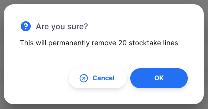

Une fois que vous appuyez sur OK, les lignes sélectionnées seront supprimées de l'inventaire.
