+++
title = "Stocktakes"
description = "Counting and adjusting stock."
date = 2022-03-19T18:20:00+00:00
updated = 2022-03-19T18:20:00+00:00
draft = false
weight = 63
sort_by = "weight"
template = "docs/page.html"

[extra]
lead = "Counting and adjusting stock"
toc = true
top = false
+++

mSupply will automatically keep track of your stock levels for you, as you receive and distribute it. But sometimes data gets entered incorrectly or stock goes out without anyone making an entry in the system.

Of course, we try not to let that happen but, if it does happen, we can make corrections. The easiest way to correct mistakes is to do a **Stocktake**.

In mSupply, you can easily do a stocktake for:

- A full inventory
- A limited range of items
- A single item

## Viewing Stocktakes

To view your stocktakes, go to `Inventory` and then `Stocktakes` in the navigation panel:

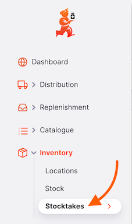

This brings up a list of all your stocktakes:

For each stocktake you can see:

| Column          | Description                                                                                                                                    |
| :-------------- | :--------------------------------------------------------------------------------------------------------------------------------------------- |
| **Number**      | The number of the stocktake                                                                                                                    |
| **Status**      | The status of the stocktake. _New_: a currently active stocktake. _Finalised_: stocktake has already been performed. You can no longer edit it |
| **Description** | The description of the stocktake (e.g. March Stocktake)                                                                                        |
| **Created**     | The date the stocktake was created                                                                                                             |
| **Date**        | The date the stocktake was done                                                                                                                |
| **Comment**     | Stocktake comment if any                                                                                                                       |

There is little point in keeping old stocktakes with status = <code>NEW</code>, and it can even be quite dangerous, especially if you are about to create a new stocktake containing the same items. If time has passed since the stocktake was created, then the snapshot and actual quantities are almost certainly incorrect. For good housekeeping reasons, it is good practice to delete old <code>NEW</code> stocktakes.

## Initial stocktake

The first stocktake recorded on a facility should be an initial stocktake. This is designed for ease of use entering stock into your store in Open mSupply for the first time.

To create an initial stocktake click in the Initial Stocktakes button in the stocktake page.

You can only create an initial stocktake if there are no stocktakes previously created for your store.

An initial stocktake will have placeholder lines for all items visible to your store. As all items counted are being added for the first time, reasons are not available to be selected on this stocktake.

## Creating a New Stocktake

Let's start a new stocktake. To do so, tap on the `New Stocktake` button in the right corner of the screen.

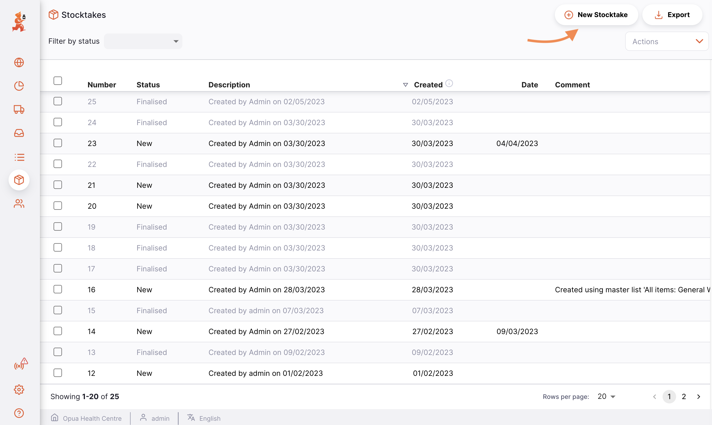

A "New Stocktake" modal appears.

- Selecting no options will include all stock lines with remaining stock in the system. You may filter the stock lines with remaining stock in the system by master list, location or their expiry date
- Selecting "Create blank stocktake" will create a stocktake with no lines. You will still be able to manually add individual items in the created stocktake.

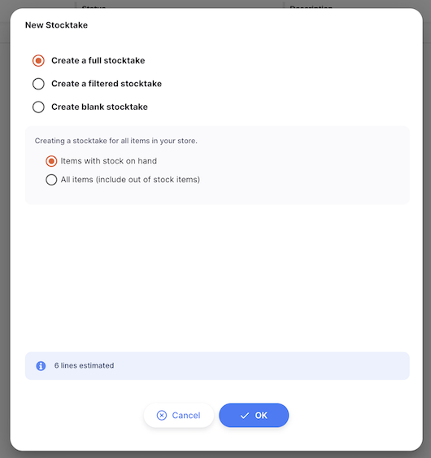

Click on OK when you have selected the option you would like.

The stocktake will then be created and stock lines will be used to populate the values for batch, expiry, pack size and snapshot number of packs. The lines show as light blue, and will change to black when a value is entered for the counted quantity.

Don't worry if an item is missing from your newly created stocktake. You will have the possibility to add more items to your stocktake afterwards. 

#### Vaccines

If you have the [Manage vaccines in doses](/docs/manage/facilities/#store-preferences) store preference enabled you will see a column of `Doses per unit`. For stocktake lines of vaccine items, the number of doses per unit (e.g. `Vial`) is shown in this column. The `Difference` column will also show the difference in doses as well as packs:

### Entering counted packs

To start entering stocktake data for an item, click on the stocktake row you would like to edit. A window appears, where you can enter the counted number of packs. You can also update other data from this window, like the expiry date, pricing or location information for a particular batch.

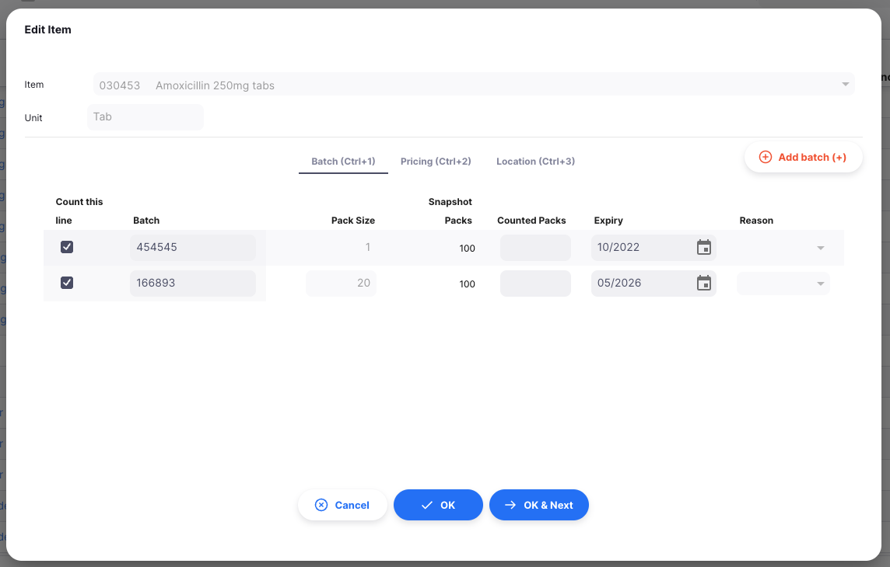

You can use the `Add batch (+)` button to add more batches of a particular item during your stocktake. This will add a new blank row, where you can enter batch information and the counted number of packs.

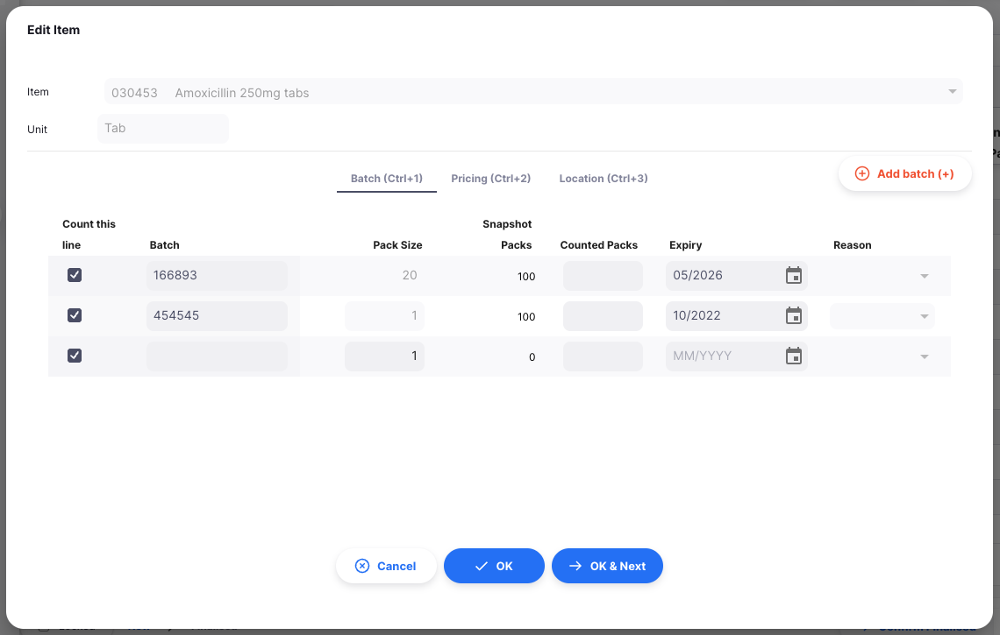

You are not able to edit the pack size of stocktake rows which are linked to an existing stock line. If you wish to repack, follow the instructions in <a href="/docs/inventory/stock-view/#repacking-stock">Repack</a>.

### Entering reasons

If you have [inventory adjustment options](https://docs.msupply.org.nz/preferences:options?s[]=reasons) configured in your central server, and are not doing an initial stocktake, then you are required to enter a reason when the `counted packs` specified does not match the snapshot packs. When reducing stock levels for vaccine items, the options configured for `Open vial wastage` and `Closed vial wastage` can be selected here also.

For example, after entering `95` for the counted quantity for Amoxicillin 250mg tabs - batch 166893, a red \* will appear to the right of the `Reason` input, and you will need to select one of the negative inventory adjustment reasons:

If you try to save the stocktake row without entering a reason you will see an error:

and the stocktake row that requires a reason to be entered will be highlighted in red as shown below.

#### Reason Types

There are several [reason types](https://docs.msupply.org.nz/preferences:options?s[]=reasons) configurable in mSupply. The types available to use in Open mSupply are:

- Positive Inventory Adjustment
- Negative Inventory Adjustment
- Open Vial Wastage

When entering a stocktake row that has a change in the number of packs, the relevant reasons available to choose from will be displayed:

| Adjustment type         | Item Type              | Reasons types available                             |
| :---------------------- | :--------------------- | :-------------------------------------------------- |
| **Inventory addition**  | Vaccine or non-vaccine | Positive Inventory Adjustment                       |
| **Inventory reduction** | Non-vaccine            | Negative Inventory adjustment                       |
| **Inventory reduction** | Vaccine                | Negative Inventory adjustment and Open Vial Wastage |

### Adding items

If an item was not included in the generated stocktake rows when you created your stocktake, you can add it manually by clicking the `Add Item` button in the top right of your screen.

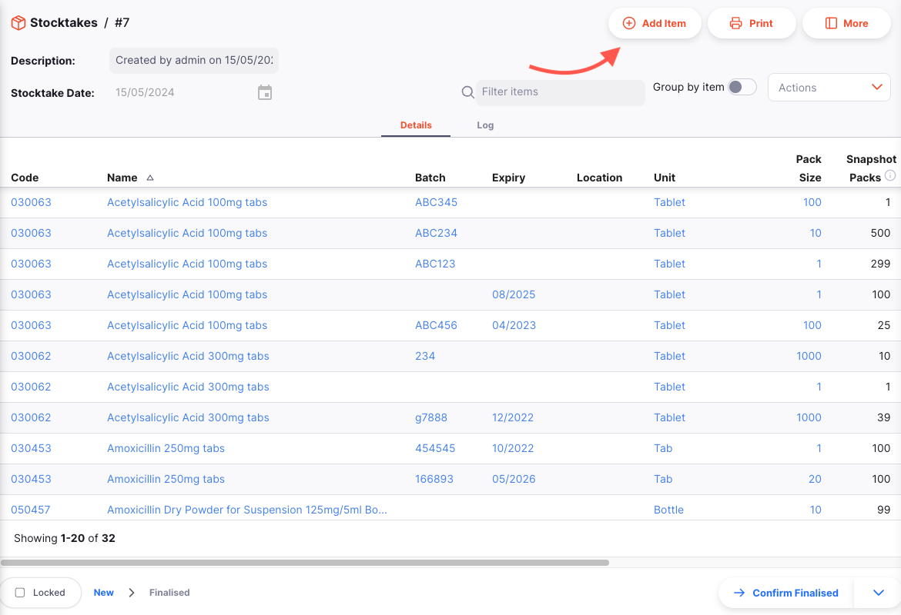

An `Add Item` window will appear, where you can select the item you would like to add to your stocktake.

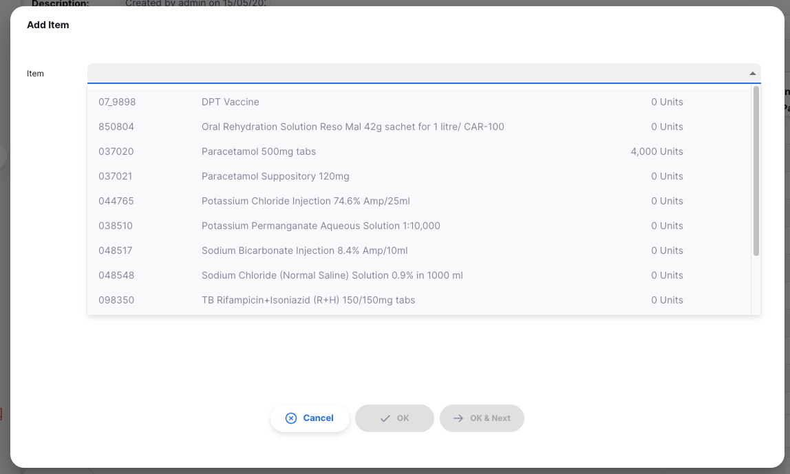

Once you select an item, stocktake rows will be generated for any batches of that item with stock, and you can carry out your stocktake data entry as above.

If there are no batches with stock for that item, your batch list will be blank. The `Add batch (+)` button will add a new blank row, where you can enter batch information and the counted number of packs.

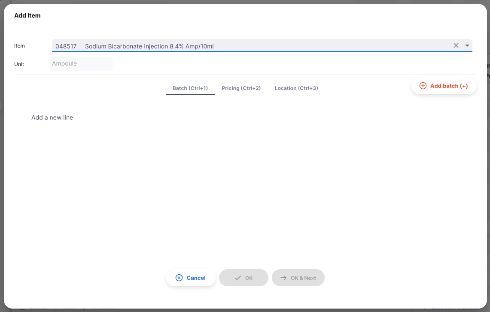

## Printing Stocktake sheet

When viewing a specific stocktake, simply click the `Print` button which is on the top right of the page.
When printing, a PDF file is generated for you, which will then open in a new browser tab. This can then be printed using your browser by clicking print or using `control`+`P` (if using windows) or `cmd`+`P` keys on your keyboard (if using a mac).

This will either:

- Create a PDF immediately, if there is only one `Stocktake` report configured
- Show a menu of possible reports for you to select from before creating a PDF. This will happen if there is more than one report defined for the `Stocktake` report type.

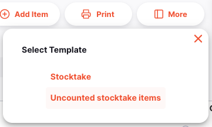

## Filtering lines

The list of stocktake lines can get very long if you have a large stocktake. To make working with the stocktake easier to manage, you can filter the list by item name or code.

In the `Filter items` search field, simply enter some or all of an item code:

Or, enter some of an item's name:

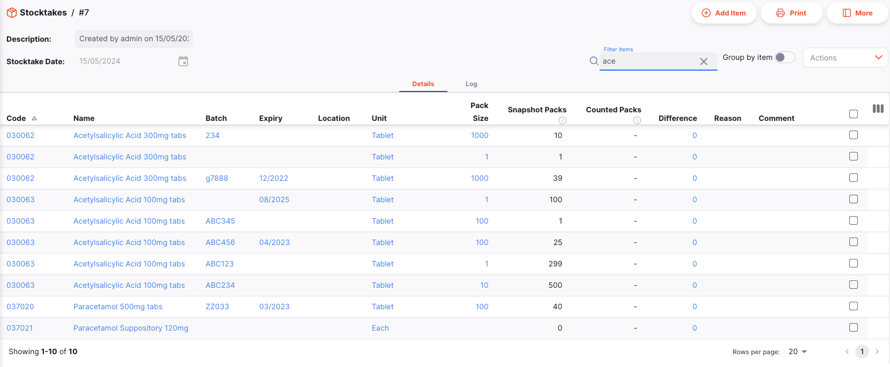

You can also group the lines by item by enabling the `Group by item` switch.

## Bulk actions

Sometimes you may want to make changes to many or all of the lines in your stocktake. Bulk actions are available for some of these changes.

### Change location

Use the checkbox column to select the lines you wish to change the location for. The `Actions` footer will display at the bottom of the screen when a stocktake line is selected. It will display the number of stocktake lines selected and the actions which can be taken. Click `Change location`.

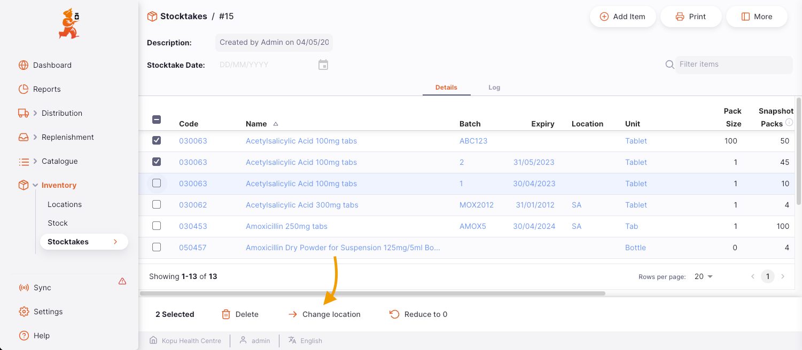

This will bring up a window where you can select which location you would like to move the stock lines to:

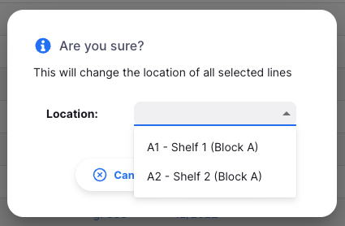

Select a location and press OK. All selected stock lines will now have an updated location.

### Reduce number of packs to 0

Use the checkbox column to select the lines you wish to reduce to 0. Click the `Reduce to 0` button which appears at the bottom of the page.

This will bring up a confirmation popup:

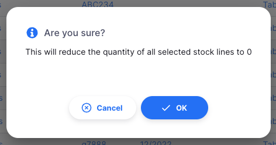

If [inventory adjustment reasons](https://docs.msupply.org.nz/preferences:options?s[]=reasons) are configured from the central server, you will also be required to supply the reason for reducing the stock level:

Select a reason and press OK. All selected stock lines will now have a `Counted packs` value of 0.

### Deleting stocktake lines

Use the checkbox column to select the lines you wish to delete. The `Actions` footer will display at the bottom of the screen when a stocktake line is selected. It will display the number of stocktake lines selected and the actions which can be taken. Click `Delete`.

This will bring up a confirmation popup:

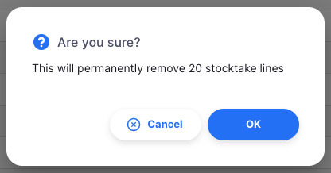

Once you press OK, the selected lines will be deleted from the stocktake.
