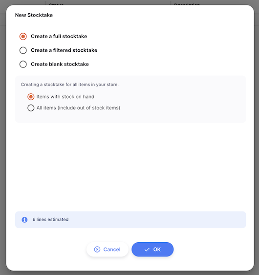

+++
title = "Tomada de inventário"
description = "Contando e ajustando stock."
date = 2022-03-19T18:20:00+00:00
updated = 2022-03-19T18:20:00+00:00
draft = false
weight = 63
sort_by = "weight"
template = "docs/page.html"

[extra]
lead = "Contando e ajustando stock"
toc = true
top = false
+++

O mSupply monitorizará automaticamente os níveis de stock à medida que os recebe e distribui. Mas, por vezes, os dados são introduzidos incorretamente ou o stock sai sem que ninguém faça qualquer introdução no sistema.

Claro que tentamos não deixar que isso aconteça, mas se acontecer, podemos fazer correções. A forma mais fácil de corrigir erros é fazer um **Inventário**.

No mSupply, pode facilmente fazer um inventário de:

- Um inventário completo
- Uma gama limitada de artigos
- Um único item

## Visualizar inventários

Para visualizar os seus inventários, vá a `Inventário` e depois a `Inventário` no painel de navegação:

Este apresenta uma lista de todos os seus inventários:

Para cada inventário pode ver:

| Coluna | Descrição |
| :-------------- | :------------------------------------------------------------------------------------------------------------------------------------------------------------ |
| **Número** | O número de inventário |
| **Estado** | O estado do inventário. _Novo_: um inventário ativo no momento. _Finalizado_: O inventário já foi realizado. Já não pode editá-lo |
| **Descrição** | A descrição do inventário (por exemplo, inventário de março) |
| **Criado** | A data em que o inventário foi criado |
| **Data** | A data em que o inventário foi feito |
| **Como** | Comentário sobre o inventário, se existir |

Não faz muito sentido manter inventários antigos com status = <code>NOVO</code>, e isso até pode ser bastante perigoso, especialmente se estiver prestes a criar um novo inventário contendo os mesmos itens. Se já passou algum tempo desde que o inventário foi criado, então o instantâneo e as quantidades reais estão quase certamente incorretos. Por razões de boa administração, é uma boa prática eliminar os inventários <code>NOVOS</code> antigos.

## Criação de um novo inventário

Vamos iniciar um novo inventário. Para tal, toque no botão `Novo inventário` no canto direito do ecrã.

Aparece uma janela onde pode optar por criar um inventário com base em artigos de uma lista mestre, artigos num local específico, artigos que estão em stock, artigos prestes a expirar ou um inventário vazio:

Clique em OK quando tiver selecionado a opção pretendida.

O inventário será então criado, e as linhas de stock existentes serão utilizadas para preencher os valores de lote, validade, tamanho da embalagem e número instantâneo de embalagens. As linhas são apresentadas a azul claro e mudam para preto quando é introduzido um valor para a quantidade contada.

Não se preocupe se faltar algum item no seu inventário recém-criado. Terá a opção de adicionar mais itens ao seu inventário posteriormente.

### Entrada com pacotes contados

Para começar a introduzir os dados de inventário de um artigo, clique na linha de inventário que pretende editar. Aparece uma janela onde pode introduzir o número de pacotes contados. Também pode atualizar outros dados nesta janela, como a data de validade, o preço ou as informações de localização de um lote específico.

Pode utilizar o botão `Adicionar lote (+)' para adicionar mais lotes de um item específico durante o seu inventário. Isto irá adicionar uma nova linha em branco, onde pode introduzir informações do lote e o número de pacotes contados.

Não pode editar o tamanho do pacote de linhas de inventário que estão ligadas a uma linha de stock existente. Se desejar reembalar, siga as instruções em <a href="/docs/inventory/stock-view/#repacking-stock">Reembalar</a>.

### Inserindo motivos

Se tiver [opções de ajuste de inventário](https://docs.msupply.org.nz/preferences:options?s[]=reasons) configuradas no seu servidor central, terá de introduzir um motivo quando os `pacotes contados` especificados não corresponderem aos pacotes de instantâneos.

For example, after entering `95` for the counted quantity for Amoxicillin 250mg tabs - batch 166893, a red \* will appear to the right of the `Reason` input, and you will need to select one of the negative inventory adjustment reasons:

If you try to save the stocktake row without entering a reason you will see an error:

and the stocktake row that requires a reason to be entered will be highlighted in red as shown below.

### Adicionando artigos

Se um item não tiver sido incluído nas linhas de inventário geradas quando criou o seu inventário, pode adicioná-lo manualmente clicando no botão `Adicionar item' no canto superior direito do ecrã.

Aparecerá uma janela `Adicionar artigo`, onde pode selecionar o item que pretende adicionar ao seu inventário.

Depois de selecionar um artigo, serão geradas linhas de inventário para todos os lotes desse artigo com stock, e poderá realizar a sua introdução de dados de inventário como acima.

Se não existirem lotes em stock para esse artigo, a sua lista de lotes ficará em branco. O botão `Adicionar lote (+)` irá adicionar uma nova linha em branco, onde poderá introduzir a informação do lote e o número de pacotes contados.

## Imprimir folha de inventário

Ao visualizar um inventário específico, basta clicar no botão `Imprimir` que se encontra no canto superior direito da página.
Ao imprimir, é-lhe gerado um ficheiro PDF, que será aberto numa nova aba do navegador. Este pode ser impresso utilizando o seu browser clicando em imprimir ou utilizando as teclas `control`+`P` (se estiver a utilizar o Windows) ou `cmd`+`P` no seu teclado (se estiver a utilizar um Mac).

Isto irá:

- Crie um PDF imediatamente, se existir apenas um relatório `Stocktake` configurado
- Apresenta um menu de relatórios possíveis para que possa selecionar antes de criar um PDF. Isto acontecerá se existir mais do que um relatório definido para o tipo de relatório `Inventário`.

## Filtragem de linhas

A lista de linhas de inventário pode tornar-se demasiado longa se tiver um inventário grande. Para facilitar a gestão do inventário, pode filtrar a lista por nome ou código do artigo.

No campo de pesquisa `Filtrar artigos`, basta introduzir parte ou a totalidade do código do artigo:

Ou introduza parte do nome de um artigo:

Também pode agrupar as linhas por item activando a opção `Agrupar por item'.

## Ações em massa

Por vezes, pode querer fazer alterações em muitas ou todas as linhas do seu inventário. Estão disponíveis ações em massa para algumas destas alterações.

### Alterar localização

Utilize a coluna de caixa de selecção para seleccionar as linhas cujo local pretende alterar. O rodapé `Ações` será apresentado na parte inferior do ecrã quando uma linha de inventário for selecionada. Irá exibir o número de linhas de inventário selecionadas e as ações que podem ser tomadas. Clique em `Alterar local`.

Isto abrirá uma janela onde pode selecionar para que local pretende mover as linhas de stock:

Selecione um local e prima OK. Todas as linhas de stock selecionadas terão agora uma localização atualizada.

### Reduza o número de pacotes para 0

Utilize a coluna de caixa de selecção para seleccionar as linhas que pretende reduzir para 0. Clique no botão `Reduzir para 0` que aparece na parte inferior da página.

Isto abrirá um pop-up de confirmação:

Se forem configurados [motivos de ajuste de stock](https://docs.msupply.org.nz/preferences:options?s[]=reasons) no servidor central, também terá de fornecer o motivo para reduzir o nível de stock:

Selecione um motivo e prima OK. Todas as linhas de stock seleccionadas terão agora um valor de `Pacotes contados' de 0.

### Apagar linhas de inventário

Utilize a coluna de caixa de selecção para seleccionar as linhas que pretende eliminar. O rodapé `Ações` será apresentado na parte inferior do ecrã quando uma linha de inventário for selecionada. Irá exibir o número de linhas de inventário selecionadas e as ações que podem ser tomadas. Clique em `Apagar`.

Isto abrirá um pop-up de confirmação:

Após premir OK, as linhas selecionadas serão eliminadas do inventário.