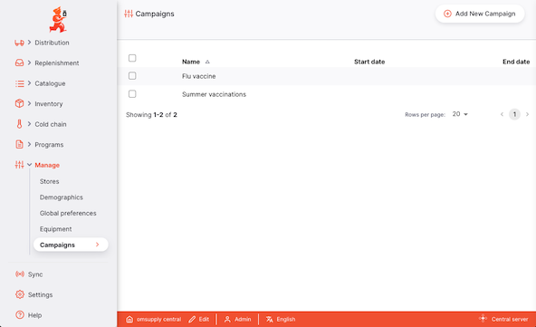
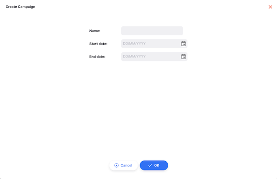

+++
title = "Campagnes"
description = "Gestion des campagnes"
date = 2025-06-11T16:20:00+00:00
updated = 2025-06-11T16:20:00+00:00
draft = false
weight = 5
sort_by = "weight"
template = "docs/page.html"

[extra]
toc = true
top = false
+++

La section Campagnes vous permet de consulter et de gérer les campagnes. Cela vous permet d'associer des lignes de stock à une campagne particulière et de les distinguer du stock ordinaire. Par exemple, dans une chaîne d'approvisionnement en vaccins, les vaccins peuvent être alloués au stock régulier ou faire partie d'une campagne de vaccination.

## Consulter les campagnes

Choisissez `Gérer` > `Campagnes` dans le panneau de navigation.

Une liste des campagnes vous sera présentée :

Les colonnes suivantes sont affichées :

| Colonne            | Description                          |
| :----------------- | :----------------------------------- |
| **Nom**            | Le nom de la campagne                |
| **Date de début**  | La date de début de la campagne      |
| **Date de fin**    | La date à laquelle la campagne se termine |

Notez que les dates ne sont actuellement pas utilisées par le système

## Ajouter une nouvelle campagne

Pour ajouter une nouvelle campagne, cliquez sur le bouton `Ajouter une nouvelle campagne` en haut à droite.

Vous pouvez maintenant saisir un nom et des dates de début et de fin optionnelles pour la campagne.

Depuis cet écran, cliquez sur :

- `Ok` pour enregistrer, ou
- `Annuler` à tout moment pour annuler vos modifications

## Assigner une campagne

Vous pouvez assigner une campagne à une ligne de stock depuis la page [Stock](/docs/inventory/stock-view#creating-a-new-stock-line).
