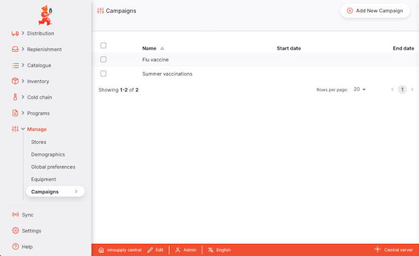
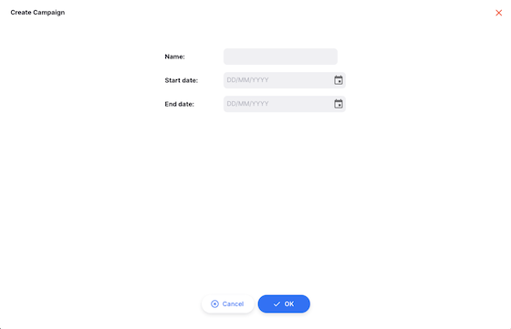

+++
title = "Campaigns"
description = "Campaign management"
date = 2025-06-11T16:20:00+00:00
updated = 2025-06-11T16:20:00+00:00
draft = false
weight = 5
sort_by = "weight"
template = "docs/page.html"

[extra]
toc = true
top = false
+++

The Campaigns section is where you can view and manage campaigns. This allows you to associate stock lines with a particular campaign and distinguish it from regular stock. An example is within a vaccine supply chain, where vaccines may be allocated to regular stock or be part of a vaccination drive.

## Viewing Campaigns

Choose `Manage` > `Campaigns` in the navigation panel.

You will be presented with a list of Campaigns:

The following columns are shown:

| Column         | Description                         |
| :------------- | :---------------------------------- |
| **Name**       | The name of the campaign            |
| **Start date** | The start date of the campaign      |
| **End date**   | The date at which the campaign ends |

Note that the dates are currently not used by the system

## Adding a new campaign

To add a new campaign, click the `Add New Campaign` button in the top right.

You can now enter a name and optional start and end dates for the campaign.

From this screen, click

- `Ok` to save, or
- `Cancel` at any time to revert your changes

## Assigning a campaign

You can assign a campaign to a stock line in the [View stock](/docs/inventory/stock-view#creating-a-new-stock-line) page.
