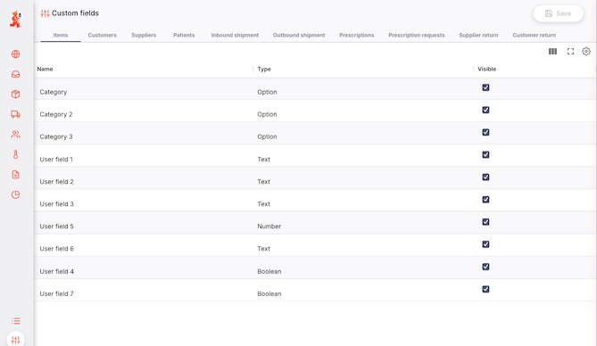

+++
title = "Custom Fields"
description = "Choose where each custom field appears on your records"
date = 2026-09-08T09:00:00+00:00
updated = 2026-09-08T09:00:00+00:00
draft = false
weight = 5
sort_by = "weight"
template = "docs/page.html"

[extra]
toc = true
top = false
+++

**Custom fields** are the extra pieces of information your organisation tracks against a record that Open mSupply doesn't have a standard field for - a procurement code on an item, a district on a customer, a funding source on a shipment.

The `Custom fields` page in the `Manage` section is where you decide **where each custom field appears**: out of sight, on the record's `Custom fields` tab, or promoted onto the top of the record itself.

The <code>Custom fields</code> page is only available on the <a href="../../getting-started/central-server/">Open mSupply Central Server</a>, and only to users who have the <code>Access server administration</code> permission (see the <a href="../../settings/permissions/">Permissions</a> page). It is not shown on remote sites, and the fields it configures apply to the whole system rather than to one store.

## Where custom fields come from

Custom fields are defined in mSupply and are synchronised to the Open mSupply central Server. This page changes only _where a field is shown_ - you cannot use it to manage fields (yet!).

To add, rename or change a custom field, or to change the list of choices an `Option` field offers, do it in mSupply. The change reaches Open mSupply Central on the next sync, and every other site on the sync after that.

The following mSupply fields become custom fields in Open mSupply:

| Record       | mSupply field                                                                            | Appears as                                           | Type      |
| :----------- | :--------------------------------------------------------------------------------------- | :--------------------------------------------------- | :-------- |
| Item         | Item categories 1, 2 and 3                                                               | `Category`, `Category 2`, `Category 3`               | Option    |
| Item         | Item user fields 1–7                                                                     | `User field 1` … `User field 7`                      | See below |
| Name         | Name categories 1–6                                                                      | `Category 1` … `Category 6`                          | Option    |
| Name         | Name custom fields 1–3                                                                   | `Custom 1`, `Custom 2`, `Custom 3`                   | Text      |
| Shipment     | [Transaction categories](https://docs.msupply.org.nz/other_stuff:transaction_categories) | `Category` on each shipment, return and prescription | Option    |
| Prescription | Prescriptions (2) categories - _Patient type_                                            | `Patient type`                                       | Option    |

Notes on the table above:

- **Item** fields carry the types mSupply gives them: user fields 1, 2, 3 and 6 are `Text`, user field 5 is a `Number`, and user fields 4 and 7 are `Boolean` (a tick box).
- **Name** means customers, suppliers and patients. They share the same nine definitions in mSupply, but each is configured **separately** for each of the three - see [A field is configured once per record type](#a-field-is-configured-once-per-record-type).
- **If you have renamed a field in mSupply**, that name is what Open mSupply shows. `User field 1` only appears as "User field 1" while it is still unnamed in mSupply.
- **Item category 1** and **name category 1** are hierarchical in mSupply, and Open mSupply keeps that structure: when you choose a value, the choices are shown as a tree
- **Transaction categories** in mSupply that Open mSupply has no screen for (builds and tenders) are not brought across

A <a href="../../getting-started/central-server/">standalone Open mSupply Central Server</a> - one with no mSupply system behind it - has no custom fields at all, so this page will show <code>No custom fields defined</code> on every tab.

## Field types

Every custom field has a type, which decides how it is displayed, how it is entered, and how you can filter a list by it.

| Type        | On a record                                       | Filtering a list by it                                                                  |
| :---------- | :------------------------------------------------ | :-------------------------------------------------------------------------------------- |
| **Text**    | A text box                                        | Contains the text you type                                                              |
| **Integer** | A whole number                                    | A `Min` / `Max` range                                                                   |
| **Number**  | A number, decimals allowed                        | A `Min` / `Max` range                                                                   |
| **Date**    | A date picker                                     | A `From` / `To` date range                                                              |
| **Boolean** | A tick box                                        | `Yes` / `No`                                                                            |
| **Option**  | A drop-down list of the choices set up in mSupply | Choose one or more options. Choosing a parent option also matches everything beneath it |

## Viewing the custom fields configuration

Choose `Manage` > `Custom fields` in the navigation panel.

The page has one tab per record type, in this order:

- Items
- Customers
- Suppliers
- Patients
- Inbound shipment
- Outbound shipment
- Prescriptions
- Supplier return
- Customer return

Each tab lists every custom field configured for that record type, in the order the fields are displayed on the record.

The following columns are shown:

| Column        | Description                                                                                                                                                                                |
| :------------ | :----------------------------------------------------------------------------------------------------------------------------------------------------------------------------------------- |
| **Name**      | The field's name, as set in mSupply. Read-only                                                                                                                                             |
| **Type**      | The field's type (see [Field types](#field-types)). Read-only                                                                                                                              |
| **Visible**   | Tick to show the field on this record type                                                                                                                                                 |
| **Prominent** | Tick to promote the field to the top of the record, next to its other key details. Only shown on the five shipment, return and prescription tabs - see [Display options](#display-options) |

If a tab shows `No custom fields defined`, no custom fields have been set up in mSupply for that record type. Fields you have hidden still appear in this list, so an empty tab always means "nothing configured", rather than "everything hidden".

## Display options

The `Visible` and `Prominent` tick boxes combine to control _if_ and _where_ a field is displayed:

| Setting                        | Where the field appears                                                                                   |
| :----------------------------- | :-------------------------------------------------------------------------------------------------------- |
| `Visible` unticked             | **Nowhere** - not on the record, not as a list column, not as a list filter                               |
| `Visible` ticked               | On the record's `Custom fields` tab, and as a column and filter on the list                               |
| `Visible` + `Prominent` ticked | At the top of the record, alongside its other key details - and _not_ repeated on the `Custom fields` tab |

## Where the custom fields then appear

Once a field is visible, it appears on that record type's list _and_ its detail view. Whether it can be **edited** depends on the record: items, customers and suppliers are maintained in mSupply, so their custom fields are shown but not editable in Open mSupply.

| Record type                                                  | On the record                                            | Editable                                      |
| :----------------------------------------------------------- | :------------------------------------------------------- | :-------------------------------------------- |
| [Items](../../catalogue/items/)                              | `Custom fields` tab                                      | No - items are maintained in mSupply          |
| [Customers](../../distribution/customers/)                   | On the customer's details                                | No                                            |
| [Suppliers](../../replenishment/suppliers/)                  | `Custom fields` tab                                      | No                                            |
| [Patients](../../dispensary/patients/)                       | `Custom fields` tab                                      | Yes, with the patient editing permission      |
| [Inbound shipments](../../replenishment/inbound-shipments/)  | `Custom fields` tab, plus prominent fields in the header | Yes, while the shipment is still editable     |
| [Outbound shipments](../../distribution/outbound-shipments/) | `Custom fields` tab, plus prominent fields in the header | Yes, while the shipment is still editable     |
| [Prescriptions](../../dispensary/prescriptions/)             | `Custom fields` tab, plus prominent fields in the header | Yes, while the prescription is still editable |
| [Supplier returns](../../replenishment/supplier-returns/)    | `Custom fields` tab, plus prominent fields in the header | Yes, while the return is still editable       |
| [Customer returns](../../distribution/customer-returns/)     | `Custom fields` tab, plus prominent fields in the header | Yes, while the return is still editable       |

## Good to know

**Hiding a field never deletes anything.** Values already recorded against a hidden field stay in the database and stop being displayed. Tick `Visible` again and both the field and its values reappear exactly as they were.

### A field is configured once per record type

Customers, suppliers and patients share the same custom fields in mSupply, but Open mSupply configures them **independently**. `Custom 1` can be visible for customers, prominent for patients and hidden for suppliers at the same time. Changing one tab never affects another - so if a field you expected is missing, check the tab for that specific record type.
