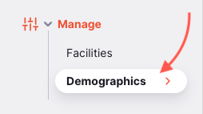
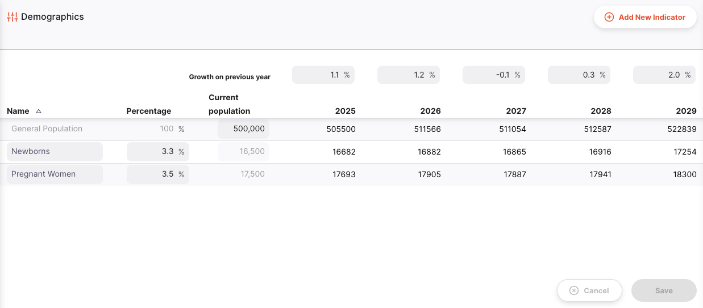
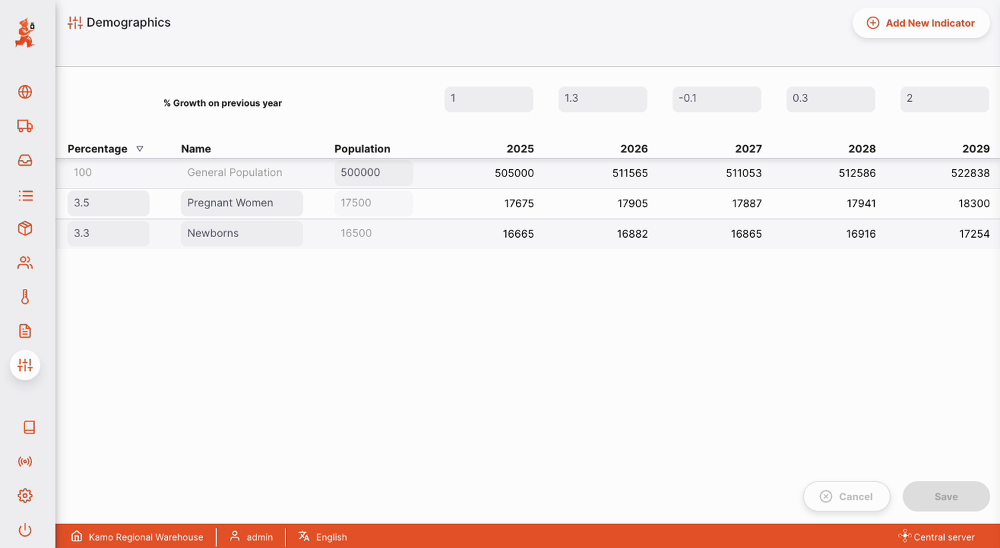
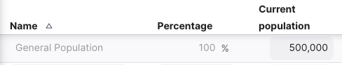
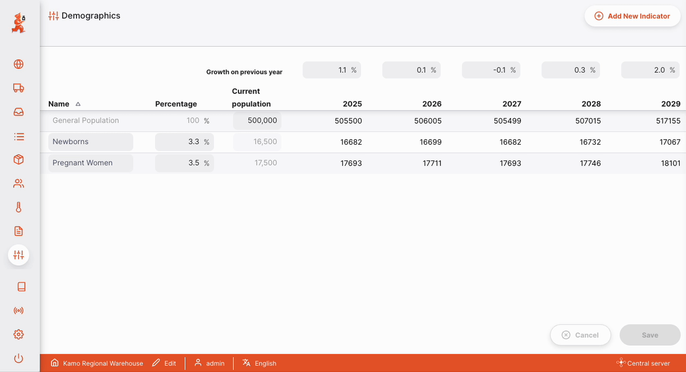

+++
title = "Demografía"
description = "Indicadores demográficos"
date = 2022-05-17T16:20:00+00:00
updated = 2022-05-17T16:20:00+00:00
draft = false
weight = 3
sort_by = "weight"
template = "docs/page.html"

[extra]
toc = true
top = false
+++

La sección de Demografía es donde puedes visualizar y gestionar proyecciones futuras para diferentes indicadores demográficos. Estos datos de población pueden utilizarse para estimar la capacidad de almacenamiento en frío necesaria para los próximos programas de vacunación.

La gestión de demografía solo está disponible en el [Servidor Central de Open mSupply](/docs/getting_started/central-server).

## Configuración

Actualmente, las funciones de `Demografía` están habilitadas como parte del módulo de `Vacunas`.

Para comenzar, activa la preferencia del almacén móvil: `Usa el módulo de vacunas` (consulta la documentación sobre [preferencias de almacén](https://docs.msupply.org.nz/other_stuff:virtual_stores#preferences_tab) para saber cómo hacerlo).

## Ver los Indicadores Demográficos

Selecciona `Gestionar` > `Demografía` en el panel de navegación.

Se te presentará una lista de Indicadores Demográficos:

La lista de Indicadores Demográficos está dividida en 4 columnas:

| Columna             | Descripción                                                                                   |
| :------------------ | :-------------------------------------------------------------------------------------------- |
| **Nombre**          | El nombre del indicador demográfico                                                           |
| **Porcentaje**      | Porcentaje de la población general incluido en este indicador demográfico                     |
| **Población**       | Población calculada de ese indicador, basada en el `Porcentaje`                               |
| **Columnas 5 años** | Proyecciones de población para 5 años futuros, basadas en las predicciones de `% Crecimiento` |

## Porcentaje de crecimiento anual

Para cada año, puedes ingresar el porcentaje de crecimiento poblacional previsto. Este puede ser un número positivo o negativo. Al editar el porcentaje de crecimiento, notarás que las proyecciones de población se actualizan.

- Haz clic en `Guardar` una vez que estés conforme con tus cambios
- O: Haz clic en `Cancelar` en cualquier momento para revertir tus cambios.

## General population

Todos los cálculos se basan en la `Población General` actual. Para comenzar, ingresa la población actual:

## Agregar un nuevo indicador

Para agregar un nuevo indicador demográfico, haz clic en el botón `Agregar nuevo indicador` en la parte superior derecha.

Esto agregará una nueva fila a la tabla. Ahora puedes ingresar un nombre para el indicador demográfico y el porcentaje de la población incluida.

- Haz clic en `Guardar` una vez que estés satisfecho con los cambios
- O: Haz clic en `Cancelar` en cualquier momento para revertir los cambios

## Permisos y restricciones

Los indicadores demográficos solo son visibles en el [Servidor Central de Open mSupply](/docs/getting_started/central-server) y requieren la preferencia de almacén [`mobile: Usa módulo de vacunas`](https://docs.msupply.org.nz/cold_chain_equipment:mobile?s[]=vaccine#enable_the_vaccine_module_for_the_mobile_store).

Para crear, editar o eliminar datos demográficos, necesitas el permiso `Puedes modificar datos centrales` habilitado en la [omSupply Permissions Tab](https://docs.msupply.org.nz/admin:managing_users?s[]=permission#omsupply_permissions_tab) en tu Almacén Central.

