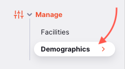
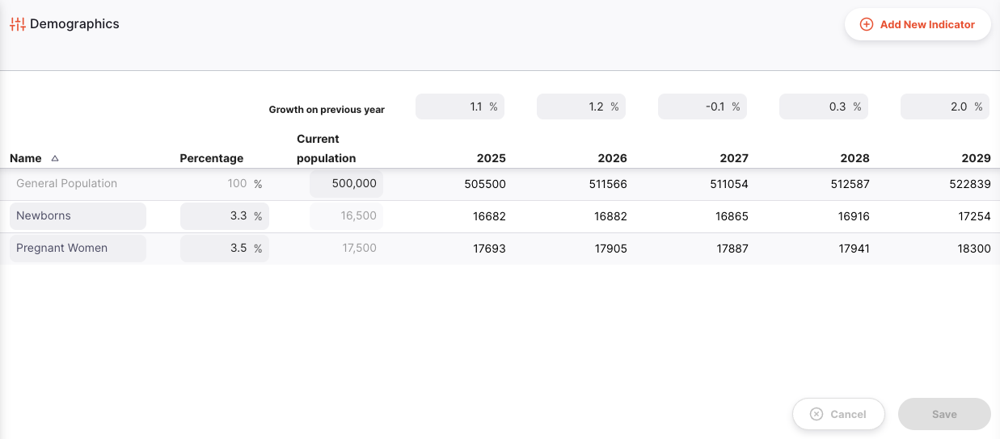
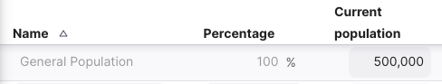
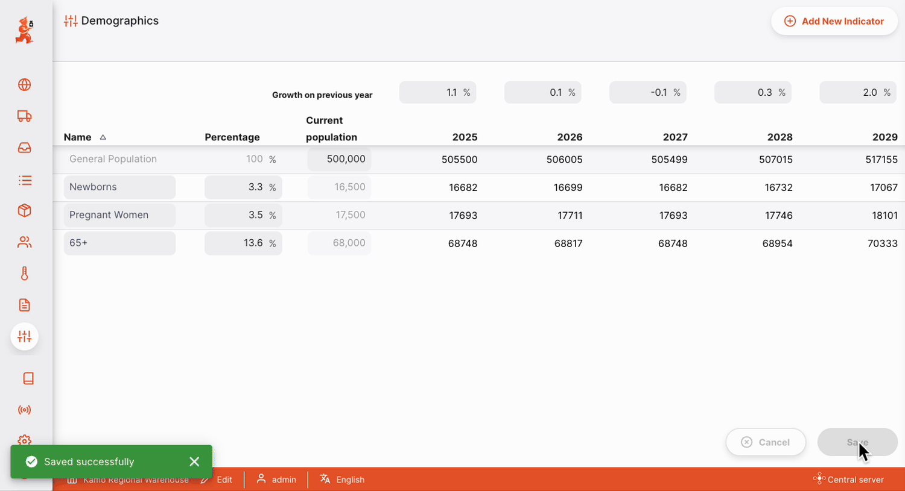

+++
title = "Démographie"
description = "Indicateurs démographiques"
date = 2022-05-17T16:20:00+00:00
updated = 2022-05-17T16:20:00+00:00
draft = false
weight = 3
sort_by = "weight"
template = "docs/page.html"

[extra]
toc = true
top = false
+++

La section Démographie vous permet de consulter et de gérer les projections futures pour différents indicateurs démographiques. Ces données de population peuvent ensuite être utilisées pour estimer la capacité de stockage à froid requise pour les programmes de vaccination à venir.

La gestion des données démographiques est uniquement disponible sur le [Serveur Central Open mSupply](/docs/getting_started/central-server).

## Configuration

Actuellement, les fonctionnalités `Démographie` sont activées dans le cadre du module `Vaccin`.

Pour commencer, activez la préférence de dépôt `mobile : Utilise le module Vaccin` (consultez la documentation sur les [préférences de dépôt](https://docs.msupply.org.nz/other_stuff:virtual_stores#preferences_tab) pour savoir comment procéder).

## Consulter les indicateurs démographiques

Choisissez `Options` > `Données démographiques` dans le panneau de navigation.

Une liste des indicateurs démographiques vous sera présentée :

Les colonnes suivantes sont affichées :

| Colonne                  | Description                                                                             |
| :----------------------- | :-------------------------------------------------------------------------------------- |
| **Nom**                  | Le nom du indicateur démographique                                                      |
| **Pourcentage**          | Pourcentage de la population générale inclus dans ce groupe démographique               |
| **Population**           | La population calculée pour ce groupe, basée sur le `Pourcentage`                      |
| **Colonnes sur 5 ans**   | Projections de population pour 5 années futures, basées sur les prévisions de `% de croissance` |

## Pourcentage de croissance annuelle

Pour chaque année, vous pouvez saisir le pourcentage de croissance démographique prévu. Il peut s'agir d'un nombre positif ou négatif. Au fur et à mesure que vous modifiez le pourcentage de croissance, les projections de population se mettent à jour.

- Cliquez sur `Enregistrer` une fois satisfait de vos modifications
- OU : Cliquez sur `Annuler` à tout moment pour annuler vos modifications

## Population actuelle

Tous les calculs sont basés sur la `Population actuelle`. Pour commencer, saisissez la population actuelle :

## Ajouter un nouvel indicateur

Pour ajouter un nouvel indicateur démographique, cliquez sur le bouton `Ajouter un nouvel indicateur` en haut à droite.

Cela ajoutera une nouvelle ligne au tableau. Vous pouvez maintenant saisir un nom pour le groupe démographique et le pourcentage de la population inclus.

- Cliquez sur `Enregistrer` une fois satisfait de vos modifications
- OU : Cliquez sur `Annuler` à tout moment pour annuler vos modifications

## Permissions et restrictions

Les données démographiques ne sont visibles que sur le [Serveur Central Open mSupply](/docs/getting_started/central-server) et nécessitent la préférence de dépôt [`mobile : Utilise le module vaccin`](https://docs.msupply.org.nz/cold_chain_equipment:mobile?s[]=vaccine#enable_the_vaccine_module_for_the_mobile_store).

Pour créer, modifier ou supprimer des données démographiques, vous avez besoin de la permission `Peut modifier les données centrales`, activée dans l'[onglet Permissions omSupply](https://docs.msupply.org.nz/admin:managing_users?s[]=permission#omsupply_permissions_tab) de votre Dépôt Central.

