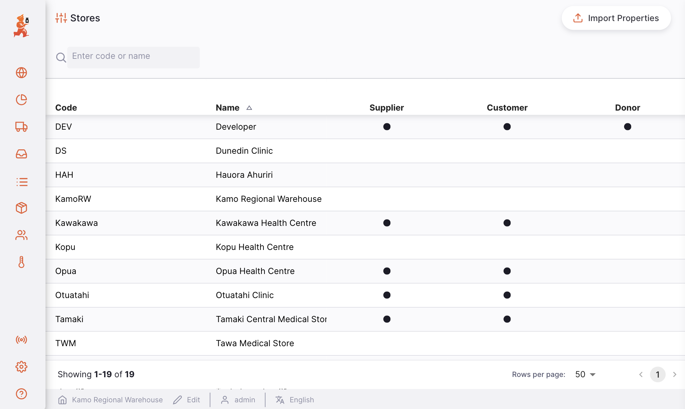
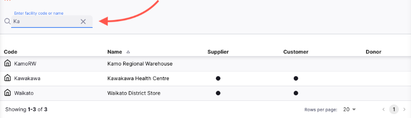
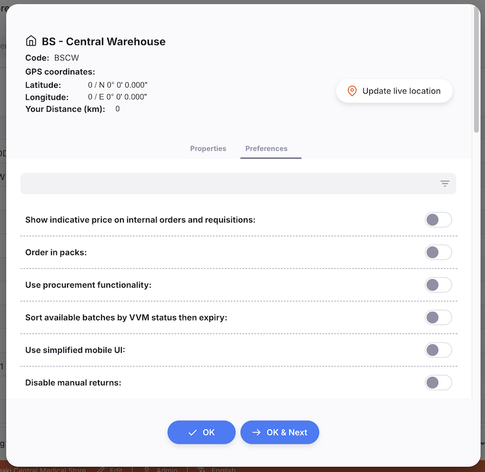
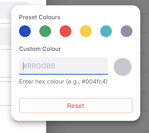
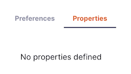
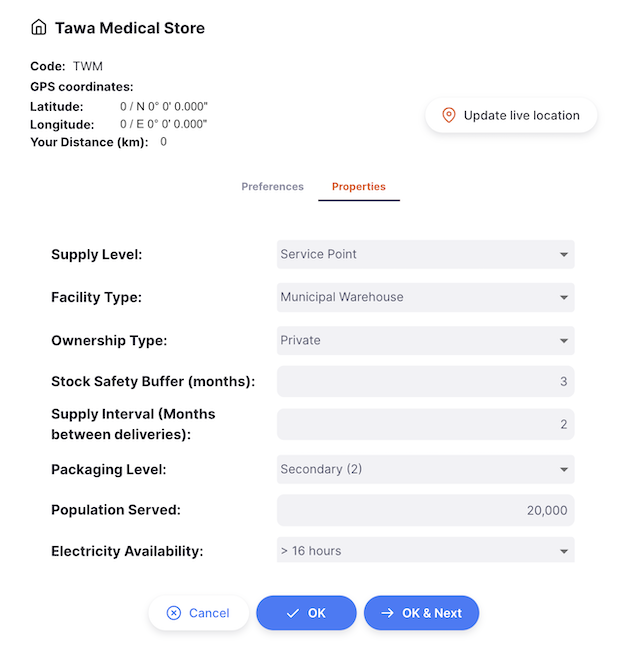
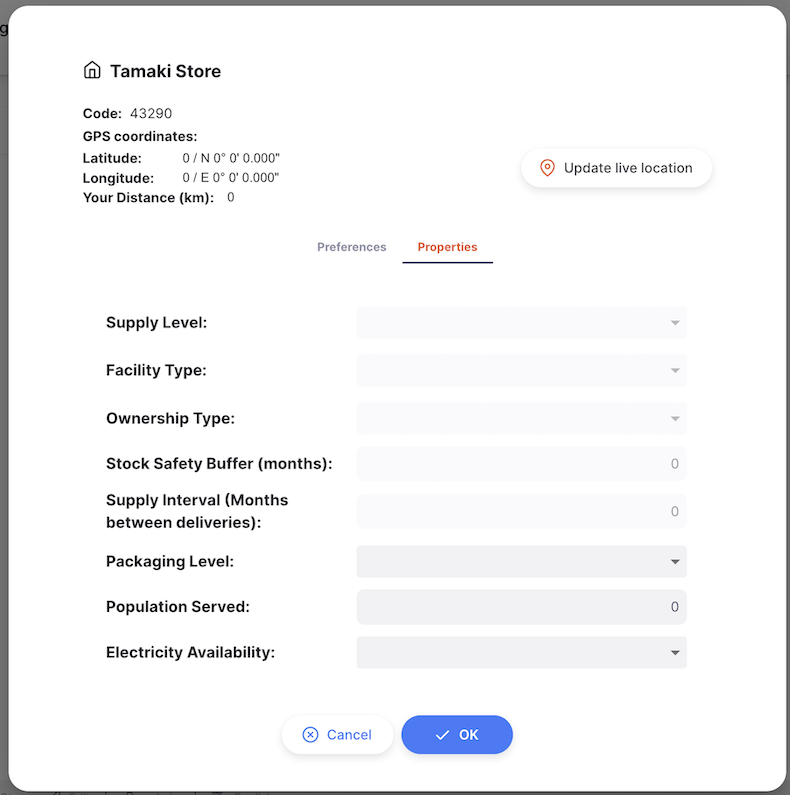
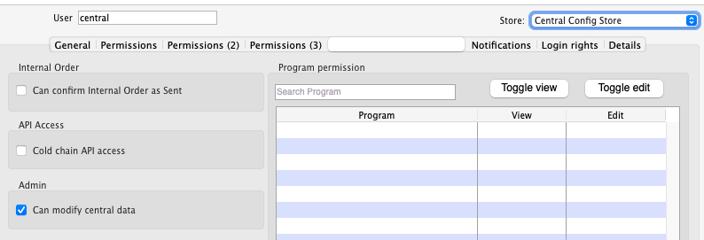

+++
title = "Dépôts"
description = "Gérer tous les dépôts"
date = 2022-05-17T16:20:00+00:00
updated = 2022-05-17T16:20:00+00:00
draft = false
weight = 2
sort_by = "weight"
template = "docs/page.html"

[extra]
toc = true
top = false
+++

La liste des dépôts est disponible uniquement sur le [Serveur Central Open mSupply](/docs/getting_started/central-server). C'est ici que vous pouvez consulter tous les dépôts et gérer leurs propriétés.

## Consulter les dépôts

Choisissez `Options` > `Dépôts` dans le panneau de navigation.

Une liste des dépôts de votre système vous sera présentée.

La liste des dépôts est divisée en 5 colonnes :

| Colonne        | Description                              |
| :------------- | :--------------------------------------- |
| **Code**       | Le code du dépôt                         |
| **Nom**        | Le nom du dépôt                          |
| **Fournisseur**| Si ce dépôt est un fournisseur           |
| **Client**     | Si ce dépôt est un client               |
| **Donateur**   | Si ce dépôt est un donateur             |

Vous pouvez savoir si un client utilise également Open mSupply dans son dépôt s'il dispose d'une icône comme celle-ci  à côté du code.

1. La liste peut afficher un nombre fixe de dépôts par page. En bas à gauche, vous pouvez voir combien de dépôts sont actuellement affichés.
2. Si vous avez plus de dépôts que la limite actuelle, vous pouvez naviguer vers d'autres pages en cliquant sur le numéro de page ou en utilisant les flèches droite ou gauche (coin inférieur droit).
3. Vous pouvez également sélectionner un nombre différent de lignes à afficher par page en utilisant l'option en bas à droite.

### Rechercher des dépôts

Vous pouvez filtrer la liste des dépôts par nom ou par code.

Dans la barre de recherche en haut à gauche de votre écran, saisissez tout ou partie d'un nom ou d'un code de dépôt. La liste affichera alors tous les dépôts correspondants :

## Préférences du dépôt

Les préférences du dépôt permettent de configurer Open mSupply pour un dépôt spécifique. Une brève description de chaque préférence est donnée ci-dessous, avec plus de détails dans les sections correspondantes de la documentation.

Pour configurer les préférences d'un dépôt, sélectionnez-le dans la liste — une nouvelle fenêtre s'ouvrira.

Activez ou désactivez les préférences selon vos besoins, puis fermez la fenêtre lorsque vous avez terminé.

### Préférences disponibles

| Nom de la préférence                                                                                       | Description                                                                                                                                                                                           |
| :--------------------------------------------------------------------------------------------------------- | :---------------------------------------------------------------------------------------------------------------------------------------------------------------------------------------------------- |
| **Afficher le prix indicatif sur les commandes internes et les réquisitions**                              |                                                                                                                                                                                                       |
| **Commander en conditionnements**                                                                          | Définit par défaut la représentation des Commandes Internes/Réquisitions en conditionnements plutôt qu'en unités                                                                                      |
| **Utiliser la fonctionnalité d'achat**                                                                     | Active la fonctionnalité d'achat, notamment les `Bons de Commande` et les `Expéditions Entrantes Externes`                                                                                            |
| **Trier les lots disponibles par statut VVM puis par expiration**                                          | L'allocation automatique dans les Expéditions Sortantes et les Prescriptions utilise d'abord le statut VVM, puis FEFO                                                                                 |
| **Utiliser l'interface mobile simplifiée**                                                                 | Réduit le nombre de champs et d'éléments pour les tablettes — voir la page [interface tablette simplifiée](/docs/settings/simplified-ui). Nécessite une préférence de dépôt héritée.                  |
| **Désactiver les retours manuels**                                                                         |                                                                                                                                                                                                       |
| **Finaliser automatiquement les réquisitions satisfaites**                                                 |                                                                                                                                                                                                       |
| **Vérifier automatiquement les expéditions entrantes**                                                     |                                                                                                                                                                                                       |
| **Gérer le statut VVM pour le stock**                                                                      | Active un champ `Statut VVM` sur le stock                                                                                                                                                             |
| **Gérer les vaccins en doses**                                                                             | Affiche les niveaux de stock et les transactions pour les vaccins en doses, plutôt qu'en unités ou conditionnements                                                                                   |
| **Peut créer une Commande Interne depuis une Réquisition**                                                 | Permet aux utilisateurs de créer une Commande Interne depuis une Réquisition                                                                                                                          |
| **Sélectionner le dépôt de destination pour une Commande Interne**                                         | Permet aux utilisateurs de sélectionner le dépôt de destination lors de la création d'une Commande Interne depuis une Réquisition                                                                     |
| **Les lignes d'expédition entrante (externe) doivent être autorisées**                                     |                                                                                                                                                                                                       |
| **Nombre de mois à vérifier pour la consommation lors du calcul des produits en rupture de stock**         | Définit le nombre de mois passés à vérifier pour l'utilisation des articles. Si un article a été utilisé mais est maintenant en rupture de stock, il sera signalé comme tel sur le Tableau de bord.   |
| **Seuil en nombre de mois pour afficher les alertes de stock faible**                                      | Signale les produits comme étant en stock faible si leurs mois de stock sont inférieurs au seuil défini.                                                                                              |
| **Seuil en nombre de mois pour afficher les alertes de sur-stock**                                         | Signale les produits comme étant en sur-stock si leurs mois de stock sont supérieurs au seuil défini.                                                                                                 |
| **Lots expirant entre (jours)**                                                                            |                                                                                                                                                                                                       |
| • Premier seuil pour les articles expirant (jours)                                                         | Nombre de jours avant expiration pour commencer à signaler comme « expirant bientôt ». Utilisé dans le widget `Stock expirant`. Le widget ne s'affiche pas si les deux seuils ne sont pas configurés. |
| • Deuxième seuil pour les articles expirant (jours)                                                        | Nombre de jours avant expiration pour arrêter de signaler comme « expirant bientôt ». Utilisé dans le widget Stock expirant.                                                                          |
| **Couleur personnalisée du pied de page**                                                                  | La couleur du pied de page peut être changée pour une valeur spécifique au dépôt                                                                                                                      |
| **Avertir les utilisateurs lors de la création d'une commande interne s'il n'y a pas d'inventaire récent** |                                                                                                                                                                                                       |
| • Activer                                                                                                  | Activer cette fonctionnalité                                                                                                                                                                          |
| • Âge maximum                                                                                              | Nombre de jours depuis le dernier inventaire contenant le nombre minimum d'articles requis                                                                                                            |
| • Nombre minimum d'articles                                                                                | Le nombre minimum d'articles que l'inventaire doit contenir pour être pris en compte — vous pouvez ignorer les inventaires ne contenant qu'un ou deux articles, par exemple.                          |
| **Options de statut de facture**                                                                           | Configurer les statuts de facture disponibles pour les expéditions sortantes / retours clients, et les livraisons entrantes / retours fournisseurs.                                                   |

Lors de la sélection d'une couleur personnalisée pour le dépôt, vous pouvez saisir directement une valeur de couleur HEX ou utiliser le sélecteur de couleur :

La plupart des préférences de dépôt sont encore gérées via le serveur central mSupply hérité (voir la <a href="/docs/settings/configuration/#store-preferences">liste des préférences</a>). Seules les nouvelles préférences de dépôt pour Open mSupply sont configurées sur le serveur central Open mSupply pour l'instant. Toutes les préférences de dépôt seront migrées vers Open mSupply dans une version future.

## Propriétés du dépôt

Pour modifier les propriétés d'un dépôt dans la liste, cliquez dessus. Une nouvelle fenêtre `Modifier le dépôt` s'ouvrira.

Depuis cette fenêtre, vous pouvez modifier les propriétés du dépôt.

- Cliquez sur `OK` pour enregistrer vos modifications et fermer la fenêtre
- Cliquez sur `OK & Suivant` pour enregistrer vos modifications et commencer à modifier le dépôt suivant
- Cliquez sur `Annuler` à tout moment pour annuler vos modifications et fermer la fenêtre

### Modifier les propriétés de votre dépôt

Tout dépôt peut consulter et modifier ses propres propriétés. Si des propriétés ont été configurées, un bouton `Modifier` supplémentaire sera visible dans le pied de page de l'application, à côté du nom de votre dépôt :

Cliquez sur le bouton `Modifier` pour ouvrir une nouvelle fenêtre où vous pouvez modifier les propriétés de votre dépôt.

Certaines propriétés peuvent être désactivées ici. Cela signifie qu'elles ne sont modifiables que sur le Serveur Central Open mSupply.

Une fois satisfait de vos modifications, cliquez sur `OK` pour enregistrer et fermer la fenêtre.

Cliquez sur `Annuler` à tout moment pour annuler vos modifications et fermer la fenêtre.

## Permissions et restrictions

Les dépôts ne sont visibles que sur le [Serveur Central Open mSupply](/docs/getting_started/central-server).

Pour modifier les dépôts de façon centralisée, vous avez besoin de la permission `Peut modifier les données centrales`, activée dans l'[onglet Permissions omSupply](https://docs.msupply.org.nz/admin:managing_users?s[]=permission#omsupply_permissions_tab) de votre Dépôt Central.

