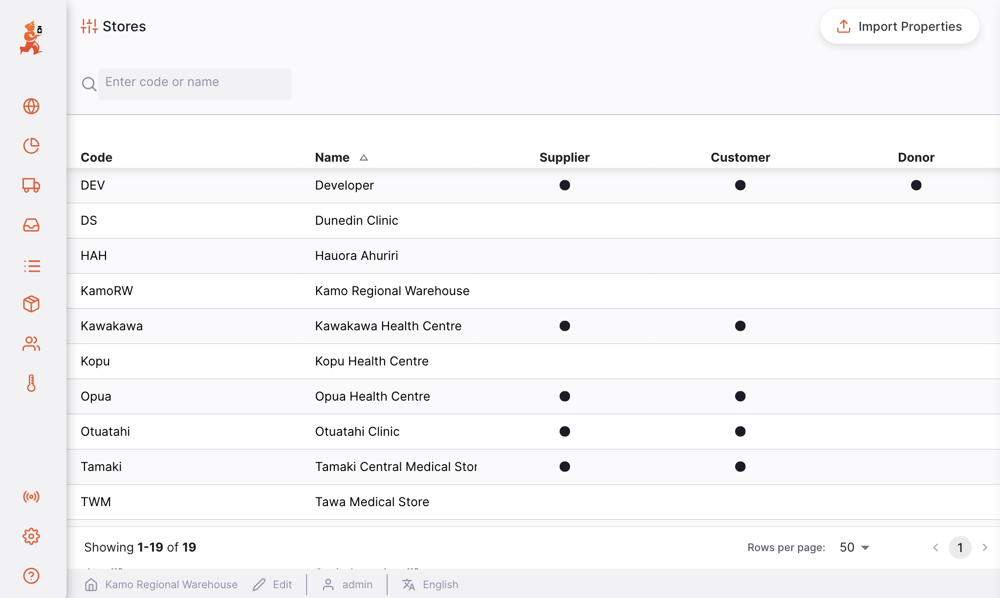
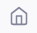
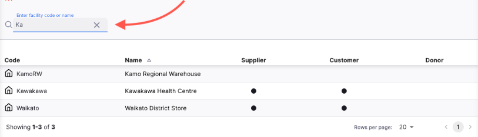
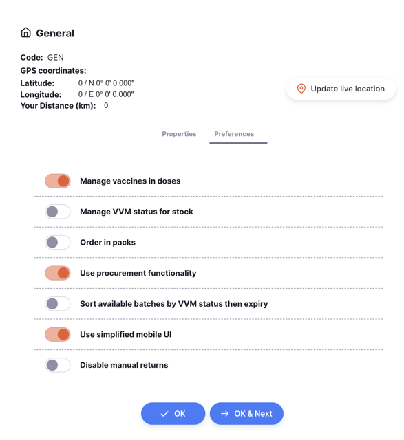
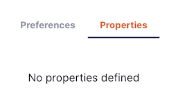
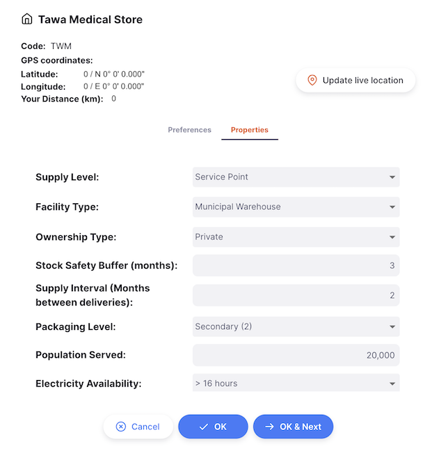
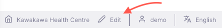
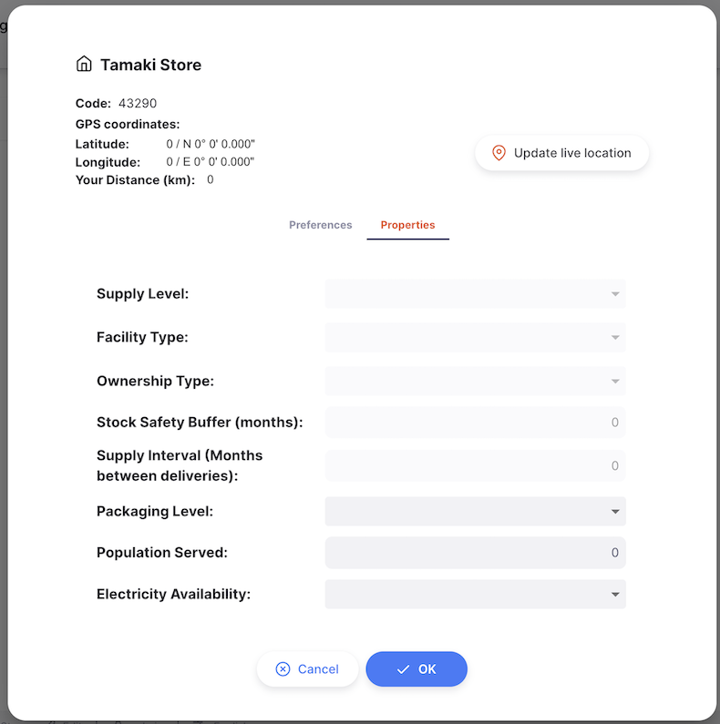
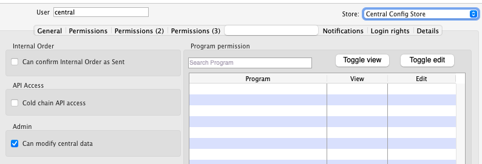

+++
title = "Stores"
description = "Manage all stores"
date = 2022-05-17T16:20:00+00:00
updated = 2022-05-17T16:20:00+00:00
draft = false
weight = 2
sort_by = "weight"
template = "docs/page.html"

[extra]
toc = true
top = false
+++

The Stores list is available only on the [Open mSupply Central Server](/docs/getting_started/central-server). This is where you can view all stores, and manage their properties.

## Viewing Stores

Choose `Manage` > `Stores` in the navigation panel.

You will be presented with a list of stores in your system.

The list of Stores is divided into 5 columns:

| Column       | Description                      |
| :----------- | :------------------------------- |
| **Code**     | The code for the store           |
| **Name**     | Store name                       |
| **Supplier** | Whether this store is a supplier |
| **Customer** | Whether this store is a customer |
| **Donor**    | Whether this store is a donor    |

You can tell if a customer is also using Open mSupply in their store if they have an icon like this  next to the code. 

1. The list can display a fixed number of stores per page. On the bottom left corner, you can see how many stores are currently displayed on your screen.
2. If you have more stores than the current limit, you can navigate to the other pages by clicking on the page number or using the right of left arrows (bottom right corner).
3. You can also select a different number of rows to show per page using the option at the bottom right of the page.

### Searching stores

You can filter the list of stores by name or by code. This can be useful if you're looking for one particular store!

In the search bar in the top left of your screen, type some (or all) of a store name or store code. The list will now contain all matching stores:

## Store Preferences

Store preferences allow the configuration of Open mSupply for a specific store. A short description of each preference is given below, with further detail in their related areas of the documentation.

To configure preferences for a store, select that store from the list - a new window will open.

Toggle the preferences on or off as required, and close when you are finished.

### Available Preferences

| Preference Name                                                                      | Description                                                                                                                                                                              |
| :----------------------------------------------------------------------------------- | :--------------------------------------------------------------------------------------------------------------------------------------------------------------------------------------- |
| **Manage vaccines in doses**                                                         | View stock levels and transactions for vaccine items in doses, rather than units or packs                                                                                                |
| **Manage VVM status for stock**                                                      | Enables a `VVM status` field on stock                                                                                                                                                    |
| **Order in packs**                                                                   | Defaults the Internal Order/Requisition representation to packs instead of units                                                                                                         |
| **Use procurement functionality**                                                    | Enables procurement functionality including Purchase Orders and Goods Received                                                                                                           |
| **Can create Internal Order from a Requisition**                                     | Allows users to create an Internal Order from a Requisition                                                                                                                              |
| **Select destination store for an Internal Order**                                   | Allows users to select the destination store when creating an Internal Order from a Requisition to change the destination of the supplier's Outbound Shipment                            |
| **Sort available batches by VVM status then expiry**                                 | Auto-allocation in Outbound Shipments and Prescriptions uses VVM status first, then FEFO                                                                                                 |
| **Use simplified mobile UI**                                                         | Reduces number of fields and elements for tablets. Requires legacy store preference.                                                                                                     |
| **Number of months to check for consumption when calculating out of stock products** | Number of past months to check for item usage. If no stock in this period, item is flagged as at risk or out of stock in the Dashboard.                                                  |
| **Batches expiring in between days**                                                 |                                                                                                                                                                                          |
| • First threshold for expiring items (days)                                          | Days before expiry to start flagging as "expiring soon." Used in the `Expiring Stock` widget. Note that the widget isn't displayed if both of these threshold settings are unconfigured. |
| • Second threshold for expiring items (days)                                         | Days before expiry to stop flagging as "expiring soon." Used in Expiring Stock widget.                                                                                                   |

Most store preferences are still managed through the Legacy mSupply central server (see the <a href="/docs/settings/configuration/#store-preferences">list of preferences</a>). Only new store preferences for Open mSupply are configured on Open mSupply central server for now. All store preferences will be migrated to Open mSupply in a future version.

## Store Properties

To edit the properties of a store in the list, click on it. This will open a new `Edit Store` window.

From this window, you can edit the store properties.

- Click `OK` to save your changes and close the window
- Click `OK & Next` to save your changes and start editing the next store
- Click `Cancel` at any time to revert your changes and close the window

### Editing your store properties

Any store can view and edit their own properties. If properties have been configured, an additional `Edit` button will be visible in the app footer, next to your store name:

Click the `Edit` button to open a new window, where you can edit the properties for your store.

Some properties can be disabled here. This means they are only editable on the Open mSupply Central Server.

Once you are happy with your changes, click `OK` to save and close the window.

Click `Cancel` at any time to revert your changes and close the window.

## Permissions & Restrictions

Stores are only visible on the [Open mSupply Central Server](/docs/getting_started/central-server).

To Edit stores centrally you need the `Can modify central data` permission, enabled in the [omSupply Permissions Tab](https://docs.msupply.org.nz/admin:managing_users?s[]=permission#omsupply_permissions_tab) on your Central Store.

