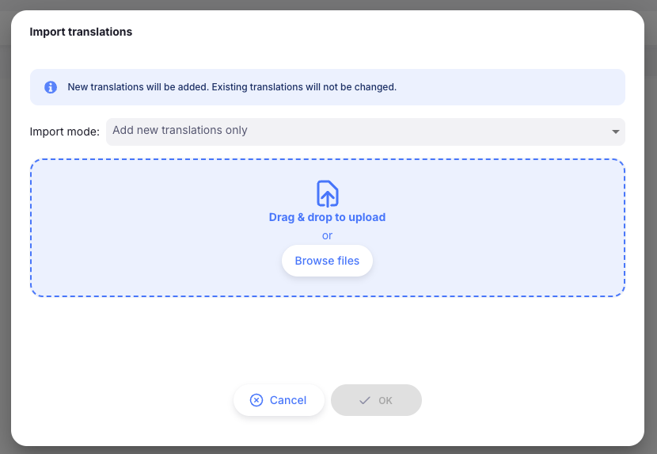

+++
title = "Préférences globales"
description = "Configuration des préférences globales"
date = 2025-05-21
updated = 2025-05-21
draft = false
weight = 2
sort_by = "weight"
template = "docs/page.html"

[extra]
toc = true
top = false
+++

La liste des préférences globales est disponible uniquement sur le [Serveur Central Open mSupply](/docs/getting_started/central-server). Ce sont des préférences qui s'appliquent à tous les sites Open mSupply.

## Consulter les préférences globales

Pour configurer les préférences globales, accédez à la page des `préférences globales` via le menu `Options` :

L'ensemble des préférences globales actuellement disponibles vous sera présenté :

## Préférences disponibles

| Nom de la préférence                                                        | Description                                                                                                                                                                                                                                                                                                                                                                                                                                                                                                              |
| :-------------------------------------------------------------------------- | :----------------------------------------------------------------------------------------------------------------------------------------------------------------------------------------------------------------------------------------------------------------------------------------------------------------------------------------------------------------------------------------------------------------------------------------------------------------------------------------------------------------------- |
| **Permettre le suivi du stock par donateur**                                | Ajoute une colonne donateur aux écrans de gestion du stock. Cela vous permet de suivre de quel donateur provient un article en stock.                                                                                                                                                                                                                                                                                                                                                                                    |
| **Options de genre**                                                        | Les options de genre disponibles pour les cliniciens et les patients. Définit les options affichées dans les filtres de genre et pouvant être assignées aux cliniciens et patients.                                                                                                                                                                                                                                                                                                                                      |
| **Afficher le suivi des contacts**                                          | Active la fonctionnalité [Suivi des contacts](/docs/programs/program-module/#contact-tracing) pour les patients                                                                                                                                                                                                                                                                                                                                                                                                          |
| **Traductions personnalisées**                                              | Configurer des substitutions pour les termes utilisés dans l'application.                                                                                                                                                                                                                                                                                                                                                                                                                                                |
| **Seuil d'affichage des enregistrements de synchronisation**                | Le nombre d'enregistrements de synchronisation en attente avant d'afficher un indicateur sur l'élément de menu Synchronisation                                                                                                                                                                                                                                                                                                                                                                                           |
| **Autoriser les bons de commande**                                          | Si le processus de bon de commande inclut une étape d'autorisation                                                                                                                                                                                                                                                                                                                                                                                                                                                       |
| **Empêcher les transferts depuis ce nombre de mois avant l'initialisation** | Lors de la migration d'anciens sites mSupply Desktop et mobile vers Open mSupply, cette préférence peut éviter la génération de centaines de livraisons entrantes bloquées. Open mSupply ne créera pas de livraisons entrantes au statut `Prélevé` correspondant aux livraisons sortantes des dépôts fournisseurs prélevées ce nombre de mois avant la date d'initialisation du site. De même, il ne créera pas de réquisitions clients pour les commandes internes finalisées ce nombre de mois avant l'initialisation. |
| **Autoriser la réception des marchandises**                                 | Si le processus de réception inclut une étape d'autorisation                                                                                                                                                                                                                                                                                                                                                                                                                                                             |
| **La marge article prime sur la marge fournisseur**                         | Donne la priorité à la marge de l'article dans le dépôt récepteur sur la marge du fournisseur si les deux sont configurées lors de la réception d'une expédition entrante.                                                                                                                                                                                                                                                                                                                                               |
| **Afficher les prévisions basées sur la population**                        | Si la calculation de prévision basée sur la population doit remplacer le calcul CMM standard dans les commandes internes et les réquisitions. Affiche également le champ stock cible (population) dans les commandes internes et les réquisitions.                                                                                                                                                                                                                                                                       |

### Consommation Mensuelle Moyenne (CMM)

Les préférences de `Consommation Mensuelle Moyenne` vous permettent de personnaliser le calcul de consommation des articles pour vos dépôts.

Le calcul de base est : **(Consommation / Mois de référence) \* Jours de référence / (Jours de référence - Jours en rupture de stock)**

Vous pouvez ajuster le fonctionnement du calcul à l'aide des préférences suivantes :

| Nom de la préférence                               | Description                                                                                                                                                                                                                                                                                                                                                                  |
| :------------------------------------------------- | :--------------------------------------------------------------------------------------------------------------------------------------------------------------------------------------------------------------------------------------------------------------------------------------------------------------------------------------------------------------------------- |
| **Ajuster pour le nombre de jours en rupture de stock :** | Exclure les jours de la période de référence où l'article était en rupture de stock toute la journée. Les jours de référence sont ajustés pour exclure les jours en rupture si cette préférence est activée. Remarque : les jours sont comptés en rupture de stock lorsque l'article a déjà été en stock (c'est-à-dire pas un nouvel article), et avait un solde nul à la fin de la journée et de la journée précédente. |
| **Jours dans un mois :**                           | Le nombre de jours par mois utilisé dans le calcul de la CMM. Si aucune valeur n'est fournie, la valeur par défaut est utilisée (jours moyens par mois = 30,4375).                                                                                                                                                                                                           |

Les [mois de référence](https://docs.msupply.org.nz/other_stuff:virtual_stores#preferences_tab) sont configurables par dépôt dans mSupply avec la préférence `Période de référence de la consommation mensuelle`. Le paramètre par défaut est 3 mois.

Les jours de référence sont calculés comme suit : `Jours dans un mois * Mois de référence`.

Si vous utilisez des plugins qui excluent les transferts du calcul de la CMM, votre calcul sera (consommation - transferts).

### Traductions personnalisées

La préférence `Traductions personnalisées` vous permet de remplacer des termes spécifiques utilisés dans l'application. C'est utile pour la localisation ou pour adapter la terminologie à votre contexte spécifique.

Utilisez cette fonctionnalité avec précaution. Elle peut créer de la confusion si les termes ne correspondent pas à notre documentation ou s'ils ne sont pas cohérents dans l'application.

Vous pouvez rechercher par tout texte visible dans l'application, ou si vous connaissez la clé de traduction, vous pouvez également rechercher par celle-ci :

Sélectionnez la traduction que vous souhaitez modifier, puis saisissez le nouveau texte dans le champ de saisie :

Certaines traductions incluent des variables, qui seront remplacées par les valeurs appropriées lors de leur utilisation. Vous pouvez déplacer ces variables dans le texte, mais assurez-vous de les conserver intactes pour que les messages restent cohérents. Les variables sont entourées de doubles accolades, comme ceci : `{{nom_variable}}`.

Pour les traductions incluant des variables numériques, nous prenons également en charge la pluralisation. Si vous sélectionnez l'une de ces traductions, vous verrez les traductions `_one` et `_other`. Assurez-vous de fournir le texte correct pour les deux cas :

#### Télécharger

Vous avez effectué de nombreuses modifications aux traductions personnalisées et souhaitez les partager ou simplement les sauvegarder ?

Pas de problème — cliquez sur le bouton `Télécharger` pour enregistrer toutes les traductions personnalisées au format JSON.

#### Importer

Si vous avez téléchargé des traductions et souhaitez maintenant les appliquer à votre serveur, cliquez simplement sur le bouton `Importer`. Une nouvelle fenêtre s'affichera où vous pourrez choisir le mode et sélectionner un fichier JSON à charger.

Les options de mode sont :

- **Ajouter uniquement les nouvelles traductions** (par défaut) — les traductions du fichier d'import qui existent déjà comme traductions personnalisées sur votre serveur ne seront pas importées
- **Ajouter les nouvelles et écraser les existantes** — les nouvelles traductions sont ajoutées et les traductions personnalisées existantes sont mises à jour
- **Supprimer les existantes et tout remplacer** — table rase ! toutes les traductions personnalisées existantes sont supprimées et toutes les traductions du fichier d'import sont ajoutées.

## Paramètres par défaut des tableaux

Il existe un type particulier de configuration globale accessible d'une manière spéciale : les paramètres par défaut des tableaux.

Les tableaux Open mSupply sont hautement personnalisables. Vous pouvez afficher ou masquer des colonnes, les réorganiser, les redimensionner, les épingler et modifier la densité des lignes. Par défaut, ces modifications sont enregistrées uniquement dans votre navigateur et ne s'appliquent qu'à vous.

Les administrateurs du serveur central peuvent aller plus loin : ils peuvent enregistrer leur configuration de tableau actuelle comme valeur par défaut globale applicable à tous les utilisateurs du système. Cela définit une base cohérente pour que chaque utilisateur voie la même disposition du tableau jusqu'à ce qu'il choisisse de la personnaliser.

### Qui peut enregistrer des valeurs par défaut globales

Pour enregistrer une configuration de tableau par défaut globale, vous devez remplir les deux conditions suivantes :

- Vous êtes connecté au serveur central (pas un site distant)
- Votre compte dispose de la permission Modifier les données centrales

Si vous ne remplissez pas ces conditions, vous pouvez tout de même personnaliser les tableaux pour vous-même, mais vous ne verrez pas l'option d'enregistrement d'une valeur par défaut globale.

### Ce qui est enregistré

Lorsque vous enregistrez une valeur par défaut globale, les paramètres suivants sont capturés pour ce tableau :

| Paramètre             | Description                                              |
| --------------------- | -------------------------------------------------------- |
| Visibilité des colonnes | Quelles colonnes sont affichées ou masquées            |
| Ordre des colonnes    | La séquence dans laquelle les colonnes apparaissent      |
| Taille des colonnes   | La largeur de chaque colonne                             |
| Épinglage des colonnes| Quelles colonnes sont épinglées à gauche ou à droite     |
| Densité des lignes    | La hauteur des lignes — compacte, confortable ou spacieuse |

Chaque tableau dans Open mSupply a sa propre valeur par défaut globale indépendante. Enregistrer une valeur par défaut sur le tableau _Articles_ n'affecte pas le tableau _Expéditions sortantes_ ni aucun autre tableau.

### Comment enregistrer une valeur par défaut globale

1. Accédez au tableau que vous souhaitez configurer
2. Ajustez le tableau selon votre disposition préférée — affichez ou masquez des colonnes, réorganisez-les, redimensionnez-les, épinglez des colonnes et définissez la densité des lignes
3. Cliquez sur l'icône **Paramètres** (engrenage) à l'extrémité droite de la barre d'outils du tableau. Un menu déroulant s'ouvre
4. En bas du menu, cliquez sur **Enregistrer les modifications du tableau comme valeur par défaut globale**
5. Une notification de succès confirme que la configuration a été enregistrée

La valeur par défaut globale est maintenant en vigueur pour tous les utilisateurs qui n'ont pas encore effectué leurs propres personnalisations pour ce tableau.

L'option <b>Enregistrer les modifications du tableau comme valeur par défaut globale</b> n'apparaît que pour les administrateurs du serveur central disposant de la permission Modifier les données centrales. Si vous ne voyez pas cette option, vérifiez que vous êtes connecté au serveur central avec les permissions appropriées.

### Comment les valeurs par défaut sont appliquées

Lorsqu'un utilisateur ouvre un tableau, Open mSupply détermine la configuration à afficher selon l'ordre de priorité suivant :

1. **Personnalisation personnelle** — Si l'utilisateur a déjà ajusté ce tableau dans son navigateur, ces paramètres personnels sont utilisés
2. **Valeur par défaut globale** — Si aucune personnalisation personnelle n'existe, la valeur par défaut globale définie par un administrateur est utilisée
3. **Valeur par défaut intégrée** — Si ni personnalisation personnelle ni valeur par défaut globale n'existent, la valeur par défaut intégrée de l'application est utilisée

Les personnalisations personnelles ont toujours la priorité. Cela signifie que les utilisateurs qui préfèrent une disposition différente peuvent toujours ajuster les tableaux selon leurs propres besoins sans être affectés par la valeur par défaut globale.

### Réinitialiser un tableau

Le menu des paramètres propose plusieurs façons de réinitialiser un tableau à ses valeurs par défaut.

#### Réinitialiser le tableau entier

Cliquez sur l'icône **Paramètres** puis sur **Réinitialiser le tableau aux valeurs par défaut** (affiché en rouge en bas du menu). Un message de confirmation apparaît :

`L'ordre, la taille, l'épinglage et la visibilité des colonnes seront tous réinitialisés à leurs paramètres par défaut pour ce tableau.`

Ce qui se passe lors de la confirmation dépend de votre rôle :

- **Utilisateurs réguliers** — Le tableau est réinitialisé à la valeur par défaut globale (si une a été définie par un administrateur). Si aucune valeur par défaut globale n'existe, il est réinitialisé à la valeur par défaut intégrée.
- **Administrateurs du serveur central** — Le tableau est réinitialisé à la valeur par défaut intégrée de l'application, ignorant toute valeur par défaut globale. Cela permet aux administrateurs de repartir de zéro avant d'enregistrer une nouvelle valeur par défaut globale.

#### Réinitialiser des paramètres individuels

Le menu des paramètres inclut également des options pour réinitialiser des aspects spécifiques du tableau indépendamment :

- **Réinitialiser l'ordre des colonnes** — restaure la séquence de colonnes par défaut
- **Afficher toutes les colonnes** — rend toutes les colonnes disponibles visibles
- **Réinitialiser la taille des colonnes** — restaure les largeurs de colonnes par défaut
- **Réinitialiser les colonnes épinglées** — désépingle toutes les colonnes

Chacune de ces réinitialisations individuelles suit la même priorité : elle restaure la valeur par défaut globale si elle existe, sinon la valeur par défaut intégrée.

### Points importants à retenir

- **Les valeurs par défaut globales sont par tableau**. Vous devez configurer et enregistrer chaque tableau séparément.
- **Les utilisateurs ne sont pas contraints à votre disposition**. Tout utilisateur peut toujours personnaliser ses propres tableaux. La valeur par défaut globale n'affecte que les utilisateurs qui n'ont pas effectué de modifications personnelles.
- **Enregistrer un tableau inchangé supprime la valeur par défaut globale**. Si vous enregistrez une configuration de tableau qui correspond à la valeur par défaut intégrée (ou est vide), la valeur par défaut globale pour ce tableau est supprimée plutôt que stockée.
